# INTRODUCTION

## 1.1 Overview

You are someone looking for a real-time operating system. This document

* presents the basic features of RTEMS, so that you can decide if it is worth to look at,
* gives you a *quick start* (page 11) to install all the tools necessary to work with RTEMS, and
* helps you to build an example application on top of RTEMS.

## 1.2 Features

The Real-Time Executive for Multiprocessor Systems (*RTEMS*) is a multi-threaded, single address-space, real-time operating system with no kernel-space/user-space separation. It is capable to operate in an *SMP* configuration providing a state of the art feature set.

RTEMS is licensed under a modified GPL 2.0 or later license with an exception for static linking FOOTNOTE. It exposes no license requirements on application code. The third-party software used and distributed by RTEMS which may be linked to the application is licensed under permissive open source licenses. Everything necessary to build RTEMS applications is available as open source software. This makes you completely vendor independent.

RTEMS provides the following basic feature set:

* *APIs*
    - *POSIX* with pthreads (enables a broad range of standard software to run on RTEMS)
    - Classic
    - *C11* (including thread support)
    - *C++11* (including thread support)
    - Newlib and *GCC* internal
* Programming languages
    - C/C++/OpenMP (RTEMS Source Builder, RSB)
    - Ada (RSB, `--with-ada`)
    - Erlang
    - Fortran (RSB, `--with-fortran`)
    - Python and MicroPython
    - Rust (page 375)
* Parallel languages
    - *EMB*<sup>2</sup>
    - Google Go FOOTNOTE
    - *OpenMP* 4.5
* Thread synchronization and communication
    - Mutexes with and without locking protocols
    - Counting semaphores
    - Binary semaphores
    - Condition variables
    - Events
    - Message queues
    - Barriers
    - Futex (used by *OpenMP* barriers)

- Epoch Based Reclamation (libbsd)
* Locking protocols
  - Transitive Priority Inheritance
  - *OMIP* (SMP feature)
  - Priority Ceiling
  - *MrsP* (SMP feature)
* Scalable timer and timeout support
* Lock-free timestamps (FreeBSD timecounters)
* Responsive interrupt management
* C11/C++11 *TLS* FOOTNOTE
* Link-time configurable schedulers
  - Fixed-priority
  - Job-level fixed-priority (*EDF*)
  - Constant Bandwidth Server (experimental)
* Clustered scheduling (SMP feature)
  - Flexible link-time configuration
  - Job-level fixed-priority scheduler (*EDF*) with support for one-to-one and one-to-all thread to processor affinities (default SMP scheduler)
  - Fixed-priority scheduler
  - Proof-of-concept strong *APA* scheduler
* Focus on link-time application-specific configuration
* Linker-set based initialization (similar to global C++ constructors)
* Operating system uses fine-grained locking (SMP feature)
* Dynamic memory allocators
  - First-fit (default)
  - Universal Memory Allocator (*UMA*, libbsd)
* File systems
  - *IMFS*
  - *FAT*
  - *RFS*
  - *NFSv2*
  - *JFFS2* (NOR flashes)
  - *YAFFS2* (NAND flashes, GPL or commercial license required)
* Device drivers
  - Termios (serial interfaces)

- I2C (Linux user-space API compatible)
- SPI (Linux user-space API compatible)
- Network stacks (legacy, libbsd, lwIP)
- USB stack (libbsd)
- SD/MMC card stack (libbsd)
- Framebuffer (Linux user-space API compatible, Qt)
- Application runs in kernel-space and can access hardware directly
* libbsd
    - Port of FreeBSD user-space and kernel-space components to RTEMS
    - Easy access to FreeBSD software for RTEMS
    - Support to stay in synchronization with FreeBSD

## 1.3 Ecosystem

The RTEMS Ecosystem is the collection of tools, packages, code, documentation and online content provided by the RTEMS Project. The ecosystem provides a way to develop, maintain, and use RTEMS. It's parts interact with the user, the host environment, and each other to make RTEMS accessible, useable and predicable.

The ecosystem is for users, developers and maintainers and it is an ongoing effort that needs your help and support. The RTEMS project is always improving the way it delivers the kernel to you and your feedback is important so please join the mailing lists and contribute back comments, success stories, bugs and patches.

What the RTEMS project describes here to develop, maintain and use RTEMS does not dictate what you need to use in your project. You can and should select the work-flow that best suites the demands of your project and what you are delivering.

### 1.3.1 Rationale

RTEMS is complex and the focus of the RTEMS Ecosystem is to simplify the complexity for users by providing a stable documented way to build, configure and run RTEMS. RTEMS is more than a kernel running real-time applications on target hardware, it is part of a project's and therefore team's workflow and every project and team is different.

RTEMS's ecosystem does not mandate a way to work. It is a series of parts, components, and items that are used to create a suitable development environment to work with. The processes explained in this manual are the same things an RTEMS maintainer does to maintain the kernel or an experienced user does to build their production system. It is important to keep this in mind when working through this manual. We encourage users to explore what can be done and to discover ways to make it fit their needs. The ecosystem provided by the RTEMS Project will not install in a single click of a mouse because we want users to learn the parts they will come to depend on as their project's development matures.

The RTEMS Ecosystem provides a standard interface that is the same on all supported host systems. Standardizing how a user interacts with RTEMS is important and making that experience portable is also important. As a result the ecosystem is documented at the command line level and we leave GUI and IDE integration for users and integrators.

Standardizing the parts and how to use them lets users create processes and procedures that are stable over releases. The RTEMS Ecosystem generates data that can be used to audit the build process so their configuration can be documented.

The ecosystem is based around the source code used in the various parts, components and items of the RTEMS development environment. A user can create an archive of the complete build process including all the source code for long term storage. This is important for projects with a long life cycle.

### 1.3.2 Open Source

RTEMS is an open source operating system and an open source project and this extends to the ecosystem. We encourage users to integrate the processes to build tools, the kernel and any third-party libraries into their project's configuration management processes.

All the parts that make up the ecosystem are open source. The ecosystem uses a package's source code to create an executable on a host so when an example RTEMS executable is created and run for the first time the user will have built every tool as well as the executable from source.

The RTEMS Project believes the freedom this gives a user is as important as the freedom of having access to the source code for a package.

### 1.3.3 Deployment

The RTEMS Project provides the ecosystem as source code that users can download to create personalised development environments. The RTEMS Project does not provide packaging and deployment for a specific host environment, target architecture or BSP. The RTEMS Project encourages users and organizations to fill this role for the community. The *RTEMS Source Builder* (page 317) provides some aid to *build and deploy tool binaries* (page 370).

## 1.4 Real-time Application Systems

Real-time application systems are a special class of computer applications. They have a complex set of characteristics that distinguish them from other software problems. Generally, they must adhere to more rigorous requirements. The correctness of the system depends not only on the results of computations, but also on the time at which the results are produced. The most important and complex characteristic of real-time application systems is that they must receive and respond to a set of external stimuli within rigid and critical time constraints referred to as deadlines. Systems can be buried by an avalanche of interdependent, asynchronous or cyclical event streams.

Deadlines can be further characterized as either hard or soft based upon the value of the results when produced after the deadline has passed. A deadline is hard if the results have no value or if their use will result in a catastrophic event. In contrast, results which are produced after a soft deadline may have some value.

Another distinguishing requirement of real-time application systems is the ability to coordinate or manage a large number of concurrent activities. Since software is a synchronous entity, this presents special problems. One instruction follows another in a repeating synchronous cycle. Even though mechanisms have been developed to allow for the processing of external asynchronous events, the software design efforts required to process and manage these events and tasks are growing more complicated.

The design process is complicated further by spreading this activity over a set of processors instead of a single processor. The challenges associated with designing and building real-time application systems become very complex when multiple processors are involved. New requirements such as interprocessor communication channels and global resources that must be shared between competing processors are introduced. The ramifications of multiple processors complicate each and every characteristic of a real-time system.

**FOOTNOTE The goal is to use the**
BSD 2-Clause license for new code or code those copyright holder agreed to a license change, see #3053 for the details.

FOOTNOTE See #2832.

**FOOTNOTE Thread-local storage requires some support by the tool chain and the**
RTEMS architecture support, e.g. context-switch code. It is supported at least on ARM, AArch64, PowerPC, RISC-V, SPARC, MicroBlaze, Nios II, and m68k. Check the RTEMS CPU Architecture Supplement if it is supported.

# QUICK START

Follow the sections of this chapter step by step to get started developing applications on top of RTEMS. You will create a set of tools and an RTEMS kernel for your selected Board Support Package (BSP).

# 2.1 Preparation

You need to perform some basic preparation to get started with RTEMS development. You need tools from your host's operating system to build the RTEMS tool suite from source. The RTEMS tools you build are used to build the Board Support Package (BSP) libraries for your target hardware from source. The BSP libraries contain the RTEMS operating system. All RTEMS tools and runtime libraries are built from source on your host machine. The RTEMS Project does not maintain binary builds of the tools. This may appear to be the opposite to what you normally experience with host operating systems, and it is, however this approach works well. RTEMS is not a host operating system and it is not a distrbution. Providing binary packages for every possible host operating system is too big a task for the RTEMS Project and it is not a good use of core developer time. Their time is better spent making RTEMS better and faster. This is not a one-click installation process, but there are *good reasons* (page 319) to build everything from source. The RTEMS Project base installation sets up the tools and the RTEMS kernel for the selected BSPs. The tools run on your host computer are used to compile, link, and format executables so they can run on your target hardware.

During this Quick Start guide you will:

* Select a suitable place to install RTEMS.
* Select if you download all the source code before you start building RTEMS or the source is downloaded on demand as it is needed. If you do not have a reliable internet connection we recommend you download all the source before starting a build.
* Build a tool suite.
* Build and test a BSP.
* Optionally build additional packages.

Alternatively you can build a BSP as a package using the RSB. This is covered in *Build an RSB Package* (page 33)

### 2.1.1 Host Computer

The *host computer* is a computer you use to develop applications. It runs all your tools, editors, documentation viewers, etc. You need a native C, C++, and Python development environment. The following procedure assumes you have installed and configured your host operating system. It also assumes you have installed any dependent packages needed when building the tools and the kernel. Please make sure you can build native C/C++ applications on your host computer. You must be able to build native Python C modules as some RTEMS tools contain these modules. Usually, you have to install a Python development package for this. The Python scripts of the RTEMS Project expect on POSIX systems that a `python` command is available FOOTNOTE. Please have a look at the *Host Computer* (page 51) chapter for the gory details. In particular *Microsoft Windows* (page 62) users should do this.

### 2.1.2 Selecting a BSP

If you are new to RTEMS and you are looking to try RTEMS then the best suited Board Support Package (BSP) is the *SPARC ERC32* (page 176) (erc32). The SPARC ERC32 BSP has a robust simulator that runs the example and test executables on your host computer. This Quick Start guide will build the erc32 BSP and run RTEMS tests executables in the simulator. The ERC32 BSP is a SPARC architecture BSP so the tool suite name is `sparc-rtems5`.

If you are looking for a hardware target to run RTEMS on we recommend the *BeagleBone Black* (page 110) (beagleboneblack) BSP. The BeagleBone Black support includes the RTEMS BSD Library (libbsd) and networking. The BeagleBone Black BSP is an ARM architecture BSP so the tool suite name is `arm-rtems5`.

### 2.1.3 Selecting a Version of RTEMS

In the examples of this manual we will often refer to a specific version of RTEMS, which will usually be the version that accompanied the publication of this documentation manual. That may not be the appropriate version for you to use, for example, it may be too old (or too new) depending on what you are trying to do. If you're not sure what version to use, we generally recommend using the most recent release or the development head (main), and you may want to consult with the same version of the documentation. We hope that newer is better.

An RTEMS *release* involves the creation of a single downloadable file, normally a compressed tarball, that packages the source of all the repositories in a state consistent with the time the release is created. A *release branch* is a git branch pushed to the repositories named with the numeric identifier of the branch. A *release branch release* is a git tag on a release branch with the tags pushed to the repositories.

Numbering for RTEMS versions beginning with RTEMS 5 uses a format as follows. The main branch has the version **N.0.0** with **N** being the next major release number. The first release of this series has the version number **N.1.0.** and there is exactly one commit with this version number in the corresponding repository. The first bugfix release (minor release) of this series will have the version number **N.2.0.** The release branch will have the version number **N.M.1** with **M** being the last minor release of this series.

For example:

* 5.0.0 is the version number of the development branch for the 5 series.
* 5.1.0 is the first release of the 5 series.
* 5.1.1 is the version number of the 5 series release branch right after the 5.1.0 release until 5.2.0 is released.
* 5.2.0 is the first bugfix release of the 5 series
* 5.2.1 is the version number of the 5 series release branch right after the 5.2.0 release until 5.3.0 is released.
* 6.0.0 is the version number of the development branch for the 6 series.

RTEMS development tools use **N** as the version number and are expected to work with all releases and the release branch of the N series. So to build tools for compiling RTEMS version number 5.1.0 for SPARC use `sparc-rtems5`. Despite the number not increasing, the tools may change within a release branch, for example the tools packaged with 5.1.1 still use the `sparc-rtems5` moniker, but are likely not the same as the tools used in version 5.1.0. This tool mismatch can be a source of confusion. Be sure to use the toolchain that matches your release.

FOOTNOTE The Python scripts use a shebang of `#!/usr/bin/env python`.

## 2.2 Choose an Installation Prefix

You will see the term *prefix* referred to throughout this documentation and in a wide number of software packages you can download from the internet. It is also used in the GNU Coding Standard. A *prefix* is the path on your host computer a software package is installed under. Packages that have a prefix will place all parts under the prefix path. Packages for your host computer typically use a default prefix of `/usr/local` on FreeBSD and Linux.

You have to select a prefix for your installation. You will build and install the RTEMS tool suite, an RTEMS kernel for a BSP, and you may build and install third party libraries. You can build all the parts as a stack with a single prefix or you can separate various parts by providing different prefixes to each part as it is built. Using separate prefixes is for experienced RTEMS users.

Do not select a prefix that is under the top of any of the source trees. The prefix collects the install output of the various build steps you take in this guide and need to be kept separate from the sources used.

The RTEMS tool suite consists of a cross tool chain (Binutils, GCC, GDB, Newlib, etc.) for your target architecture and *RTEMS tools* (page 275) provided by the RTEMS Project. The RTEMS Tools are a toolkit that help create the RTEMS ecosystem and help support the building of embedded real-time applications and systems. The RTEMS tool chain changes less often than the RTEMS kernel. One method of working with development releases is to have a separate prefix for the RTEMS tools and a different one for the RTEMS kernel. You can then update each without interacting with the other. You can also have a number of RTEMS versions available to test with.

You build and install the tool suite with the *RTEMS Source Builder (RSB)* (page 317). By default, the RSB will start the prefix path with a host operating system specific path plus `rtems`, and the RTEMS version, e.g. `/opt/rtems/7` on Linux, and `/usr/local/rtems/7` on FreeBSD and macOS. Placing the RTEMS version number in the path lets you manage and migrate RTEMS versions as they are released. It is best to have a prefix for each different version of RTEMS you are using. If you are using RTEMS in production it is **not** a good idea to install a development version of over the top by using the same prefix. A separate prefix for each version avoids this.

It is strongly recommended to run the RSB as a *normal user* and not with *root* privileges (also known as *super user* or *Administrator*). You have to make sure that your normal user has sufficient privileges to create files and directories under the prefix. For example, you can create a directory `/opt/rtems` and give it to a developer group with read, write, and execute permissions. Alternatively, you can choose a prefix in your home directory, e.g. `$HOME/rtems/7` or with a project-specific component `$HOME/project-x/rtems/7`. For more ideas, see the *project sandboxing* (page 20) section. In this quick start chapter, we will choose `$HOME/quick-start/rtems/7` for the RTEMS tool suite prefix.

> ### ⚠️ Warning
>
> The prefix must not contain space characters.

# 2.3 Obtain the Sources

You have considered and chosen a suitable installation prefix in the previous section. For example, if you are building RTEMS with version 7 tools we have chosen `$HOME/quick-start/rtems/7` as the installation prefix. We will show how to use a released version of RTEMS and then as an alternative we will show you using the *RSB Git repository* (page 16). Consider using a Git clone if you wish to make contributions to the RTEMS Project.

You need the RTEMS Source Builder (RSB) to work with RTEMS. You should use the same version of the RSB as you plan to use for RTEMS, for example 7 for the development head of RTEMS, or a released version of the RSB matching the released version of RTEMS. A released version of the RSB downloads all source code from the RTEMS servers. Each release archives all the referenced source providing long term stability as changes in upstream projects do not effect a release's build.

You will need approximately 1.5G bytes of disk space to build the tools, RTEMS kernel, network stack and 3rd party packages for the ERC32 BSP.

### 2.3.1 Releases

You can download the source archives for a released RTEMS version from RTEMS' servers. Releases can be viewed at https://ftp.rtems.org/pub/rtems/releases with the releases listed as a series under a release's major number. For RTEMS 5.1 the release series is 5 and the release path is https://ftp.rtems.org/pub/rtems/releases/5/5.1.

To work with the archives of a released RTEMS version, simply replace the version major number 5 and minor number 1 used throughout this section with the version number you selected, e.g., `sparc-rtems4.11`, `sparc-rtems6`, and so on. The specific instructions for working with released versions of RTEMS are available in the released documents associated with those versions. However, the procedures should generally work fine replacing 7 with the release version major number you are using.

Download and unpack using the `curl` and `tar` command with these commands:

```bash
1 mkdir -p $HOME/quick-start/src
2 cd $HOME/quick-start/src
3 curl https://ftp.rtems.org/pub/rtems/releases/5/5.1/sources/rtems-source-builder-
  ↪5.1.tar.xz | tar xJf -
```

If `curl` does not work consider using `wget` or a browser.

The RSB is unpacked under the path `rtems-source-builder-5.1`. We rename this to `rsb` so that the subsequent directions are consistent regardless of what version is being used. This has the added benefit of using shorter paths during the tool suite build. To do this run these commands:

```bash
1 cd $HOME/quick-start/src
2 mv rtems-source-builder-5.1 rsb
```

If you wish to build the RTEMS kernel from source obtain the RTEMS kernel sources:

```bash
1 cd $HOME/quick-start/src
2 curl https://ftp.rtems.org/pub/rtems/releases/5/5.1/sources/rtems-5.1.tar.xz | ␣
  ↪tar xJf -
```

### 2.3.2 Git

Alternatively, clone the Git repositories into `$HOME/quick-start/src`.

A Git repository clone gives you some flexibility with the added complexity of needing to use a Git tag or branch to build a released version. With Git you can switch between branches to try out different RTEMS versions and you have access to the RTEMS source history. The RTEMS Project welcomes contributions. The Git repositories enable you to easily create patches and track local changes.

You can clone the Git repository to get all versions of RTEMS including the development head. Release branches in Git are kept stable however they may differ from a release's source archive.

```bash
1 mkdir -p $HOME/quick-start/src
2 cd $HOME/quick-start/src
3 git clone https://gitlab.rtems.org/rtems/tools/rtems-source-builder.git rsb
4 git clone https://gitlab.rtems.org/rtems/rtos/rtems.git
```

The `rsb` repository clone contains the *RTEMS Source Builder (RSB)* (page 317). We clone it into `rsb` to get a consistent (and shorter) path for the subsequent instructions. This renaming is optional. The `rtems` repository clone contains the RTEMS sources. These two repositories are enough to get started. There are more repositories available.

> **Warning**
>
> The development version is not for use in production and it can break from time to time.

### 2.3.3 Offline Download

If you have limited Internet access you can download the source before you start building. If you are permanently connected to the Internet you do not need to do this and the sources will be automatically download on demand when needed.

Once the sources have been downloaded you could disconnect your host computer from the Internet. It is no longer required to work with RTEMS. To download the sources to build the ERC 32 BSP before building run the following commands:

```bash
1 cd $HOME/quick-start/src/rsb/rtems
2 ../source-builder/sb-set-builder --source-only-download 7/rtems-sparc
```

This command should output something like this (omitted lines are denoted by `...`):

```text
1 RTEMS Source Builder - Set Builder, 7 (5e449fb5c2cb)
2 Build Set: 7/rtems-sparc
3 Build Set: 7/rtems-autotools.bset
4 Build Set: 7/rtems-autotools-internal.bset
5 ...
6 download: https://gitlab.rtems.org/rtems-tools/snapshot/rtems-tools-
  ↪90342feb4dd63d188ce945adfb0a769...<see log> -> sources/rtems-tools-
  ↪90342feb4dd63d188ce945adfb0a7694a42a65cd.tar.bz2
7 ...
8 Build Sizes: usage: 0.000B total: 264.228MB (sources: 264.186MB, patches: 43.
                                                                (continues on next page)
```

(continued from previous page)
```
  ↪468KB, installed 0.000B)
9 Build Set: Time 0:06:34.357125
```

If you encounter errors, check your internet connection, firewall settings, virus scanners and the availability of the download servers.

## 2.4 Install the Tool Suite

You have chosen an installation prefix, the BSP to build, the tool's architecure and prepared the source for the RSB in the previous sections. We have chosen `$HOME/quick-start/rtems/7` as the installation prefix, the erc32 BSP and the SPARC architecture name of `sparc-rtems7`, and unpacked the RSB source in `$HOME/quick-start/src`.

The tool suite for RTEMS and the RTEMS sources are tightly coupled. For example, do not use a RTEMS version 7 tool suite with RTEMS version 4.11 or 5 sources and vice versa.

If you are unsure how to specify the build set for the architecture you wish to build, just ask the tool:

```
1 $ ../source-builder/sb-set-builder --list-bsets
```

Build and install the tool suite:

```
1 cd $HOME/quick-start/src/rsb/rtems
2 ../source-builder/sb-set-builder --prefix=$HOME/quick-start/rtems/7 7/rtems-sparc
```

This command should output something like this (omitted lines are denoted by `...`). The build host appears as part of the name of the package being built. The name you see may vary depending on the host you are using:

```
1 RTEMS Source Builder - Set Builder, 7 (5e449fb5c2cb)
2 Build Set: 7/rtems-sparc
3 ...
4 config: tools/rtems-binutils-2.36.cfg
5 package: sparc-rtems7-binutils-fbb9a7e-x86_64-linux-gnu-1
6 building: sparc-rtems7-binutils-fbb9a7e-x86_64-linux-gnu-1
7 sizes: sparc-rtems7-binutils-fbb9a7e-x86_64-linux-gnu-1: 716.015MB (installed: 
  ↪163.538MB)
8 cleaning: sparc-rtems7-binutils-fbb9a7e-x86_64-linux-gnu-1
9 reporting: tools/rtems-binutils-2.36.cfg -> sparc-rtems7-binutils-fbb9a7e-x86_64-
  ↪linux-gnu-1.txt
10 reporting: tools/rtems-binutils-2.36.cfg -> sparc-rtems7-binutils-fbb9a7e-x86_64-
  ↪linux-gnu-1.xml
11 config: tools/rtems-gcc-10-newlib-head.cfg
12 package: sparc-rtems7-gcc-6051af8-newlib-d10d0d9-x86_64-linux-gnu-1
13 building: sparc-rtems7-gcc-6051af8-newlib-d10d0d9-x86_64-linux-gnu-1
14 ....
15 Build Sizes: usage: 9.607GB total: 2.244GB (sources: 264.186MB, patches: 43.468KB, 
  ↪installed 1.986GB)
16 installing: 7/rtems-sparc -> $HOME/quick-start/rtems/7
17 clean staging: 7/rtems-sparc
18 Staging Size: 5.292MB
19 Build Set: Time 1:01:48.019157
```

Once the build has successfully completed you can check if the cross C compiler works with the following command:

```
1 $HOME/quick-start/rtems/7/bin/sparc-rtems7-gcc --version
```

This command should output something like below. The version informtion helps you to identify the exact sources used to build the cross compiler of your RTEMS tool suite. In the output you see the version of RTEMS or the hash from the RSB repository if you are building using a Git repository clone. The Newlib hash is the version of Newlib in the RTEMS’s github sourceware-mirror-newlib-cygwin repository. The sources and patches directories created by the RSB contain all the source code used.

```
1 sparc-rtems7-gcc (GCC) 10.2.1 20210309 (RTEMS 7, RSB␣
  ↪5e449fb5c2cb6812a238f9f9764fd339cbbf05c2, Newlib d10d0d9)
2 Copyright (C) 2023 Free Software Foundation, Inc.
3 This is free software; see the source for copying conditions. There is NO
4 warranty; not even for MERCHANTABILITY or FITNESS FOR A PARTICULAR PURPOSE.
```

Add `--verbose` to the GCC command for the verbose version details.

### 2.4.1 Creating a Tool Archive

Since the RTEMS Project does not provide binary tool distributions, some users may need to create their own relocatable toolchains. This need can be due to Canadian Cross-Compilation (CxC or three-way), configuration control, or because a user wants to synchronize development environments across multiple workstations or to share tools among multiple developers. To support such needs, the RSB can create tar files of the built package set by adding `--bset-tar-file` to the `sb-set-builder` command line. These tar files can then be relocated or adapted as needed to suit the user’s needs.

### 2.4.2 Need for RTEMS-Specific Cross-Compiler

New users are often confused as to why they cannot use their distribution’s cross-compiler for their target on RTEMS, e.g., the `riscv64-linux-gnu` or the `arm-none-eabi-gcc`. Below mentioned are some of the reasons for using the RTEMS cross-compiler.

*   **Correct configuration of Newlib**
    Newlib is a C standard library implementation intended for use on embedded systems. Most of the POSIX and libc support for RTEMS is derived from Newlib. The RTEMS cross-compiler configures Newlib correctly for RTEMS.
*   **Threading in GCC support libraries**
    Several threading packages in GCC such as Go threads (libgo), OpenMP (libgomp), and OpenACC need to be customized according to RTEMS. This is done by the RTEMS specific cross-compiler.
*   **Provide preprocessor define `__rtems__`**
    The `__rtems__` preprocessor define is used to provide conditional code compilation in source files that are shared with other projects e.g. in Newlib or imported code from FreeBSD.
*   **Multilib variants to match the BSP**
    RTEMS configures GCC to create separate runtime libraries for each supported instruction set, floating point unit, vector unit, word size (e.g. 32-bit and 64-bit), endianness, ABI, processor errata workarounds, and so on in the architecture. These libraries are termed as *Multilib* (page 79) variants. Multilib variants to match the BSP are set by selecting a specific set of machine options using the RTEMS cross-compiler.

### 2.4.3 Project Sandboxing

Project specific sandboxes let you have a number of projects running in parallel with each project in its own sandbox. You simply have a *prefix* per project and under that prefix you create a simple yet repeatable structure.

As an example lets say I have a large disk mounted under `/bd` for *Big Disk*. As root create a directory called projects and give the directory suitable permissions to be writable by you as a user.

Lets create a project sandbox for my *Box Sorter* project. First create a project directory called `/bd/projects/box-sorter`. Under this create `rtems` and under that create `rtems-7.1023b8c`. Under this path you can follow the released-version procedure to build a tool set using the prefix of `/bd/projects/box-sorter/rtems/7.1023b8c`. You are free to create your project specific directories under `/bd/projects/box-sorter`. The top level directories would be:

**/bd/projects**
> Project specific development trees.

**/bd/projects/box-sorter**
> Box Sorter project sandbox.

**/bd/projects/box-sorter/rtems/7.1023b8c**
> Project prefix for RTEMS 7.1023b8c compiler, debuggers, tools and installed Board Support Package (BSP).

A variation is to use the `--without-rtems` option with the RSB to not build the BSPs when building the tools and to build RTEMS specifically for each project. This lets you have a production tools installed at a top level on your disk and each project can have a specific and possibly customised version of RTEMS. The top level directories would be:

**/bd/rtems**
> The top path to production tools.

**/bd/rtems/7.1023b8c**
> Production prefix for RTEMS 7.1023b8c compiler, debuggers and tools.

**/bd/projects**
> Project specific development trees.

**/bd/projects/box-sorter**
> Box Sorter project sandbox.

**/bd/projects/box-sorter/rtems**
> Box Sorter project’s custom RTEMS kernel source and installed BSP.

A further varation if there is an RTEMS kernel you want to share between projects is it to move this to a top level and share. In this case you will end up with:

**/bd/rtems**
> The top path to production tools and kernels.

**/bd/rtems/7.1023b8c**
> Production prefix for RTEMS 7.1023b8c.

**/bd/rtems/7.1023b8c/tools**
> Production prefix for RTEMS 7.1023b8c compiler, debuggers and tools.

**/bd/rtems/7.1023b8c/bsps**
> Production prefix for RTEMS 7.1023b8c Board Support Packages (BSPs).

**/bd/projects**
* Project specific development trees.

**/bd/projects/box-sorter**
* Box Sorter project sandbox.

Finally you can have a single set of *production* tools and RTEMS BSPs on the disk under `/bd/rtems` you can share between your projects. The top level directories would be:

**/bd/rtems**
* The top path to production tools and kernels.

**/bd/rtems/7.1023b8c**
* Production prefix for RTEMS 7.1023b8c compiler, debuggers, tools and Board Support Packages (BSPs).

**/bd/projects**
* Project specific development trees.

**/bd/projects/box-sorter**
* Box Sorter project sandbox.

The project sandboxing approach allows you move a specific production part into the project's sandbox to allow you to customise it. This is useful if you are testing new releases. The typical dependency is the order listed above. You can test new RTEMS kernels with production tools but new tools will require you build the kernel with them. Release notes with each release will let know what you need to update.

If the machine is a central project development machine simply replace `projects` with `users` and give each user a personal directory.

# 2.5 Build a Board Support Package (BSP)

You installed the tool suite in your installation prefix, made ready the source for two RTEMS source packages and if you are using a Git clone bootstrapped the RTEMS sources in the previous sections. We installed the tool suite in `$HOME/quick-start/rtems/7` and unpacked the source in `$HOME/quick-start/src`.

You are now able to build *Board Support Packages (BSPs)* (page 69) for all architectures you have an installed RTEMS tool suite. To build applications on top of RTEMS, you have to build and install a BSP for your target hardware. To select a proper BSP for your target hardware consult the *BSPs* (page 69) chapter. We select the `erc32` BSP. The `erc32` BSP uses approximately 2.3G bytes of disk space when the testsuite is built and 44M bytes of space when installed.

We will first show how to build the BSP using the RSB and then we will show how to build the same BSP manually. You only need to use one of the listed methods to build the BSP.

In the output in this section the base directory `$HOME/quick-start` was replaced by `$BASE`.

### 2.5.1 RSB BSP Build

The RSB build of RTEMS does not use the RTEMS source we made ready. It uses the RSB source you downloaded in a previous section. If you are using a release RSB source archive the BSP built is the released kernel image. If you are using a Git clone of the RSB the BSP will be version referenced in the RSB clone.

To build the BSP with all the tests run this command:

```bash
1 cd $HOME/quick-start/src/rsb/rtems
2 ../source-builder/sb-set-builder --prefix=$HOME/quick-start/rtems/7 \
3  --target=sparc-rtems7 --with-rtems-bsp=sparc/erc32 --with-rtems-tests=yes 7/
   ↪rtems-kernel
```

This command should output something like:

```text
1 RTEMS Source Builder - Set Builder, @rtems-ver-majminver@
2 Build Set: 7/rtems-kernel
3 config: tools/rtems-kernel-7.cfg
4 package: sparc-rtems7-kernel-erc32-1
5 building: sparc-rtems7-kernel-erc32-1
6 sizes: sparc-rtems7-kernel-erc32-1: 2.279GB (installed: 44.612MB)
7 cleaning: sparc-rtems7-kernel-erc32-1
8 reporting: tools/rtems-kernel-7.cfg -> sparc-rtems7-kernel-erc32-1.txt
9 reporting: tools/rtems-kernel-7.cfg -> sparc-rtems7-kernel-erc32-1.xml
10 installing: sparc-rtems7-kernel-erc32-1 -> $BASE/
11 cleaning: sparc-rtems7-kernel-erc32-1
12 Build Set: Time 0:03:09.896961
```

The RSB BSP build can be customised with following RSB command line options:

**--with-rtems-tests:**
> Build the test suite. If `yes` is provided all tests in the testsuite are build. If `no` is provided no tests are built and if `samples` is provided only the sample executables are built, e.g. `--with-rtems-tests=yes`. The test executables are install under the BSP in the `tests` directory and you can execute them with the *tester and run command* (page 292).

**--with-rtems-smp:**
Build with SMP support. The BSP has to have SMP support or this option will fail with an error.

**--with-rtems-legacy-network:**
Build the legacy network software. We recommend you use the current network support in the RTEMS BSP Library (libbsd) unless you need to maintain a legacy product. Do not use the legacy networking software for new developments.

**--with-rtems-bspopts:**
Build the BSP with BSP specific options. This is an advanced option. Please refer to the BSP specific details in the Board Support Packages (BSPs) of this manual or the BSP source code in the RTEMS source directory. To supply a list of options quote then list with ", e.g. `--with-rtems-bspopts="BSP_POWER_DOWN_AT_FATAL_HALT=1"`

If you have built a BSP with the RSB, you can move on to *Test a Board Support Package (BSP)* (page 26).

### 2.5.2 Manual BSP Build

We manually build the BSP in four steps. The first step is to set your path. Prepend the RTEMS tool suite binary directory to your $PATH throughout the remaining steps. Run the command:

```bash
1 export PATH=$HOME/quick-start/rtems/7/bin:"$PATH"
```

Check your installed tools can be found by running:

```bash
1 command -v sparc-rtems7-gcc && echo "found" || echo "not found"
```

The output should be:

```bash
1 found
```

If `not found` is printed the tools are not correctly installed or the path has not been correctly set. Check the contents of the path `$HOME/quick-start/rtems/7/bin` manually and if `sparc-rtems7-gcc` is present the path is wrong. If the file cannot be found return to *Install the Tool Suite* (page 18) and install the tools again.

The second step is to configure the BSP. There are various BSP build configuration options available. Some options are BSP-specific. Each section in the INI-style configuration file `config.ini` instructs the build system to build a particular BSP variant (sparc/erc32 in our case). We enable the build of the tests with the `BUILD_TESTS = True` option and use default values for everything else. For detailed information about the BSP build system, see *BSP Build System* (page 83).

```bash
1 cd $HOME/quick-start/src/rtems
2 echo "[sparc/erc32]" > config.ini
3 echo "BUILD_TESTS = True" >> config.ini
4 ./waf configure --prefix=$HOME/quick-start/rtems/7
```

The first invocation of `./waf` needs a bit of time (e.g. 10 seconds) since an internal cache file is populated. This command should output something like this. In this output the base directory `$HOME/quick-start` was replaced by `$BASE`.

```
1  Setting top to                               : $BASE/quick-start/src/rtems
2  Setting out to                               : $BASE/quick-start/src/rtems/build
3  Configure board support package (BSP)        : sparc/erc32
4  Checking for program 'sparc-rtems7-gcc'      : $BASE/quick-start/rtems/7/bin/sparc-
   ↪rtems7-gcc
5  Checking for program 'sparc-rtems7-g++'      : $BASE/quick-start/rtems/7/bin/sparc-
   ↪rtems7-g++
6  Checking for program 'sparc-rtems7-ar'       : $BASE/quick-start/rtems/7/bin/sparc-
   ↪rtems7-ar
7  Checking for program 'sparc-rtems7-ld'       : $BASE/quick-start/rtems/7/bin/sparc-
   ↪rtems7-ld
8  Checking for program 'ar'                    : $BASE/quick-start/rtems/7/bin/sparc-
   ↪rtems7-ar
9  Checking for program 'g++, c++'              : $BASE/quick-start/rtems/7/bin/sparc-
   ↪rtems7-g++
10 Checking for program 'ar'                    : $BASE/quick-start/rtems/7/bin/sparc-
   ↪rtems7-ar
11 Checking for program 'gas, gcc'              : $BASE/quick-start/rtems/7/bin/sparc-
   ↪rtems7-gcc
12 Checking for program 'ar'                    : $BASE/quick-start/rtems/7/bin/sparc-
   ↪rtems7-ar
13 Checking for program 'gcc, cc'               : $BASE/quick-start/rtems/7/bin/sparc-
   ↪rtems7-gcc
14 Checking for program 'ar'                    : $BASE/quick-start/rtems/7/bin/sparc-
   ↪rtems7-ar
15 Checking for asm flags '-MMD'                : yes
16 Checking for c flags '-MMD'                  : yes
17 Checking for cxx flags '-MMD'                : yes
18 Checking for program 'rtems-bin2c'           : $BASE/quick-start/rtems/7/bin/rtems-
   ↪bin2c
19 Checking for program 'gzip'                  : /usr/bin/gzip
20 Checking for program 'rtems-ld'              : $BASE/quick-start/rtems/7/bin/rtems-ld
21 Checking for program 'rtems-syms'            : $BASE/quick-start/rtems/7/bin/rtems-
   ↪syms
22 Checking for program 'xz'                    : $BASE/anaconda3/bin/xz
23 'configure' finished successfully (0.414s)
```

Building the BSP is the third step.

```
1 cd $HOME/quick-start/src/rtems
2 ./waf
```

This command should output something like this (omitted lines are denoted by . . . ).

```
1 Waf: Entering directory `$BASE/quick-start/src/rtems/build'
2 Waf: Leaving directory `$BASE/quick-start/src/rtems/build'
3 'build' finished successfully (0.085s)
4 Waf: Entering directory `$BASE/quick-start/src/rtems/build/sparc/erc32'
5 [     1/4093] Compiling bsps/shared/dev/serial/mc68681_reg2.c
6 [     2/4093] Compiling bsps/shared/dev/rtc/mc146818a_ioreg.c
```
(continues on next page)

(continued from previous page)
```
7  [   3/4093] Compiling bsps/shared/dev/flash/am29lv160.c
8  ...
9  [4093/4093] Processing link: build/sparc/erc32/testsuites/libtests/dl01/dl01-tar.
   ↪o build/sparc/erc32/testsuites/libtests/dl01/init.o build/sparc/erc32/
   ↪testsuites/libtests/dl01/dl-load.o build/sparc/erc32/testsuites/libtests/dl01/
   ↪dl01-sym.o -> build/sparc/erc32/testsuites/libtests/dl01.exe
10 Waf: Leaving directory `$BASE/quick-start/src/rtems/build/sparc/erc32'
11 'build_sparc/erc32' finished successfully (2m14.111s)
```

The last step is to install the BSP.

```
1 cd $HOME/quick-start/src/rtems
2 ./waf install
```

This command should output something like this (omitted lines are denoted by . . . ). In this output the base directory $HOME/quick-start was replaced by $BASE.

```
1  Waf: Entering directory `$BASE/quick-start/src/rtems/build'
2  Waf: Leaving directory `$BASE/quick-start/src/rtems/build'
3  'install' finished successfully (0.081s)
4  Waf: Entering directory `$BASE/quick-start/src/rtems/build/sparc/erc32'
5  + install $BASE/quick-start/rtems/7/sparc-rtems7/erc32/lib/include/libchip/
   ↪am29lv16.h (from bsps/include/libchip/am29lv1.h)
6  + install $BASE/quick-start/rtems/7/sparc-rtems7/erc32/lib/include/libchip/
   ↪mc146818a.h (from bsps/include/libchip/mc146818a.h)
7  + install $BASE/quick-start/rtems/7/sparc-rtems7/erc32/lib/include/libchip/
   ↪mc68681.h (from bsps/include/libchip/mc68681.h))
8  ...
9  + install $BASE/quick-start/rtems/7/sparc-rtems7/erc32/lib/include/rtems/score/
   ↪watchdogticks.h (from cpukit/include/rtems/score/watchdogticks.h)
10 + install $BASE/quick-start/rtems/7/sparc-rtems7/erc32/lib/include/rtems/score/
   ↪wkspace.h (from cpukit/include/rtems/score/wkspace.h)
11 + install $BASE/quick-start/rtems/7/sparc-rtems7/erc32/lib/include/rtems/score/
   ↪wkspacedata.h (from cpukit/include/rtems/score/wkspacedata.h)
12 Waf: Leaving directory `$BASE/quick-start/src/rtems/build/sparc/erc32'
13 'install_sparc/erc32' finished successfully (1.834s))
```

## 2.6 Test a Board Support Package (BSP)

You built a BSP with tests in the previous section. The manual build of the sparc/erc32 BSP placed build artifacts in `$HOME/quick-start/src/rtems` while the RSB build placed build artifacts under `$HOME/quick-start/rtems/7/sparc/erc32-rtems*/tests` which will need to be adjusted below.

You should run the RTEMS test suite on your target hardware. The RTEMS Project provides some support to do this, see the Testing (page 219) chapter for the details.

On the sparc/erc32 BSP we selected for this quick start chapter, this is easy. Just run this command:

```bash
1 cd $HOME/quick-start/src/rtems
2 rtems-test --rtems-bsp=erc32-sis build/sparc/erc32
```

This command should output something like this (omitted lines are denoted by ...). In this output the base directory `$HOME/quick-start` was replaced by `$BASE`.

```text
1 RTEMS Testing - Tester, 7.0.not_released
2 Command Line: $BASE/rtems/7/bin/rtems-test --rtems-bsp=erc32-sis build/sparc/
  ↪erc32
3 Host: Linux 5.8.0-44-generic #50~20.04.1-Ubuntu SMP Wed Feb 10 21:07:30 UTC 2021␣
  ↪x86_64
4 Python: 3.8.5 (default, Jan 27 2021, 15:41:15) [GCC 9.3.0]
5 Host: Linux-5.8.0-44-generic-x86_64-with-glibc2.29 (Linux 5.8.0-44-generic #50~20.
  ↪04.1-Ubuntu SMP Wed Feb 10 21:07:30 UTC 2021 x86_64 x86_64)
6 [  1/570] p:0  f:0  u:0  e:0  I:0  B:0  t:0  L:0  i:0  W:0  | sparc/
  ↪erc32: dhrystone.exe
7 ...
8 [570/570] p:554 f:2  u:6  e:1  I:0  B:3  t:0  L:0  i:0  W:0  | sparc/
  ↪erc32: ts-validation-1.exe
9
10 Passed:           558
11 Failed:             2
12 User Input:         6
13 Expected Fail:      1
14 Indeterminate:      0
15 Benchmark:          3
16 Timeout:            0
17 Test too long:      0
18 Invalid:            0
19 Wrong Version:      0
20 Wrong Build:        0
21 Wrong Tools:        0
22 ------------------
23 Total:            570
24 Failures:
25 dl06.exe
26 minimum.exe
27 User Input:
28 dl10.exe
```
(continues on next page)

(continued from previous page)
```
29 monitor.exe
30 termios.exe
31 top.exe
32 capture.exe
33 fileio.exe
34 Expected Fail:
35 psxfenv01.exe
36 Benchmark:
37 dhrystone.exe
38 linpack.exe
39 whetstone.exe
40 Average test time: 0:00:00.371256
41 Testing time     : 0:03:31.616055
```

## 2.7 Build Your Application

You tested a BSP in the previous section. We built the erc32 BSP and it is installed under `$HOME/quick-start/rtems/7`.

We will now create a simple Hello World application with a Git repository and using the Waf build system.

The application is be created in `$HOME/quick-start/app/hello`.

In the output in this section the base directory `$HOME/quick-start` was replaced by `$BASE`.

The steps in this section assume you are in the directory `$HOME/quick-start/app/hello` after the first step changes to it.

Setup the application work space. Create a new Git repository, download the Waf build system, and the RTEMS Waf.

Create the application directory and change into it:

```bash
1 mkdir -p $HOME/quick-start/app/hello
2 cd $HOME/quick-start/app/hello
```

Download the Waf build system and set it to executable:

```bash
1 curl https://waf.io/waf-2.0.19 > waf
2 chmod +x waf
```

Initialise a new Git repository:

```bash
1 git init
```

Add RTEMS Waf support as a Git sub-module and initialise it:

```bash
1 git submodule add https://gitlab.rtems.org/rtems/tools/rtems_waf.git rtems_waf
```

Create the application source files. Three files are created with an editor of your choice.

First create a C file that configures RTEMS. Using an editor create a file called `init.c` and copy the following configuration settings:

```c
1 /*
2  * Simple RTEMS configuration
3  */
4
5 #define CONFIGURE_APPLICATION_NEEDS_CLOCK_DRIVER
6 #define CONFIGURE_APPLICATION_NEEDS_CONSOLE_DRIVER
7
8 #define CONFIGURE_UNLIMITED_OBJECTS
9 #define CONFIGURE_UNIFIED_WORK_AREAS
10
11 #define CONFIGURE_RTEMS_INIT_TASKS_TABLE
12
13 #define CONFIGURE_INIT
14
15 #include <rtems/confdefs.h>
```

Create the Hello World application source file. Using an editor create `hello.c` and copy the follow code:

```c
1  /*
2   * Hello world example
3   */
4  #include <rtems.h>
5  #include <stdlib.h>
6  #include <stdio.h>
7
8  rtems_task Init(
9    rtems_task_argument ignored
10 )
11 {
12   printf( "\nHello World\n" );
13   exit( 0 );
14 }
```

Finally create the Waf script. Using an editor create `wscript` and copy the Waf script:

```python
1  #
2  # Hello world Waf script
3  #
4  from __future__ import print_function
5
6  rtems_version = "7"
7
8  try:
9       import rtems_waf.rtems as rtems
10 except:
11      print('error: no rtems_waf git submodule')
12      import sys
13      sys.exit(1)
14
15 def init(ctx):
16      rtems.init(ctx, version = rtems_version, long_commands = True)
17
18 def bsp_configure(conf, arch_bsp):
19      # Add BSP specific configuration checks
20      pass
21
22 def options(opt):
23      rtems.options(opt)
24
25 def configure(conf):
26      rtems.configure(conf, bsp_configure = bsp_configure)
27
28 def build(bld):
29      rtems.build(bld)
30
31      bld(features = 'c cprogram',
```
(continues on next page)

(continued from previous page)
```python
32        target = 'hello.exe',
33        cflags = '-g -O2',
34        source = ['hello.c',
35                  'init.c'])
```

Configure the application using Waf's configure command:

```bash
1 ./waf configure \
2 --rtems=$HOME/quick-start/rtems/7 \
3 --rtems-tools=$HOME/quick-start/rtems/7 \
4 --rtems-bsp=sparc/erc32
```

The output will be something close to:

```text
1 Setting top to                               : $BASE/app/hello
2 Setting out to                               : $BASE/app/hello/build
3 RTEMS Version                                : 7
4 Architectures                                : sparc-rtems7
5 Board Support Package (BSP)                  : sparc-rtems7-erc32
6 Show commands                                : no
7 Long commands                                : no
8 Checking for program 'sparc-rtems7-gcc'      : $BASE/rtems/7/bin/sparc-rtems7-gcc
9 Checking for program 'sparc-rtems7-g++'      : $BASE/rtems/7/bin/sparc-rtems7-g++
10 Checking for program 'sparc-rtems7-gcc'     : $BASE/rtems/7/bin/sparc-rtems7-gcc
11 Checking for program 'sparc-rtems7-ld'      : $BASE/rtems/7/bin/sparc-rtems7-ld
12 Checking for program 'sparc-rtems7-ar'      : $BASE/rtems/7/bin/sparc-rtems7-ar
13 Checking for program 'sparc-rtems7-nm'      : $BASE/rtems/7/bin/sparc-rtems7-nm
14 Checking for program 'sparc-rtems7-objdump' : $BASE/rtems/7/bin/sparc-rtems7-
   ↪objdump
15 Checking for program 'sparc-rtems7-objcopy' : $BASE/rtems/7/bin/sparc-rtems7-
   ↪objcopy
16 Checking for program 'sparc-rtems7-readelf' : $BASE/rtems/7/bin/sparc-rtems7-
   ↪readelf
17 Checking for program 'sparc-rtems7-strip'   : $BASE/rtems/7/bin/sparc-rtems7-strip
18 Checking for program 'sparc-rtems7-ranlib'  : $BASE/rtems/7/bin/sparc-rtems7-
   ↪ranlib
19 Checking for program 'rtems-ld'             : $BASE/rtems/7/bin/rtems-ld
20 Checking for program 'rtems-tld'            : $BASE/rtems/7/bin/rtems-tld
21 Checking for program 'rtems-syms'           : $BASE/rtems/7/bin/rtems-syms
22 Checking for program 'rtems-bin2c'          : $BASE/rtems/7/bin/rtems-bin2c
23 Checking for program 'tar'                  : /usr/bin/tar
24 Checking for program 'gcc, cc'              : $BASE/rtems/7/bin/sparc-rtems7-gcc
25 Checking for program 'ar'                   : $BASE/rtems/7/bin/sparc-rtems7-ar
26 Checking for program 'g++, c++'             : $BASE/rtems/7/bin/sparc-rtems7-g++
27 Checking for program 'ar'                   : $BASE/rtems/7/bin/sparc-rtems7-ar
28 Checking for program 'gas, gcc'             : $BASE/rtems/7/bin/sparc-rtems7-gcc
29 Checking for program 'ar'                   : $BASE/rtems/7/bin/sparc-rtems7-ar
30 Checking for c flags '-MMD'                 : yes
31 Checking for cxx flags '-MMD'               : yes
32 Compiler version (sparc-rtems7-gcc)         : 10.2.1 20210309 (RTEMS 7, RSB_
```
(continues on next page)

(continued from previous page)
```
    ˓→5e449fb5c2cb6812a238f9f9764fd339cbbf05c2, Newlib d10d0d9)
33  Checking for a valid RTEMS BSP installation : yes
34  Checking for RTEMS_DEBUG                   : no
35  Checking for RTEMS_MULTIPROCESSING         : no
36  Checking for RTEMS_NEWLIB                  : yes
37  Checking for RTEMS_POSIX_API               : no
38  Checking for RTEMS_SMP                     : no
39  Checking for RTEMS_NETWORKING              : no
40  'configure' finished successfully (1.142s)
```

Build the application:

```
1  ./waf
```

The output will be something close to:

```
1  Waf: Entering directory `$BASE/app/hello/build/sparc-rtems7-erc32'
2  [1/3] Compiling init.c
3  [2/3] Compiling hello.c
4  [3/3] Linking build/sparc-rtems7-erc32/hello.exe
5  Waf: Leaving directory `$BASE/app/hello/build/sparc-rtems7-erc32'
6  'build-sparc-rtems7-erc32' finished successfully (0.183s)
```

Run the executable:

```
1  rtems-run --rtems-bsps=erc32-sis build/sparc-rtems7-erc32/hello.exe
```

The output will be something close to:

```
1  RTEMS Testing - Run, @rtems-ver-mjminrev@
2  Command Line: $BASE/quick-start/rtems/7/bin/rtems-run --rtems-bsps=erc32-sis␣
   ˓→build/sparc-rtems7-erc32/hello.exe
3  Host: Linux 5.8.0-44-generic #50~20.04.1-Ubuntu SMP Wed Feb 10 21:07:30 UTC 2021␣
   ˓→x86_64
4  Python: 3.8.5 (default, Jan 27 2021, 15:41:15) [GCC 9.3.0]
5  Host: Linux-5.8.0-44-generic-x86_64-with-glibc2.29 (Linux 5.8.0-44-generic #50~20.
   ˓→04.1-Ubuntu SMP Wed Feb 10 21:07:30 UTC 2021 x86_64 x86_64)
6
7  SIS - SPARC/RISCV instruction simulator 2.26, copyright Jiri Gaisler 2020
8  Bug-reports to jiri@gaisler.se
9
10 ERC32 emulation enabled
11
12 Loaded build/sparc-rtems7-erc32/hello.exe, entry 0x02000000
13
14 Hello World
15
16 *** FATAL ***
17 fatal source: 5 (RTEMS_FATAL_SOURCE_EXIT)
18 fatal code: 0 (0x00000000)
```
(continues on next page)

(continued from previous page)
```text
19 RTEMS version: 7.0.0.586e06ec6222f1cd1f005aa8f4a34a8b33f5d862
20 RTEMS tools: 10.2.1 20210309 (RTEMS 7, RSB 
   ↪5e449fb5c2cb6812a238f9f9764fd339cbbf05c2, Newlib d10d0d9)
21 executing thread ID: 0x08a010001
22 executing thread name: UI1
23 cpu 0 in error mode (tt = 0x101)
24 158479 0200d500: 91d02000 ta 0x0
25 Run time : 0:00:00.259136
```

Commit the application to the repository:

```bash
1 git add init.c hello.c wscript
2 git commit -m "My first RTEMS application."
```

# 2.8 Build an RSB Package

This section describes how to build an RTEMS package using the RSB. Before we start to build a package with the RSB you need to complete these steps:

* *Choose an Installation Prefix* (page 14)
* *Obtain the Sources* (page 15).

Return to here once you have completed these steps.

You have chosen an installation prefix, the BSP to build, the tool's architecure and prepared the source for the RSB in the previous sections. We have chosen `$HOME/quick-start/rtems/5` as the installation prefix, the `erc32` BSP and the SPARC architecture name of `sparc-rtems5`, and unpacked the RSB source in `$HOME/quick-start/src`.

You are now able to build BSP Packages or 3rd party libraries of code if you have built a BSP.

### 2.8.1 RTEMS Packages

RTEMS Packages are source packages the RSB build to run on RTEMS. An installed package is a set of header files and libraries. Your application include the packages header files to make calls to the package's code and include the libraries in it's linker options.

RTEMS packages can be part of the RTEMS Project or they can be external packages from 3rd parties. RTEMS Project packages include the BSPs and BSD Library package called libbsd. External 3rd party packages include networking such has curl or libcurl to graphics libraries.

Packages can depend on other packages and need to be build in the corret order. For example the FreeBSD Library package depends on the BSP package and a 3rd party library such as `curl` depends on the FreeBSD Library package. We call this layering a vertical software stack.

RTEMS applications are cross-compiled and this adds complexity when building libraries of code. RTEMS Packages build with the RSB manage this complexity for you.

Package are libraries so they will not be linked into your application until you make calls to the the code and add the library to your application's linker command line.

### 2.8.2 BSP Stack Build

A BSP stack build is a single command that uses the RSB to build a BSP software stack of:

* Tool suite
* BSP
* Packages

The packages built depend on the BSP and the default will build all packages for a BSP.

```bash
1 cd $HOME/quick-start/src/rsb/rtems
2 ../source-builder/sb-set-builder --prefix=$HOME/quick-start/rtems/5 \
3      --with-rtems-tests=yes bsps/erc32
```

This command should output something like this:

```text
1 RTEMS Source Builder - Set Builder, 5.1.0
2 Build Set: bsps/erc32
```
(continues on next page)

(continued from previous page)
```
3  Build Set: 5/rtems-sparc.bset
4  Build Set: 5/rtems-autotools.bset
5  Build Set: 5/rtems-autotools-internal.bset
6  config: tools/rtems-autoconf-2.69-1.cfg
7  package: autoconf-2.69-x86_64-freebsd12.1-1
8  building: autoconf-2.69-x86_64-freebsd12.1-1
9  sizes: autoconf-2.69-x86_64-freebsd12.1-1: 7.505MB (installed: 0.000B)
10 ...
11 building: protobuf-2.6.1-sparc-rtems5-1
12 sizes: protobuf-2.6.1-sparc-rtems5-1: 228.079MB (installed: 84.408MB)
13 cleaning: protobuf-2.6.1-sparc-rtems5-1
14 reporting: net/protobuf-2.6.1-1.cfg -> protobuf-2.6.1-sparc-rtems5-1.txt
15 reporting: net/protobuf-2.6.1-1.cfg -> protobuf-2.6.1-sparc-rtems5-1.xml
16 staging: protobuf-2.6.1-sparc-rtems5-1 -> $HOME/quick-start/src/rsb/rtems/build/
   ↪tmp/sb-500-staging
17 cleaning: protobuf-2.6.1-sparc-rtems5-1
18 Build Set: Time 0:00:23.564992
19 Build Set: Time 0:02:27.380299
20 installing: bsps/erc32 -> $HOME/quick-start/rtems/
21 clean staging: bsps/erc32
22 Staging Size: 1.372GB
23 Build Set: Time 0:24:17.83979
```

The RSB BSP build can be customised with following RSB command line options:

**--with-rtems-tests:**
> Build the test suite. If `yes` is provided all tests in the testsuite are build. If `no` is provided no tests are built and if `samples` is provided only the sample executables are built, e.g. `--with-rtems-tests=yes`.

**--with-rtems-smp:**
> Build with SMP support. The BSP has to have SMP support or this option will fail with an error.

**--with-rtems-bspopts:**
> Build the BSP with BSP specific options. This is an advanced option. Please refer to the BSP specific details in the Board Support Packages (BSPs) of this manual or the BSP source code in the RTEMS source directory. To supply a list of options quote then list with `"`, e.g. `--with-rtems-bspopts="BSP_POWER_DOWN_AT_FATAL_HALT=1"`

Only a limited number of BSPs have RSB support to build as a software stack. To see which BSPs are supported run this command:

```
1 cd $HOME/quick-start/src/rsb/rtems
2 ../source-builder/sb-set-builder --list-bsets | grep bsps
```

### 2.8.3 Package Build

Packages are built using RSB build sets. A build set is a set of builds need to build a packages. The build steps can be dependencies a package has or it could be a stack of software to provide specific functionality, i.e. a build set can be a list of build sets. To view the avaliable build sets run this command:

```bash
1 cd $HOME/quick-start/src/rsb/rtems
2 ../source-builder/sb-set-builder --list-bsets
```

RTEMS package naming is based on the naming FreeBSD uses in its ports collection.

This Quick Start Guide will build the BSD Library or `5/rtems-libbsd`.

An RTEMS package is hosted on RTEMS so the tool suite name needs to be supplied using the `--host` option, e.g. `--host=sparc-rtems5`. The BSP needs to be provided using the `--with-rtems-bsp` option, e.g. `--with-rtems-bsp=erc32`. The commands to build libbsd for the erc32 BSP are:

```bash
1 cd $HOME/quick-start/src/rsb/rtems
2 ../source-builder/sb-set-builder --prefix=$HOME/quick-start/rtems/5 \
3   --host=sparc-rtems5 --with-rtems-bsp=erc32 5/rtems-libbsd
```

This command should output something like this:

```text
1 RTEMS Source Builder - Set Builder, 5.1.0
2 Build Set: 5/rtems-libbsd
3 config: tools/rtems-libbsd-5.cfg
4 package: rtems-libbsd-v3cc039cdac77272a8e16b33ae5a53ccd89edf989-sparc-rtems5-1
5 building: rtems-libbsd-v3cc039cdac77272a8e16b33ae5a53ccd89edf989-sparc-rtems5-1
6 sizes: rtems-libbsd-v3cc039cdac77272a8e16b33ae5a53ccd89edf989-sparc-rtems5-1: 1.
  ↪199GB (installed: 116.541MB)
7 cleaning: rtems-libbsd-v3cc039cdac77272a8e16b33ae5a53ccd89edf989-sparc-rtems5-1
8 reporting: tools/rtems-libbsd-5.cfg -> rtems-libbsd-
  ↪v3cc039cdac77272a8e16b33ae5a53ccd89edf989-sparc-rtems5-1.txt
9 reporting: tools/rtems-libbsd-5.cfg -> rtems-libbsd-
  ↪v3cc039cdac77272a8e16b33ae5a53ccd89edf989-sparc-rtems5-1.xml
10 installing: rtems-libbsd-v3cc039cdac77272a8e16b33ae5a53ccd89edf989-sparc-rtems5-1␣
  ↪-> $HOME/quick-start/rtems/5
11 cleaning: rtems-libbsd-v3cc039cdac77272a8e16b33ae5a53ccd89edf989-sparc-rtems5-1
12 Build Set: Time 0:00:51.898231
```

> **Note**
>
> Not all packages will build or run with all BSPs. Please ask on the Users Mailing List if you have any issues.

## 2.9 GSoC Getting Started

The goal of this page is to help new contributors get RTEMS compiled and running so they can start with the real work. It is specifically meant for prospective applicants to Google Summer of Code, but should be helpful for anyone who wants to get in to development and contributing to RTEMS.

Please use our Users Forum to ask any questions. Keep GSoC related questions in the GSoC category.

Help correct any deficiencies in the code or documentation you spot, including those on the website. The ultimate goal of GSoC is to help you become part of the open source community, and there is no better way to start than by fixing small errors in the getting started resources.

This section will help you to quickly setup a development environment without delving into the details. For more information you can go through the other subsections under *Quick Start* (page 11) chapter, ask in the Users Forum.

We recommend all new developers use the current development (unreleased) version, which is currently 7. The *Quick Start Preparation* (page 12) should be consulted for guidance. Some examples shown may use released versions, which may not be recommended for your purposes. If you are unsure, feel free to inquire in the Users Forum.

You will likely encounter the least difficulty by using a GNU/Linux environment, which could be in a virtual machine, for example that uses Virtualbox and should run on most modern desktop systems. You should also be able to work with a MacOS or Windows system, but might encounter more challenges. See the detailed guidance in *Host Computer* (page 51).

Setting up a development environment consists of the following steps.

1. Installing dependencies for your host operating system.
2. Choosing an installation prefix.
3. Downloading the source code.
4. Installing the tool suite.
5. Building the Board Support Package (BSP).
6. Testing the Board Support Package (BSP).

### 2.9.1 Installing Dependencies

You need tools for your host's operating system to build the RTEMS tool suite from source. Please have a look at the *Host Computer* (page 51) chapter for the instructions to install the tools for your OS.

### 2.9.2 Choosing an installation prefix

The term prefix refers to the path on your computer where the software is to be installed. You can refer to the *Prefix* (page 14) section for details on choosing an installation prefix. You should avoid using prefixes that require root permission, as building with root is not supported or recommended.

### 2.9.3 Downloading the Sources

We will be using Git to clone the sources for RTEMS and RSB. This is the preferred way if you are planning to make contributions to the RTEMS project.

Please refer to the *Git* (page 16) section for instructions on obtaining sources using Git.

### 2.9.4 Installing the Tool Suite

The Tools suite is the collection of tools required to build the BSP. This includes the compiler, debugger, assembler and other tools. These tools are architecture-specific. We will be installing the SPARC tool suite since we are building a SPARC based BSP.

Please refer to the *Install the Tool Suite* (page 18) section for instructions on building and installing the tool suite. Remember to use the current version associated with the RTEMS development head, see *Selecting a Version of RTEMS* (page 13). You do not need to create a toolchain archive, but you should read the rest of the *Quick Start* (page 11) while your tools build.

### 2.9.5 Building the Board Support Package

There are two ways of building a BSP. We could either ask RSB to build the BSP or manually build it. You will build it manually. Please refer the *Manual BSP Build* (page 23) section for the instructions.

### 2.9.6 Testing the Board Support Package

Testing is an essential part of RTEMS development process. The main reason for choosing the SPARC erc32 BSP is that it has very good simulator support. This will allow you to test your changes without the need for SPARC hardware.

Please refer to *Test a Board Support Package (BSP)* (page 26) for instructions on testing the BSP.

### 2.9.7 Prove You Can Work On RTEMS

This section is intended for contributors interested in Google Summer of Code.

You have to finish the following task to prove that you can work on RTEMS.

Modify the hello world example to include a new different print statement.

Something like "Hello from The Dark Side!".

If you followed this guide, this hello world modification will likely need to be made in `$HOME/quick-start/src/rtems/testsuites/samples/hello/init.c`. To test your changes, you have to build the BSP again, something like the following:

```bash
1 cd $HOME/quick-start/src/rtems
2 ./waf
```

If you are happy with your changes you can commit the changes. Create a patch of your changes and attach it with your screenshot to send to us to prove that you did this. We want to know you can work with RTEMS. You can create a patch using this command from inside your modified rtems.git:

```bash
1 git format-patch HEAD^ -o ../
```

This should create a file in the parent directory (`../`) with a filename like `0001-commit-message.patch` where the first (subject) line of your commit message gets embedded in the filename.

Please create a new threard in the GSoC category on our Users Forum and attach these files to your thread.

### 2.9.8 Creating and Sending Merge Requests

Instead of passing around patches, we use merge requests (MRs) in GitLab to share code and conduct code reviews. Before sending an MR, make sure that the changes you have made conforms to RTEMS coding standards. You can refer to *Contributing* (page 44) section for instruction on creating and sending merge requests.

Here are a few pointers to keep in mind while creating the patches.

* Always work in a fork.
* Make sure not to commit changes in the `main` branch. This is to avoid merge conflicts when you are pulling the latest changes from the remote branch.
* Avoid trailing whitespace errors.
* Avoid making random whitespace changes unrelated to your changes.
* The author name of the patch is your full legal name.
* The author email of the patch is your valid email address.
* Ensure that your changeset builds before sending the MR for review.

As an initial test of submitting an MR, please add yourself to the correct tracking page of Google Summer of Code for the current year.

Our Discord is available for those that want to see RTEMS development but all GSoC and User related activity should stay on the Users Forum.

# SUPPORT AND CONTRIBUTING

## 3.1 RTEMS Project Support

### 3.1.1 Users Mailing List

RTEMS offers a variety of support options and ways to contribute to the project. Users can ask their questions on the Users Mailing List. This is a low frequency mailing list intended for topics related to the use of RTEMS. If you are new to RTEMS, please join the list and ask whatever you want.

### 3.1.2 Documentation

You find the latest set of manuals at the Documentation Site.

### 3.1.3 All Mailing Lists

We have several mailing lists for RTEMS users and developers:

* Announce Mailing List: Announcements for major and other project-related issues.
* Bugs Mailing List: Emails generated by the Bugs Database.
* Developers Mailing List: For developers of RTEMS itself.
* Build Logs: Results from building and testing of RTEMS.
* Users Mailing List: For users of RTEMS.
* Version Control Mailing List: Commits to the RTEMS Project repositories.

### 3.1.4 Discord

The RTEMS Discord server is available at https://www.rtems.org/discord

We have several channels available for discussion please be kind. The purpose of each channel is listed in thier discriptions.

For support with GitLab there is also the #gitlab-support channel.

## 3.2 Report Bugs

The RTEMS Project uses a ticket system to deal with bugs, organize enhancement requests, and manage small tasks and projects. You can submit a bug report to the RTEMS Project ticket system. Before you do this, please read the following information. Good bug reports are more likely to get addressed quickly. If you have patches not specifically related to bugs or existing tickets, please have a look at the Contributing (page 44) guidelines.

### 3.2.1 Search for Existing Bugs

You can search for existing bugs in the RTEMS Project ticket system. Please try to avoid duplicate bug reports and search for an existing bug before you report a new bug. If you are unsure, please ask on the Users Mailing List and we will help you sort it out.

### 3.2.2 Not RTEMS Bugs

Some issues appear to be an RTEMS bug to you, but are actually the intended behaviour or in the scope of other projects.

*   Bugs in the assembler, the linker, or the C library (Newlib) are not RTEMS bugs. These are separate projects, with separate mailing lists and different bug reporting procedures. The RTEMS Project is happy to work with you and those projects to resolve the problem but we must work with those projects. Bugs in those products must be addressed in the corresponding project. Report assembler, linker, and GDB bugs to sourceware.org, compiler bugs to GCC, and Newlib bugs to the Newlib mailing list. If the bug was fixed, then you can update the *Source Builder* (page 317) to pick up the fix.
*   Questions about the correctness or the expected behaviour of programming language constructs or calls to library routines that are not part of RTEMS belong somewhere else.
*   The POSIX standard does *not* specify the default set of thread attributes. Thus, when passing a NULL for attributes to `pthread_create()`, the application is not guaranteed any particular thread behaviour.
*   The defaults for all RTEMS Application Configuration parameters are intentionally small, see *Configuring a System* chapter of the *RTEMS Classic API Guide*. Thus, it is common for RTEMS tasking and file related calls to return errors indicating out of resources until the configuration parameters are properly tuned for the application. For example, there are only three file descriptors available by default: stdin, stdout, and stderr. Any attempt to open a socket or file will fail unless more file descriptors are configured.
*   When first developing a BSP, many users encounter an unexpected interrupt or exception immediately upon completion of RTEMS initialization. This occurs because interrupts are disabled during RTEMS initialization and are automatically initialized as part of switching to the first task. The interrupted user code will be in either `_CPU_Context_switch()` or `_Thread_Handler()`. This indicates that an interrupt source has not been properly initialized or masked.
*   Some users encounter a random reset during BSP initialization. This usually indicates that the board has a watchdog timer that is not being properly serviced during the BSP initialization.
*   Bugs in releases or snapshots of RTEMS not issued by the RTEMS Project. Report them to whoever provided you with the release.

### 3.2.3 Creating Good Bug Reports

Please open a page to the RTEMS Project ticket system and follow the guidelines below to write a good bug report.

*   Click the “Select project to create issue” button for the relevant repository.
*   Click the *New Issue* button for the selected project repository.
*   Provide a useful single line **Summary** in the Title.
*   Fill out a description with target details, reproduction steps, build environment, exact versions, etc. Use MarkDown to structure the information you provide. It does help the readability of the information you provide.
*   Add a description of the expected behaviour. The expected behaviour may be obvious to you, but maybe not to someone else reading the bug report.
*   Add a description of the actual undesired behaviour.
*   Name the *target hardware* (page 77) (processor architecture, chip family or model, and *BSP* (page 69)) in the description. In addition, select the appropriate `arch::` label if the bug is hardware-specific.
*   Add the toolchain version used (GCC, Binutils, Newlib) to the description. Custom toolchain builds are discouraged. To avoid problems caused by custom builds of the toolchain, please build your toolchain with the *Source Builder* (page 317). If you use a custom build of the toolchain, then try to reproduce the bug first using a toolchain built by the RSB.
*   Provide the configuration options used to build the RTEMS BSP in the description. This helps to reproduce the issue.
*   Make the bug reproducible by others. Write a self-contained piece of source code which can be compiled and reproduces the bug. Avoid adding assembly files (`*.s`) produced by the compiler, or any binary files, such as object files, executables, core files, or precompiled header files. If it is difficult or time consuming to reproduce the bug, then it may not get the attention it deserves from others. Developing and debugging real-time embedded systems can be difficult. Exercise caution in reporting an error that occurs only some of the times a certain program is executed, such that retrying a sufficient number of times results in a successful compilation; this is often a symptom of a hardware problem or application issue, not of a RTEMS bug (sorry). We do recognise that sometimes a timing bug will exist in RTEMS, but we want you to exercise due diligence before pointing fingers.
*   Only when your bug report requires multiple source files to be reproduced should you attach an archive. Otherwise, the uploaded individual source file or diff should contain the minimal source code needed to reproduce the bug. In any case, make sure the above are included in the body of your bug report as plain text, even if needlessly duplicated as part of an archive.
*   Please try to reproduce the bug on the current Git main branch. If it is not reproducible on main, you should figure out if the bug was already fixed. You can search the existing bugs once again, ask on the Users Mailing List, or do a Git bisect to find a commit which fixed the bug.
*   Include only information relevant to the bug.
*   Write separate bug reports for different bugs.

* Select the Milestone to which this bug applies. It should be the nearest unreleased Milestone from the affected branch. Ask for help if you are not sure.
* Select a set of appropriate **Labels** for the issue.
* Select whether the issue is confidential. This is only expected in the potential context of security bugs.
* Some fields should only be set by the maintainers, as it is not always clear what they should be set to. Feel free to make your own choices.

When you have checked that your report meets the criteria for a good bug report, please submit it.

If you fail to supply enough information for a bug report to be reproduced, someone will probably ask you to post additional information. In this case, please post the additional information and not just to the person who requested it, unless explicitly told so.

### 3.2.4 Nobody Fixes my Bug

Sometimes, you may notice that after some time your bug report gets no attention and the bug is not magically fixed. This may have several reasons

* the bug report is incomplete or confusing,
* the target hardware is not available to others,
* the bug is not reproducible on the Git main branch,
* the bug is not reproducible at all,
* the RTEMS version is quite old and no longer used by RTEMS maintainers, or
* fixing the bug has a low priority for others.

Please note that you do not have a service contract with the RTEMS Project. The RTEMS Project is run by volunteers and persons who take care about how RTEMS performs in their application domain. If your bug does not affect the interest of someone else, then you should try to fix the bug on your own, see the *Contributing* (page 44) guidelines. To change the priorities of others with respect to your bug, you may refer to the *Commercial Support Services* (page 49).

## 3.3 Contributing

### 3.3.1 How to Contribute?

You can contribute to the RTEMS Project in various ways, for example:

* participation in mailing list discussions, helping other users
* documentation updates, clarifications, consolidation, fixes
* bug fixes, bug report consolidation
* new BSPs
* new device drivers
* new CPU (processor architecture) ports
* improvements in the existing code base (code size, code clarity, test coverage, performance optimizations)
* new features
* RTEMS Tools improvements

Most contributions will end up in patches of the RTEMS source code or documentation sources. The patch integration into the RTEMS repositories is done through a *patch review process* (page 46) on Gitlab.

### 3.3.2 Preparing and Submitting Merge Requests

The RTEMS Project uses Git for version control and uses Gitlab for managing changes. Contributions are made by creating a Merge Request (MR) on Gitlab. The Gitlab merge request documentation comprehensively explains the concepts of using merge requests. RTEMS will only accept changes via a Merge Request. Most merge requests should have one or more Issues associated with them, unless it is a simple, isolated change. Please do not use merge requests to introduce new code, concepts, styles or to change existing behaviours such as APIs or internal interfaces. Please create an issue before you start the work so the community is aware of the changes coming. The merge requests can then focus on the details of the implementation and approval does not need to be about approval of change at a functional level.

We use project forks as the base of our workflow and outside of that there is no workflow we mandate. What works for one task or work package may not work for another. Complex tasks may affect a number of our GitLab Projects with issues and merge requests in a number of projects. You may want to use an Epic to bring work together.

With our GitLab instance, you fork a repo into your personal workspace and use that to manage your changes. This means you need to keep your forked project up to date. See the Gitlab forking workflow documentation for details. If you are part of a team working on a change you can collaborate on merge requests. GitLab enforces branch naming rules and provides branch naming patterns that simplifies code review and software change management. You can create merge requests from your fork back to the upstream repository. We do not normally squash merge requests. A merge request with more than one commit should be buildable at each commit so a bisect of main does not break.

### 3.3.2.1 Checklist for Merge Requests

Check the following items before you publish your merge requests:

* The author name of each commit is a full name of the author.
* The author email of each commit is a valid email address for the author.
* The licence conditions of the contributed content allow an integration into the RTEMS code base.
* If you are the copyright holder of the entire patch content, then please contribute it under the BSD-2-Clause license. For documentation use CC BY-SA 4.0.
* Make sure you have a meaningful title which does not exceed 50 characters in one line. Use a "topic: The meaningful title" style. A topic could be the main component of the commit. Just have a look at existing commit messages.
* Each patch has a good commit message. It should describe the reason for the change. It should list alternative approaches and why they were not chosen.
* The code changes honour the coding style. At least do your changes in the style of the surrounding code.
* Each patch contains no spelling mistakes and grammar errors.
* Each patch is easy to review. It changes one thing only and contains no unrelated changes. Format changes should be separated from functional changes.
* If commits correspond to Issues, the merge request should have "Close #X." or "Update #X." to update status once it is merged.
* Each patch builds. All RTEMS tests link with every patch.
* Each patch does not introduce new compiler warnings.
* Each patch does not introduce new test failures in existing tests.

### 3.3.2.2 Updating a Merge Request

As you make changes to your merge request through the review process, you will either be layering additional patches on top of your current patch set, or you will be rebasing your patch set. Either approach is acceptable, but remember that every patch in your patch set must pass continuous integration testing and adhere to the Checklist for Merge Requests (page 45). Most often, this means that you should rebase the patch set in your merge request to include the updates.

There are several ways you can rebase the patch set. The following is one suggested workflow:

* Before making changes, create a new local branch of your merge request. Make your changes on this branch, so that you can always go back to your previous state. Always keep your original branch until you have pushed a new, clean version that supersedes it. Even then, you may want to keep your original branch around in case something went wrong that you did not notice, such as you accidentally removed a necessary commit while rebasing.
* Make and commit changes locally until you are satisfied with your code
* Interactively rebase your local branch using `git rebase --interactive` to allow you to select the order of commits and to reword or fixup commits. One good strategy here is to reorder and fixup commits in one round and then reword them in a second round, so that

you get your commits in the right order and shape you want before finalizing the patch descriptions.
* Force-push your local branch to your merge request branch on your fork. If something goes wrong, you can revert back to your local version.

### 3.3.3 Rebasing a Merge Request

You can follow a similar process as *Updating a Merge Request* (page 45) to rebase your merge request branch to an updated target branch, e.g., to pick up changes on `main`. In this case, after creating a local branch, use `git pull --rebase` stopping to fix merge conflicts along the way. If it gets out of hand, you can either abort the rebase or you can go back to your original branch.

When merge conflicts are too much to handle doing a rebase, you may instead like to create a fresh branch from `main` and then use `git-cherry-pick` to pull commits from your merge request branch on to the head of `main`. If you are having too much trouble, ask for help.

### 3.3.4 Merge Request Review Process

Merge requests sent to the RTEMS Gitlab undergo a public review process. At least two approvals are required before a merge request can be pushed to the RTEMS repository. It helps if you follow the *Checklist for Merge Requests* (page 45). An easy to review patch series which meets the quality standards of the RTEMS Project will be more likely to get integrated quickly.

The review process includes both objective and subjective feedback. You should reflect upon and consider all feedback before making or refusing changes. It is important to note that some feedback may be relevant at one point in time, but less relevant in the future. Also, what concerns one developer may not concern another. Just because you address all the feedback in one round of review does not mean your submission will be approved, as someone (even the same reviewer) may notice something that was not seen before. It is important to have patience, humility, and open-mindedness when engaging in open-source software review and approval processes. This is true for both contributors and reviewers.

Reviews should be conducted primarily via the GitLab interface using the in-line commenting feature. Follow-up comments to the same line should be threaded, while new comments should be added to the specific, relevant line of modified code. Although high-level comments about the entire patch set are allowed, the most useful commments are those that are specifically targeted to problematic lines of code.

Threads usually should be resolved by the first author of the thread, i.e., the reviewer who wrote the first comment. In particular, code submitters should not resolve the threads but should reply to the thread to indicate that they think they have addressed the concern.

#### 3.3.4.1 Approvers

Merge Request approvals must be from a code owner, identified by the `CODEOWNERS` file and by sub-groups beneath Approvers. Any one who has requested approval permission can approve a merge request. Once a patch series is approved for integration into the RTEMS code base it can be merged by anyone with merge rights, which may include an automated bot.

Approvers are volunteering their time so be polite. If you do not get a response to a merge request after five working days, please send a reminder on the merge request or send email to the Developers Mailing List.

### 3.3.5 Why Contribute?

If you are writing a major extension to RTEMS, such as a port to a new CPU family (processor architecture) or model, a new target board, a major rewrite of some existing component, or adding some missing functionality, please keep in mind the importance of keeping other developers informed. Part of being a good cooperating member of the RTEMS development team is the responsibility to consider what the other developers need in order to work effectively.

Nobody likes to do a lot of work and find it was duplicated effort. So when you work on a major new feature, you should tell Developers Mailing List what you are working on, and give occasional reports of how far you have come and how confident you are that you will finish the job. This way, other developers (if they are paying attention) will be aware which projects would duplicate your effort, and can either join up with you, or at least avoid spending time on something that will be unnecessary because of your work. If, for whatever reason, you are not in a position to publicly discuss your work, please at least privately let other developers know about it so they can look out for duplicated effort or possible collaborators.

You should also monitor the Users Mailing List and Developers Mailing List to see if someone else mentions working on a similar project to yours. If that happens, speak up!

If you are thinking of taking a contract to develop changes under a temporary delayed-release agreement, please negotiate the agreement so that you can give progress reports before the release date, even though you cannot release the code itself. Also please arrange so that, when the agreed-on date comes, you can release whatever part of the job you succeeded in doing, even if you have not succeeded in finishing it. Someone else may be able to finish the job.

Many people have done RTEMS ports or BSPs on their own, to a wide variety of processors, without much communication with the RTEMS development team. However, much of this work has been lost over time, or have proven very hard to integrate. So, what we are asking is that, to the maximum extent possible, you communicate with us as early on and as much as possible.

### 3.3.6 Common Questions and Answers

Here are some questions RTEMS porters may have with our answers to them. While the focus here is on new ports and BSPs, we believe that the issues are similar for other RTEMS development efforts including student efforts to implement new algorithmic optimizations.

> Our engineers understand our target environment better than anyone else, and we have a tight schedule. Why should we work with the RTEMS developers, when we can get the code out faster by whacking it out on our own?

You understand your target environment better than anyone else. However, the RTEMS developers understand RTEMS better than anyone else; furthermore, the RTEMS developers tend to have a wide breadth of experience across a large number of processors, boards, peripherals, and application domains. It has been our experience that few problems encountered in embedded systems development are unique to a particular processor or application. The vast majority of the time an issue that arises in one project has also shown up in other projects.

The intimate knowledge of RTEMS internals as well as a wide breadth of embedded systems knowledge means that there is a good chance that at least one RTEMS developer has already addressed issues you are likely to face when doing your port, BSP, or application. The developers can help guide you towards a workable long term solution, possibly saving you significant time in your development cycle.

If getting the sources into the official RTEMS distributions is one of your goals, then engaging

other RTEMS developers early will also likely shorten your development time. By interacting as early as possible you are more likely to write code which can be easily accepted into the official sources when you are finished. If you wait until you think you are done to begin interacting with the RTEMS team, you might find that you did some things wrong and you may have to rewrite parts of your RTEMS port, which is a waste of your valuable time.

> Why should we care if our port is integrated into the official RTEMS sources? We can distribute it ourselves to whoever is interested.

Yes, the RTEMS licenses allows you to do that. But by doing so, you end up having to maintain that code yourself; this can be a significant effort over time as the RTEMS sources change rapidly.

You also lose the advantage of wider exposure by including your port in the official RTEMS sources maintained by the RTEMS Project. The wider exposure in the RTEMS developer and tester community will help keep your work up to date with the current sources. You may even find that volunteers will run the ever-growing test suite on your port and fix problems during the development cycle – sometimes without your intervention.

It has been our experience that integrated ports tend to ultimately be of better quality and stay up to date from release to release.

> Why should we communicate up front? We are happy to let the RTEMS developers integrate our stuff later.

See above. It will save work for you over both the short and the long term, and it is the right thing to do.

> Aspects of my target environment that my application exploits are still under NDA.

Nevertheless, if the target hardware is built of any commercial parts that are generally available including, but not limited to, the CPU or peripherals, then that portion of your work is still of general use. Similarly, if you have written software that adheres to existing API or interface standards, then that portion is also of general use. Our experience is that most embedded applications do utilize a custom mix of hardware and application, but they are built upon layers of hardware and software components that are in no way unique to the project.

If you are porting to an unreleased CPU family or model, then just announcing it is important because other RTEMS users may be planning to use it and some of them may already be trying to port RTEMS on their own. Your customers might be happier to know that your port will eventually be available. Also, there is no requirement that RTEMS include all features or ports at any particular time, so you are encouraged to submit discrete pieces of functionality in stages.

Assume that your processor has some new functionality or peripherals. However that functionality is still covered by NDA, but the basic core architecture is not. It is still to your advantage to go ahead and work with the developers early to provide a "base port" for the CPU family. That base port would only use the publicly available specifications until such time as the NDA is lifted. Once the NDA is lifted you can work with the developers to provide the code necessary to take advantage of the new functionality.

Ultimately, cooperating with the free software community as early as possible helps you by decreasing your development cycle, decreasing your long term maintenance costs and may help raise interest in your processor by having a free compiler implementation available to anyone who wants to take a look.

## 3.4 Commercial Support Services

The wider RTEMS community has developers and organizations who can provide commercial support services. These services range from training, implementing new features in RTEMS, deployment of RTEMS, helping establish a new project environment for a team, to application and system design.

The RTEMS Project does not endorse or promote any provider of these services and we recommend you use a search engine to locate a suitable provider. If you are unsure please contact a provider and see what is available.

If you develop a new feature or you have someone do this for you we recommend you have the work submitted to the project and merged. Once accepted into the project the work will be maintained as part of the development process within the project and this is a benefit for.

# HOST COMPUTER

RTEMS applications are developed using cross-development tools running on a development computer, more often called the host computer. These are typically your desktop machine or a special build server. All RTEMS tools and runtime libraries are built from source on your host machine. The RTEMS Project does not maintain binary builds of the tools. This differs to what you normally experience with host operating systems however this approach works well. RTEMS is not a host operating system and it is not a distrbution. Deploying binary packages for every possible host operating system is too big a task for the RTEMS Project and it is not a good use of core developer time. Their time is better spent making RTEMS better and faster.

The RTEMS Project's aim is to give you complete freedom to decide on the languages used in your project, which version control system, and the build system for your application.

The rule for selecting a computer for a developer is more is better but we do understand there are limits. Projects set up different configurations, some have a development machine per developer while others set up a tightly controlled central build server. RTEMS Ecosystem is flexible and lets you engineer a development environment that suites you. The basic specs are:

* Multicore processor
* 8G bytes RAM
* 256G harddisk

RTEMS makes no demands on graphics.

If you are using a VM or your host computer is not a fast modern machine do not be concerned. The tools may take longer to build than faster hardware however building tools is something you do once. Once the tools and RTEMS are built all your time can be spent writing and developing your application. It may take longer than an hour for the ARM architecture and with all BSPs it can be many hours.

# 4.1 Python

RTEMS uses Python in a range of host tools for users and developer. RTEMS supports:

1. Python3 and Python2 for user tools,
2. Python3 for developer tools.

Python2 is now **end of life** however the RTEMS Project will continue to provide support for its user commands. We do this to support older host operating systems some users may be forced to use. At some point the project will drop support for Python2 so we recommend users look at ways to transition to Python3 if it is not easily available.

Developers of RTEMS are required to have Python3 available. RTEMS tools used by developers for the development and maintenance of RTEMS are Python3 only.

All RTEMS Tools that can be invoked from the command line start with the following line:

```python
#! /usr/bin/env python
```

The `env` command is available on all POSIX host operating systems and it searches the `$PATH` environment variable for the `python` command invoking it with the script as the first argument. This means you need to have a suitable `python` command on your host to run the RTEMS user tools. Not all hosts provide a `python` command. If your host does not you need to find a way to provide one. The following are some examples you can use to solve this problem.

Python2 by default always provides a `python` command.

### 4.1.1 Virtual Environment

Python3 provides virtual environment support. This is a great way to manage Python on a single host. You can have a number of virtual environments with a different mix of installed Python packages with different versions that do not clash.

Virtual environment always provide a `python` command. This makes it ideal if your host only provides Python3 and there is no default `python` command.

A virtual environment is created once and when you need to use it you activate it and when finished you deactivate it.

The following shows how to create a virtual environment using different methods. You can select the method that best suites you.

To create a virtual environment using the Python3 `venv` module:

```bash
python3 -m venv rtems-py
```

To create a virtual environment for a specific version of Python3 you can enter the command:

```bash
python3.7 -m venv rtems-py
```

You can also install the `virtualenv` package on your host if it is avaliable then enter the following create command:

```bash
virtualenv rtems-py
```

To activate the virtual environment:

```
1 . rtems-py/bin/activate
```

You will see your prompt change to reflect the virtual environment you have active. To check if you now have a python command enter:

```
1 type python
```

The output will be something similar to the following:

```
1 (rtems-py) $ type python
2 python is /home/chris/development/rtems-py/bin/python
```

### 4.1.2 Symbolic Link

If your host does not provide the `python` command you can add a symbolic link to it.

> **Note**
>
> We recommend you do not add the symbolic link in any of your operating system controlled directories as it is changing your operating system.

We suggest you add the symbolic link to a directory under your home directory adding that directory to your environment's PATH variable. The following commands show how to do this:

```
1 cd
2 mkdir bin
3 cd bin
4 ln -s `command -v python3` python
5 export PATH=$HOME/bin:$PATH
```

> **Note**
>
> You will need to modify your shell's initialization scripts to make the PATH change permanent.

### 4.1.3 Directly Invoking Python

It is valid to specifically invoke any python script directly. To do this simply prepend the specific version of python you wish to use. For example to run the waf build system command with Python3 use:

```
1 python3 ./waf
```

# 4.2 Host Operating Systems

> **GDB and Python**
>
> RTEMS uses Python in GDB to aid debugging which means GDB needs to be built with Python development libraries. Please check the RSB documentation and install the packages specified for your host. Make sure a python development package is included.

A wide range of host operating systems and hardware can be used. The host operating systems supported are:

* Linux
* FreeBSD
* NetBSD
* Apple OS X
* Windows
* Solaris

The functionality on a POSIX operating such as Linux and FreeBSD is similar and most features on Windows are supported but you are best to ask on the Users Mailing List if you have a specific question.

We recommend you maintain your operating system by installing any updates.

We also recommend you keep your environment to the bare minimum, particularly the PATH variable. Using environment variables has been proven over the years to be difficult to manage in production systems.

> **⚠️ Warning**
>
> The RSB assumes your host is set up and the needed packages are installed and configured to work. If your host has not been set up please refer to section that covers your host's packages you need to install.

> **Path to use when building applications:**
>
> Do not forget to set the path before you use the tools, for example to build the RTEMS kernel.
>
> The RSB by default will install (copy) the executables to a directory tree under the *prefix* you supply. To use the tools once finished just set your path to the bin directory under the *prefix* you use. In the examples that follow the *prefix* is `$HOME/development/rtems/7.0` and is set using the `--prefix` option so the path you need to configure to build applications can be set with the following in a BASH shell:
>
> ```bash
> 1 $ export PATH=$HOME/development/rtems/7.0/bin:$PATH
> ```
>
> Make sure you place the RTEMS tool path at the front of your path so they are searched first. RTEMS can provide newer versions of some tools your operating system provides and placing the RTEMS tools path at the front means it is searched first and the RTEMS needed versions of the tools are used.

> ### Warning
>
> Do not put spaces or special characters in the directories you use to build RTEMS. Many of the packages built by the RSB use GNU `make`, which cannot handle spaces in pathnames. If there is a space in the pathname the build will fail. Special characters are also likely to confuse build systems.

> ### Note
>
> RSB and RTEMS have a matching *git branch* for each version of RTEMS. For example, if you want to build a toolchain for 4.11, then you should checkout the 4.11 branch of the RSB:
>
> ```bash
> $ git checkout -t origin/7.0
> ```
>
> Branches are available for the 4.9, 4.10, 4.11 and 5 versions of RTEMS.

## 4.3 POSIX Hosts

POSIX hosts are most Unix operating systems such as Linux, FreeBSD and NetBSD. RTEMS development works well on Unix and can scale from a single user and a desktop machine to a team with decentralised or centralised development infrastructure.

### 4.3.1 Root Access

You either have root access to your host development machine or you do not. Some users are given hardware that is centrally managed. If you do not have root access you can create your work environment in your home directory. You could use a prefix of `$HOME/development/rtems` or `$HOME/rtems`. Note, the `$HOME` environment variable can be substituted with `~`.

*Choose an Installation Prefix* (page 14) details using Prefixes to manage the installation.

RTEMS Tools and packages do not require root access to be built and we encourage you to not build the tools as root. If you need to control write access then it is best to manage this with groups assigned to users.

If you have root access you can decide to install the tools under any suitable prefix. This may depend on the hardware in your host development machine. If the machine is a centralised build server the prefix may be used to separate production versions from the test versions and the prefix paths may have restricted access rights to only those who manage and have configuration control of the machine. We call this project sandboxing and *Project Sandboxing* (page 20) explains this in more detail.

### 4.3.2 Linux

BSP Build will require pax package if RTEMS is configured with the `--enable-tests` option, see *Building RTEMS Tests* (page 293). This package is not installed, by default, on many Linux distributions, you can check for it using your package manager. Install it, if it is not present on your system.

A number of different Linux distrubutions are known to work. The following have been tested and report as working.

#### 4.3.2.1 ArchLinux

The following packages are required on a fresh Archlinux 64bit installation:

```bash
1 # pacman -S base-devel gdb xz unzip ncurses git zlib
```

#### 4.3.2.2 CentOS

The following packages are required on a minimal CentOS 6.3 or CentOS 7 64-bit installation:

```bash
1 # yum install autoconf automake binutils gcc gcc-c++ gdb make patch pax \
2 bison flex xz unzip ncurses-devel texinfo zlib-devel python-devel git
```

On CentOS 8, the pax command is now provided by the spax package, you need to enable the PowerTools repository. and use Python3. On a fresh install, the following commands should install everything you need for RTEMS development:

```bash
1 # dnf install yum-utils
2 # dnf config-manager --set-enabled PowerTools
3 # dnf update
4 # dnf groupinstall "Development Tools"
5 # dnf install python3 python3-pip python3-setuptools python3-devel
6 # dnf install texinfo spax
7 # alternatives --set python /usr/bin/python3
```

The minimal CentOS distribution is a specific DVD that installs a minimal system. If you use a full system some of these packages may have been installed.

### 4.3.2.3 Rocky

On Rocky Linux 9 the PowerTools has been renamed as crb. On a fresh install, the following commands should install everything you need for RTEMS development:

```bash
1 # dnf install yum-utils
2 # dnf config-manager --enable crb
3 # dnf update
4 # dnf groupinstall "Development Tools"
5 # dnf install python3 python3-pip python3-setuptools python3-devel
6 # dnf install texinfo
```

At present there does not seem to be a solution for pax on Rocky 9.

### 4.3.2.4 Fedora

The RTEMS Source Builder has been tested on Fedora 19 64bit with the following packages:

```bash
1 # yum install ncurses-devel python-devel git bison gcc cvs gcc-c++ \
2     flex texinfo patch perl-Text-ParseWords zlib-devel
```

### 4.3.2.5 Raspbian

The is the Debian distribution for the Raspberry Pi. The following packages are required:

```bash
1 $ sudo apt-get install autoconf automake bison flex binutils gcc g++ gdb \
2 texinfo unzip ncurses-dev python-dev git
```

It is recommended you get Model B of the Pi with 512M of memory and to mount a remote disk over the network. The tools can be built on the network disk with a prefix under your home directory as recommended and end up on the SD card.

### 4.3.2.6 Ubuntu

The latest version is Ubuntu 24.04 LTS 64-bit. This section also includes Xubuntu. A minimal installation was used and the following packages installed:

```bash
1 $ sudo apt install build-essential g++ gdb unzip pax bison flex texinfo \
2 python3-dev python-is-python3 libncurses-dev zlib1g-dev \
3 ninja-build pkg-config
```

The name of packages changes over time. You need the package with Python development libraries for C/C++ programs. The following is needed for recent versions:

```bash
1 $ sudo apt-get install python git
```

It is likely necessary that you will have to enable the Ubuntu Source Repositories. Users have suggested the following web pages which have instructions:

* https://askubuntu.com/questions/158871/how-do-i-enable-the-source-code-repositories/158872
* https://askubuntu.com/questions/496549/error-you-must-put-some-source-uris-in-your-sources-list

### 4.3.2.7 Linux Mint

zlib package is required on Linux Mint. It has a different name (other than the usual zlib-dev):

```bash
1 # sudo apt-get install zlib1g-dev
```

### 4.3.2.8 openSUSE

The RTEMS Source Builder has been tested on openSUSE Leap 15.4 64bit. Starting with a clean install with source repositories enabled, the following zypper command installs the required packages:

```bash
1 # sudo zypper in -t pattern devel_C_C++ devel_python3
```

In addition, the following command can set python3 as the default python interpreter:

```bash
1 # sudo update-alternatives --install /usr/bin/python python /usr/bin/python3 1
```

### 4.3.3 FreeBSD

The RTEMS Source Builder has been tested on FreeBSD 9.1, 10.3, 11 and 12 64bit versions. You need to install some ports. They are:

```bash
1 # pkg install -y python
2 # pkg install -y gsed
```

For FreeBSD 13, you will need to install the packages listed above, as well as the following additional ones. They are:

```bash
1 # pkg install -y bison texinfo gmake binutils
```

FreeBSD’s default C compiler is LLVM and installing the host’s GCC compiler package may break building GCC. We recommend you do not install the GCC package and you use the default C compiler.

If you wish to build Windows (mingw32) tools please install the following ports:

```bash
1 # pkg install -y mingw32-binutils mingw32-gcc
2 # pkg install -y mingw32-zlib mingw32-pthreads
```

The *zlip* and *pthreads* ports for MinGW32 are used when builiding a Windows QEMU.

Check if your kernel has a `/dev/fd` directory. If it does not we recommend you run as root the following command to speed up Python 3's subprocess support:

```bash
1 # mount -t fdescfs none /dev/fd
```

The support speeds up closing file descriptors when creating subprocesses.

### 4.3.4 NetBSD

The RTEMS Source Builder has been tested on NetBSD 6.1 i386. Packages to add are:

```bash
1 # pkg_add ftp://ftp.netbsd.org/pub/pkgsrc/packages/NetBSD/i386/6.1/devel/gmake-3.
  ↪82nb7.tgz
2 # pkg_add ftp://ftp.netbsd.org/pub/pkgsrc/packages/NetBSD/i386/6.1/devel/bison-2.
  ↪7.1.tgz
3 # pkg_add ftp://ftp.netbsd.org/pub/pkgsrc/packages/NetBSD/i386/6.1/archivers/xz-5.
  ↪0.4.tgz
```

## 4.4 Apple macOS

Apple’s macOS is supported. You need to download and install a recent version of the Apple developer application Xcode. Xcode is available in the App Store. Make sure you install the Command Line Tools add on available for download within Xcode and once installed open a Terminal shell and enter the command `cc` and accept the license agreement.

The normal prefix when working on macOS as a user is under your home directory. Prefixes of `$HOME/development/rtems` or `$HOME/rtems` are suitable.

*Choose an Installation Prefix* (page 14) details using Prefixes to manage the installation.

Homebrew and Macports should work but are not tested by the project as they are rolling releases making it difficult to reproduce any problems there may be. We recommend reaching out to those projects for support.

Intel and Apple silicon is supported.

### 4.4.1 Python

Building GDB requires the installation of Python’s development libraries. Building GDB includes the Python runtime header `Python.h` and linking to the Python runtime libraries. The RSB detects a valid header and libraries before starting a GDB build.

It is recommended you run the RSB in a Python virtual environment. A virtual environment manages paths for you, provides a python executable mapped to the version the virtual environment is built with and a command to find the appropriate runtime header and library files GDB needs. Virtual environments make it easier to update Python to a newer version if this is needed.

Apple has removed support for Python’s development libraries from recent versions of MacOS as users can manage Python using the installer packages provided by the Python project.

To install:

1. Download a Python installer for MacOS from https://www.python.org/.
2. Run the installer and install Python.
3. Open a terminal and update your shell profile using the command Python provides. For Python 3.12 the command is:

```bash
1 /Applications/Python\ 3.12/Update\ Shell\ Profile.command
```

Check with:

```bash
1 % type python3.12
2 python3.12 is /Library/Frameworks/Python.framework/Versions/3.12/bin/python3.
  ↪12
```

4. Create a virtual environment:

```bash
1 mkdir $HOME/development/rtems
2 cd $HOME/development/rtems
3 python3.12 -m venv py3.12
```

Activate the virtual environment:

```bash
1 . $HOME/development/rtems/py3.12/bin/activate
```

You are now ready to the build the tools within the virtual environment.

### 4.4.2 Sonoma

The RSB is supported on Sonoma and Apple silicon.

### 4.4.3 Ventura

The RSB is supported on Ventura and Intel silicon.

### 4.4.4 Monterey

The RSB is supported on Ventura and Intel silicon.

### 4.4.5 Catalina

In the macOS Catalina 10.15 Release Notes Apple deprecated several scripting language runtimes such as Python 2.7. See also Xcode 11 Release Notes. Due to the deprecated Python 2.7 support, we recommend to install and use the latest Python 3 release from python.org.

### 4.4.6 Sierra

The RSB works on Sierra with the latest Xcode.

### 4.4.7 Mavericks

The RSB works on Mavericks and the GNU tools can be built for RTEMS using the Mavericks clang LLVM tool chain. You will need to build and install a couple of packages to make the RSB pass the sb-check. These are CVS and XZ. You can get these tools from a packaging tool for macOS such as *MacPorts* or *HomeBrew*.

I do not use third-party packaging on macOS and prefer to build the packages from source using a prefix of `/usr/local`. There are good third-party packages around however they sometimes bring in extra dependence and that complicates my build environment and I want to know the minimal requirements when building tools. The following are required:

* **The XZ package’s home page is http://tukaani.org/xz/ and I use version** 5.0.5. XZ builds and installs cleanly.

## 4.5 Microsoft Windows

RTEMS supports Windows as a development host and the tools for most architectures are available. The RTEMS Project relies on the GNU tools for compilers and debuggers and we use the simulators that come with GDB and QEMU. The Windows support for these tools varies and the RTEMS Project is committed to helping the open source community improve the Windows experience. If something is not working or supported please email the Users Mailing List.

The RTEMS Project's Windows tools can be native Windows executables which give the user the best possible experience on Windows. Native Windows programs use the standard Windows DLLs and paths. Integration with standard Windows integrated development tools such as editors is straight forward. POSIX emulation environments such as Cygwin and the MSYS2 shell have special executables that require a POSIX emulation DLL and these emulation DLLs add an extra layer of complexity as well as a performance over-head. The RTEMS Project uses these POSIX emulation shells to run configure scripts that come with various open source packages such as gcc so they form an important and valued part of the environment we describe here. The output of this procedure forms the tools you use during your application development and they do not depend on the emulation DLLs.

The performance of a native Windows compiler is as good as you can have on Windows and the performance compiling a single file will be similar to that on a host like Linux or FreeBSD given the same hardware. Building the tools from source is much slower on Windows because POSIX shells and related tools are used and the POSIX emulation overhead it much much slower than a native POSIX operating system like Linux and FreeBSD. This overhead is only during the building of the tools and the RTEMS kernel and if you use a suitable build system that is native to Windows your application development should be similar to other operating systems.

Building is known to work on Windows 7 64bit Professional and Windows 10 64bit.

### 4.5.1 Windows Path Length

Windows path length is limited and can cause problems when building the tools. The standard Windows API has a `MAX_PATH` length of 260 characters. This can effect some of the tools used by RTEMS. It is recommended you keep the top level directories as short as possible when building the RTEMS tools and you should also keep an eye on the path length when developing your application. The RTEMS built tools can handle much longer path lengths however some of the GNU tools such as those in the binutils package cannot.

The release packages of the RSB when unpacked have top level file names that are too big to build RTEMS. You need to change or rename that path to something smaller to build. This is indicated in released-version.

### 4.5.2 Windows Spaces In Paths

Occasionally, a program will fail on Windows with errors that appear as if a directory or file name was partially parsed by some utility or program. This can be caused by having directories of file names with spaces. Programs written in scripting languages sometimes fail to properly quote file names and the space is incorrectly interpreted.

Parts of the PATH inherited from the native Windows environment often include directory names with spaces. Sometimes it is necessary to set the PATH explicitly to avoid these.

### 4.5.3 Parallel Builds with Make

The MSYS2 GNU `make` has problems when using the jobs option. The RSB defaults to automatically using as many cores as the host machine has. To get a successful build on Windows it is recommended you add the `--jobs=none` option to all RSB build set commands.

### 4.5.4 POSIX Support

Building the RTEMS compilers, debugger, the RTEMS kernel and a number of other third-party packages requires a POSIX environment. On Windows you can use Cygwin or MSYS2. This document focuses on MSYS2. It is smaller than Cygwin and comes with the Arch Linux package manager `pacman`.

MSYS2 provides MinGW64 support as well as a POSIX shell called MSYS2. The MinGW64 compiler and related tools produce 64bit native Windows executables. The shell is a standard Bourne shell and the MSYS2 environment is a stripped Cygwin shell with enough support to run the various configure scripts needed to build the RTEMS tools and the RTEMS kernel.

MSYS2 is built around the `pacman` packaging tool. This makes MSYS2 a distribution and that is a welcome feature on Windows. You get a powerful tool to manage your development environment on Windows.

### 4.5.5 Python

We need Python to build the tools as the RSB is written in Python and we need suitable Python libraries to link to GDB as RTEMS makes use of GDB's Python support. This places specific demands on the Python we need installed and available and MSYS2 provides suitable Python versions we can use. You need to make sure you have the correct type and version of Python installed.

We cannot use the Python executables created by the Python project (python.org) as they are built by Microsoft's C (MSC) compiler. Linking the MSC Python libraries with the MinGW64 executables is not easy and MSYS provides us with a simple solution so we do not support linking MSC libraries.

MSYS2 provides two types and two versions of Python executables, MinGW and MSYS and Python version 2 and 3. For Windows we need the MinGW executable so we have suitables libraries and we have to have Python version 2 because on Windows GDB only builds with Python2.

You also need to install the MSYS version of Python along with the MinGW64 Python2 package. The MSYS Python is version 3 and the RSB can support version 2 and 3 of Python and it helps handle some of the long paths building GCC can generate.

### 4.5.6 MSYS2

MSYS2 is installed on a new machine using the MSYS2 installer found on https://msys2.github.io/. Please select the x86_64 variant for 64bit support. Run the installer following the 7 steps listed on the page.

MSYS2 uses the `pacman` package manager. The Arch Linux project has detailed documentation on how to use `pacman`. What is shown here is a just few examples of what you can do.

### Pin MSYS2 Shell to Taskbar

Pin the MSYS2 64bit Shell to the Taskbar so you always use it rather than the 32bit Shell.

Open a 64bit MSYS shell from the Start Menu:

The image shows a Windows 7 Start Menu with the "MSYS2 64bit" folder expanded. The "MinGW-w64 Win64 Shell" option is highlighted. Below the menu, the Windows taskbar is visible with several icons, including the MSYS2 shell icon.

> **Note**
>
> If you ever see `error: no hosts defaults found; please add` you have probably opened an MSYS2 32bit Shell. Close all 32bit Shell windows and open the MSYS2 64bit Shell.

The packages we require are:

* python
* mingw-w64-x86_64-python2
* mingw-w64-x86_64-python3
* mingw-w64-x86_64-gcc
* flex
* git
* bison
* cvs
* diffutils
* make
* patch
* tar
* texinfo
* unzip

> **Note**
>
> The actual output provided may vary due to changes in the dependent packages or newer package versions.

Install the packages using pacman:

```bash
1 $ pacman -S python mingw-w64-x86_64-python3 mingw-w64-x86_64-python2 \
2 mingw-w64-x86_64-gcc \
3 bison flex cvs diffutils git make patch tar texinfo unzip
4 resolving dependencies...
5 looking for conflicting packages...
6 .... output shortened for brevity ....
```

The base installer executable puts the compiler you want to use in `/mingw64/bin` which needs to be added to the beginning of your PATH. You can do that for example by adding this line to the end of `${HOME}/.bashrc`:

```bash
1 export PATH=/mingw64/bin:$PATH
```

You will also likely want to add to PATH the bin directory of the prefix where you plan to install RTEMS.

### 4.5.7 Cygwin

Building on Windows is a little more complicated because the Cygwin shell is used rather than the MSYS2 shell. The MSYS2 shell is simpler because the detected host triple is MinGW so the build is a standard cross-compiler build. A Canadian cross-build using Cygwin is supported if you would like native tools or you can use a Cygwin built set of tools.

Install a recent Cygwin version using the Cygwin setup tool. Select and install the groups and packages listed:

Table 4.1: Cygwin Packages

| Group   | Package                  |
| ------- | ------------------------ |
| Archive | bsdtar                   |
| Archive | unzip                    |
| Archive | xz                       |
| Devel   | autoconf                 |
| Devel   | autoconf2.1              |
| Devel   | autoconf2.5              |
| Devel   | automake                 |
| Devel   | binutils                 |
| Devel   | bison                    |
| Devel   | flex                     |
| Devel   | gcc4-core                |
| Devel   | gcc4-g++                 |
| Devel   | git                      |
| Devel   | make                     |
| Devel   | mingw64-x86\_64-binutils |
| Devel   | mingw64-x86\_64-gcc-core |
| Devel   | mingw64-x86\_64-g++      |
| Devel   | mingw64-x86\_64-runtime  |
| Devel   | mingw64-x86\_64-zlib     |
| Devel   | patch                    |
| Devel   | zlib-devel               |
| MinGW   | mingw-zlib-devel         |
| Python  | python                   |


The setup tool will add a number of dependent package and it is ok to accept them.

Disabling Windows Defender improves performance if you have another up to date virus detection tool installed and enabled. The excellent Process Hacker 2 tool can monitor the performance and the Windows Defender service contributed a high load. In this case a third-party virus tool was installed so the Windows Defender service was not needed.

To build a MinGW tool chain a Canadian cross-compile (Cxc) is required on Cygwin because the host is Cygwin therefore a traditional cross-compile will result in Cygwin binaries. With a Canadian cross-compile a Cygwin cross-compiler is built as well as the MinGW RTEMS cross-compiler. The Cygwin cross-compiler is required to build the C runtime for the RTEMS target because we are building under Cygwin. The build output for an RTEMS 4.10 ARM tool set is:

```
1  chris@cygwin ~/development/rtems/src/rtems-source-builder/rtems
2  $ ../source-builder/sb-set-builder --log=l-arm.txt \
3                                     --prefix=$HOME/development/rtems/7.0 4.10/rtems-arm
4  RTEMS Source Builder - Set Builder, v0.2
5  Build Set: 4.10/rtems-arm
6  config: expat-2.1.0-1.cfg
7  package: expat-2.1.0-x86_64-w64-mingw32-1
8  building: expat-2.1.0-x86_64-w64-mingw32-1
9  reporting: expat-2.1.0-1.cfg -> expat-2.1.0-x86_64-w64-mingw32-1.html
10 config: tools/rtems-binutils-2.20.1-1.cfg
11 package: arm-rtems4.10-binutils-2.20.1-1  <1>
```
(continues on next page)

(continued from previous page)
```
12 building: arm-rtems4.10-binutils-2.20.1-1
13 package: (Cxc) arm-rtems4.10-binutils-2.20.1-1  <2>
14 building: (Cxc) arm-rtems4.10-binutils-2.20.1-1
15 reporting: tools/rtems-binutils-2.20.1-1.cfg ->
16 arm-rtems4.10-binutils-2.20.1-1.html
17 config: tools/rtems-gcc-4.4.7-newlib-1.18.0-1.cfg
18 package: arm-rtems4.10-gcc-4.4.7-newlib-1.18.0-1
19 building: arm-rtems4.10-gcc-4.4.7-newlib-1.18.0-1
20 package: (Cxc) arm-rtems4.10-gcc-4.4.7-newlib-1.18.0-1
21 building: (Cxc) arm-rtems4.10-gcc-4.4.7-newlib-1.18.0-1
22 reporting: tools/rtems-gcc-4.4.7-newlib-1.18.0-1.cfg ->
23 arm-rtems4.10-gcc-4.4.7-newlib-1.18.0-1.html
24 config: tools/rtems-gdb-7.3.1-1.cfg
25 package: arm-rtems4.10-gdb-7.3.1-1
26 building: arm-rtems4.10-gdb-7.3.1-1
27 reporting: tools/rtems-gdb-7.3.1-1.cfg -> arm-rtems4.10-gdb-7.3.1-1.html
28 config: tools/rtems-kernel-4.10.2.cfg
29 package: arm-rtems4.10-kernel-4.10.2-1
30 building: arm-rtems4.10-kernel-4.10.2-1
31 reporting: tools/rtems-kernel-4.10.2.cfg -> arm-rtems4.10-kernel-4.10.2-1.html
32 installing: expat-2.1.0-x86_64-w64-mingw32-1 -> /cygdrive/c/Users/chris/
   ↪development/rtems/7.0
33 installing: arm-rtems4.10-binutils-2.20.1-1 -> /cygdrive/c/Users/chris/
   ↪development/rtems/7.0 <3>
34 installing: arm-rtems4.10-gcc-4.4.7-newlib-1.18.0-1 -> /cygdrive/c/Users/chris/
   ↪development/rtems/7.0
35 installing: arm-rtems4.10-gdb-7.3.1-1 -> /cygdrive/c/Users/chris/development/
   ↪rtems/7.0
36 installing: arm-rtems4.10-kernel-4.10.2-1 -> /cygdrive/c/Users/chris/development/
   ↪rtems/7.0
37 cleaning: expat-2.1.0-x86_64-w64-mingw32-1
38 cleaning: arm-rtems4.10-binutils-2.20.1-1
39 cleaning: arm-rtems4.10-gcc-4.4.7-newlib-1.18.0-1
40 cleaning: arm-rtems4.10-gdb-7.3.1-1
41 cleaning: arm-rtems4.10-kernel-4.10.2-1
42 Build Set: Time 10:09:42.810547  <4>
```

> **Items:**
>
> 1. The Cygwin version of the ARM cross-binutils.
> 2. The `(Cxc)` indicates this is the MinGW build of the package.
> 3. Only the MinGW version is installed.
> 4. Cygwin is slow so please be patient. This time was on an AMD Athlon 64bit Dual Core 6000+ running at 3GHz with 4G RAM running Windows 7 64bit.

> **Warning**
>
> Cygwin documents the ‘Big List Of Dodgy Apps’ or ‘BLODA’. The link is http://cygwin.com/faq/faq.html#faq.using.bloda and it is worth a look. You will see a large number of common pieces of software found on Windows systems that can cause problems. My testing has been performed with NOD32 running and I have seen some failures. The list is for all of Cygwin so I am not sure which of the listed programs effect the RTEMS Source Biulder. The following FAQ item talks about *fork* failures and presents some technical reasons they cannot be avoided in all cases. Cygwin and it’s fork MSYS are fantastic pieces of software in a difficult environment. I have found building a single tool tends to work, building all at once is harder.

# DEPLOYMENT

Deployment is a process companies, organizations or teams use to control and manage delivery of RTEMS tools, kernels and third party libraries. Deployed tools, kernels and libraries are packaged and controlled so the same tools and libraries are used in all phases of a project.

The Quick Start guide details how tools are built using the RSB. The tools are installed on your development computer and available for you to build applications. That build can be viewed as the simplest form of deployment because it is simple and easy however it does not scale. Building the tools and kernel on each development machine in a project or company is time consuming, difficult to get right and costly to audit.

This section covers the building of tools, kernels and third party libraries using the RSB for deployment. Custom RSB buildset files are supported across releases giving you an easy update path. The RSB can generate a single tarfile for any prefix without needing to install the pieces built helping ease integration with packaging systems and continuous integration (CI) for automated workflows.

# 5.1 RSB Deployment

The RSB provides support for deployment using custom buildset files. A custom buildset file resides outside the RSB and can build tools for a number of architectures and kernels for BSPs. Deployment can include third party libraries if a single BSP is being built.

The RSB `--no-install` option builds the tools and kernel without the final installation phase. A prefix that is not accessible when running the RSB can be used. This is important if a CI flow is being used.

The buildset tar file option `--bset-tar-file` packages the build's staging directory tree into a single tar file. The tar file can be used as the input source to a packaging system.

Buildset configuration files can be tested by adding the `--dry-run` option to the `sb-set-builder` command line.

The buildset examples that follow assume the prefix path used does not exist or is not writable and the environment path does not include any RTEMS tools.

### 5.1.1 Deployment Repository

Create a repository to hold a project's buildset configuration files:

```
1 $ mkdir a-project
2 $ cd a-project
3 $ git init
```

Add the RSB as a sub-module:

```
1 $ git submodule add \
2   ssh://git@gitlab.rtems.org:2222/rtems/tools/rtems-source-builder.git
```

Create a configuration directory:

```
1 $ mkdir config
2 $ git add config
```

### 5.1.2 Tools Configuration

This example will build a single tool set with a local configuration file.

Create a configuration file for the project:

```
1 $ vi config/project-tools.bset
```

Add the following to the buildset configuration file:

```
1 #
2 # Project Tools
3 #
4 7/rtems-aarch64
```

Commit the changes to the repository:

```bash
1 $ git add config/project-tools.bset
2 $ git commit -m "Add project aarch64 tools buildset"
```

Build a tarfile containing the tools using the RSB submodule:

```bash
1 $ ./rtems-source-builder/source-builder/sb-set-builder \
2     --prefix=/opt/project --log=project.txt \
3     --bset-tar-file --no-install \
4     project-tools
```

Once the build has finished the tar directory will contain the project tools in a tarfile:

```bash
1 $ ls tar
2 project-tools.tar.bz2
```

Inspect the tarfile to check the path matches the prefix used to build the tools (sizes may vary):

```bash
 1 $ tar Jtvf tar/project-tools.tar.bz2 | less
 2 drwxr-xr-x  0 chris  eng        0 Sep  6 14:27 opt/project/bin/
 3 -rwxr-xr-x  0 chris  eng  1320888 Sep  6 14:20 opt/project/bin/aarch64-rtems7-
   ↪addr2line
 4 -rwxr-xr-x  0 chris  eng  1358688 Sep  6 14:20 opt/project/bin/aarch64-rtems7-ar
 5 -rwxr-xr-x  0 chris  eng  2381976 Sep  6 14:20 opt/project/bin/aarch64-rtems7-as
 6 -rwxr-xr-x  0 chris  eng  1328440 Sep  6 14:27 opt/project/bin/aarch64-rtems7-c++
 7 -rwxr-xr-x  0 chris  eng  1316240 Sep  6 14:20 opt/project/bin/aarch64-rtems7-
   ↪c++filt
 8 -rwxr-xr-x  0 chris  eng  1328440 Sep  6 14:27 opt/project/bin/aarch64-rtems7-cpp
 9 -rwxr-xr-x  0 chris  eng    60792 Sep  6 14:20 opt/project/bin/aarch64-rtems7-
   ↪elfedit
10 -rwxr-xr-x  0 chris  eng  1328440 Sep  6 14:27 opt/project/bin/aarch64-rtems7-g++
11 -rwxr-xr-x  0 chris  eng  1328440 Sep  6 14:27 opt/project/bin/aarch64-rtems7-gcc
12 -rwxr-xr-x  0 chris  eng  1328440 Sep  6 14:27 opt/project/bin/aarch64-rtems7-gcc-
   ↪12.1.1
13 -rwxr-xr-x  0 chris  eng    48568 Sep  6 14:27 opt/project/bin/aarch64-rtems7-gcc-
   ↪ar
14 -rwxr-xr-x  0 chris  eng    48568 Sep  6 14:27 opt/project/bin/aarch64-rtems7-gcc-
   ↪nm
15 -rwxr-xr-x  0 chris  eng    48576 Sep  6 14:27 opt/project/bin/aarch64-rtems7-gcc-
   ↪ranlib
16 .....
```

### 5.1.3 Tools and Kernel

This example builds a single tool set and an RTEMS kernel for a BSP using a buildset defined BSP settings.

We use the same a-project repository from the previous example and add a new configuration. Add a configuration file to build the tools and a BSP:

```bash
1 $ vi config/project-tools-bsp.bset
```

Add the following to the buildset configuration file and save:

```
1 #
2 # Project Tools and BSP
3 #
4 %define with_rtems_bsp       aarch64/versal_aiedge
5 %define with_rtems_bspopts BSP_XILINX_VERSAL_NOCACHE_LENGTH=0x4000000 \
6                              BSP_XILINX_VERSAL_RAM_LENGTH=0x200000000
7 7/rtems-aarch64
8 7/rtems-kernel
```

The configuration provides BSP options. Commit the changes to the repository:

```
1 $ git add config/project-tools-bsp.bset
2 $ git commit -m "Add project tools and BSP buildset"
```

Build a tarfile of the tools and BSP using the RSB submodule:

```
1 $ ./rtems-source-builder/source-builder/sb-set-builder \
2     --prefix=/opt/project --log=project.txt \
3     --bset-tar-file --no-install \
4     project-tools-bsp
```

A buildset configuration file that uses buildset BSP defines is limited to a single architecture and the tools built need to match the architecture of the BSP.

You can specify more than one BSP to be built. An updated configuration could be:

```
1 %define with_rtems_bsp       aarch64/versal_aiedge \
2                              aarch64/zynqmp_apu
```

This is useful when deploying more than one BSP. If you need multiple architectures and BSPs consider the Tools and Kernel With Config example.

Buildset BSP options are applied to all BSPs in the BSP list. If they are specific to a BSP only specify a single BSP in the BSP define.

RTEMS 5 supports this type of buildset file.

### 5.1.4 Tools and Kernel with Config

This example builds tool sets for different architectures and multiple BSPs for the architectures using a kernel configuration INI file.

Tools for the arch64 and arm architectures are built and three BSPs each with different options.

We use the same a-project repository from the previous example and add the new configurations. Add a configuration file to build the tools and BSPs:

```
1 $ vi config/project-tools-bsp-config.bset
```

Add the following to the buildset configuration file and save:

```
1 #
2 # Project Tools and BSPs
3 #
```
(continues on next page)

(continued from previous page)
```
4 %define with_rtems_bsp_config config/project-bsps.ini
5 7/rtems-aarch64
6 7/rtems-arm
7 7/rtems-kernel
```

Add a kernel configuration INI file:

```
1 $ vi config/project-bsps.ini
```

Add the following to the kernel configuration INI file and save:

```
1 #
2 # Project BSPs
3 #
4 [DEFAULT]
5 RTEMS_POSIX_API = True
6 BUILD_SAMPLES = True
7 BUILD_TESTS = False
8
9 [aarch64/versal_aiedge]
10 BSP_XILINX_VERSAL_NOCACHE_LENGTH = 0x4000000
11 BSP_XILINX_VERSAL_RAM_LENGTH = 0x200000000
12
13 [aarch64/zynqmp_apu]
14 RTEMS_SMP = True
15
16 [arm/xilinx_zynq_zc706]
17 RTEMS_SMP = True
18 BSP_XILINX_VERSAL_NOCACHE_LENGTH = 0x4000000
19 BSP_XILINX_VERSAL_RAM_LENGTH = 0x200000000
```

Commit the changes to the repository:

```
1 $ git add config/project-tools-bsp-config.bset
2 $ git add config/project-bsps.ini
3 $ git commit -m "Add project tools and BSPs buildset and kernel config"
```

Build a tarfile of the tools and BSPs using the RSB submodule:

```
1 $ ./rtems-source-builder/source-builder/sb-set-builder \
2      --prefix=/opt/project --log=project.txt \
3      --bset-tar-file --no-install \
4      project-tools-bsp-config
```

### 5.1.5 Tools, Kernel and Packages

Third party libraries can be built as part of a single RSB configuration if only one BSP is built at a time. The RSB support for building packages does not support building for multiple BSPs.

We use the same a-project repository from the previous example and add a new configuration. Add a configuration file to build the tools, BSPs and LibBSD:

```bash
1 $ vi config/project-aarch64-tools-bsp-libbsd.bset
```

Add the following to the buildset configuration file and save:

```text
1 #
2 # Project Tools, BSP and LibBSD
3 #
4 %define with_rtems_bsp           aarch64/versal_aiedge
5 %define with_rtems_bspopts       BSP_XILINX_VERSAL_NOCACHE_LENGTH=0x4000000 \
6                                  BSP_XILINX_VERSAL_RAM_LENGTH=0x200000000
7 6/rtems-aarch64
8 6/rtems-kernel
9 6/rtems-libbsd
```

Commit the changes to the repository:

```bash
1 $ git add config/project-aarch64-tools-bsp-libbsd.bset
2 $ git commit -m "Add project aarch64 tools, BSP and libbsd"
```

Build a tarfile of the tools, BSP and LibBSD using the RSB submodule:

```bash
1 $ ./rtems-source-builder/source-builder/sb-set-builder \
2     --prefix=/opt/project --log=project.txt \
3     --bset-tar-file --no-install \
4     project-aarch64-tools-bsp-libbsd
```

The tarfile can be reviewed to see the BSP libraries built (sizes may vary):

```text
1 $ tar jtvf tar/project-aarch64-tools-bsp-libbsd.tar.bz2 | \
2           grep -e '\.a$' | grep -e 'versal_aiedge'
3 -rw-r--r--  0 chris eng 138936312 Sep  7 14:58 opt/project/aarch64-rtems7/versal_
  ↪aiedge/lib/libbsd.a
4 -rw-r--r--  0 chris eng    686190 Sep  7 14:56 opt/project/aarch64-rtems7/versal_
  ↪aiedge/lib/libdebugger.a
5 -rw-r--r--  0 chris eng    164086 Sep  7 14:56 opt/project/aarch64-rtems7/versal_
  ↪aiedge/lib/libftpd.a
6 -rw-r--r--  0 chris eng    107560 Sep  7 14:56 opt/project/aarch64-rtems7/versal_
  ↪aiedge/lib/libftpfs.a
7 -rw-r--r--  0 chris eng    978812 Sep  7 14:56 opt/project/aarch64-rtems7/versal_
  ↪aiedge/lib/libjffs2.a
8 -rw-r--r--  0 chris eng    412354 Sep  7 14:56 opt/project/aarch64-rtems7/versal_
  ↪aiedge/lib/libmghttpd.a
9 -rw-r--r--  0 chris eng   2099962 Sep  7 14:56 opt/project/aarch64-rtems7/versal_
  ↪aiedge/lib/librtemsbsp.a
10 -rw-r--r-- 0 chris eng  29693496 Sep  7 14:56 opt/project/aarch64-rtems7/versal_
  ↪aiedge/lib/librtemscpu.a
11 -rw-r--r-- 0 chris eng    435236 Sep  7 14:56 opt/project/aarch64-rtems7/versal_
  ↪aiedge/lib/librtemscxx.a
12 -rw-r--r-- 0 chris eng    141234 Sep  7 14:56 opt/project/aarch64-rtems7/versal_
  ↪aiedge/lib/librtemsdefaultconfig.a
13 -rw-r--r-- 0 chris eng    856514 Sep  7 14:56 opt/project/aarch64-rtems7/versal_
```
(continues on next page)

(continued from previous page)
```
    ↪aiedge/lib/librtemstest.a
14 -rw-r--r-- 0 chris eng 159004 Sep 7 14:56 opt/project/aarch64-rtems7/versal_
    ↪aiedge/lib/libtelnetd.a
15 -rw-r--r-- 0 chris eng 137386 Sep 7 14:56 opt/project/aarch64-rtems7/versal_
    ↪aiedge/lib/libtftpfs.a
16 -rw-r--r-- 0 chris eng 476692 Sep 7 14:56 opt/project/aarch64-rtems7/versal_
    ↪aiedge/lib/libz.a
```

### 5.1.6 Tools, Kernel with Config and Packages

This example builds the tools, kernel and LibBSD using an RSB configuration file and a kernel configuration file. The kernel configuration provides easier kernel and BSP option management.

Third party libraries can be built as part of a single RSB configuration if only one BSP is built at a time. The RSB support for building packages does not support building for multiple BSPs.

We use the same a-project repository from the previous example and add a new configuration. Add a configuration file to build the tools, BSPs and LibBSD:

```
1 $ vi config/project-aarch-tools-bsp-libbsd-config.bset
```

Add the following to the buildset configuration file and save:

```
1 #
2 # Project Tools, BSP and LibBSD
3 #
4 %define with_rtems_bsp_config config/project-aarch64-bsp.ini
5 6/rtems-aarch64
6 6/rtems-kernel
7 6/rtems-libbsd
```

Add a kernel configuration INI file:

```
1 $ vi config/project-aarch64-bsp.bset
```

Add the following kernel configuration INI file and save:

```
1 #
2 # Project Versal AI Edge BSP
3 #
4 [DEFAULT]
5 RTEMS_POSIX_API = True
6 BUILD_SAMPLES = True
7 BUILD_TESTS = False
8
9 [aarch64/versal_aiedge]
10 BSP_XILINX_VERSAL_NOCACHE_LENGTH = 0x4000000
11 BSP_XILINX_VERSAL_RAM_LENGTH = 0x200000000
```

Commit the changes to the repository:

```bash
1 $ git add config/project-aarch64-tools-bsp-libbsd-config.bset
2 $ git add config/project-aarch64-bsp.ini
3 $ git commit -m "Add project aarch64 tools, BSP (with config) and libbsd"
```

Build the tarfile of the tools, BSP and LibBSD using the RSB submodule:

```bash
1 $ ./rtems-source-builder/source-builder/sb-set-builder \
2     --prefix=/opt/project --log=project.txt \
3     --bset-tar-file --no-install \
4     project-aarch64-tools-bsp-libbsd-config
```

# TARGET HARDWARE

# 6.1 Targets

*Target hardware* that can run RTEMS is often referred to simply as the *target* because RTEMS is specifically aimed at that target hardware. An RTEMS executable is statically linked and executes in a single address space on the target hardware. A statically linked executable means the RTEMS Kernel, drivers, third-party packages and application code is linked into a single executable image. A single address space means no virtual memory and no memory protected process address space is running within the RTEMS arena and the RTEMS executive, drivers and application have unprotected access to the whole address space and all hardware.

Target hardware supported by RTEMS has a *Board Support Package* (page 69) or BSP. A BSP is a specific instance of an RTEMS architecture that allows the creation of an RTEMS executable. You can view the layering as:

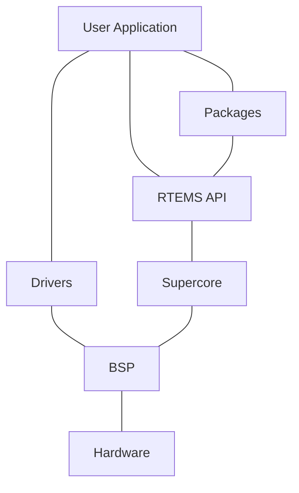

RTEMS targets are grouped by architectures and within an architecture there are a number of Board Support Packages or BPSs. An architecture is a specific class or family of processors and can be large such as ARM or specific such as the NIOS-II or Microblaze.

RTEMS is designed to be ported to new target hardware easily and efficiently.

## 6.2 Architectures

An RTEMS architecture is a class or family of a processor architecture that RTEMS supports. The RTEMS architecture model follows the architecture model of GCC. An architecture in GCC results in a specific RTEMS GCC compiler. This compiler may support a range of processors in the family that may have differences in instructions sets, floating point support or other aspects. RTEMS configures GCC to create separate runtime libraries for each supported instruction set, floating point unit, vector unit, word size (e.g. 32-bit and 64-bit), endianess, code model, ABI, processor errata workarounds, and so on in the architecture. This is termed *multilib*. Multilibs are chosen automatically by GCC via selecting a specific set of machine options.

You can query the multilibs of a specific RTEMS GCC compiler via the `-print-multi-lib` option:

```
1 $ sparc-rtems5-gcc -print-multi-lib
2 .;
3 soft;@msoft-float
4 v8;@mcpu=v8
5 leon3;@mcpu=leon3
6 leon3v7;@mcpu=leon3v7
7 leon;@mcpu=leon
8 leon3/gr712rc;@mcpu=leon3@mfix-gr712rc
9 leon3v7/gr712rc;@mcpu=leon3v7@mfix-gr712rc
10 leon/ut699;@mcpu=leon@mfix-ut699
11 leon/at697f;@mcpu=leon@mfix-at697f
12 soft/v8;@msoft-float@mcpu=v8
13 soft/leon3;@msoft-float@mcpu=leon3
14 soft/leon3v7;@msoft-float@mcpu=leon3v7
15 soft/leon;@msoft-float@mcpu=leon
16 soft/leon3/gr712rc;@msoft-float@mcpu=leon3@mfix-gr712rc
17 soft/leon3v7/gr712rc;@msoft-float@mcpu=leon3v7@mfix-gr712rc
18 soft/leon/ut699;@msoft-float@mcpu=leon@mfix-ut699
19 soft/leon/at697f;@msoft-float@mcpu=leon@mfix-at697f
```

Each printed line represents a multilib. The `.` corresponds to the default multilib. It is used if a set of machine options does not match to a specialized multilib. The string before the `;` describes the directory in the GCC installation used for the particular multilib. After the `;` the set of machine options for this multilib follows separated by `@` characters.

You can figure out the multilib selected by GCC for a set of machine options with the `-print-multi-directory` option:

```
1 $ sparc-rtems5-gcc -print-multi-directory -mcpu=leon3
2 leon3
```

It is crucial that the RTEMS BSP, support libraries and the application code are compiled consistently with a compatible set of machine options. Otherwise, in the best case errors during linking will occur or you may end up silently with undefined behaviour which results in sporadic run-time crashes. A wrong set of machine options may result in a running application, however, with degraded performance, e.g. hardware floating point unit is not used by the mathematical library.

For a list of architectures supported by RTEMS please have a look at the sections of the *Board Support Packages* (page 69) chapter.

*RTEMS executables* (page 185) are statically linked for a specific target therefore a precise and exact match can be made for the hardware that extracts the best possible performance. The compiler supports the variants to the instruction set and RTEMS extends the specialization to specific processors in an architecture. This specialization gives RTEMS a finer resolution of features and capabilities a specific device may offer allowing the kernel, drivers and application to make the most of those resources. The trade off is portability however this is not important because the executable are statically linked for a single target.

> **Note**
>
> RTEMS support dynamically load code through the dlopen interface. Loading code via this interface results in an executable image that is equivalent to statically linked executable of the same code. Dynamic loading is a system level tool for system architects.

## 6.3 Tiers

RTEMS has a tiered structure for architecture and BSPs. It provides:

1. A way to determine the state of a BSP in RTEMS.
2. A quaility measure for changes entering the RTEMS source code.

The RTEMS project supports RTEMS Architecture Tiers. Each architecture resided in one of the numbered tiers. The tiers are number 1 to 4 where Tier 1 is the highest tier and Tier 4 is the lowest. Architectures move between tiers based on the level of support and the level of testing that is performed. An architecture requires continual testing and reporting of test results to maintain a tier level. The RTEMS Project’s continuous integration testing program` continually monitors and reports the test results.

The RTEMS Architecture Tier system provides a defined way to determine the state of an architecture in RTEMS. Architectures age and support for them drops off and the RTEMS Project needs a way to determine if an architecture should stay and be supported or depreciated and removed. The tier system also provides users with a clear understanding of the state of an architecture in RTEMS, often useful when deciding on a processor for a new project. It can also let a user know the RTEMS Project needs support to maintain a specific architecture. Access to hardware to perform testing is a large and complex undertaking and the RTEMS Project is always looking for user support and help. If you can help please contact someone and let us know.

The tier structure in RTEMS is support by the Buildbot continuous integration server. Changes to RTEMS are automatically built and tested and the results indicate if a BSP currently meets its tier status. As the RTEMS Project does not own hardware for every BSP, it is critical that users provide test results on hardware of interest.

The rules for Tiers are:

1. A BSP can only be in one of the following tiers:

| Tier |                                                                                        | Description |   |
| ---- | -------------------------------------------------------------------------------------- | ----------- | - |
| 1    | \* The RTEMS Kernel must build without error.<br/>\* Tests are run on target hardware. |             |   |
| 2    | \* The RTEMS Kernel must build without error.<br/>\* Tests can be run on simulation.   |             |   |
| 3    | \* The RTEMS Kernel must build without error.<br/>\* There are no test results.        |             |   |
| 4    | \* The RTEMS Kernel does not build.                                                    |             |   |
| 5    | \* The BSP is to be removed after the next release.                                    |             |   |


2. An architecuture's tier is set by the highest BSP tier reached.

3. The tier level for a BSP is set by the RTEMS Project team. Movement of BSP between tier level requires agreement. The Buildbot results indicate the minimum current tier level.

4. Changes to RTEMS may result in a BSP not meeting its tier are acceptable if the change is accompanied by an announcement and a plan on how this is to be resolved. Temporary drops in tier are expected and should be brief.

5. Test results are set on a per BSP basis by the RTEMS Project team. Changes to the test result values requires agreement. The test results are defined as:

    1. Passes
    2. Expected Failures

    Expected failures must be explicitly listed. A BSP is required to have a valid test result entry on target hardware to reach tier 1.

# BSP BUILD SYSTEM

The purpose of the build system is to produce and install artefacts from the RTEMS sources such as static libraries, start files, linker command files, configuration header files, header files, test programs, package description files, and third-party build system support files for a specific BSP in a user controlled configuration.

## 7.1 Overview

The build system consists of three components which are all included in the RTEMS sources
* the waf meta build system command line tool,
* a wscript file used by waf, and
* a set of build specification items maintained by a text editor just like other source files.

The build system is controlled by the user through
* commands passed to the waf command line tool,
* command line options passed to waf, and
* configuration files (e.g. `config.ini`) used by wscript through waf invocations.

Configurable things which are subject to a local installation variant such as paths to tools are intended to be passed as command line options to the waf command line tool. Which BSPs are built and how they are configured by means of options is placed in configuration files (e.g. `config.ini`). The configuration files may reside anywhere in the file system and the goal is to have it under version control by the user.

## 7.2 Work Flow

There are five steps necessary to build and install one or more BSPs.

1. Select which BSPs you want to build. See also *Deployment* (page 69) and `./waf bsplist`.
2. Write a BSP build configuration file (e.g. `config.ini`) which determines which BSPs are built and how they are configured.
3. Run the `./waf configure` command to generate the build environment.
4. Build the BSP artefacts with `./waf`. The build uses the build environment created by `./waf configure`. The BSP build configuration file (e.g. `config.ini`) is no longer used and may be deleted.
5. Install the BSP artefacts with `./waf install`.

# 7.3 Commands

The build system is controlled by invocations of the `./waf` command line tool instead of the well known make. Since waf is written in Python, a standard Python 2.7 or 3 installation without third-party packages is required to run it. The `./waf` command line tool must be invoked in the RTEMS source tree top-level directory.

Some commands accept the `--rtems-specs` command line option. This option specifies paths to build specification items. It is an advanced option and there is normally no need to use it. It may be used to customize the build at the level of the build specification. For more information see the Build System chapter of the RTEMS Software Engineering guide.

### 7.3.1 Help

Use `./waf --help` to get a list of commands and options.

### 7.3.2 BSP List

The BSP list command `./waf bsplist` loads the build specification items and generates a list of base BSPs from it. The list is sorted by architecture and base BSP name. Which base BSPs are listed can be controlled by the `--rtems-bsps` command line option. It expects a comma-separated list of Python regular expressions which select the desired BSP variants. The path to the build specification items can be specified by the `--rtems-specs` command line option.

```
1 $ ./waf bsplist --rtems-bsps=sparc/
2 sparc/at697f
3 sparc/erc32
4 sparc/gr712rc
5 sparc/gr740
6 sparc/leon2
7 sparc/leon3
8 sparc/ut699
9 sparc/ut700
```

```
1 $ ./waf bsplist --rtems-bsps='/leon,/rv64imac$'
2 riscv/rv64imac
3 sparc/leon2
4 sparc/leon3
```

### 7.3.3 BSP Defaults

The BSP defaults command `./waf bspdefaults` loads the build specification items and generates a list options with default values for each base BSP from it. The list is sorted by architecture and base BSP name. Which base BSPs are listed can be controlled by the `--rtems-bsps` command line option. Default values may depend on the selected compiler. The compiler can be specified by the `--rtems-compiler` command line option. The path to the build specification items can be specified by the `--rtems-specs` command line option.

```
1 $ ./waf bspdefaults --rtems-bsps=gr712rc --rtems-compiler=gcc | grep ABI_FLAGS
2 ABI_FLAGS = -mcpu=leon3 -mfix-gr712rc
```

```bash
1 $ ./waf bspdefaults --rtems-bsps=gr712rc --rtems-compiler=clang | grep ABI_FLAGS
2 ABI_FLAGS = -mcpu=gr712rc
```

### 7.3.4 Configure

The configure command `./waf configure` loads the BSP build configuration files and the build specification items and configures the build environment accordingly. The configuration files can be specified by the `--rtems-config` command line option. It expects a comma-separated list of paths to the configuration files. By default, the file `config.ini` is used. The paths to RTEMS tools can be specified by the `--rtems-tools` command line option. It expects a comma-separated list of prefix paths to tools, e.g. compiler, linker, etc. By default, the installation prefix is used for the RTEMS tools. Tools are searched in the prefix path and also in a bin subdirectory of the prefix path. The path to the build specification items can be specified by the `--rtems-specs` command line option.

### 7.3.5 Build, Clean, and Install

The commands `./waf`, `./waf clean`, and `./waf install` load the build specification items according to the specification paths stored in the build environment. The BSP build configuration files (e.g. `config.ini`) used by the `./waf configure` command to create the build environment are not longer used and may be deleted. The build commands perform a dependency tracking and re-build artefacts if input sources changed. Input sources are also the build specification.

# 7.4 Configuration

The BSP build configuration is done via INI-style configuration files. The configuration files are consumed by the `./waf configure` command. By default, the file `config.ini` is used. You can specify other configuration files with the `--rtems-config` command line option. The configuration files consist of sections and options (key-value pairs).

To build a particular BSP, you have to create a section with the BSP variant name.

```ini
1 [sparc/erc32]
```

This one line configuration file is sufficient to build the base BSP sparc/erc32 with default values for all options. The base BSPs are determined by the build specification. The `./waf bsplist` command lists all base BSPs. You can create your own BSP names. However, in this case you have to inherit from a base BSP. The inheritance works only within an architecture, e.g. a riscv BSP cannot inherit options from an arm BSP.

```ini
1 [sparc/foobar]
2 INHERIT = erc32
```

The inheritance works recursively and must end up in a base BSP.

```ini
1 [sparc/foo]
2 INHERIT = erc32
3
4 [sparc/bar]
5 INHERIT = foo
```

A child BSP variant inherits all options from the parent BSP variant. The child BSP can override the inherited options.

You can determine the compiler used to build the BSP with the `COMPILER` option.

```ini
1 [sparc/gr740_gcc]
2 INHERIT = gr740
3 COMPILER = gcc
4
5 [sparc/gr740_clang]
6 INHERIT = gr740
7 COMPILER = clang
```

Use the `./waf bspdefaults` command to get a list of all configuration options with default values.

```shell
1 $ ./waf bspdefaults --rtems-bsps=sparc/erc32
2 [sparc/erc32]
3 # Flags passed to the library archiver
4 ARFLAGS = crD
5 # Warning flags passed to the C compiler
6 CC_WARNING_FLAGS = -Wmissing-prototypes -Wimplicit-function-declaration -Wstrict-
  ↪prototypes -Wnested-externs
7 # Warning flags passed to the C++ compiler
8 CXX_WARNING_FLAGS =
```

(continues on next page)

(continued from previous page)
```
 9 # Flags passed to the linker (GNU ld)
10 LDFLAGS = -Wl,--gc-sections
11 # Enable the Ada support
12 __RTEMS_ADA__ = False
13 # Enable the RTEMS internal debug support
14 RTEMS_DEBUG = False
15 ...
16 # Install the legacy application Makefile framework.
17 INSTALL_LEGACY_MAKEFILES = True
```

It is not recommended to blindly add all the options obtained through the `./waf bspdefaults` command to custom configuration files. The specified options should be kept at the necessary minimum to get the desired build.

Some projects may still want to specify all options in a configuration file to be independent of changes in the base BSP. You can review differences between the user and base BSP values with the `diff` command.

```
 1 $ ./waf bspdefaults --rtems-bsps=sparc/erc32 > config.ini
 2 $ sed -i 's/BUILD_TESTS = False/BUILD_TESTS = True/' config.ini
 3 $ ./waf bspdefaults --rtems-bsps=sparc/erc32 | diff -u - config.ini
 4 --- config.ini 2019-12-04 08:21:36.049335872 +0100
 5 +++ -       2019-12-04 08:21:41.187432405 +0100
 6 @@ -31,7 +31,7 @@
 7  # Build the Ada test programs (may be also enabled by BUILD_TESTS)
 8  BUILD_ADATESTS = False
 9  # Build the test programs
10 -BUILD_TESTS = False
11 +BUILD_TESTS = True
12  # Build the benchmark programs (may be also enabled by BUILD_TESTS)
13  BUILD_BENCHMARKS = False
14  # Build the file system test programs (may be also enabled by
```

There is a special section `DEFAULT` which can be used to specify default values for all other sections of the configuration file. In the following example configuration file, building of the tests is enabled for the `sparc/erc32` and the `riscv/griscv` BSP.

```
1 [DEFAULT]
2 BUILD_TESTS = True
3
4 [sparc/erc32]
5
6 [riscv/griscv]
```

## 7.5 Migration from Autoconf/Automake

The Autoconf/Automake based build system used a configure command to configure a single target architecture and one or more BSPs. The make command was used to build it. The configure command is replaced by a `./waf configure` invocation with configuration file. The make command is replaced by `./waf` and `make install` is replaced by `./waf install`.

Here are some hints for how a configure command line can be converted to options in the configuration file of the waf based build system. BSP options given at the configure command line have to be added to the BSP section in the configuration file.

**`--target=${arch}-rtems6 --enable-rtemsbsp=${bsp}`**
To build a BSP add `[${arch}/${bsp}]` to the configuration file.

**`--enable-ada | --disable-ada`**
Set `__RTEMS_ADA__` to True or False in the BSP section of the configuration file.

**`--enable-multiprocessing | --disable-multiprocessing`**
Set `RTEMS_MULTIPROCESSING` to True or False in the BSP section of the configuration file.

**`--enable-paravirt | --disable-paravirt`**
Set `RTEMS_PARAVIRT` to True or False in the BSP section of the configuration file.

**`--enable-profiling | --disable-profiling`**
Set `RTEMS_PROFILING` to True or False in the BSP section of the configuration file.

**`--enable-posix | --disable-posix`**
Set `RTEMS_POSIX_API` to True or False in the BSP section of the configuration file.

**`--enable-rtems-debug | --disable-rtems-debug`**
Set `RTEMS_DEBUG` to True or False in the BSP section of the configuration file.

**`--enable-smp | --disable-smp`**
Set `RTEMS_SMP` to True or False in the BSP section of the configuration file.

**`--enable-tests | --disable-tests`**
Set `BUILD_TESTS` to True or False in the BSP section of the configuration file.

**`--enable-tests=samples`**
Set `BUILD_SAMPLES` to True or False in the BSP section of the configuration file.

Please have a look at the following example configuration file.

```ini
1 # --target=sparc-rtems6 --enable-rtemsbsp=erc32
2 [sparc/erc32]
3
4 # --enable-ada
5 __RTEMS_ADA__ = True
6
7 # --enable-multiprocessing
8 RTEMS_MULTIPROCESSING = False
9
10 # --disable-paravirt
11 RTEMS_PARAVIRT = False
12
13 # --enable-profiling
14 RTEMS_PROFILING = True
```
(continues on next page)

(continued from previous page)

```python
15
16 # --disable-posix
17 RTEMS_POSIX_API = False
18
19 # --enable-rtems-debug
20 RTEMS_DEBUG = True
21
22 # --disable-smp
23 RTEMS_SMP = False
24
25 # --enable-tests
26 BUILD_TESTS = True
27
28 # BSP_POWER_DOWN_AT_FATAL_HALT=
29 BSP_POWER_DOWN_AT_FATAL_HALT = False
```

# BOARD SUPPORT PACKAGES

A Board Support Package or BSP is the software that glues a specific target or board or piece of hardware to RTEMS so it's services are available to applications.

RTEMS contains a large number of BSPs for commonly available simulators and target hardware.

You can see the current BSP list in the RTEMS sources by asking RTEMS with:

```bash
1 $ ./rtems-bsps
```

# 8.1 aarch64 (AArch64)

## 8.1.1 Qemu A53

This BSP supports two variants, `qemu_a53_ilp32` and `qemu_a53_lp64`. The basic hardware initialization is performed by the BSP. These BSPs support the GICv3 interrupt controller.

### 8.1.1.1 Boot via ELF

The executable image is booted by Qemu in ELF format.

### 8.1.1.2 Clock Driver

The clock driver uses the ARM Generic Timer.

### 8.1.1.3 Console Driver

The console driver supports the default Qemu emulated ARM PL011 PrimeCell UART.

### 8.1.1.4 Running Executables

Executables generated by these BSPs can be run using the following command:

```
1 qemu-system-aarch64 -no-reboot -nographic -serial mon:stdio \
2 -machine virt,gic-version=3 -cpu cortex-a53 -m 4096 -kernel example.exe
```

## 8.1.2 Qemu A72

This BSP supports two variants, `qemu_a72_ilp32` and `qemu_a72_lp64`. The basic hardware initialization is performed by the BSP. These BSPs support the GICv3 interrupt controller.

### 8.1.2.1 Boot via ELF

The executable image is booted by Qemu in ELF format.

### 8.1.2.2 Clock Driver

The clock driver uses the ARM Generic Timer.

### 8.1.2.3 Console Driver

The console driver supports the default Qemu emulated ARM PL011 PrimeCell UART.

### 8.1.2.4 Running Executables

Executables generated by these BSPs can be run using the following command:

**qemu-system-aarch64 -no-reboot -nographic -serial mon:stdio**
-machine virt,gic-version=3 -cpu cortex-a72 -m 4096 -kernel example.exe

## 8.1.3 Raspberry Pi 4B

The ‘raspberrypi4b’ BSP currently supports only the LP64 ABI. ILP32 is not supported. Raspberry pi 4B all variants and Raspberry Pi 400 are supported. The default bootloader which is used by the Raspbian OS or other OS can be used to boot RTEMS. SMP is supported.

Raspberry Pi 4B has 2 types of interrupt controller, GIC-400 (GICv2) and ARM legacy generic controller. Both are supported.

The documentation says that `enable_gic=1` is the default but that seems to be true only if device tree is present otherwise it reverts to the legacy interrupt controller. So set `enable_gic=1` in the `config.txt` file to make sure gic is enable.

### 8.1.3.1 Build Configuration Options

The following options can be used in the BSP section of the waf configuration INI file. The waf defaults can be used to inspect the values.

**CONSOLE_USE_INTERRUPTS**
Use interrupt driven mode for console devices (enabled by default).

**GPU_CORE_CLOCK_RATE**
The GPU processor core frequency in Hz (default is 500000000), The value of this option should be the same as the value of option `core_freq` in `config.txt`. See the Raspberry Pi documentation for details.

**BSP_SPI_USE_INTERRUPTS**
Use interrupt mode in the SPI driver (enabled by default).

**BSP_CLOCK_USE_SYSTEMTIMER**
Use the System Timer in the clock driver (disable by default).

**BSP_I2C_USE_INTERRUPTS**
Use interrupt mode in the I2C driver (enabled by default).

**BSP_CONSOLE_PORT**
Default UART port for the console device (default is UART0). The optional ports are UART0, UART2, UART3, UART4, UART5.

**BSP_PL011_CLOCK_FREQ**
PL011 UART clock frequency in Hz (default is 48000000). The value of this option should be the same as the value of option `init_uart_clock` in `config.txt`. See the Raspberry Pi documentation for details.

### 8.1.3.2 Clock Driver

Raspberry pi 4B has two timers.

The System Timer and The ARM Generic Timer.

The clock from the ARM timer is derived from the system clock. This clock can change dynamically e.g. if the system goes into reduced power or in low power mode. Thus the clock speed adapts to the overall system performance capabilities. For accurate timing it is recommended to use the system timers.

The clock driver uses the ARM Generic Timer by default. Set `BSP_CLOCK_USE_SYSTEMTIMER = True` in the Build Configuration Options to enable the System Timer.

### 8.1.3.3 Console Driver

Raspberry pi 4B has 2 types of UARTs, ARM PL011 and Mini-uart. The PL011 is a capable, broadly 16550-compatible UART, while the mini UART has a reduced feature set. The console driver supports the default Qemu emulated ARM PL011 PrimeCell UART as well as the physical ARM PL011 PrimeCell UART in the raspberrypi hardware. Mini-uart is not supported.

Set `BSP_CONSOLE_PORT` in the Build Configuration Options to set the default UART port for the console device.

Initialize gpio of UART and install UART to the dev directory by `raspberrypi_uart_init()` function.

```c
1  #include <assert.h>
2  #include <bsp/console.h>
3
4  void uart_init(void)
5  {
6    int rv;
7
8    /* The optional devices are UART0, UART2, UART3, UART4, UART5. */
9    rv = raspberrypi_uart_init(UART0);
10   assert(rv == 0);
11 }
```

### 8.1.3.4 GPIO Driver

The GPIO of Raspberry pi 4B can be controlled by the following functions: `raspberrypi_gpio_set_function()`, `raspberrypi_gpio_set_pin()`, `raspberrypi_gpio_clear_pin()`, `raspberrypi_gpio_set_pull()`.

```c
1  void gpio(void)
2  {
3    /* Define the operation of the general-purpose I/O pins. Each of the 58
4     * GPIO pins has at least two alternative functions as defined.
5     * The optional functions are GPIO_INPUT, GPIO_OUTPUT, GPIO_AF5, GPIO_AF4,
6     * GPIO_AF0, GPIO_AF1, GPIO_AF2, GPIO_AF3
7     */
8    raspberrypi_gpio_set_function(8, GPIO_AF0);
9
10   /* Control the actuation of the internal pull-up/down resistors.
11    * The optional value are GPIO_PULL_NONE, GPIO_PULL_UP, GPIO_PULL_DOWN
12    */
13   raspberrypi_gpio_set_pull(8, GPIO_PULL_NONE);
14
15   /* Clear a GPIO pin. */
16   raspberrypi_gpio_clear_pin(8);
17
18   /* Set a GPIO pin. */
19   raspberrypi_gpio_set_pin(8);
20 }
```

### 8.1.3.5 SPI Driver

The BCM2711 device has five SPI interfaces of this type: SPI0, SPI3, SPI4, SPI5 & SPI6. It has two additional mini SPI interfaces (SPI1 and SPI2). The SPI driver supports SPI0, SPI3, SPI4, SPI5 & SPI6. The mini SPI is not supported.

SPI drivers are registered by the `raspberrypi_spi_init()` function. The driver has no DMA support, but has interrupt support.

```c
1 #include <assert.h>
2 #include <bsp/raspberrypi-spi.h>
3 
4 void spi_init(void)
5 {
6   int rv;
7 
8   /*
9    * The optional devices are raspberrypi_SPI0, raspberrypi_SPI3,
10   * raspberrypi_SPI4, raspberrypi_SPI5, raspberrypi_SPI6.
11   */
12  rv = raspberrypi_spi_init(raspberrypi_SPI0);
13  assert(rv == 0);
14 }
```

### 8.1.3.6 I2C Driver

The BSC(Broadcom Serial Control) Controller has a total of 6 master: BSC0, BSC1, BSC3, BSC4, BSC5 and BSC6. The driver supports all these masters under devices: `raspberrypi_bscmX`. Interrupt driven I2C is enabled by default.

```c
1 #include <assert.h>
2 #include <bsp/raspberrypi-i2c.h>
3 
4 void i2c_example(void){
5   int rv;
6 
7   rv = rpi_i2c_init(raspberrypi_bscm1, CLOCK_SPEED);
8   assert(rv == 0);
9 }
```

### 8.1.3.7 Watchdog Driver

```c
1 void raspberrypi_watchdog_example()
2 {
3   raspberrypi_watchdog_init();
4   raspberrypi_watchdog_start(15000);
5 
6   raspberrypi_watchdog_reload();
7   /* ... */
8   raspberrypi_watchdog_reload();
9 
10  raspberrypi_watchdog_stop();
11 }
```

The watchdog driver is used to implement BSP/system reset.

### 8.1.3.8 PWM Driver

The Raspberry Pi has 2 PWM masters PWM0 and PWM1. Each of these masters has 2 channels each PWMx_0 and PWMx_1. The PWM driver allows the user to configure the PWM clock, Data and Range.

```c
1  #include "bsp/raspberrypi-pwm.h"
2
3  void pwm_example()
4  {
5      /*
6       * Set the Clock divisor where 0 < DIVI < 4096.
7       */
8      rtems_status_code sc = rpi_pwm_set_clock(DIVI);
9
10     /*
11      * Initialise the master and the channel with duty and range.
12      * The DUTY cannot be greater than the RANGE.
13      */
14     sc = rpi_pwm_init(
15         raspberrypi_pwm_master1,     /* PWM Master 1 */
16         raspberrypi_pwm0,            /* Channel 0 */
17         RANGE,                       /* Range (max counter value) */
18         DUTY                         /* Initial duty cycle (<= RANGE) */
19     );
20
21     /*
22      * To change the duty after initialising the PWM channel.
23      */
24     sc = rpi_pwm_set_data(
25         raspberrypi_pwm_master1,
26         raspberrypi_pwm0,
27         DUTY2
28     );
29 }
```

### 8.1.3.9 DMA Driver

The DMA driver currently supports memory-to-memory transfers. The DMA driver can be controlled using the following functions: `rpi_dma_mem_to_mem_init()` `rpi_dma_start_transfer()` `rpi_dma_wait()`

```c
1  #include <bsp/raspberrypi-dma.h>
2
3  void dma_test()
4  {
5      /* The source and destination pointers must be cache aligned */
6      void* src = rtems_heap_allocate_aligned_with_boundary(BUFFER_SIZE,
7                                                           CPU_CACHE_LINE_BYTES,
8                                                           0);
9      void* dst = rtems_heap_allocate_aligned_with_boundary(BUFFER_SIZE,
```
(continues on next page)

(continued from previous page)
```c
10                                                                  CPU_CACHE_LINE_BYTES,
11                                                                  0);
12
13     rtems_status_code ret = rpi_dma_mem_to_mem_init(channel,
14                                                src,
15                                                dst,
16                                                BUFFER_SIZE);
17     if (ret != RTEMS_SUCCESSFUL) {
18         free(src);
19         free(dst);
20         return;
21     }
22
23     ret = rpi_dma_start_transfer(channel);
24     if (ret != RTEMS_SUCCESSFUL) {
25         free(src);
26         free(dst);
27         return;
28     }
29
30     ret = rpi_dma_wait(channel);
31     if (ret != RTEMS_SUCCESSFUL) {
32         free(src);
33         free(dst);
34         return;
35     }
36
37    }
```

### 8.1.3.10 Preparing to boot

Raspberry Pi uses a different mechanism to boot when compared with any ARM SoC. First the GPU initializes, loads the bootloader (Raspberry pi firmware) and then looks for the kernel img. This whole process is done by the GPU (VideoCore IV) till the kernel is loaded. More information can be found on the Raspberry pi documentation page. By default the arm64 mode looks for the kernel8.img. Any other kernel can be loaded by adding kernel=<img_name> to the config.txt file.

The Firmware files are required in order to boot RTEMS. The latest firmware can be downloaded from the Raspberry Pi Firmware Repository. USB boot is supported. All the files (Firmwares and kernel) must be place in the FAT32 partition only. Add arm_64bit=1 in the config.txt file in order to boot the BSP in 64bit kernel mode (it is default).

#### UART Setup

Connect your serial device to the GPIO15 and GPIO14. Add the following to the config.txt file in order to use the PL011 UART0 and thus disabling the default Mini-uart.

A Minimal version of config.txt using UART0:

```
1 dtoverlay=disable-bt
2 arm_64bit=1
3 kernel=kernel8.img
4 enable_uart=1
```

### Generating kernel image

The following steps show how to run `hello.exe` on the BSP. Other executables can be processed in a similar way.

To create the kernel image:

```
1 $ aarch64-rtems7-objcopy -Obinary hello.exe kernel8.img
```

Copy the kernel image to the SD card.

#### 8.1.3.11 JTAG Setup

The Raspberry Pi 4 doesn’t have dedicated JTAG pins. Instead, you must configure the GPIO pins (GPIO22-GPIO27) to activate the JTAG functionality. The RPi 4 documentation refers to this as Alt4 functions of those pins. Alt5 does exist too, which goes from GPIO4, 5, 6, 12 and 13. you can check this out from pinout.xyz or eLinux

One more thing to note on JTAG with Raspberry pi 4B is that, by default, All the GPIO pins are pulled down, according to the BCM2711 documentation. This wasn’t the case in the earlier models. So in order to let the data flow freely, we will have to disable them.

```
1 # Disable pull downs
2 gpio=22-27=np
3
4 # Enable jtag pins (i.e. GPIO22-GPIO27)
5 enable_jtag_gpio=1
```

#### 8.1.3.12 Running Executables on QEMU

Executables generated by these BSPs can be run using the following command:

```
1 qemu-system-aarch64 -M raspi4b -serial mon:stdio -nographic \
2 -kernel kernel8.img
```

### 8.1.4 xen (Xen on AArch64)

This BSP enables RTEMS to run as a guest virtual machine in AArch64 mode on the Xen hypervisor for ARMv8 platforms.

Drivers:

* Clock: ARMv8-AR Generic Timer
* Console: Virtual PL011 device
* Interrupt: GICv2

BSP variants:

* xen: completely virtualized guest with no dependence on underlying hardware

The xen BSP relies on standard Xen features, so it should be able to run on any ARMv8 platform. This BSP supports SMP if `RTEMS_SMP=True` is set and the Xen domU configuration file has more than one vCPU allocated.

Xen allows for the passthrough of hardware peripherals to guest virtual machines. BSPs could be added in the future targeting specific hardware platforms and include the appropriate drivers.

This BSP was tested with Xen running on the Xilinx Zynq UltraScale+ MPSoC using the PetaLinux distribution.

### 8.1.4.1 Execution

This procedure describes how to run the ticker sample application that should already be built with the BSP.

The `ticker.exe` file can be found in the BSP build tree at:

```
1 aarch64/xen/testsuites/samples/ticker.exe
```

The `ticker.exe` elf file must be translated to a binary format.

```
1 aarch64-rtems7-objcopy -O binary ticker.exe ticker.bin
```

Then place the `ticker.bin` file on the dom0 filesystem.

From the dom0 console, create a configuration file `ticker.cfg` with the following contents.

```
1 name = "ticker"
2 kernel = "ticker.bin"
3 memory = 8
4 vcpus = 1
5 gic_version = "v2"
6 vuart = "sbsa_uart"
```

Create the virtual machine and attach to the virtual vpl011 console.

```
1 xl create ticker.cfg && xl console -t vuart ticker
```

To return back to the dom0 console, press both **Ctrl** and **]** on your keyboard.

### 8.1.5 Qemu Xilinx Versal

This BSP supports three variants: `versal-qemu`, `versal-aiedge` and `versal-vck190`. The basic hardware initialization is performed by the BSP. These BSPs support the GICv3 interrupt controller present in the Xilinx Versal Adaptive Compute Acceleration Platform (ACAP) systems. The BSPs currently only work when started in the secure mode.

#### 8.1.5.1 Boot via ELF

The executable image is booted by Qemu in ELF format.

#### 8.1.5.2 Clock Driver
The clock driver uses the ARM Generic Timer.

#### 8.1.5.3 Console Driver
The console driver supports the default Qemu emulated ARM PL011 PrimeCell UART. There are some differences between the PL011 and the UART used by actual Versal ACAP hardware systems.

#### 8.1.5.4 Running Executables
Executables generated by these BSPs can be run using the following command:

**qemu-system-aarch64 -no-reboot -nographic -serial mon:stdio**
-machine xlnx-versal-virt -m 4096 -kernel example.exe

### 8.1.6 Xilinx ZynqMP
This BSP family supports the following variants:
* zynqmp_qemu_ilp32
* zynqmp_qemu
* zynqmp_apu_ilp32
* zynqmp_apu
* zynqmp_cfc400x

Platform-specific hardware initialization is performed by ARM Trusted Firmware (ATF). Other basic hardware initialization is performed by the BSP. These BSPs support the GICv2 interrupt controller present in all ZynqMP systems. The zynqmp_apu BSP has been tested on zu2cg, zu3eg, and zu9cg chip variants and should also work on any other ZynqMP chip variant since the Processing Subsystem (PS) does not vary among chip variants other than the number of CPU cores available.

This BSP family has been tested on the following hardware:
* Avnet UltraZed-EG SOM
* Innoflight CFC-400X
* Trenz TE0802
* Xilinx ZCU102

#### 8.1.6.1 Boot on QEMU
The executable image is booted by Qemu in ELF format.

#### 8.1.6.2 Boot on ZynqMP Hardware
On ZynqMP hardware, RTEMS can be started at EL1, EL2, or EL3 by u-boot or directly as part of BOOT.bin. Regardless of the exception level at boot, RTEMS will drop to EL1 for execution. For quick turnaround during testing, it is recommended to use the u-boot BOOT.bin that comes with the PetaLinux prebuilts for the board in question.

Some systems such as the CFC-400X may require a bitstream to be loaded into the FPGA portion of the chip to operate as expected. This bitstream must be loaded before RTEMS begins operation since accesses to programmable logic (PL) memory space can cause the CPU to hang if the FPGA is not initialized. This can be performed as part of BOOT.bin or by a bootloader such as u-boot. Loading bitstreams from RTEMS has not been tested on the ZynqMP platform and requires additional libraries from Xilinx.

### 8.1.6.3 Hardware Boot Image Generation

RTEMS expects some hardware initialization to be performed by ATF and expects the services it provides to be present, so this must be included when generating a direct-boot RTEMS BOOT.bin.

When booting via u-boot, RTEMS must be packaged into a u-boot image or booted as a raw binary since u-boot does not currently support ELF64 which is required for AArch64 ELF binaries.

### 8.1.6.4 Example: Booting a RTEMS image on the ZCU102 ZynqMP board

This example will walk through the steps needed for booting RTEMS from a SD card on the ZCU102 ZynqMP board. The reference for setting up a SD card and obtaining pre-built boot images is here.

#### Hardware Setup

Set the dip switch SW6 according to the table below. This will allow the board to boot from the SD card. Connect a Micro-USB cable to the USB UART interface J83. This is a quad USB UART interface which will show up on the development host computer as four different serial or tty devices. Use the first channel for the console UART. It should be set to 115k baud.

| Dip Switch JW6 | Dip Switch JW6 | Dip Switch JW6 | Dip Switch JW6 |
| -------------- | -------------- | -------------- | -------------- |
| ON             | OFF            | OFF            | OFF            |


#### Prepare a SD card with a bootable partition

The goal is to have a bootable SD card with a partition that is formatted with the FAT file system. The file system will contain the boot artifacts including BOOT.bin and the u-boot image. The RTEMS image will be placed on this volume. To create the bootable SD card, follow the directions here.

Once you have the card formatted correctly, you need to place the files from this archive on the FAT partition. The following file was used for this example: xilinx-vck190-v2021.2-final.bsp

In order to download these files, you need to have a Xilinx account login. As an alternative, you can download a bootable image for Ubuntu 20.04 and write it to an SD card using a utility such as Balena Etcher or dd. The Ubuntu image is available here. Download the image for the Zynq Ultrascale+ MPSoC Development boards, uncompress it and write it to the SD card. This image creates multiple partitions, but we only need to use the FAT partition with the boot artifacts on it.

### Verify that the board can boot from the SD card

It is worth booting the board from the SD card before trying to boot RTEMS. Insert the card and power on the board. You should see the messages on the first console indicating the various boot loader stages and eventually the Linux kernel. The goal is to interrupt u-boot when given the chance to access the u-boot command prompt.

### Build RTEMS with examples

Build the RTEMS zynqmp_apu BSP. Use the ticker.exe sample which can be found in the directory:

```
1 build/aarch64/zynqmp_apu/testsuites/samples
```

### Prepare the RTEMS image

Prepare your RTEMS image to boot from u-boot with the following commands:

```
1 $ aarch64-rtems7-objcopy -Obinary ticker.exe ticker.bin
2 $ gzip -9 ticker.bin
3 $ mkimage -A arm64 -O rtems -T kernel -a 0x10000 -e 0x10000 -n RTEMS -d ticker.
  ↪bin.gz rtems.img
```

Note: If the start address has been changed in the BSP configuration, you have to adapt the `-a` and `-e` parameters accordingly. To find out the start address of an application, `aarch64-rtems6-nm ticker.exe | grep \ _start` can be used. That will show the address of the `_start` symbol which is the value that has to be used for the two parameters.

### Boot the RTEMS image

Copy the prepared RTEMS image to the SD card and insert the SD crd in the ZCU102 board. Power on the board. When you see the prompt on the console to interupt u-boot, hit a key to bring up the u-boot command prompt. On the u-boot command prompt you can boot your RTEMS image:

```
1 Zynq-MP> fatload mmc 0:1 0x1000 rtems.img
2 Zynq-MP> bootm 0x1000
```

This is the entire boot sequence:

```
1 Pre-FSBL boot Started
2 Xilinx Zynq MP First Stage Boot Loader
3 Release 2020.2  Nov 18 2020  - 11:46:01
4 NOTICE:  ATF running on XCZU9EG/silicon v1/RTL5.1 at 0xfffea000
5 NOTICE:  BL31: v2.2(release):xilinx_rebase_v2.2_2020.1-10-ge6eea88b1
6 NOTICE:  BL31: Built : 12:28:45, Nov 17 2020
7
8 U-Boot 2020.01 (Jun 15 2021 - 14:24:32 +0000)
9
10 Model: ZynqMP ZCU102 Rev1.0
11 Board: Xilinx ZynqMP
12 DRAM:  4 GiB
```

(continues on next page)

(continued from previous page)

```
13  PMUFW:   v1.1
14  EL Level:      EL2
15  Chip ID:       zu9eg
16  NAND:   0 MiB
17  MMC:    mmc@ff170000: 0
18  In:     serial@ff000000
19  Out:    serial@ff000000
20  Err:    serial@ff000000
21  Bootmode: SD_MODE1
22  Reset reason:  SOFT
23  Net:
24  ZYNQ GEM: ff0e0000, mdio bus ff0e0000, phyaddr 12, interface rgmii-id
25
26  Warning: ethernet@ff0e0000 (eth0) using random MAC address - 82:32:1d:80:d9:c9
27  eth0: ethernet@ff0e0000
28  Hit any key to stop autoboot:  0
29
30  ZynqMP> fatload mmc 0:1 0x1000 rtems.img
31  46669 bytes read in 27 ms (1.6 MiB/s)
32  ZynqMP> bootm 0x1000
33  ## Booting kernel from Legacy Image at 00001000 ...
34   Image Name:   RTEMS
35   Image Type:   AArch64 RTEMS Kernel Image (gzip compressed)
36   Data Size:    46605 Bytes = 45.5 KiB
37   Load Address: 10000000
38   Entry Point:  10000000
39   Verifying Checksum ... OK
40   Uncompressing Kernel Image
41  ## Transferring control to RTEMS (at address 10000000) ...
42
43  *** BEGIN OF TEST CLOCK TICK ***
44  *** TEST VERSION: 7.1023b8c.f381e9bab29278e4434b1a93e70d17a7562dc64c
45  *** TEST STATE: EXPECTED_PASS
46  *** TEST BUILD: RTEMS_POSIX_API RTEMS_SMP
47  *** TEST TOOLS: 10.3.1 20210409 (RTEMS 6, RSB 
    ad54d1dd3cf8249d9d39deb1dd28b2f294df062d, Newlib eb03ac1)
48  TA1   - rtems_clock_get_tod - 09:00:00   12/31/1988
49  TA2   - rtems_clock_get_tod - 09:00:00   12/31/1988
50  TA3   - rtems_clock_get_tod - 09:00:00   12/31/1988
51  TA1   - rtems_clock_get_tod - 09:00:05   12/31/1988
52  TA2   - rtems_clock_get_tod - 09:00:10   12/31/1988
53  TA1   - rtems_clock_get_tod - 09:00:10   12/31/1988
54  TA1   - rtems_clock_get_tod - 09:00:15   12/31/1988
55  TA3   - rtems_clock_get_tod - 09:00:15   12/31/1988
56  TA2   - rtems_clock_get_tod - 09:00:20   12/31/1988
57  TA1   - rtems_clock_get_tod - 09:00:20   12/31/1988
58  TA1   - rtems_clock_get_tod - 09:00:25   12/31/1988
59  TA2   - rtems_clock_get_tod - 09:00:30   12/31/1988
60  TA1   - rtems_clock_get_tod - 09:00:30   12/31/1988
```

(continues on next page)

(continued from previous page)
```
61 TA3 - rtems_clock_get_tod - 09:00:30 12/31/1988
62
63 *** END OF TEST CLOCK TICK ***
64
65 [ RTEMS shutdown ]
```

### Follow up

This is just one possible way to boot the RTEMS image. For a development environment you may wish to configure u-boot to boot the RTEMS image from a TFTP server. For a production environment, you may wish to download, configure, and build u-boot, or develop a BOOT.BIN image with the RTEMS application.

#### 8.1.6.5 Clock Driver
The clock driver uses the ARM Generic Timer.

#### 8.1.6.6 Console Driver
The console driver supports the default Qemu emulated ARM PL011 PrimeCell UART as well as the physical ARM PL011 PrimeCell UART in the ZynqMP hardware.

#### 8.1.6.7 SDHCI Driver
The ZynqMP bsp has an SDHCI driver which allows writing to and reading from SD cards. These can be tested in qemu using the "-sd" option. For example:

```
1 qemu-system-aarch64 -no-reboot -nographic -serial mon:stdio \
2 -machine xlnx-zcu102 -m 4096 -kernel media01.exe -sd example.img
```

The SD card image should have an MSDOS partition table with a single partition containing a FAT file system.

#### 8.1.6.8 Network Configuration
When used with LibBSD, these BSP variants support networking via the four Cadence GEM instances present on all ZynqMP hardware variants. All interfaces are enabled by default, but only interfaces with operational MII busses will be recognized and usable in RTEMS. Most ZynqMP dev boards use RGMII with CGEM3.

When used with lwIP from the rtems-lwip integration repository, these BSP variants support networking via CGEM0 and one of the other CGEM* instances simultaneously. This is a limitation of the Xilinx driver, specifically in code referring directly to `XPAR_XEMACPS_0_BASEADDR`. Attempting to use more than two interfaces simultaneously may cause unexpected behavior. Attempting to use a set of two interfaces that does not include CGEM0 may cause unexpected behavior.

The interfaces will not come up by default under lwIP and must be configured manually. There are examples of this in the `start_networking()` implementation in `netstart.c` as used by the network tests.

#### 8.1.6.9 Running Executables on QEMU

Executables generated by these BSPs can be run using the following command:

```bash
1 qemu-system-aarch64 -no-reboot -nographic -serial mon:stdio \
2 -machine xlnx-zcu102 -m 4096 -kernel example.exe
```

## 8.2 arm (ARM)

### 8.2.1 altera-cyclone-v (Intel Cyclone V)

This BSP offers only one variant, the `altcycv_devkit`. This variant supports the Intel Cyclone V system on chip. The basic hardware initialization is not performed by the BSP. A boot loader with device tree support must be used to start the BSP, e.g. U-Boot.

The BSP is known to run on these boards:

* Cyclone V SoC Development Kit
* Enclustra Mars MA3 SoC Module
* Terasic DE10-Standard Development Kit

#### 8.2.1.1 Boot via U-Boot

The application executable file (ELF file) must be converted to an U-Boot image. Use the following commands:

```bash
1 arm-rtems7-objcopy -O binary app.exe app.bin
2 gzip -9 -f -c app.bin > app.bin.gz
3 mkimage -A arm -O linux -T kernel -a 0x00300000 -e 0x00300000 -n RTEMS -d app.bin.
  ↪gz app.img
```

Use the following U-Boot commands to boot an application via TFTP download:

```bash
1 tftpboot ${loadaddr} app.img && run loadfdt && bootm ${loadaddr} - ${fdt_addr} ; ␣
  ↪reset
```

The `loadfdt` command may be not defined in your U-Boot environment. Just replace it with the appropriate commands to load the device tree at `${fdt_addr}`.

#### 8.2.1.2 Clock Driver

The clock driver uses the Cortex-A9 MPCore Global Timer.

#### 8.2.1.3 Console Driver

The console driver supports up to two on-chip NS16550 UARTs. The console driver does not configure the pins.

#### 8.2.1.4 I2C Driver

There is a legacy I2C driver. It should be converted to the I2C driver framework.

#### 8.2.1.5 Network Interface Driver

The network interface driver is provided by the `libbsd`. It is initialized according to the device tree. It supports checksum offload.

### 8.2.1.6 MMC/SDCard Driver

The MMC/SDCard driver is provided by the libbsd. It is initialized according to the device tree. Pin re-configuration according to the serial clock frequency is not supported. DMA transfers are supported.

### 8.2.1.7 USB Host Driver

The USB host driver is provided by the libbsd. It is initialized according to the device tree. The driver works in polled mode.

### 8.2.1.8 Caveats

The clock and pin configuration support is quite rudimentary and mostly relies on the boot loader.

### 8.2.2 atsam

Board support package for the Atmel SAM V71/V70/E70/S70 chip platform.

The BSP is customized to a particular board/chip variant by means of BSP config options.

Use `ATSAM_CHIP = XYZ` to select the chip variant where XYZ is one of same70j19, same70j20, same70j21, same70n19, same70n20, same70n21, same70q19, same70q20, same70q21, sams70j19, sams70j20, sams70j21, sams70n19, sams70n20, sams70n21, sams70q19, sams70q20, sams70q21, samv71j19, samv71j20, samv71j21, samv71n19, samv71n20, samv71n21, samv71q19, samv71q20, samv71q21. By default the BSP uses the ATSAMV71Q21 chip. Not all variants are tested.

Use `ATSAM_SDRAM = XYZ` to select the SDRAM variant where XYZ is one of is42s16100e-7bli, is42s16320f-7bl and mt48lc16m16a2p-6a. Not all variants are tested with all controller and speed combinations.

Use `BOARD_MAINOSC = XYZ` to set the main oscillator frequency in Hz (default 12MHz).

Use `ATSAM_MCK = XYZ` to set the MCK frequency that should be used. The default case (123000000) enables operation of an external SDRAM on the SAMv71 Explained evaluation kit. Some other configurations (e.g. 150MHz) would be too fast on that board.

Your application can also overwrite the clock settings. If you have a bootloader with one setting in your internal flash and an application with another setting in your external SDRAM, you should also use the `ATSAM_CHANGE_CLOCK_FROM_SRAM = 1` option. To overwrite the clock settings, define the following structures in your application:

```c
1 const struct atsam_clock_config atsam_clock_config = {
2   .pllar_init = my_custom_pllar_value,
3   .mckr_init = my_custom_mckr_value,
4   .mck_freq = my_resulting_mck_frequency
5 };
6
7 const struct BOARD_Sdram_Config BOARD_Sdram_Config = {
8   .sdramc_tr = my_custom_sdramc_tr_value,
9   .sdramc_cr = my_custom_sdramc_cr_value,
10  .sdramc_mdr = my_custom_sdramc_mdr_value,
11  .sdramc_cfr1 = my_custom_sdramc_cfr1_value
12 };
```

Use `ATSAM_SLOWCLOCK_USE_XTAL = 0` to disable the usage of the external 32 kHz oscillator for the slow clock. This is useful for example for the SAM E70 Xplained kit.

Use `ATSAM_CONSOLE_BAUD = XYZ` to set the initial baud for console devices (default 115200).

Use `ATSAM_CONSOLE_DEVICE_TYPE = XYZ` to set the device type for /dev/console, use 0 for USART and 1 for UART (default USART).

Use `ATSAM_CONSOLE_DEVICE_INDEX = XYZ` to set the device index for /dev/console (default 1, e.g. USART1).

Use `ATSAM_CONSOLE_USE_INTERRUPTS = XYZ` to set the use interrupt driven mode for console devices (used by default).

Use `ATSAM_MEMORY_NULL_SIZE = XYZ` to set the size of NULL pointer protection area in bytes (default 0x00000000).

Use `ATSAM_MEMORY_TCM_SIZE = XYZ` to set the size of tightly coupled memories (TCM) in bytes (default 0x00000000). Note: ITCM is reduced by the `ATSAM_MEMORY_NULL_SIZE`.

Use `ATSAM_MEMORY_QSPIFLASH_SIZE = XYZ` to set the size of QSPI flash in bytes (default 0x00200000).

The pins may be configured by the application at link-time. See `<bsp/pin-config.h>`.

The clock driver uses the ARMv7-M Systick.

The console driver supports the USART and UART devices.

The default linker command file places the code into the internal flash. There are the alternative linker command files `linkcmds.sdram`, `linkcmds.qspiflash` and `linkcmds.intsram` that use other memories. To use them in your application, add the following linker flags: `LDFLAGS += -qnolinkcmds -T linkcmds.XYZ`.

The fast text section uses the ITCM. The fast data section uses the DTCM.

Data and instruction cache are enabled during system start. The RTEMS cache manager is supported with exception of the freeze functions.

### 8.2.3 beagle

This BSP supports four variants, `beagleboardorig` (for the original BeagleBoard), `beagleboardxm` (for the BeagleBoard-xM), `beaglebonewhite` (for the original BeagleBone) and `beagleboneblack` (for the BeagleBone Black). The `beagleboneblack` should also work for the PocketBeagle.

Currently the only distinction in the BSP are between the beagleboards and the beaglebones, but the 4 names are specified in case hardware-specific distinctions are made in the future, so this can be done without changing the usage.

Note that the beagleboards are not well tested because the hardware isn't available any more. Expect that some drivers won't work out of the box.

The basic hardware initialization is not performed by the BSP. A boot loader with device tree support must be used to start the BSP, e.g., U-Boot.

### 8.2.3.1 Boot via U-Boot

To boot via uboot, the ELF must be converted to a U-Boot image like below:

```bash
1 arm-rtems7-objcopy hello.exe -O binary app.bin
2 gzip -9 app.bin
3 mkimage -A arm -O linux -T kernel -a 0x80000000 -e 0x80000000 -n RTEMS -d app.bin.
  ↪gz rtems-app.img
```

All beagles have memory starting at 0x80000000 so the load & run syntax is the same.

#### Getting the Device Tree Blob

The Device Tree Blob (DTB) is needed to load the device tree while starting up the kernel. We build the dtb from the FreeBSD source matching the commit hash from the libbsd HEAD of freebsd-org. For example if the HEAD is at "19a6ceb89dbacf74697d493e48c388767126d418" Then the right Device Tree Source (DTS) file is: https://github.com/freebsd/freebsd/blob/19a6ceb89dbacf74697d493e48c388767126d418/sys/gnu/dts/arm/am335x-boneblack.dts

Please refer to the *Device Tree* (page 208) to know more about building and applying the Device Trees.

#### Writing the uEnv.txt file

The uEnv.txt file is needed to set any environment variable before the kernel is loaded. Each line is a u-boot command that the uboot will execute during start up.

Add the following to a file named uEnv.txt:

```bash
1 setenv bootdelay 5
2 uenvcmd=run boot
3 boot=fatload mmc 0 0x80800000 rtems-app.img ; fatload mmc 0 0x88000000 am335x-
  ↪boneblack.dtb ; bootm 0x80800000 - 0x88000000
```

#### Booting from SD

You can either use the U-Boot that is on the on-board eMMC of the BeagleBone. For that, copy the generated rtems-app.img, the am335x-boneblack.dtb device tree and the uEnv.txt to a FAT formatted SD card. Any recent enough U-Boot will pick up the uEnv.txt and boot based on that.

If you want to boot purely from SD card (you have to clear the on-board eMMC for that) or if you want to write the application to the eMMC, you additionally need the MLO and u-boot.img on your SD card. You can get these either by building U-Boot yourself. Or you an get them from one of the pre-build images that you can download from beagleboard.org.

> **Note**
>
> U-Boot needs to be configured to allow for Legacy format images to be loaded. If not, the following error will be shown when booting the RTEMS image:
>
>     Wrong Image Type for bootm command
>
>     ERROR -91: can't get kernel image!

> Older versions (<v2022.01) of U-Boot will normally allow this by default. Newer versions might need to be reconfigured. Make sure the `CONFIG_LEGACY_IMAGE_FORMAT` is set to `y` in the U-Boot config when compiling.

### Booting via Network

The Beagle can also be booted via a TFTP server. To do that using an U-Boot console on the BeagleBones, use the following commands:

```
1 uboot# setenv ipaddr 192.168.12.20
2 uboot# setenv serverip 192.168.12.10
3 uboot# echo starting from TFTP
4 uboot# tftp 0x88000000 am335x-boneblack.dtb
5 uboot# tftp 0x80800000 rtems-app.img
6 uboot# dcache off ; icache off
7 uboot# bootm 0x80800000 - 0x88000000
```

The BeagleBoards use Ethernet over USB. Therefore the commands are a bit different. Note that these commands haven't been tested recently and you might have to add a devicetree similar to the BeagleBone:

```
1 uboot# setenv serverip 192.168.12.10
2 uboot# setenv ipaddr 192.168.12.62
3 uboot# setenv usbnet_devaddr e8:03:9a:24:f9:10
4 uboot# setenv usbethaddr e8:03:9a:24:f9:11
5 uboot# usb start
6 uboot# echo starting from TFTP
7 uboot# tftp 0x80800000 rtems-app.img
8 uboot# dcache off ; icache off
9 uboot# bootm 0x80800000
```

#### 8.2.3.2 Drivers

TODO(These drivers are present but not documented yet):

* Clock driver.
* Network Interface Driver.
* SDcard driver.
* GPIO Driver.
* Console driver.
* PWM Driver.
* RTC driver.

#### I2C Driver

The Beagle i2c initialization is based on the device tree. To initialize a i2c device, the user has to enable the respective node in the device tree using overlays.

For registering an I2C device with a custom path (say /dev/i2c-eeprom) an overlay has to be provided. The overlay must add an additional attribute `rtems,path` with the custom path as value to the respective i2c node.

For example,

```
1 /dts-v1/;
2
3 / {
4    compatible = "ti,am335x-bone-black", "ti,am335x-bone", "ti,am33xx";
5
6    fragment@0 {
7      target = <0xffffffff>;
8
9      __overlay__ {
10          compatible = "rtems,bsp-i2c", "ti,omap4-i2c";
11          status = "okay";
12          rtems,path = "/dev/i2c-eeprom";
13     };
14   };
15
16   __fixups__ {
17     i2c0 = "/fragment@0:target:0";
18   };
19 };
```

The above example registers a custom path /dev/i2c-eeprom for i2c0.

### SPI Driver

The SPI device `/dev/spi-0` can be registered with `bbb_register_spi_0()`

For registering with a custom path, the `bsp_register_spi()` can be used.

The function prototype is given below:

```c
1 rtems_status_code bsp_register_spi(
2    const char            *bus_path,
3    uintptr_t             register_base,
4    rtems_vector_number irq
5 );
```

#### 8.2.3.3 Debugging using libdebugger

RTEMS’s libdebugger requires the ARM debug resources be enabled for it to work. The TI SOC used on the beagleboneblack board provides no access for software to the ARM defined debug enable signal DBGEN. The signal is negated on power up locking software out of the ARM debug hardware. The signal can only be accessed via the JTAG interface.

The beagleboneblack BSP provides a low level solution to enable the DBGEN signal via the JTAG interface if the board has the following hardware modification installed. The modification requires the addition of two small wire links soldered to the pads of the JTAG connect on the underside of the board. A small length of fine wire, a fine tip soldering iron, some good

quality solder and a pair of fine tip pliers are required. If you are new to soldering I suggest you find something to practice on first.

The modification details and software driver can be found in the BSP in the file `bsps/arm/beagle/start/bspdebug.c`. The driver is automatically run and the DBGEN is asserted via JTAG when libdebugger is started.

The modification is:

1. Locate P2 on the bottom side of the board. It is the JTAG connector pads. If you look at the underside of the board with the SD card holder to the right the pads are top center left. There are 20 pads in two columns. The pads are numbered 1 at the top left then 2 top right, 3 is second top on the left, 4 is second top to the right, then the pin number increments as you move left then right down the pads.
2. Connect P2 to P5.
3. Connect P7 to P13.

The resulting wiring is:

```
 1  1 ===  /--=== 2
 2  3 ===  |   === 4
 3  5 ===--/   === 6
 4  7 ===--\   === 8
 5  9 ===  |   === 10
 6 11 ===  |   === 12
 7 13 ===--/   === 14
 8 15 ===      === 16
 9 17 ===      === 18
10 19 ===      === 20
```

The image shows a close-up photograph of the underside of a BeagleBone Black circuit board, specifically focusing on the P2 JTAG connector pads. Two yellow jumper wires have been soldered to the pads according to the instructions: one wire connects pad 2 to pad 5, and another wire connects pad 7 to pad 13.

Fig. 8.1: BeagleBone Black JTAG Hardware Modification

If libdebugger fails to detect the registers open the `bspdebug.c` source and change `has_tdo` to 1, save then rebuild and install the BSP. This will turn on an internal feeback to check the JTAG logic. Discard the edit once the hardware is working.

### 8.2.3.4 Debugging Beagle Bone Black using a JTAG debugger and gdb

Debugging a Beagle Bone Black (or variants) is also possible using a hardware JTAG debugger. The JTAG is available via P2. The footprint is for an ARM 20 pin cTI connector. That connector should be used, if it is necessary to have access to commercially available adapters.

For hand-made cables and adapters a standard 1.27mm pitch header and a 0.635mm ribbon cable can be much cheaper. But note that even if it looks compatible, it's not the same pin out as a ARM Cortex 20 pin connector!

A lot of JTAG adapters that are working together with OpenOCD will work. There are also commercially available systems (like Segger J-Link) that work well with the Beagle. Note that the JTAG debugger has to be compatible with ARM Cortex A8. Cortex M only debuggers (like the Segger J-Link Edu Mini) won't work.

If the debugger offers a gdb server (like OpenOCD or Segger J-Link) the following gdb start script can be used:

```gdb
1  define reset
2     echo -- Reset target and wait for U-Boot to start kernel.\n
3     monitor reset
4     # RTEMS U-Boot starts at this address.
5     tbreak *0x80000000
6     # Linux starts here.
7     tbreak *0x82000000
8     continue
9
10    echo -- Disable watchdog.\n
11    set *(uint32_t*)0x44e35048=0xAAAA
12    while (*(uint32_t*)0x44e35034 != 0)
13    end
14    set *(uint32_t*)0x44e35048=0x5555
15    while (*(uint32_t*)0x44e35034 != 0)
16    end
17
18    echo -- Overwrite kernel with application to debug.\n
19    load
20 end
21
22 target remote :2331
```

Note that you might have to replace the `monitor reset` by some other command that resets the target using your specific debugger. You also have to replace the `target remote :2331` to match the port of your gdb server.

The script expects that the Beagle Bone Black starts some application from an SD card or from eMMC. It defines a reset command that does the following:

* reset the target
* let U-Boot run, initialize the base system, load an FDT and an application
* break at the application entry point
* disable the watchdog

* overwrite the application that has been loaded by U-Boot with the application provided as an command line argument to gdb

This method has the advantage that the application is executed in nearly the same environment like it would be executed if loaded by U-Boot directly (except for the watchdog).

### 8.2.3.5 Debugging using a JTAG debugger and gdb without any bootcode

Note: These instructions haven't been tested for quite some time. So you maybe have to adapt them. If possible, prefer the method with a dummy application described above.

To run RTEMS from scratch (without any other bootcode) on the beagles, you can comfortably load the executables over JTAG using gdb. This is necessarily target-specific however.

1. BBXM
    * For access to JTAG using openocd, see simscripts/bbxm.cfg.
    * openocd then offers access to gdb using simscripts/gdbinit.bbxm.
    * start openocd using bbxm.cfg
    * copy your .exe to a new dir and that gdbinit file as .gdbinit in the same dir
    * go there and start gdb: `$ arm-rtems4.11-gdb hello.exe`
    * gdb will invoke the BBXM hardware initialization in the bbxm.cfg and load the ELF over JTAG. type 'c' (for continue) to run it.
    * breakpoints, C statement and single-instruction stepping work.
2. beaglebone white
    This has been tested with openocd and works but not in as much detail as for the BBXM yet (i.e. loading an executable from scratch).

### 8.2.3.6 Testing

Note: These instructions haven't been tested for quite some time. So you maybe have to adapt them. Please update the documentation if you find bugs.

To build and run the tests for this BSP, use the RTEMS tester. The necessary software can be built with the RTEMS source builder.

To build the BSP for testing:
* set `CONSOLE_POLLED=1` in the configure environment, some tests assume console i/o is polled
* Enable the tests during BSP configuration

Then you can run the tests:

1. Qemu
    Linaro Qemu can emulate the beagleboard xm and so run all regression tests in software. Build the bbxm.bset from the RTEMS source builder and you will get qemu linaro that can run them. There is a beagleboardxm_qemu bsp in the RTEMS tester to invoke it with every test.

2. bbxm hardware

   This requires JTAG, see README.JTAG. Use the beagleboardxm bsp in the RTEMS tester. It starts gdb to connect to openocd to reset the target and load the RTEMS executable for each test iteration.

### 8.2.4 csb336

TODO.

### 8.2.5 csb337

TODO.

### 8.2.6 edb7312

TODO.

### 8.2.7 fvp (Fixed Virtual Platform)

The BSP for the Arm Fixed Virtual Platforms offers one variant. You need a license from Arm to run the simulator. The `fvp_cortex_r52` variant supports a simulation of the Cortex-R52 processor. The BSP supports the SMP configuration.

#### 8.2.7.1 Run an Executable

To run an executable on a single Cortex-R52 processor use:

```bash
FVP_BaseR_Cortex-R52x1 -C bp.vis.disable_visualisation=1 -a build/arm/fvp_cortex_
↪r52/testsuites/samples/ticker.exe
```

To run an executable on a four Cortex-R52 processors use:

```bash
FVP_BaseR_Cortex-R52x4 -C bp.vis.disable_visualisation=1 -a build/arm/fvp_cortex_
↪r52/testsuites/samples/ticker.exe
```

#### 8.2.7.2 Clock Driver

The clock driver uses the ARMv7-AR Generic Timer.

#### 8.2.7.3 Console Driver

The console driver uses the semihosting `SYS_READC` and `SYS_WRITEC` system calls.

### 8.2.8 gumstix

TODO.

### 8.2.9 imx (NXP i.MX)

This BSP offers only one variant, the `imx7`. This variant supports the i.MX 7Dual processor and the i.MX 6UL/ULL processor family (with slightly different clock settings). The basic hardware initialization is not performed by the BSP. A boot loader with device tree support must be used to start the BSP, e.g. U-Boot or barebox.

#### 8.2.9.1 Build Configuration Options

The following options can be used in the BSP section of the waf configuration INI file. The waf defaults can be used to inspect the values.

**BSP_PRESS_KEY_FOR_RESET**
> If defined to a non-zero value, then print a message and wait until pressed before resetting board when application terminates.

**BSP_RESET_BOARD_AT_EXIT**
> If defined to a non-zero value, then reset the board when the application terminates.

**BSP_PRINT_EXCEPTION_CONTEXT**
> If defined to a non-zero value, then print the exception context when an unexpected exception occurs.

**BSP_FDT_BLOB_SIZE_MAX**
> The maximum size of the device tree blob in bytes (default is 262144).

**CONSOLE_USE_INTERRUPTS**
> Use interrupt driven mode for console devices (enabled by default).

**IMX_CCM_IPG_HZ**
> The IPG clock frequency in Hz (default is 67500000).

**IMX_CCM_UART_HZ**
> The UART clock frequency in Hz (default is 24000000).

**IMX_CCM_ECSPI_HZ**
> The ECSPI clock frequency in Hz (default is 67500000).

**IMX_CCM_AHB_HZ**
> The AHB clock frequency in Hz (default is 135000000).

**IMX_CCM_SDHCI_HZ**
> The SDHCI clock frequency in Hz (default is 196363000).

#### 8.2.9.2 Clock settings for different boards

The default clock settings are targeted for an i.MX 7Dual evaluation board using U-Boot. Some other boards with different boot loaders need different settings:

* Phytec phyCORE-i.MX 6ULL (system on module) with MCIMX6Y2CVM08AB and a barebox bootloader (version `2019.01.0-bsp-yocto-i.mx6ul-pd19.1.0`):
    - `IMX_CCM_IPG_HZ=66000000`
    - `IMX_CCM_UART_HZ=80000000`
    - `IMX_CCM_AHB_HZ=66000000`
    - `IMX_CCM_SDHCI_HZ=198000000`
    - `IMX_CCM_ECSPI_HZ=60000000`

### 8.2.9.3 Boot via U-Boot

The application executable file (ELF file) must be converted to an U-Boot image. Use the following commands:

```bash
1 arm-rtems7-objcopy -O binary app.exe app.bin
2 gzip -9 -f -c app.bin > app.bin.gz
3 mkimage -A arm -O linux -T kernel -a 0x80200000 -e 0x80200000 -n RTEMS -d app.bin.
  ˓→gz app.img
```

Use the following U-Boot commands to boot an application via TFTP download:

```bash
1 tftpboot ${loadaddr} app.img && run loadfdt && bootm ${loadaddr} - ${fdt_addr} ;␣
  ˓→reset
```

The `loadfdt` command may be not defined in your U-Boot environment. Just replace it with the appropriate commands to load the device tree at `${fdt_addr}`.

### 8.2.9.4 Boot via barebox

The same command like for U-Boot can be used to generate an application image. In a default configuration barebox expects an fdt image called `oftree` and a kernel image called `zImage` in the root folder of the bootable medium (e.g. an SD card).

### 8.2.9.5 Clock Driver

The clock driver uses the ARMv7-AR Generic Timer.

### 8.2.9.6 Console Driver

The console driver supports up to seven on-chip UARTs. They are initialized according to the device tree. The console driver does not configure the pins.

### 8.2.9.7 I2C Driver

I2C drivers are registered by the `i2c_bus_register_imx()` function. The I2C driver does not configure the pins.

```c
1 #include <assert.h>
2 #include <bsp.h>
3
4 void i2c_init(void)
5 {
6  int rv;
7
8  rv = i2c_bus_register_imx("/dev/i2c-0", "i2c0");
9  assert(rv == 0);
10 }
```

#### 8.2.9.8 SPI Driver

SPI drivers are registered by the `spi_bus_register_imx()` function. The SPI driver configures the pins according to the `pinctrl-0` device tree property. SPI transfers with a continuous chip select are limited by the FIFO size of 64 bytes. The driver has no DMA support.

```c
1 #include <assert.h>
2 #include <bsp.h>
3
4 void spi_init(void)
5 {
6  int rv;
7
8  rv = spi_bus_register_imx("/dev/spi-0", "spi0");
9  assert(rv == 0);
10 }
```

#### 8.2.9.9 Network Interface Driver

The network interface driver is provided by the libbsd. It is initialized according to the device tree. It supports checksum offload and interrupt coalescing. IPv6 transmit checksum offload is not implemented. The interrupt coalescing uses the MII/GMII clocks and can be controlled by the following system controls:

* `dev.ffec.<unit>.int_coal.rx_time`
* `dev.ffec.<unit>.int_coal.rx_count`
* `dev.ffec.<unit>.int_coal.tx_time`
* `dev.ffec.<unit>.int_coal.tx_count`

A value of zero for the time or count disables the interrupt coalescing in the corresponding direction.

On the Phytec phyCORE-i.MX 6ULL modules the PHY needs an initialization for the clock. A special PHY driver handles that (ksz8091rnb). Add it to your libbsd config like that:

```c
1 #define RTEMS_BSD_CONFIG_BSP_CONFIG
2 #define RTEMS_BSD_CONFIG_INIT
3 SYSINIT_DRIVER_REFERENCE(ksz8091rnb, miibus);
4 #include <machine/rtems-bsd-config.h>
```

On chips with two Ethernet controllers, the MDIO lines are shared between the two controllers for a number of chips variants. This is currently supported with some restrictions on the initialization order. For this configuration to work, you have to make sure that the pins are assigned to the Ethernet controller that is initialized first. The initialization order in libbsd depends on the order of the Ethernet controllers in the device tree. So if (for example) fec2 is defined in the device tree sources before fec1, make sure that the MDIO lines are routed to fec2 and that the Ethernet PHYs are a sub-node of fec2 in the device tree.

Note that the clock for the second Ethernet controller is not necessarily enabled in the CCM. On the i.MX6UL/ULL, the clock will be enabled by the startup code if the node that is compatible with `fsl,imx6ul-anatop` can be found in the device tree. If you have trouble with the second Ethernet controller make sure that the `ENET2_125M_EN` bit in the `CCM_ANALOG_PLL_ENET` register is set as expected.

#### 8.2.9.10 MMC/SDCard Driver

The MMC/SDCard driver (uSDHC module) is provided by the `libbsd`. It is initialized according to the device tree. Pin re-configuration according to the serial clock frequency is not supported. Data transfers are extremely slow. This is probably due to the missing DMA support.

#### 8.2.9.11 Caveats

The clock and pin configuration support is quite rudimentary and mostly relies on the boot loader. For a pin group configuration see `imx_iomux_configure_pins()`. There is no power management support.

### 8.2.10 imxrt (NXP i.MXRT)

This BSP offers multiple variants. The `imxrt1052` supports the i.MXRT 1052 processor on a IMXRT1050-EVKB (tested with rev A1). Some possibilities to adapt it to a custom board are described below.

NOTE: The IMXRT1050-EVKB has an backlight controller that must not be enabled without load. Make sure to either attach a load, disable it by software or disable it by removing the 0-Ohm resistor on it's input.

The `imxrt1166-cm7-saltshaker` supports an application specific board. Adapting it to another i.MXRT1166 based board works similar like for the `imxrt1052` BSP.

#### 8.2.10.1 Build Configuration Options

Please see the documentation of the `IMXRT_*` and `BSP_*` configuration options for that. You can generate a default set of options with:

```bash
./waf bspdefaults --rtems-bsps=arm/imxrt1052 > config.ini
```

#### 8.2.10.2 Adapting to a different board

This is only a short overview for the most important steps to adapt the BSP to another board. Details for most steps follow further below.

1. The device tree has to be adapted to fit the target hardware.
2. A matching clock configuration is necessary (simplest method is to generate it with the NXP PinMux tool)
3. The `dcd_data` has to be adapted. That is used for example to initialize SDRAM.
4. `imxrt_flexspi_config` has to be adapted to match the Flash connected to FlexSPI (if that is used).
5. `BOARD_InitDEBUG_UARTPins` should be adapted to match the used system console.

#### 8.2.10.3 Boot Process of IMXRT1050-EVKB

There are two possible boot processes supported:

1. The ROM code loads a configuration from HyperFlash (connected to FlexSPI), does some initialization (based on device configuration data (DCD)) and then starts the application. This is the default case. `linkcmds.flexspi` is used for this case.

2. Some custom bootloader does the basic initialization, loads the application to SDRAM and starts it from there. Select the `linkcmds.sdram` for this.

For programming the HyperFlash in case 1, you can use the on board debugger integrated into the IMXRT1050-EVKB. You can generate a flash image out of a compiled RTEMS application with for example:

```bash
arm-rtems7-objcopy -O binary build/arm/imxrt1052/testsuites/samples/hello.exe \
hello.bin
```

Then just copy the generated binary to the mass storage provided by the debugger. Wait a bit till the mass storage vanishes and re-appears. After that, reset the board and the newly programmed application will start.

NOTE: It seems that there is a bug on at least some of the on board debuggers. They can't write more than 1MB to the HyperFlash. If your application is bigger than that (like quite some of the applications in libbsd), you should use an external debugger or find some alternative programming method.

For debugging: Create a special application with a `while(true)` loop at end of `bsp_start_hook_1`. Load that application into flash. Then remove the loop again, build your BSP for SDRAM and use a debugger to load the application into SDRAM after the BSP started from flash did the basic initialization.

### 8.2.10.4 Flash Image

For booting from a HyperFlash (or other storage connected to FlexSPI), the ROM code of the i.MXRT first reads some special flash header information from a fixed location of the connected flash device. This consists of the Image vector table (IVT), Boot data and Device configuration data (DCD).

In RTEMS, these flash headers are generated using some C-structures. If you use a board other than the IMXRT1050-EVKB, those structures have to be adapted. To do that re-define the following variables in your application (you only need the ones that need different values):

```c
#include <bsp/flash-headers.h>
const uint8_t imxrt_dcd_data[] =
    { /* Your DCD data here */ };
const ivt imxrt_image_vector_table =
    { /* Your IVT here */ };
const BOOT_DATA_T imxrt_boot_data =
    { /* Your boot data here */ };
const flexspi_nor_config_t imxrt_flexspi_config =
    { /* Your FlexSPI config here */ };
```

You can find the default definitions in `bsps/arm/imxrt/start/flash-*.c`. Take a look at the i.MX RT1050 Processor Reference Manual, Rev. 4, 12/2019 chapter 9.7 Program image or i.MX RT1166 Processor Reference Manual, Rev. 0, 05/2021 chapter 10.7 Program image for details about the contents.

### 8.2.10.5 FDT

The BSP uses a FDT based initialization. The FDT is linked into the application. You can find the default FDT used in the BSPs in `bsps/arm/imxrt/dts`. The FDT is split up into two parts. The controller specific part is put into an dtsi file. The board specific one is in the dts file. Both are installed together with normal headers into `${PREFIX}/arm-rtems7/${BSP}/lib/include`. You can use that to create your own device tree based on that. Basically use something like:

```dts
1 /dts-v1/;
2 
3 #include <imxrt/imxrt1050-pinfunc.h>
4 #include <imxrt/imxrt1050.dtsi>
5 
6 &lpuart1 {
7         pinctrl-0 = <&pinctrl_lpuart1>;
8         status = "okay";
9 };
10 
11 &chosen {
12         stdout-path = &lpuart1;
13 };
14 
15 /* put your further devices here */
16 
17 &iomuxc {
18         pinctrl_lpuart1: lpuart1grp {
19                 fsl,pins = <
20                            IMXRT_PAD_GPIO_AD_B0_12__LPUART1_TX     0x8
21                            IMXRT_PAD_GPIO_AD_B0_13__LPUART1_RX     0x13000
22                 >;
23         };
24 
25         /* put your further pinctrl groups here */
26 };
```

You can then convert your FDT into a C file with (replace `YOUR.dts` and similar with your FDT source names):

```bash
1 sh> arm-rtems7-cpp -P -x assembler-with-cpp \
2             -I ${PREFIX}/arm-rtems7/imxrt1052/lib/include \
3             -include "YOUR.dts" /dev/null | \
4         dtc -O dtb -o "YOUR.dtb" -b 0 -p 64
5 sh> rtems-bin2c -A 8 -C -N imxrt_dtb "YOUR.dtb" "YOUR.c"
```

You'll get a C file which defines the `imxrt_dtb` array. Make sure that your new C file is compiled and linked into the application. It will overwrite the existing definition of the `imxrt_dtb` in RTEMS.

#### 8.2.10.6 Clock Driver
The clock driver uses the generic ARMv7-M Clock.

#### 8.2.10.7 IOMUX
The i.MXRT IOMUXC is initialized based on the FDT. For that, the `pinctrl-0` fields of all devices with a status of ok or okay will be parsed.

#### 8.2.10.8 Console Driver
LPUART drivers are registered based on the FDT. The special `rtems,path` attribute defines where the device file for the console is created.

The `stdout-path` in the chosen node determines which LPUART is used for the console.

#### 8.2.10.9 I2C Driver
I2C drivers are registered based on the FDT. The special `rtems,path` attribute defines where the device file for the I2C bus is created.

Limitations:
* Only basic I2C is implemented. This is mostly a driver limitation and not a hardware one.

#### 8.2.10.10 SPI Driver
SPI drivers are registered based on the FDT. The special `rtems,path` attribute defines where the device file for the SPI bus is created.

Note that the SPI-pins on the evaluation board are shared with the SD card. Populate R278, R279, R280, R281 on the IMXRT1050-EVKB (Rev A) to use the SPI pins on the Arduino connector.

By default, the native chip selects are used. If you want to use GPIOs as chip select instead, you can use the `cs-gpios` and `num-cs` attributes just like on a Linux SPI controller. A maximum of `IMXRT_LPSPI_MAX_CS` pins can be used.

The hardware doesn't support selecting no native chip select during a transfer. Therefore one native chip select has to be reserved as a dummy if you want to be able to use GPIOs. The pin function for this chip select must not be configured on any pin. Dummy will be the first of the first four chip selects that is not a native one. Example configuration:

```
1 &lpspi4 {
2  status = "okay";
3  pinctrl-0 = <&my_pinctrl_lpspi4>;
4  cs-gpios = <0>, <0>, <&gpio1 1 0>, <0>, <&gpio11 5 1>;
5  num-cs = <5>;
6 }
```

In this case, CS2 will be the dummy chip select and no pin must be configured with that function. CS0, CS1 and CS3 are just native chip selects and should be used via pin functions. GPIO1.1 is used as a high active CS and GPIO11.5 a low active one.

Limitations:
* Only a basic SPI driver is implemented. This is mostly a driver limitation and not a hardware one.

* GPIO CS pins on i.MXRT10xx are not tested. The chip has a lot of errata so they might not work.
* Switching from one mode (CPOL/CPHA) to another one can lead to single wrong edges on the CLK line if GPIO CS pins are involved. Make sure to stuff a dummy transfer with `SPI_NO_CS` set if you use multiple modes together with a GPIO CS.

### 8.2.10.11 Network Interface Driver

The network interface driver is provided by the libbsd. It is initialized according to the device tree.

Note on the hardware: The i.MXRT1050 EVKB maybe has a wrong termination of the RXP, RXN, TXP and TXN lines. The resistors R126 through R129 maybe shouldn't be populated because the used KSZ8081RNB already has an internal termination. Ethernet does work on short distance anyway. But keep it in mind in case you have problems. Source: https://community.nxp.com/t5/i-MX-RT/Error-in-IMXRT1050-EVKB-and-1060-schematic-ethernet/m-p/835540#M1587

### 8.2.10.12 NXP SDK files

A lot of peripherals are currently not yet supported by RTEMS drivers. The NXP SDK offers drivers for these. For convenience, the BSP compiles the drivers from the SDK. But please note that they are not tested and maybe won't work out of the box. Everything that works with interrupts most likely needs some special treatment.

The SDK files are imported to RTEMS from the NXP mcux-sdk git repository that you can find here: https://github.com/nxp-mcuxpresso/mcux-sdk/

The directory structure has been preserved and all files are in a `bsps/arm/imxrt/mcux-sdk` directory. All patches to the files are marked with `#ifdef __rtems__` markers.

The suggested method to import new or updated files is to apply all RTEMS patches to the mcux-sdk repository, rebase them to the latest mcux-sdk release and re-import the files. The new base revision should be mentioned in the commit description to make future updates simpler.

A import helper script (that might or might not work on newer releases of the mcux-sdk) can be found here: https://raw.githubusercontent.com/c-mauderer/nxp-mcux-sdk/d21c3e61eb8602b2cf8f45fed0afa50c6aee932f/export_to_RTEMS.py

### 8.2.10.13 Clocks and SDRAM

The clock configuration support is quite rudimentary. The same is true for SDRAM. It mostly relies on the DCD and on a static clock configuration that is taken from the NXP SDK example projects.

If you need to adapt the DCD or clock config to support a different hardware, you should generate these files using the NXP MCUXpresso Configuration Tools. You can add the generated files to your application to overwrite the default RTEMS ones or you can add them to RTEMS in a new BSP variant.

As a special case, the imxrt1052 BSP will adapt it's PLL setting based on the chip variant. The commercial variant of the i.MXRT1052 will use a core clock of 600MHz for the ARM core. The industrial variants only uses 528MHz. For other chip or BSP variants, you should adapt the files generated with the MCUXpresso Configuration Tools.

#### 8.2.10.14 Caveats

* The MPU settings are currently quite permissive.
* There is no power management support.
* On the i.MXRT1166, sleeping of the Cortex M7 can't be disabled even for debugging purposes. That makes it hard for a debugger to access the controller. To make debugging a bit easier, it's possible to overwrite the idle thread with the following one in the application:

```c
1 void * _CPU_Thread_Idle_body(uintptr_t ignored)
2 {
3  (void)ignored;
4  while (true) {
5   /* void */
6  }
7 }
```

#### 8.2.11 lm3s69xx

TODO.

#### 8.2.12 lpc176x

TODO.

#### 8.2.13 lpc24xx (NXP LPC17XX/LPC24XX/LPC40XX)

This BSP offers only several variants. The following variants support the Embedded Artits LPC4088 Developer's Kit and earlier board generations:

* lpc17xx_ea_ram
* lpc17xx_ea_rom_int
* lpc24xx_ea
* lpc40xx_ea_ram
* lpc40xx_ea_rom_int

They can be used as a base line for customization. The basic hardware initialization is performed by the BSP. It can be customized via configuration options and configuration tables. See also `<bsp/start-config.h>`.

##### 8.2.13.1 Clock Driver

The clock driver of the Cortex-M variants uses the ARMv7-M Systick. The older ARM7TDMI variants use the TMR0 timer module.

##### 8.2.13.2 Console Driver

The console driver supports up to four on-chip UARTs. Initialization can be customized via the `lpc24xx_uart_probe_1()`, `lpc24xx_uart_probe_2()` and `lpc24xx_uart_probe_3()` functions.

#### 8.2.13.3 I2C Bus Driver

I2C bus drivers are registered by the `lpc24xx_register_i2c_0()`, `lpc24xx_register_i2c_1()` and `lpc24xx_register_i2c_2()` functions. The I2C driver does not configure the pins. See also `<bsp/i2c.h>`.

#### 8.2.13.4 SPI Bus Driver

SPI bus drivers are registered by the `lpc24xx_register_ssp_0()`, `lpc24xx_register_ssp_1()` and `lpc24xx_register_ssp_2()` functions. The SSP driver does not configure the pins. See also `<bsp/ssp.h>`.

#### 8.2.13.5 Network Interface Driver

Only a legacy network driver is support. For a libbsd base driver the platform support is missing, see `if_lpe.c`.

#### 8.2.13.6 USB Driver

The USB host driver (OHCI) is provided by the libbsd.

#### 8.2.13.7 Framebuffer Driver

For a custom framebuffer driver see `<bsp/lcd.h>`.

#### 8.2.13.8 RTC Driver

There is a standard RTC driver available using the on-chip RTC module.

### 8.2.14 raspberrypi

The ‘raspberrypi’ BSP supports the single core models (Zero, Zero W, A+, B+), and the ‘raspberrypi2’ BSP supports the Raspberry Pi 2, Raspberry Pi 3 A+, and Raspberry Pi 3. The Raspberry Pi 4 is supported by the AArch64 Raspberry Pi BSP. The default bootloader on the Raspberry Pi which is used to boot Raspbian or other OS can be also used to boot RTEMS. U-boot can also be used.

#### 8.2.14.1 Setup SD card

The Raspberry Pis have an unconventional booting mechanism. The GPU boots first, initializes itself, runs the bootloader and starts the CPU. The bootloader looks for a kernel image, by default the kernel images must have a name of the form `kernel*.img` but this can be changed by adding `kernel=<img_name>` to `config.txt`.

You must provide the required firmware files on the SD card for the GPU to proceed, and thereby to boot RTEMS. The BSP currently boots up with an older version of the official firmware. These files can be downloaded from the Raspberry Pi Firmware Repository. You can remove the `kernel*.img` files if you want to, but don’t touch the other files.

Copy these files in to a SD card with FAT filesystem.

### 8.2.14.2 Kernel image

The following steps show how to run `hello.exe` on a Raspberry Pi 2. The same instructions can be applied to Raspberry Pi 1 also. Other executables can be processed in a similar way.

To create the kernel image:

```bash
1 $ arm-rtems7-objcopy -Obinary hello.exe kernel.img
```

Copy the kernel image to the SD card.

Make sure you have these lines below, in your `config.txt`.

```text
1 dtoverlay=disable-bt
2 kernel_address=0x200000
3 kernel=kernel.img
```

### 8.2.14.3 SPI Driver

SPI drivers are registered by the `rpi_spi_init(bool bidirectional_mode)` function.

```c
1 #include <assert.h>
2 #include <bsp.h>
3
4 void spi_init(void)
5 {
6  int rv;
7
8  rv = rpi_spi_init(false);
9  assert(rv == 0);
10 }
```

### 8.2.14.4 I2C Driver

I2C drivers are registered by the `rpi_setup_i2c_bus()` function.

```c
1 #include <assert.h>
2 #include <bsp.h>
3
4 void i2c_init(void)
5 {
6  int rv;
7
8  rv = rpi_setup_i2c_bus();
9  assert(rv == 0);
10 }
```

### 8.2.14.5 Testing using QEMU

QEMU can be built using RSB. Navigate to `<SOURCE_BUILDER_DIR>/rtems` and run this command.

```bash
1 $ ../source-builder/sb-set-builder --prefix=<TOOLCHAIN_DIR> devel/qemu
```

**Note:** Replace `<SOURCE_BUILDER_DIR>` and `<TOOLCHAIN_DIR>` with the correct path of the directories. For example, if you used quick-start section as your reference, these two will be `$HOME/quick-start/src/rsb` and `$HOME/quick-start/rtems/5` respectively.

QEMU along with GDB can be used for debugging, but it only supports Raspberry Pi 2 and the emulation is also incomplete. So some of the features might not work as expected.

Make sure your version of QEMU is newer than v2.6, because older ones don't support Raspberry Pis.

```bash
1 $ qemu-system-arm -M raspi2 -m 1G -kernel hello.exe -serial mon:stdio -nographic -
  ↪S -s
```

This starts QEMU and creates a socket at port `localhost:1234` for GDB to connect.

The Device Tree Blob (DTB) is needed to load the device tree while starting up the kernel. The BSP uses information from this file to initialize the drivers.

Make sure you pass in the correct DTB file. There are currently two version of DTB for the Raspberry Pi 2 `bcm2709-rpi-2-b.dtb` and `bcm2710-rpi-2-b.dtb`. The `bcm2709-rpi-2-b.dtb` is for Raspberry Pi 2 Model B and `bcm2710-rpi-2-b.dtb` is for Raspberry Pi 2 Model B v1.2.

We need to pass in the DTB file to GDB before running the example.

In a new terminal, run GDB using

```bash
1 $ arm-rtems7-gdb hello.exe
```

This will open GDB and will load the symbol table from `hello.exe`. Issue the following commands in the GDB prompt.

```gdb
1 (gdb) tar remote:1234
2 (gdb) load
3 (gdb) restore bcm2709-rpi-2-b.dtb binary 0x2ef00000
4 (gdb) set $r2 = 0x2ef00000
```

This will connect GDB to QEMU and will load the DTB file and the application.

```gdb
1 (gdb) continue
```

The `continue` command will run the executable.

**Note:** Add `set scheduler-locking on` in GDB if you have any issues running the examples.

### 8.2.15 realview-pbx-a9

The `arm/realview_pbx_a9_qemu` BSP is intended to be used with Qemu. The Qemu realview-pbx-a9 machine can be used to run SMP tests using for example the Qemu `-smp 4` command line option.

The command line to execute an ELF file `app.exe` on this Qemu machine is:

```bash
1 export QEMU_AUDIO_DRV="none"
2 qemu-system-arm -net none -nographic -M realview-pbx-a9 -m 256M -kernel app.exe
```

You do not need to specify a device tree blob.

### 8.2.16 rtl22xx

TODO.

### 8.2.17 smdk2410

TODO.

### 8.2.18 stm32f4

TODO.

### 8.2.19 stm32h7

This BSP supports the STM32H7 Series.

The BSP is known to run on these boards on specified core with using specified BSP variant.

| Board name         | Core name | BSP variant name        |
| ------------------ | --------- | ----------------------- |
| STM32H743I-EVAL 2  | M7        | arm/stm32h7             |
| STM32H743ZI-Nucleo | M7        | arm/nucleo-h743zi       |
| STM32H7B3I-DK      | M7        | arm/stm32h7b3i-dk       |
| STM32H757I-EVAL    | M7        | arm/stm32h757i-eval     |
|                    | M4        | arm/stm32h757i-eval-m4  |
| STM32H747I-DISCO   | M7        | arm/stm32h747i-disco    |
|                    | M4        | arm/stm32h747i-disco-m4 |


#### 8.2.19.1 Clock Driver

The clock driver uses the ARMv7-M Systick module. The HSE (external oscillator) value can also be different for different evaluation or custom boards, so it is recommended to check the default values of the BSP.

#### 8.2.19.2 Console Driver

The console driver supports the on-chip UART and USART modules. Even the MCU supports about 10 U(S)ARTs, only those supported by the chosen board are enabled by default configuration. The board needs to support some kind of connector-based connection to the U(S)ART in order for the feature to be considered supported here.

#### 8.2.19.3 Network Interface Driver

The network interface driver `if_stmac` is provided by the `libbsd`.

#### 8.2.19.4 USB Host Driver

The USB host driver `dwc_otg` is provided by the `libbsd`.

### 8.2.19.5 SD/MMC Driver

The SDMMC driver `st_sdmmc` is provided by the libbsd.

The default initialization is done for the STM32H743I-EVAL 2 board.

To use different pins, you can create a `HAL_SD_MspInit()` function in your application that overwrites the default one defined in RTEMS. If you don't have direction lines like on the evaluation board, you can just skip initializing these pins.

If you want to use a different number of data lines, another polarity for the data direction pins, a different voltage or similar, you have to redefine `st_sdmmc_get_config()` (normally provided by libbsd) in your application.

Known limitations:

* Currently 1.8V signaling is not implemented. Therefore higher speeds like used for UHS cards are not available. All cards fall back to High Speed transfers.
* The driver uses the IDMA only. MDMA is currently not implemented. For SDMMC1 that means that the memory buffers can only come from AXI SRAM, QSPI memory, Flash or the FMC (SDRAM, ...). The internal SRAM1, SRAM2, SRAM3 and SRAM4 are not supported. SDMMC2 should not have that limitation. See ST AN5200 "Getting started with STM32H7 Series SDMMC host controller" for more details.

### 8.2.19.6 How to run RTEMS on the board

Following few paragraphs save a purpose of simple HOWTO or a quick starting guide for the users not versed in STM32 toolchain and their boards workflow.

#### Board hardware setup

Connect board with the host computer using micro-USB cable connected to micro-USB connector on the board marked with 'ST-LINK V3E' in case of evaluation and discovery boards or with 'USB PWR' in case of Nucleo board.

#### STM32CubeIDE installation

Download and install STM32CubeIDE from https://www.st.com/en/development-tools/stm32cubeide.html. Install the software into the user directory. On Linux install with 'sudo' command to install as a root since as part of the installation USB permissions rules for ST-Link GDB server are also installed. The reason for installing into the user directory is that the IDE is based on Eclipse, which provides its own update method and this will not work well in case of read-only access to the installation directory. In case of any troubles consult installation manual provided by ST here https://www.st.com/resource/en/user_manual/um2563-stm32cubeide-installation-guide-stmicroelectronics.pdf. Although we will not used full fledged IDE here, the package provides ST-Link GDB Server which will be used for uploading RTEMS binaries to the board memory.

#### STM32CubeProgrammer installation

Download and install STM32CubeProgrammer from https://www.st.com/en/development-tools/stm32cubeprog.html. We will use this software for board setup required for RTEMS and later when something goes wrong to delete content of the MCU flash

memory. The software is also internally used by the ST-Link GDB Server from STM32CubeIDE so it is crucial to have it installed.

### Board ST-Link firmware upgrade

Download ST-Link board firmware upgrade package from https://www.st.com/en/development-tools/stsw-link007.html. The software is distributed in a form of Java jar file for Linux and Mac OSX and in a form of Windows binary for MS Windows. Unpack it somewhere and run it with

```bash
1 $ unzip en.stsw-link007-v3-9-3_v3.9.3.zip
2 $ cd stsw-link007/AllPlatforms
3 $ java -jar STLinkUpgrade.jar
```

Click on *Open in update mode* button and then if *Version* and *Update to Firmware version* information are different in shown version number/code, click on *Upgrade* button and wait till upgrade finishes.

```bash
1 $ sudo apt install libusb-1.0-0
```

### Dual core board setup for RTEMS

Current RTEMS BSP supports running MCU in a single-core mode only on either M7 core or M4 core. That means that to not leave other core interfering with the system we either need to upload short infinite loop code to it or we may switch off the core completely. The second option is what is described here. The board by default switches on and starts both cores. Based on chosen BSP variant you may like to switch off other core with using STMCubeProgrammer tool. Go to the directory where you have installed STMCubeProgrammer software and run it with

```bash
1 $ cd bin
2 $ ./STM32CubeProgrammer
```

> **Important**
>
> It is absolutely necessary you will do that from inside the bin directory where STM32CubeProgrammer binary resides. If you don't, then programmer UI will crash on attempt to connect to the board. Probable reason is a bug in the programmer which is not able to correctly locate its C dynamic library responsible for connecting to the ST-Link board interface. Version 2.9.0 of the programmer is described here. Other versions may behave a bit differently.

When you start the programmer application, the UI window of the programmer will appear. Click on green *Connect* button in the right upper corner of the UI. This will connect programmer to the board. Then click on *OB* icon in the left upper corner. Actually this is hidden menu item which you can un-hide by clicking on menu icon (three horizontal stripes) in the upper left corner. When you click on *OB* or *Option bytes* in un-hidden state, then click on *User Configuration* in the options list and when the user configuration list opens unselect preselected *BCM4* item inside it to switch off M4 core or unselect preselected *BCM7* item to switch off M7 core from starting up. The action needs to be saved by clicking on *Apply* button below the option table.

> ### Warning
> Be careful! Wrong setup in STM32H7 configuration may result in *bricked* board.

Do not forget to disconnect the programmer application from the board by clicking on green *Disconnect* button in the upper right corner and then close the programmer UI.

> ### Important
> If you keep programmer connected then you will not be able to connect ST-Link GDB server to the board and upload RTEMS binary to it.

### STM32CubeIDE ST-Link GDB Server setup

In order to use STM provided ST-Link GDB server externally, that is not from inside the IDE, we need to configure it. Please go to the directory where you have installed STM32CubeIDE software. Look for file containing *ST-LINK* string inside its name. Following shell command sequence shows example about how to find it.

```bash
1 $ cd $HOME/sfw/stm32cubeide_1.8.0
2 $ find . -name 'ST-LINK*'
3 ./plugins/com.st.stm32cube.ide.mcu.externaltools.stlink-gdb-server.linux64_2.0.
  ↪200.202202231230/tools/bin/ST-LINK_gdbserver.sh
4 ./plugins/com.st.stm32cube.ide.mcu.externaltools.stlink-gdb-server.linux64_2.0.
  ↪200.202202231230/tools/bin/ST-LINK_gdbserver
5 ./plugins/com.st.stm32cube.ide.mcu.externaltools.stlink-gdb-server.linux64_2.0.
  ↪100.202109301221/tools/bin/ST-LINK_gdbserver.sh
6 ./plugins/com.st.stm32cube.ide.mcu.externaltools.stlink-gdb-server.linux64_2.0.
  ↪100.202109301221/tools/bin/ST-LINK_gdbserver
```

Notice that in this particular installation case we already have two versions of GDB server installed. This is due to fact that version 1.8.0 of the IDE was later upgraded to 1.9.0 version. Anyway, we will choose to use the latest one, or if there is only one, then the only one installed. Please go to its *bin* directory. E.g.

```bash
1 $ cd plugins/com.st.stm32cube.ide.mcu.externaltools.stlink-gdb-server.linux64_2.0.
  ↪200.202202231230/tools/bin
```

Now, you will need to edit provided *config.txt* file inside the directory. Use your favorite editor. Open the file and scroll down to its end. You will see following comment:

```text
1 ###############################################################
2 # -cp <path>          : Path to STM32CubeProgrammer
3 #                       Modify to correct path
4 #                       for STM32_Programmer_CLI executable
5 ###############################################################
6 -cp
```

and here you will need to place path where your STM32CubeProgrammer is installed directly behind the *-cp* parameter. E.g.

```
1 ###############################################################
2 #   -cp <path>          : Path to STM32CubeProgrammer
3 #                         Modify to correct path
4 #                         for STM32_Programmer_CLI executable
5 ###############################################################
6 -cp /home/karel/sfw/stm32cubeide_1.8.0/plugins/com.st.stm32cube.ide.mcu.
  ↪externaltools.cubeprogrammer.linux64_2.0.200.202202231230/tools/bin
```

Once you are done with it, you can save the file and close the editor. Let's verify that GDB server is configured and running well by starting it inside the shell. Please go inside the directory where ST-LINK_gdbserver.sh is located and run it by:

```
1 $ ./ST-LINK_gdbserver.sh
```

If everything is all right and if you have board still connected to the host computer then you should see output like following:

```
1  $ ./ST-LINK_gdbserver.sh
2
3  STMicroelectronics ST-LINK GDB server. Version 6.1.0
4  Copyright (c) 2022, STMicroelectronics. All rights reserved.
5
6  Starting server with the following options:
7  Persistent Mode               : Enabled
8  LogFile Name                  : debug.log
9  Logging Level                 : 31
10 Listen Port Number            : 61234
11 Status Refresh Delay          : 15s
12 Verbose Mode                  : Disabled
13 SWD Debug                     : Enabled
14
15 COM frequency = 24000 kHz
16 Target connection mode: Default
17 Reading ROM table for AP 0 @0xe00fefd0
18 Hardware watchpoint supported by the target
19 ST-LINK Firmware version : V3J9M3
20 Device ID: 0x450
21 PC: 0x8028fa4
22 ST-LINK device status: HALT_MODE
23 ST-LINK detects target voltage = 3.28 V
24 ST-LINK device status: HALT_MODE
25 ST-LINK device initialization OK
26 Stm32Device, pollAndNotify running...
27 SwvSrv state change: 0 -> 1
28 Waiting for connection on port 61235...
29 Waiting for debugger connection...
30 Waiting for connection on port 61234...
```

In output above you can see ST-Link GDB server waiting for debugger connection. If this is the case in your case, then you can finish GDB server by hitting *Ctrl-C* key combination.

## RTEMS BSP samples build and run

We will use STM32H747I-DISCO board as an example hereafter. If you use different board please adjust configuration steps in BSP configuration accordingly. You should use BSP variant name specified for your particular board in the table above.

Generate default configuration for the board:

```
1 $ ./waf bspdefaults --rtems-bsps=arm/stm32h747i-disco > stm32h747i-disco.ini
2 Regenerate build specification cache (needs a couple of seconds)...
```

To run basic hello world or ticker samples you do not need to modify default BSP configuration here as the compilation of basic RTEMS demo samples is enabled by default. Let’s continue with configuration of the RTEMS source by running following command. Please change the RTEMS tools installation prefix to suite your installation.

```
1 $ ./waf configure --rtems-bsps=arm/stm32h747i-disco --rtems-config=./stm32h747i-
  ↪disco.ini --rtems-tools=$HOME/workspace/rtems-tools
2 Setting top to                                  : /home/rtems/workspace/rtems
3 Setting out to                                  : /home/rtems/workspace/rtems/build
4 Configure board support package (BSP)           : arm/stm32h747i-disco
5 Checking for program 'arm-rtems6-gcc'           : /home/rtems/workspace/rtems-tools/bin/
  ↪arm-rtems6-gcc
6 Checking for program 'arm-rtems6-g++'           : /home/rtems/workspace/rtems-tools/bin/
  ↪arm-rtems6-g++
7 Checking for program 'arm-rtems6-ar'            : /home/rtems/workspace/rtems-tools/bin/
  ↪arm-rtems6-ar
8 Checking for program 'arm-rtems6-ld'            : /home/rtems/workspace/rtems-tools/bin/
  ↪arm-rtems6-ld
9 Checking for program 'ar'                       : /home/rtems/workspace/rtems-tools/bin/
  ↪arm-rtems6-ar
10 Checking for program 'g++, c++'                : /home/rtems/workspace/rtems-tools/bin/
  ↪arm-rtems6-g++
11 Checking for program 'ar'                      : /home/rtems/workspace/rtems-tools/bin/
  ↪arm-rtems6-ar
12 Checking for program 'gas, gcc'                : /home/rtems/workspace/rtems-tools/bin/
  ↪arm-rtems6-gcc
13 Checking for program 'ar'                      : /home/rtems/workspace/rtems-tools/bin/
  ↪arm-rtems6-ar
14 Checking for program 'gcc, cc'                 : /home/rtems/workspace/rtems-tools/bin/
  ↪arm-rtems6-gcc
15 Checking for program 'ar'                      : /home/rtems/workspace/rtems-tools/bin/
  ↪arm-rtems6-ar
16 Checking for asm flags '-MMD'                  : yes
17 Checking for c flags '-MMD'                    : yes
18 Checking for cxx flags '-MMD'                  : yes
19 'configure' finished successfully (0.454s)
```

Build the BSP including samples using *build* command:

```
1 $ ./waf build
```

the command outputs a lot of information about files being compiled and ends with output like:

```
1 Waf: Leaving directory `/home/rtems/workspace/rtems/build/arm/stm32h747i-disco'
2 'build_arm/stm32h747i-disco' finished successfully (12.086s)
```

As your RTEMS BSP including samples is compiled, we will proceed with running the hello world sample on the board now. Open 3 shell windows for the test on the host computer. Also make sure board is connected to the computer and is running. It does not matter if manufacturer's demo is running there or if you navigated to some demo part and left it there. ST-Link GDB server always takes over the board when connected to it.

Start GDB server in the first window by switching to GDB server directory and running the shell script. This is from testing machine installation, the path to GDB server will probably look different in your installation case.

```
1 $ cd sfw/stm32cubeide_1.8.0/plugins/com.st.stm32cube.ide.mcu.externaltools.stlink-
  ↪gdb-server.linux64_2.0.200.202202231230/tools/bin
2 $ ./ST-LINK_gdbserver.sh
3 
4 STMicroelectronics ST-LINK GDB server. Version 6.1.0
5 Copyright (c) 2022, STMicroelectronics. All rights reserved.
6 
7 Starting server with the following options:
8 Persistent Mode            : Enabled
9 LogFile Name               : debug.log
10 Logging Level              : 31
11 Listen Port Number         : 61234
12 Status Refresh Delay       : 15s
13 Verbose Mode               : Disabled
14 SWD Debug                  : Enabled
15 
16 COM frequency = 24000 kHz
17 Target connection mode: Default
18 Reading ROM table for AP 0 @0xe00fefd0
19 Hardware watchpoint supported by the target
20 ST-LINK Firmware version : V3J9M3
21 Device ID: 0x450
22 PC: 0x8028fa4
23 ST-LINK device status: HALT_MODE
24 ST-LINK detects target voltage = 3.28 V
25 ST-LINK device status: HALT_MODE
26 ST-LINK device initialization OK
27 Stm32Device, pollAndNotify running...
28 SwvSrv state change: 0 -> 1
29 Waiting for connection on port 61235...
30 Waiting for debugger connection...
31 Waiting for connection on port 61234...
```

In second shell window you will need to run your terminal program and connect to the board virtual serial port. Following steps describes how to do that on the Ubuntu 20.04. The recommended way here is to use minicom. Let's install it first by:

```
1 $ sudo apt install minicom
```

And run it with root privileges to be able to reach USB serial port provided by board:

```
1 $ sudo minicom -s
```

The minicom is invoked with configuration menu open. Go into the *Serial port setup* and hit a key to select *Serial Device* setup. Change `/dev/modem` from there into `/dev/ttyACM0` and hit *Enter* key. Hit *f* key to change hardware flow control from *Yes* to *No*. When you are done with it, you can hit *Enter* key to finish this part of configuration and then scrolls in menu to *Exit* and hit *Enter* key on it. The minicom will switch to terminal mode with just provided configuration.

In the third shell window navigate into the BSP build directory and start RTEMS GDB with the hello.exe sample.

```
1  $ arm-rtems6-gdb build/arm/stm32h747i-disco/testsuites/samples/hello.exe
2  GNU gdb (GDB) 10.1.90.20210409-git
3  Copyright (C) 2021 Free Software Foundation, Inc.
4  License GPLv3+: GNU GPL version 3 or later <http://gnu.org/licenses/gpl.html>
5  This is free software: you are free to change and redistribute it.
6  There is NO WARRANTY, to the extent permitted by law.
7  Type "show copying" and "show warranty" for details.
8  This GDB was configured as "--host=x86_64-linux-gnu --target=arm-rtems6".
9  Type "show configuration" for configuration details.
10 For bug reporting instructions, please see:
11 <https://www.gnu.org/software/gdb/bugs/>.
12 Find the GDB manual and other documentation resources online at:
13 <http://www.gnu.org/software/gdb/documentation/>.
14
15 For help, type "help".
16 Type "apropos word" to search for commands related to "word"...
17 Reading symbols from build/arm/stm32h747i-disco/testsuites/samples/hello.exe...
18 (gdb)
```

Now, you need to connect GDB with the ST’s GDB server by:

```
1 (gdb) target extended-remote :61234
2 Remote debugging using :61234
3 0x08028fa4 in ?? ()
4 (gdb)
```

and finally you will need to load hello.exe binary into the board memory by:

```
1  (gdb) load
2  Loading section .start, size 0x458 lma 0x24000000
3  Loading section .text, size 0xfca8 lma 0x24000480
4  Loading section .init, size 0xc lma 0x24010128
5  Loading section .fini, size 0xfecc lma 0x24010134
6  Loading section .rodata, size 0x1aab lma 0x24020000
7  Loading section .ARM.exidx, size 0x8 lma 0x24021aac
8  Loading section .eh_frame, size 0x4 lma 0x24021ab4
9  Loading section .init_array, size 0x4 lma 0x24021ab8
10 Loading section .fini_array, size 0x4 lma 0x24021abc
11 Loading section .rtemsroset, size 0x540 lma 0x24021ac0
```
(continues on next page)

(continued from previous page)
```
12 Loading section .data, size 0x6a4 lma 0x24022000
13 Start address 0x24000400, load size 140923
14 Transfer rate: 684 KB/sec, 2562 bytes/write.
15 (gdb)
```

If everything went fine, then you can run the RTEMS binary by using `cont` GDB command.

> **Note**
>
> Memory address values in the load output in the gdb shows that we have loaded our application into the AXI SRAM. Memory addresses will be different when loading into different part of MCU memory.

```
1 (gdb) cont
2 Continuing.
```

Note that this command should never finish. To see the actual output from RTEMS switch to the second shell window with minicom (or other terminal emulation program) running and you should see hello output there:

```
1 *** BEGIN OF TEST HELLO WORLD ***
2 *** TEST VERSION: 6.0.0.50ce036cfbd9807a54af47eb60eadb6a33a9e82d
3 *** TEST STATE: EXPECTED_PASS
4 *** TEST BUILD:
5 *** TEST TOOLS: 10.3.1 20220224 (RTEMS 6, RSB 
  ↪49e3dac17765fa82ce2f754da839638ee352f95c, Newlib 64b2081)
6 Hello World
7
8 *** END OF TEST HELLO WORLD ***
9
10
11 [ RTEMS shutdown ]
12 RTEMS version: 6.0.0.50ce036cfbd9807a54af47eb60eadb6a33a9e82d
13 RTEMS tools: 10.3.1 20220224 (RTEMS 6, RSB 
  ↪49e3dac17765fa82ce2f754da839638ee352f95c, Newlib 64b2081)
14 executing thread ID: 0x08a010001
```

Since default RTEMS BSP configuration resets the board after run immediately you can also see output from the immediately started ST demo:

```
1 STM32H747I-DISCO_MB1248: Out Of the Box Demonstration V1.0.1 (Build Aug 22 2019 
  ↪at 11:56:22)
2 STM32H747I-DISCO_MB1248: ST Menu Launcher V1.1.0
3 CPU running at 400MHz, Peripherals at 100MHz/100Mz
```

which is not a problem here at all. Later we can reconfigure BSP to not reset board to prevent demo output here.

### How to load binary file into the QSPI NOR

Connect the board to your host computer using micro-USB cable. Start STM32CubeProgrammer and connect it to the board by clicking on *Connect* button which is located in the right upper corner of the programmer application UI. For accessing QSPI connected memory you will need to configure programmer's external loader which needs to match your target board. Click on *EL* icon (or *External loaders*) in the left sidebar menu. Either go thorough the list of external loaders or just search for your board by typing board name (or part of the name) into the search bar located on top of the table view. When you find your board, select it by selecting rectangle in the *Select* table column. That's what is needed to make programmer ready to program your board memory. For uploading file to the board, you need to continue with clicking on *Erase & programming* menu item in the left sidebar menu. It's second item from the top. Now, let's select your file to upload by clicking on *Browse* button and selecting the file name from your host computer filesystem. The most important thing here is to specify start address of flashing process. You need to do that by typing start address into the *Start address* field.

> **Note**
>
> Usually external memory connected to QSPI has 0x90000000 starting address.

When all is set you can click on *Start Programming* button.

> **Important**
>
> Cube programmer is very picky about files it shows in the file list. The only recognized suffixes are: elf, bin, hex and similar. Also do not try to fool programmer by renaming let's say text file to bin file. It'll detect file type as ascii text and will not show it in the list of files to flash. So bin file type is really for media types like avi, jpeg, mpeg or for binary dumps from elf files. If you need to save text file, convert it to hex file first.

### 8.2.20 stm32u5

This BSP supports the STM32U5 Series.

The BSP is known to run on the following boards:

* GRiSP nano (BSP variant arm/stm32u5-grisp-nano)

#### 8.2.20.1 Clocks

The clocks for this BSP are configured using structures that are defined in the `start/stm32u5-config-{clk,osc,per}.c` files. An application can overwrite the definitions if different clocks are required.

#### 8.2.20.2 Console Driver

The console supports the on-chip USARTs. The BSP options allow selecting different pins and a different default console instance. Please check the default BSP options (via `./waf bspdefaults --rtems-bsp arm/stm32u5-grisp-nano`) for details.

#### 8.2.20.3 Memory configurations

The BSP supports to run from different memory. So for example, internal Flash and RAM can be used for a bootloader and external OctoSPI memory can be used for an application. The target memory can be selected by using one of the provided linker command files.

**OctoSPI memory**

The `arm/stm32u5-grisp-nano` BSP supports an external OctoSPI RAM. It is configured in the `start/stm32u5-init-octospi.c`. Other memory chips (RAM or Flash) need modified values in that file.

#### 8.2.20.4 USB Driver

Currently, the drivers in LibBSD do not support the used USB controller. USB via HAL should be possible but is not yet tested.

#### 8.2.20.5 SD/MMC Driver

The `st_sdmmc` provided by the LibBSD can be used with small modifications to LibBSD (smaller `RTEMS_BSD_CONFIG_DOMAIN_PAGE_MBUFS_SIZE`). Depending on the LibBSD version, the internal memory is not enough and external memory is required.

### 8.2.21 tms570

This BSP family supports the two evaluation boards:

* Hercules TMS570LC43x Development Kit
* Hercules TMS570LS31x/21x Development Kit

BSP build options allow you to customize the BSP variants. The

* `tms570lc4357_hdk`
* `tms570ls3137_hdk`

BSP variants use the internal flash for code, the internal SRAM for data, and perform a basic system initialization including setting up the SDRAM controller. The

* `tms570lc4357_hdk_sdram`
* `tms570ls3137_hdk_sdram`

do not use the internal flash and use the SDRAM for code and data. They rely on a basic system initialization.

### 8.2.22 xen (Xen on ARM)

This BSP enables RTEMS to run as a guest virtual machine in AArch32 mode on the Xen hypervisor for ARMv8 platforms.

Drivers:

* Clock: ARMv7-AR Generic Timer
* Console: Virtual PL011 device
* Interrupt: GICv2

BSP variants:

* xen_virtual: completely virtualized guest with no dependence on underlying hardware

The xen_virtual BSP variant relies on standard Xen features, so it should be able to run on any ARMv8 platform.

Xen allows for the passthrough of hardware peripherals to guest virtual machines. BSPs could be added in the future targeting specific hardware platforms and include the appropriate drivers.

This BSP was tested with Xen running on the Xilinx Zynq UltraScale+ MPSoC using the Virtuosity distribution maintained by DornerWorks.

### 8.2.22.1 Execution

This procedure describes how to run the ticker sample application that should already be built with the BSP.

The `ticker.exe` file can be found in the BSP build tree at:

```
1 arm/xen_virtual/testsuites/samples/ticker.exe
```

The `ticker.exe` elf file must be translated to a binary format.

```
1 arm-rtems7-objcopy -O binary ticker.exe ticker.bin
```

Then place the `ticker.bin` file on the dom0 filesystem.

From the dom0 console, create a configuration file `ticker.cfg` with the following contents.

```
1 name = "ticker"
2 kernel = "ticker.bin"
3 memory = 8
4 vcpus = 1
5 gic_version = "v2"
6 vuart = "sbsa_uart"
```

Create the virtual machine and attach to the virtual vpl011 console.

```
1 xl create ticker.cfg && xl console -t vuart ticker
```

To return back to the dom0 console, press both Ctrl and ] on your keyboard.

### 8.2.22.2 Additional Information

* Virtuosity distribution

### 8.2.23 xilinx-zynq

This BSP supports the Xilinx Zynq range of devices. This family of devices contain the same ARM hard IP and the different parts have different sizes of programable logic.

The BSP defaults may need to be adjusted using configure BSP options to match the size of memory your board may have.

#### 8.2.23.1 Bootloader

The bootloader initialises the Zynq device. The Xilinx tool provide an interface to configure the hardware. This is includes the buses, clocks, memory and UART board rate. The output of this is called `ps7_init` and it a C file. The Xilinx SDK builds a first stage boot loader (FSBL) using this file.

The U-Boot boot loader has it's own FSBL called `MLO` to initialise the hardware.

#### 8.2.23.2 Clocks

An application can provide a function called:

```c
1 uint32_t a9mpcore_clock_periphclk(void);
```

to return the peripheral clock. Normally this is half the CPU clock. This function is declared weak so you can override the default behaviour by providing it in your application.

#### 8.2.23.3 Console

The console driver for the UARTs will always be initialized to a baud rate of 115200 with 8 bit characters, 1 stop bit and no parity bits during start up. Previous configurations programmed into the hardware by the Xilinx tools or a bootloader will be overwritten.

The settings for the console driver can be changed by the user application through the termios API afterwards.

#### 8.2.23.4 Network

The Cadence network interface driver of LibBSD works on the Xilinx Zynq platform. The hardware checksum support works on real hardware but does not seem to be supported on Qemu therefore the default state is to disable `IFCAP_TXCSUM` and `IFCAP_RXCSUM` and this can be enabled from the shell with:

```bash
1 ifconfig cgem0 rxcsum txcsum
```

or with an `ioctl()` call to the network interface driver with `SIOCSIFCAP` and the mask `IFCAP_TXCSUM` and `IFCAP_RXCSUM` set.

#### 8.2.23.5 Debugging with xilinx_zynq_a9_qemu

To debug an application add the QEMU options `-s`. If you need to debug an initialisation issue also add `-S`. For example to debug a networking application you could use:

```bash
1 qemu-system-arm -M xilinx-zynq-a9 -m 256M -no-reboot -serial \
2        null -serial mon:stdio -nographic \
3        -net nic,model=cadence_gem -net vde,id=vde0,sock=/tmp/vde1 \
4        -kernel myapp.exe \
5        -s -S
```

Start GDB with the same executable QEMU is running and connect to the QEMU GDB server:

```bash
1 (gdb) target remote :1234
```

If your application is crashing set a breakpoint on the fatal error handler:

```gdb
1 (gdb) b bsp_fatal_extension
```

Enter continue to run the application. Running QEMU loads the executable and initialises the CPU. If the -S option is provided the CPU is held in reset. Without the option the CPU runs starting RTEMS. Either way you are connecting to set up target and all you need to do is continue:

```gdb
1 (gdb) c
```

If you have a crash and the breakpoint on bsp_fatal_extension is hit, load the following a GDB script:

```gdb
1  define arm-crash
2    set $code = $arg0
3    set $r0 = ((const rtems_exception_frame *) $code)->register_r0
4    set $r1 = ((const rtems_exception_frame *) $code)->register_r1
5    set $r2 = ((const rtems_exception_frame *) $code)->register_r2
6    set $r3 = ((const rtems_exception_frame *) $code)->register_r3
7    set $r4 = ((const rtems_exception_frame *) $code)->register_r4
8    set $r5 = ((const rtems_exception_frame *) $code)->register_r5
9    set $r6 = ((const rtems_exception_frame *) $code)->register_r6
10   set $r7 = ((const rtems_exception_frame *) $code)->register_r7
11   set $r8 = ((const rtems_exception_frame *) $code)->register_r8
12   set $r9 = ((const rtems_exception_frame *) $code)->register_r9
13   set $r10 = ((const rtems_exception_frame *) $code)->register_r10
14   set $r11 = ((const rtems_exception_frame *) $code)->register_r11
15   set $r12 = ((const rtems_exception_frame *) $code)->register_r12
16   set $sp = ((const rtems_exception_frame *) $code)->register_sp
17   set $lr = ((const rtems_exception_frame *) $code)->register_lr
18   set $pc = ((const rtems_exception_frame *) $code)->register_pc
19   set $cpsr = ((const rtems_exception_frame *) $code)->register_cpsr
20 end
```

Enter the command:

```gdb
1 (gdb) arm-crash code
```

Enter bt to see the stack back trace.

The script moves the context back to the crash location. You should be able to view variables and inspect the stack.

The fatal error handler runs inside an exception context that is not the one than generated the exception.

### 8.2.24 xilinx-zynqmp

This BSP supports the Xilinx Zynq UltraScale+ MPSoC platform.

### 8.2.25 Xilinx ZynqMP RPU

This BSP supports the Real-time Processing Unit (RPU) on the Xilinx Zynq UltraScale+ MPSoC and RFSoC platforms. The RPU has two Cortex-R5 cores which can operate in lock-step or split mode. Basic hardware initialization is performed by the Cortex-R5 FSBL and the BSP. This BSP supports the GICv2 interrupt controller available to the RPU subsystem. Since the RPU subsystem only varies in speed, this BSP should be functional across all chip variants as well as on Xilinx’s QEMU branch. There are three BSP variants available for customization:

* `zynqmp_rpu_lock_step`
* `zynqmp_rpu_split_0`
* `zynqmp_rpu_split_1`

The `zynqmp_rpu_lock_step` BSP variant is intended to be used for the RPU in lock-step mode. In this case, the ATCM and BTCM will be used as a combined memory area for code and data. The `zynqmp_rpu_split_0` and `zynqmp_rpu_split_1` BSP variants are intended to be used for the RPU in split mode for core 0 and 1 respectively. The core 0 variant initializes the GIC distributor. The core 1 variants waits for the GIC distributor initialization done by core 0 during the system initialization. The DDR RAM is a shared resource and should be used according to applications-specific requirements. The default BSP settings for the DDR RAM usage aimed at testing the BSP variants.

#### 8.2.25.1 Clock Driver

The clock driver uses one of the available triple timer counters (TTCs) as the timer interrupt source.

#### 8.2.25.2 Console Driver

The console driver supports the default Qemu emulated ARM PL011 PrimeCell UART as well as the physical ARM PL011 PrimeCell UART in the ZynqMP hardware.

#### 8.2.25.3 Boot on ZynqMP Hardware

On the ZynqMP RPU, RTEMS can be started by Cortes-R5 u-boot, Cortex-A53 u-boot, via JTAG, or directly as part of BOOT.bin. For quick turnaround during testing, it is recommended to use Cortex-A53 u-boot to avoid repeated BOOT.bin generation since the provided Cortex-R5 u-boot is highly limited and has no network or MMC/SD access.

Note that if the RPU image is started by the Cortex-A53 u-boot, the program sections located at `ZYNQMP_RPU_RAM_INT_0_ORIGIN` and `ZYNQMP_RPU_RAM_INT_1_ORIGIN` must be manually relocated from DDR to TCM since the TCMs are not directly available to the Cortex-A53 cores at their Cortex-R5 internal addresses. This can be accomplished by disabling dcache in u-boot and using u-boot’s “cp” command. Once this is done, the program can be started at 0x0 by using u-boot’s “cpu” command to first disable core 4 and then release it in split mode.

#### 8.2.25.4 Hardware Boot Image Generation

When generating BOOT.bin from components, the BIF file should include at least entries for the Cortex-R5 FSBL (`[bootloader,destination_cpu=r5-0]`) and the Cortex-R5 application (`[destination_cpu=r5-0]`). The Cortex-R5 application should be either a u-boot or RTEMS ELF binary. The Cortex-R5 u-boot binary can be obtained by building it from Xilinx’s u-boot repository. The Cortex-R5 FSBL can be obtained setting up an appropriate platform project in Xilinx’s current development system.

#### 8.2.25.5 Boot on QEMU

The executable image is booted by Qemu in ELF format.

#### 8.2.25.6 Running Executables on QEMU

Xilinx’s qemu-devicetrees repository must be used in conjunction with the Xilinx QEMU available via RSB. Executables generated by this BSP can be run using the following command:

```
1 qemu-system-aarch64 -no-reboot -nographic -M arm-generic-fdt -serial null \
2  -serial mon:stdio -device loader,file=example.exe,cpu-num=4 \
3  -device loader,addr=0xff5e023c,data=0x80088fde,data-len=4 \
4  -device loader,addr=0xff9a0000,data=0x80000218,data-len=4 \
5  -hw-dtb /xlnx-qemu-devtrees-path/LATEST/SINGLE_ARCH/board-zynqmp-zcu102.dtb \
6  -m 4096 -display none
```

#### 8.2.25.7 Debugging Executables on QEMU

Debugging the RPU cores under QEMU presents unique challenges due to requiring the AArch64 QEMU to emulate the entire processing subsystem. Debugging requires a multi-arch GDB which can be created by adding “–enable-targets=all” to the normal GDB configure line and then building as normal.

To attach to the RPU core once QEMU is started with “-s -S”, The following steps are required:

```
1 aarch64-rtems6-gdb
2 (gdb) tar ext :1234
3 (gdb) add-inferior
4 (gdb) inferior 2
5 (gdb) file example.exe
6 (gdb) attach 2
```

# 8.3 i386

## 8.3.1 pc386

This BSP supports a standard Intel/AMD PC on i386 and up CPUs. If run on a Pentium or above, the TSC register is used for timing calibration purposes rather than relying entirely on the i8254. Partial support is implemented for more modern PCs which do not have a complete complement of legacy peripherals.

The BSP is able to utilize up to 3 GB of available RAM and up to 16 CPUs. Hyper-threading is supported, but may not be detected by the BSP successfully.

> **Note**
>
> BSP capability to detect target hardware SMP details is limited due to fact the SMP support is implemented based on Intel Multi-Processor Specification (MPS). Final version of the specification is version 1.4 which was released on July 1, 1995. On most newer machines the MPS functionality was more or less supplanted by more modern ACPI (Advanced Configuration and Power Interface). Still, on some machine SMP support may be fragile at least at the platform detection and initialization state depending on the target BIOS/ACPI/MPS compatibility implementation.

There are several BSP variants provided which differ only in the target CPU optimization. The most general is pc386 which is tuned for i386. The pc486 variant is tuned for i486, pc585 is tuned for Pentium, pc586-sse is tuned for Pentium processor supporting SSE instructions. Finally pc686 is tuned for Pentium Pro processor, but generating only instructions for Pentium and pcp4 is tuned and generating instructions for Pentium4 processor including SSE3 instructions.

### 8.3.1.1 Build Configuration Options

**BSP_PRESS_KEY_FOR_RESET**
: If defined to a non-zero value, then print a message and wait until any key is pressed before resetting board when application terminates (disabled by default).

**BSP_RESET_BOARD_AT_EXIT**
: If defined to a non-zero value, then reset the board when the application terminates (enabled by default).

**BSP_PRINT_EXCEPTION_CONTEXT**
: If defined to a non-zero value, then print the exception context when an unexpected exception occurs (enabled by default).

**BSP_VERBOSE_FATAL_EXTENSION**
: If defined to a non-zero value, then print more information in case of a fatal error (enabled by default).

**BSP_ENABLE_VGA**
: Enables VGA console driver (enabled by default).

**BSP_ENABLE_COM1_COM4**
: Enables support of COM1 thorough COM4 (enabled by default).

**USE_COM1_AS_CONSOLE**
: Enforces usage of COM1 as a console device (disabled by default).

**BSP_ENABLE_IDE**
> Enables legacy IDE driver (enabled by default).

**IDE_USE_PRIMARY_INTERFACE**
> Allows RTEMS to use storage drive(s) connected to the primary IDE interface. Disable if (i) the target hardware does not have primary IDE interface or (ii) it does not have any drive attached to the primary IDE interface or (iii) there is no need to use drive(s) attached to the primary IDE interface at all (enabled by default).

**IDE_USE_SECONDARY_INTERFACE**
> Allows RTEMS to use storage drive(s) connected to the secondary IDE interface. Enable if (i) the target hardware does have secondary IDE interface and (ii) there is at least one drive attached to the secondary IDE interface and (iii) there is a need to use drive(s) attached to the secondary IDE interface (disabled by default).

**BSP_VIDEO_80x50**
> Sets the VGA display to 80x50 character mode (disabled by default).

**CLOCK_DRIVER_USE_TSC**
> Enforces clock driver to use TSC register available on Pentium and higher class CPUs. If disabled and `CLOCK_DRIVER_USE_8254` is disabled too, then BSP will choose clock driver mechanism itself during the runtime (disabled by default).

**CLOCK_DRIVER_USE_8254**
> Enforces clock driver to use 8254 chip. If disabled and `CLOCK_DRIVER_USE_TSC` is disabled too, then BSP will choose clock driver mechanism itself during the runtime (disabled by default).

**NUM_APP_DRV_GDT_DESCRIPTORS**
> Defines how many descriptors in GDT may be allocated for the application or driver usage.

**USE_CIRRUS_GD5446**
> Enables usage of Cirrus GD5446 graphic card for RTEMS frame-buffer (disabled by default).

**USE_VGA**
> Enables usage of generic VGA graphic card for RTEMS frame-buffer (disabled by default).

**USE_VBE_RM**
> Enables usage of graphic card implementing VESA BIOS Extensions for RTEMS frame-buffer (enabled by default).

**BSP_GDB_STUB**
> Enables GDB support for debugging over serial port (enabled by default).

### 8.3.1.2 Runtime Options

The BSP supports several runtime options. They may be used by either setting during boot by using target hardware bootloader or by using Qemu's `-append` command-line parameter in case BSP application is run inside the Qemu emulator.

`--console=<dev>`
> specifies console device. E.g. `--console=/dev/com1`. COM device name may also be followed by a baud rate like `--console=/dev/com2,19200`

The pc386 BSP family uses 9600 as a default baud rate for console over UART (`/dev/comX`) with 8 data bits, no parity and 1 stop bit.

`--printk=<dev>`
> specifies target device for printk/getk calls. E.g. `--printk=/dev/vgacons`

If the specified console device is not present then suitable fallback device is selected based on the device order specified in Console Drivers.

**`--video=<mode>`**
> specifies required video mode. The options applies only to the systems supporting VESA BIOS Extensions. Choices are `auto` which selects graphic mode automatically or `none`/`off` which disables initialization of the graphic driver or direct specification of resolution and/or color depth by `<resX>x<resY>[-<bpp>]`. E.g. `--video=none` disables graphic driver. Using `--video=1280x1024` sets video mode to 1280x1024 pixels mode while `--video=800x600-32` sets video mode to 800x600 pixels with 32bit color depth.

**`--disable-com1-com4`**
> disables usage of COM1 thorough COM4.

**`--gdb=<dev>`**
> specifies UART device for communication between BSP's GDB stub and GDB running on a host system. Option accepts device and baud rate like the `--console` option above. E.g. `--gdb=/dev/com2,115200` instructs BSP to use COM2 device for GDB stub/host communication with the speed of 115200 bauds.

The default GDB stub/host is similar to console over UART, i.e., 9600 baud rate, 8 data bits, no parity and 1 stop bit.

**`--gdb-break`**
> halts BSP execution at a break point in the BSP initialization code and waits for GDB connection.

**`--gdb-remote-debug`**
> outputs the GDB remote protocol data to printk.

### 8.3.1.3 Testing with Qemu

To test with Qemu, we need to:

* Build / install Qemu (most distributions should have it available on the package manager).

#### Booting RTEMS in Qemu

```bash
1 $ qemu-system-i386 -m 128 -no-reboot -append \
2 "--video=off --console=/dev/com1" -nographic -kernel ./hello.exe
```

This command boots `hello.exe` application located in current directory and sets Qemu to provide 128MB RAM and to switch both Qemu's and BSP's video off.

#### Booting RTEMS in KVM accelerated Qemu

When the Qemu host hardware and OS support KVM, it is possible to use it to accelerate BSP run by using `-machine type=q35,accel=kvm` Qemu option. Depending on the Qemu host configuration it may or may not require administrator privileges to run the command.

```bash
1 $ sudo qemu-system-i386 -machine type=q35,accel=kvm -m 128 -no-reboot \
2        -append "--video=off --console=/dev/com1" -nographic -kernel \
3        ./dhrystone.exe
```

This command boots `dhrystone.exe` application and sets Qemu to use KVM acceleration.

### 8.3.1.4 Running on a PC hardware

There are several ways how to start RTEMS BSP application on the real PC hardware.

#### Booting with GRUB boot-loader

In case the target machine does already have Linux with GRUB boot loader installed, then the most easy way to load and boot RTEMS is to use GRUB. This may be done in following steps:

1. prepare RTEMS binary and save it either to Linux partition/directory accessible from GRUB or to an USB stick.
2. boot machine to GRUB menu.

> **Note**
>
> Some Linux installations hide GRUB menu by default and quickly continues with booting default Linux option. If this is the case, then during the boot hold down 'Shift' key to unhide the menu.

3. press c key to get into the GRUB's command-line mode.
4. use ls command to observe drives and partitions on them. If unsure, use 'ls' command with drive/partition description to show the target file system content. E.g. `ls (hd1, msdos1)/` will list files on the second drive, first partition which is formatted using fat/vfat file-system.

> **Note**
>
> Use `ls (hdX, partY)` without a slash at the end to show information about the partition.

22. use multiboot command to load the RTEMS application binary for boot. E.g. `multiboot (hd1,msdos2)/rtems/ticker.exe` will load ticker.exe from the second drive, second partition with fat/vfat file-system and its rtems directory.
6) use boot command to boot loaded binary.

> **Note**
>
> Advantage of using GRUB for booting RTEMS is the GRUB's support for both classical BIOS and UEFI boot. This way RTEMS may be booted even on UEFI only systems.

#### Booting with PXE/iPXE

PXE booting is more complex than GRUB based booting and hence requires more infrastructure configuration. The booting may be done in two possible ways:

1. using iPXE booted from an USB stick or a hard drive

It may be done using following steps:

* Download iPXE ISO image from http://boot.ipxe.org/ipxe.iso
* Either record it to CD/DVD or copy it to an USB stick

* boot from the medium above on the target hardware
* wait for `Press Ctrl-B for the iPXE command line...` prompt and once it appears press Ctrl-B key.
* use 'dhcp' command to configure network interface card
* use 'boot' command to boot RTEMS application from specified tftp server. E.g. `boot tftp://10.0.0.5/hello.exe` will boot hello.exe application from the tftp server on host with 10.0.0.5 IP address.

Whole interaction may look as:

```
1 Press Ctrl-B for the iPXE command line...
2 iPXE> dhcp
3 Configuring (net0 <mac address>)..... ok
4 iPXE> boot tftp://10.0.0.5/hello.exe
```

2. using built in network card's PXE BIOS to boot into iPXE

This way is more complex and requires network infrastructure configuration changes which description is out of the scope of this documentation. Generic steps how to achieve this are:

* use target hardware BIOS/SETUP to enable PXE booting on the board
* setup network router to announce tftp server and file on it as a part of the router's BOOTP/DHCP protocol reply. You should use http://boot.ipxe.org/undionly.kpxe as a payload for non-UEFI based booting. Put that file into tftp server served/root directory.
* reboot target hardware and it should run network card PXE BIOS which should obtain IP address from the network router and load undionly.kpxe file from the tftp server. Once this is done, familiar iPXE UI appears. Follow steps described in previous paragraph to boot RTEMS application.

> **Note**
>
> It is not possible to use UEFI based PXE booting. Neither directly by the network card PXE BIOS nor indirectly by booting into iPXE. UEFI booting in both cases is not currently supported.

### 8.3.1.5 Clock Drivers

The BSP supports two clock drivers. If there is no build option used (see Build Configuration Options) for selecting particular clock driver, then the decision which is used is done during the runtime.

* i8254 based driver. It is used on pre-Pentium CPUs by default.
* TSC register based driver. It is used on Pentium and later CPUs by default.

### 8.3.1.6 Console Drivers

The BSP console supports device drivers for a variety of devices including VGA/keyboard and a number of serial ports. The default console is selected based on which devices are present in the following order of priority:

* VGA with PS/2 keyboard

* COM1 thorough COM4
* Any COM devices on the PCI bus including IO and memory mapped

PCI-based UART devices are named `/dev/pcicom<number>` as they are probed and found. The numbers sequence starts with 1. E.g. first PCI UART device found is accessible with `/dev/pcicom1` name.

Besides supporting generic devices above, the BSP also support specific UART chips. The drivers for those are not initialized automatically, but requires initialization from the application code:

* Exar 17d15x (NS16550 compatible multiport PCI UART)

### 8.3.1.7 Frame-Buffer Drivers

The BSP supports several drivers implementing RTEMS frame-buffer API. The default driver is for card(s) implementing VESA BIOS Extensions. Others may be enabled by using appropriate build option (see Build Configuration Options). Available drivers support:

* generic VGA graphic card
* Cirrus Logic GD5446
* generic graphic card supporting VESA BIOS Extensions

### 8.3.1.8 Network Interface Drivers

The network interface drivers are provided by the libbsd.

### 8.3.1.9 USB Host Drivers

The USB host drivers are provided by the libbsd.

### 8.3.1.10 RTC Drivers

There are several real time clock devices supported by drivers in the BSP.

* Maxim DS1375
* Mostek M48T08/M48T18 (Maxim/Dallas Semiconductor DS1643 compatible)
* Motorola MC146818A
* Renesas ICM7170

### 8.3.1.11 I2C Drivers

There are several drivers for various I2C bus connected peripherals supported by the BSP. Supported peripherals are:

* EEPROM
* Maxim DS1621 temperature sensor
* Semtech SC620 Octal LED Driver

#### 8.3.1.12 SPI Drivers

There are several devices which connect to serial peripheral interfaces supported by the BSP.

* M25P40 flash
* FM25L256 fram
* memory devices
* SD card

#### 8.3.1.13 Legacy Drivers

The BSP source code provides legacy drivers for storage and network devices. The usage of legacy drivers is discouraged and description of such use is out of the scope of this documentation. Interested users should consult BSP source code directly but use legacy driver only when it is not possible to use similar driver provided by `libbsd`.

##### Storage Drivers

* IDE/ATA
* AM26LV160/M29W160D flash

##### Network Drivers

* 3Com 3c509
* 3Com 3c90x (Etherlink XL family)
* Novell NE2000
* Western Digital WD8003
* Intel 82586
* Intel EtherExpress PRO/100
* Cirrus Logic CS8900
* DEC/Intel 21140
* SMC 91111
* Opencores Ethernet Controller
* National Semiconductor SONIC DP83932

## 8.4 m68k (Motorola 68000 / ColdFire)

### 8.4.1 av5282

TODO.

### 8.4.2 genmcf548x

TODO.

### 8.4.3 mcf5235

TODO.

### 8.4.4 mcf5329

#### 8.4.4.1 Overview

This BSP is heavily based on the MCF5235 BSP. The MCF5329EVB is a Motorola evaluation board (Zoom) with a LogicPD MCF5329-10 SODIMM-144 card. The development kit features the MCF5329 based Fire Engine, as well as a plug-in system-on-module containing 32 MB of DDR-SDRAM. The board also includes 2 MB of boot flash, 16 MB of NAND flash, a core frequency of 240MHz, an onboard 800x600 LCD controller, FEC, USB, uarts, CAN bus, QSPI, I2C, and 10/100 Ethernet.

You can find the link to MCF5329 Reference Manual below:

* MCF5329 Reference Manual

### 8.4.5 uC5282

TODO.

# 8.5 microblaze (MicroBlaze)

## 8.5.1 KCU105 QEMU

The basic hardware initialization is performed by the BSP. This BSP supports the QEMU emulated Xilinx AXI Interrupt Controller v4.1.

### 8.5.1.1 Boot via ELF

The executable image is booted by QEMU in ELF format.

### 8.5.1.2 Clock Driver

The clock driver supports the QEMU emulated Xilinx AXI Timer v2.0. It is implemented as a simple downcounter. If device tree support is enabled in the build configuration, the clock driver will use the node that is compatible with `xlnx,xps-timer-1.00.a` from the device tree to configure the clock. The following device tree node properties are used to configure the clock driver: `reg`, `clock-frequency`, and `interrupts`.

### 8.5.1.3 Console Driver

The console driver supports the QEMU emulated Xilinx AXI UART Lite v2.0. It is initialized to a baud rate of 115200. If device tree support is enabled in the build configuration, the console driver will use the node that is compatible with `xlnx,xps-uartlite-1.00.a` from the device tree to configure the console. The following device tree node properties are used to configure the console driver: `reg`, `status`, `port-number`, and `interrupts`.

### 8.5.1.4 Network Driver

Support for networking is provided by the libbsd library. Network interface configuration is extracted from the device tree binary which, by default, is in `<bsp/microblaze-dtb.h>`. The device tree source for the default device tree is at `dts/system.dts`.

To replace the default device tree with your own, assuming `my_device_tree.dts` is the name of your device tree source file, first you must convert your device tree to .dtb format.

```bash
$ dtc -I dts -O dtb my_device_tree.dts > my_device_tree.dtb
```

The device tree blob, `my_device_tree.dtb`, can now be converted to a C file. The name `system_dtb` is significant as it is the name expected by the BSP.

```bash
$ rtems-bin2c -C -A 8 -N system_dtb my_device_tree.dtb my_dtb
```

The `BSP_MICROBLAZE_FPGA_DTB_HEADER_PATH` BSP configuration option can then be set to the path of the resulting source file, `my_dtb.c`, in the waf INI file to include it in the BSP build.

```ini
BSP_MICROBLAZE_FPGA_DTB_HEADER_PATH = /path/to/my_dtb.c
```

### 8.5.1.5 QSPI NOR JFFS2 Driver

The QSPI NOR JFFS2 driver supports the QEMU emulated n25q512a11 QSPI NOR flash device. It is initialized to a page size of 256 bytes and a sector size of 64 KiB. If device tree support is enabled in the build configuration, the QSPI NOR JFFS2 driver will use the node that is compatible with `xlnx,xps-spi-2.00.a` from the device tree to configure the QSPI NOR JFFS2

driver. The following device tree node properties are used to configure the QSPI NOR JFFS2 driver: `reg` and `interrupts`.

### 8.5.1.6 Running Executables

A `.dtb` (device tree blob) file should be provided to QEMU via the `-hw-dtb` option. In the example command below, the device tree blob comes from the Xilinx Petalinux KCU105 MicroBlaze BSP (https://www.xilinx.com/support/download/index.html/content/xilinx/en/downloadNav/embedded-design-tools.html).

Executables generated by this BSP can be run using the following command:

```bash
1 $ qemu-system-microblazeel -no-reboot -nographic -M microblaze-fdt-plnx -m 256 \
2  -serial mon:stdio -display none -hw-dtb system.dtb -kernel example.exe
```

### 8.5.1.7 Debugging with QEMU

To debug an application, add the option `-s` to make QEMU listen for GDB connections on port 1234. Add the `-S` option to also stop execution until a connection is made.

For example, to debug the hello sample and break at `Init`, first start QEMU.

```bash
1 $ qemu-system-microblazeel -no-reboot -nographic -M microblaze-fdt-plnx -m 256 \
2  -serial mon:stdio -display none -hw-dtb system.dtb -kernel \
3  build/microblaze/kcu105_qemu/testsuites/samples/hello.exe -s -S
```

Then start GDB and connect to QEMU.

```bash
1 $ microblaze-rtems7-gdb build/microblaze/kcu105_qemu/testsuites/samples/hello.exe
2 (gdb) target remote localhost:1234
3 (gdb) break Init
4 (gdb) continue
```

### 8.5.2 KCU105

The basic hardware initialization is performed by the BSP. This BSP supports the Xilinx AXI Interrupt Controller v4.1.

This BSP was tested using the Xilinx Kintex UltraScale FPGA KCU105 board configured with the default Petalinux KCU105 MicroBlaze BSP. The defaults may need to be adjusted using BSP configuration options to match the memory layout and configuration of your board.

#### 8.5.2.1 Clock Driver

The clock driver supports the Xilinx AXI Timer v2.0. It is implemented as a simple down-counter. If device tree support is enabled in the build configuration, the clock driver will use the node that is compatible with `xlnx,xps-timer-1.00.a` from the device tree to configure the clock. The following device tree node properties are used to configure the clock driver: `reg`, `clock-frequency`, and `interrupts`.

### 8.5.2.2 Console Driver

The console driver supports the Xilinx AXI UART Lite v2.0. It is initialized to a baud rate of 115200. If device tree support is enabled in the build configuration, the console driver will use the node that is compatible with `xlnx,xps-uartlite-1.00.a` from the device tree to configure the console. The following device tree node properties are used to configure the console driver: `reg`, `status`, `port-number`, and `interrupts`.

### 8.5.2.3 Debugging

The following debugging procedure was used for debugging RTEMS applications running on the Xilinx KCU105 board using GDB.

First send an FPGA bitstream to the board using OpenOCD.

```
1 $ openocd -f board/kcu105.cfg -c "init; pld load 0 system.bit; exit"
```

After the board has been programmed, start the Vivado hw_server application to serve as the debug server. Leave it running in the background for the rest of the process.

```
1 $ tools/Xilinx/Vivado/2020.2/bin/hw_server
```

With the debug server running, connect to the debug server with GDB, load the application, and debug as usual. By default the GDB server listens on port 3002.

```
1 $ microblaze-rtems7-gdb example.exe
2 (gdb) target extended-remote localhost:3002
3 (gdb) load
4 (gdb) break Init
5 (gdb) continue
```

# 8.6 mips (MIPS)

## 8.6.1 csb350

TODO.

## 8.6.2 hurricane

TODO.

## 8.6.3 jmr3904

TODO.

## 8.6.4 malta

TODO.

## 8.6.5 rbtx4925

TODO.

## 8.6.6 rbtx4938

TODO.

## 8.7 moxie

### 8.7.1 moxiesim

TODO.

## 8.8 nios2 (Nios II)

### 8.8.1 nios2_iss

TODO.

## 8.9 or1k (OpenRISC 1000)

### 8.9.1 generic_or1k

TODO.

## 8.10 powerpc (PowerPC)

### 8.10.1 beatnik
The beatnik BSP supports the MVME5500 and the MVME6100 boards.

### 8.10.2 gen5200
TODO.

### 8.10.3 gen83xx
TODO.

### 8.10.4 haleakala
TODO.

### 8.10.5 motorola_powerpc

#### 8.10.5.1 Boot Image Generation
The application executable file (ELF file) must be converted to a boot image. Use the following commands:

```bash
1 powerpc-rtems7-objcopy -O binary -R .comment -S ticker.exe rtems
2 gzip -9 -f rtems
3 powerpc-rtems7-ld -o ticker.boot bootloader.o --just-symbols=ticker.exe -b binary ˓→rtems.gz -T ppcboot.lds -no-warn-mismatch
4 powerpc-rtems7-objcopy -O binary ticker.boot ticker.bin
```

### 8.10.6 mpc55xxevb
TODO.

### 8.10.7 mpc8260ads
TODO.

### 8.10.8 mvme3100
TODO.

### 8.10.9 psim
TODO.

### 8.10.10 qemuppc
TODO.

### 8.10.11 qoriq (QorIQ)

The BSP for the QorIQ chip family offers three variants. The `qoriq_e500` variant supports the P-series chips such as P1020, P2010 and P2020. The `qoriq_e6500_32` (32-bit ISA) and `qoriq_e6500_64` (64-bit ISA) variants support the T-series chips such as T2080 and T4240. The basic hardware initialization is not performed by the BSP. A boot loader with device tree support must be used to start the BSP, e.g. U-Boot.

The BSP is known to run on these boards:

* NXP P1020RDB
* MicroSys miriac MPX2020 (System on Module)
* Artesyn MVME2500 (VME64x SBC)
* NXP T2080RDB
* NXP T4240RDB
* MEN G52A (CompactPCI Serial)

The `qoriq_core_0` and `qoriq_core_1` variants should be used with care. They are inteded for a `RTEMS_MULTIPROCESSING` configuration on the P1020.

#### 8.10.11.1 Boot via U-Boot

The application executable file (ELF file) must be converted to an U-Boot image. Use the following commands:

```bash
1 powerpc-rtems7-objcopy -O binary app.exe app.bin
2 gzip -9 -f -c app.bin > app.bin.gz
3 mkimage -A ppc -O linux -T kernel -a 0x4000 -e 0x4000 -n RTEMS -d app.bin.gz app.
  ↪img
```

Use the following U-Boot commands to boot an application via TFTP download:

```bash
1 tftpboot ${loadaddr} app.img && run loadfdt && bootm ${loadaddr} - ${fdt_addr} ; ␣
  ↪reset
```

#### 8.10.11.2 Clock Driver

The clock driver uses two MPIC global timer (`QORIQ_CLOCK_TIMER` and `QORIQ_CLOCK_TIMECOUNTER`). In case `QORIQ_IS_HYPERVISOR_GUEST` is defined, then the PowerPC decrementer is used.

#### 8.10.11.3 Console Driver

The console driver supports the on-chip NS16550 compatible UARTs. In case `QORIQ_IS_HYPERVISOR_GUEST` is defined, then the EPAPR byte channel is used for the console device.

#### 8.10.11.4 Network Interface Driver

The network interface driver is provided by the libbsd. The DPAA is supported including 10Gbit/s Ethernet.

#### 8.10.11.5 Topaz Hypervisor Guest

For a Topaz hypervisor guest configuration include the following settings in your RTEMS configuration:

```ini
1 [powerpc/qoriq_e6500_32]
2 QORIQ_IS_HYPERVISOR_GUEST = True \
3 QORIQ_UART_0_ENABLE = False \
4 QORIQ_UART_1_ENABLE = False \
5 QORIQ_TLB1_ENTRY_COUNT = 16
```

You may have to adjust the linker command file according to your partition configuration.

#### 8.10.12 ss555

TODO.

#### 8.10.13 t32mppc

TODO.

#### 8.10.14 tqm8xx

TODO.

#### 8.10.15 virtex

TODO.

#### 8.10.16 virtex4

TODO.

#### 8.10.17 virtex5

TODO.

## 8.11 riscv (RISC-V)

### 8.11.1 riscv

**Each variant in this first group corresponds to a GCC multilib option with different RISC-V standard extensions.**

* rv32i
* rv32iac
* rv32im
* rv32imac
* rv32imafc
* rv32imafd
* rv32imafdc
* rv64imac
* rv64imafd
* rv64imafdc

Each variant reflects an ISA with ABI and code model choice. All rv64 BSPs have medany code model by default, while rv32 BSPs are medlow. The reason is that RV32 medlow can access the entire 32-bit address space, while RV64 medlow can only access addresses below 0x80000000. With RV64 medany, it's possible to perform accesses above 0x80000000. The BSP must be started in machine mode.

The reference platforms for the rv* variants include the QEMU virt and spike machines and the Spike RISC-V ISA simulator.

**The BSP also provides the following variants for specific hardware targets:**

* frdme310arty - The reference platform for this variant is the Arty FPGA board with the SiFive Freedom E310 reference design.
* mpfs64imafdc - The reference platform for this variant is the Microchip PolarFire SoC Icicle Kit.
* kendrytek210 - The reference platform for this variant is the Kendryte K210 SoC on the Sipeed MAiX BiT or Maixduino board.

#### 8.11.1.1 Build Configuration Options

The following options can be used in the BSP section of the waf configuration INI file. The waf defaults can be used to inspect the values.

**BSP_PRESS_KEY_FOR_RESET**
> If defined to a non-zero value, then print a message and wait until pressed before resetting board when application terminates.

**BSP_RESET_BOARD_AT_EXIT**
> If defined to a non-zero value, then reset the board when the application terminates.

**BSP_PRINT_EXCEPTION_CONTEXT**
> If defined to a non-zero value, then print the exception context when an unexpected exception occurs.

**BSP_FDT_BLOB_SIZE_MAX**
> The maximum size of the device tree blob in bytes (default is 65536).

**BSP_DTB_IS_SUPPORTED**
> If defined to a non-zero value, then the device tree blob is embedded in the BSP.

**BSP_DTB_HEADER_PATH**
> The path to the header file containing the device tree blob.

**BSP_CONSOLE_BAUD**
> The default baud for console driver devices (default is 115200).

**RISCV_MAXIMUM_EXTERNAL_INTERRUPTS**
> The maximum number of external interrupts supported by the BSP (default is 64).

**RISCV_ENABLE_HTIF_SUPPORT**
> Enable the Host/Target Interface (HTIF) support (enabled by default).

**RISCV_CONSOLE_MAX_NS16550_DEVICES**
> The maximum number of NS16550 devices supported by the console driver (default is 2).

**RISCV_ENABLE_SIFIVE_UART_SUPPORT**
> Enable the SiFive console UART (disabled by default).

**RISCV_RAM_REGION_BEGIN**
> The begin of the RAM region for linker command file (default is 0x80000000).

**RISCV_RAM_REGION_SIZE**
> The size of the RAM region for linker command file (default 64MiB).

**RISCV_ENABLE_FRDME310ARTY_SUPPORT**
> Enables support sifive Freedom E310 Arty board if defined to a non-zero value,otherwise it is disabled (disabled by default).

**RISCV_ENABLE_MPFS_SUPPORT**
> Enables support Microchip PolarFire SoC if defined to a non-zero value, otherwise it is disabled (disabled by default).

**RISCV_ENABLE_KENDRYTE_K210_SUPPORT**
> Enables support for the Kendtryte K210 SoC if defined to a non-zero value, otherwise it is disabled (disabled by default).

**RISCV_BOOT_HARTID**
> The boot hartid (processor number) of risc-v cpu by default 0.

### 8.11.1.2 Interrupt Controller

Exactly one Core Local Interruptor (CLINT) and exactly one Platform-Level Interrupt Controller (PLIC) are supported. The maximum number of external interrupts supported by the BSP is defined by the `RISCV_MAXIMUM_EXTERNAL_INTERRUPTS` BSP option.

#### 8.11.1.3 Clock Driver

The clock driver uses the CLINT timer.

#### 8.11.1.4 Console Driver

The console driver supports devices compatible to:

* “ucb,htif0” (depending on the `RISCV_ENABLE_HTIF_SUPPORT` BSP option),
* “ns16550a” (see `RISCV_CONSOLE_MAX_NS16550_DEVICES` BSP option),
* “ns16750” (see `RISCV_CONSOLE_MAX_NS16550_DEVICES` BSP option), and
* “sifive,uart0” (see `RISCV_ENABLE_SIFIVE_UART_SUPPORT` BSP option).

They are initialized according to the device tree. The console driver does not configure the pins or peripheral clocks. The console device is selected according to the device tree “/chosen/stdout-path” property value.

#### 8.11.1.5 QEMU

All of the BSP variants that start with rv can be run on QEMU’s virt and spike machines. For instance, to run the rv64imafdc BSP with the following “config.ini” file.

```
1 [riscv/rv64imafdc]
```

Run the following QEMU command.

```
1 $ qemu-system-riscv64 -M virt -nographic -bios $RTEMS_EXE
2 $ qemu-system-riscv64 -M spike -nographic -bios $RTEMS_EXE
```

#### 8.11.1.6 Spike

All of the BSP variants that start with rv can be run on Spike. For instance, to run the rv64imafdc BSP with the following “config.ini” file.

```
1 [riscv/rv64imafdc]
```

Run the following Spike command.

```
1 $ spike --isa=rv64imafdc $RTEMS_EXE
```

Unlike QEMU, Spike supports enabling/disabling a subset of the imafdc extensions and has support for further RISC-V extensions as well. A fault will be triggered if an executable built with rv64imafdc RISC-V’s -march option run on Spike with –isa=rv64i option. If no –isa option is specified, the default is rv64imafdc.

### 8.11.2 Microchip PolarFire SoC

The PolarFire SoC is the 4x 64-bit RISC-V U54 cores and a 64-bit RISC-V E51 monitor core SoC from the Microchip.

The mpfs64imafdc BSP variant supports the U54 cores but not the E51 because the E51 monitor core is reserved for the first stage bootloader (Hart Software Services). In order to boot from the first U54 core, `RISCV_BOOT_HARTID` is set to 1 by default.

The device tree blob is embedded in the `mpfs64imafdc` BSP variant by default with the `BSP_DTB_IS_SUPPORTED` enabled and the DTB header path `BSP_DTB_HEADER_PATH` is set to `bsp/mpfs-dtb.h`.

**SMP test procedure for the Microchip PolarFire Icicle Kit:**

The "config.ini" file.

```
1 [riscv/mpfs64imafdc]
2 BUILD_TESTS = True
3 RTEMS_POSIX_API=True
4 RTEMS_SMP = True
5 BSP_START_COPY_FDT_FROM_U_BOOT=False
6 BSP_VERBOSE_FATAL_EXTENSION = False
```

Build RTEMS.

```
1 $ ./waf configure --prefix=$HOME/rtems-start/rtems/7
2 $ ./waf
```

Convert .exe to .elf file.

```
1 $ riscv-rtems7-objcopy build/riscv/mpfs64imafdc/testsuites/smptests/smp01.exe \
  build/riscv/mpfs64imafdc/testsuites/smptests/smp01.elf
```

Generate a payload for the `smp01.elf` using the `hss-payload-generator`.

* Copy `smp01.elf` file to the `HSS/tools/hss-payload-generator/test` directory.
* Go to `hss-payload-generator` source directory.

```
1 $ cd hart-software-services/tools/hss-payload-generator
```

* Edit `test/uboot.yaml` file for the hart entry points and correct name of the binary file.

```
1 set-name: 'PolarFire-SoC-HSS::RTEMS'
2 hart-entry-points: {u54_1: '0x1000000000', u54_2: '0x1000000000', u54_3:
  '0x1000000000', u54_4: '0x1000000000'}
3 payloads:
4  test/smp01.elf: {exec-addr: '0x1000000000', owner-hart: u54_1, secondary-hart: \
  u54_2, secondary-hart: u54_3, secondary-hart: u54_4, priv-mode: prv_m, skip- \
  opensbi: true}
```

* Generate payload

```
1 $ ./hss-payload-generator -c test/uboot.yaml payload.bin
```

Once the payload binary is generated, it should be copied to the eMMC/SD.

FPGA design with HSS programming file.

Program the eMMC/SD with the payload binary.

* Power Cycle the Microchip PolarFire Icicle Kit and stop at the HSS.
* type "mmc" and then "usbdmsc" on the HSS terminal(UART0).

* Load the payload.bin from the Host PC.

```bash
1 $ sudo dd if=payload.bin of=/dev/sdb bs=512
```

Reset the Microchip PolarFire SoC Icicle Kit.

Serial terminal UART1 displays the SMP example messages

```text
1  *** BEGIN OF TEST SMP 1 ***
2  *** TEST VERSION: 6.0.0.ef33f861e16de9bf4190a36e4d18062c7300986c
3  *** TEST STATE: EXPECTED_PASS
4  *** TEST BUILD: RTEMS_POSIX_API RTEMS_SMP
5  *** TEST TOOLS: 12.1.1 20220622 (RTEMS 6, RSB 3cb78b0b815ba05d17f5c6
6              5865d246a8333aa087, Newlib ea99f21)
7
8  CPU 3 start task TA0
9  CPU 2 running Task TA0
10 CPU 3 start task TA1
11 CPU 1 running Task TA1
12 CPU 3 start task TA2
13 CPU 0 running Task TA2
14
15 *** END OF TEST SMP 1 ***
```

### 8.11.3 Kendryte K210

The Kendryte K210 SoC is a dual core 64-bit RISC-V SoC with an AI NPU, built in SRAM, and a variety of peripherals. Currently just the console UART, interrupt controller, and timer are supported.

The device tree blob is embedded in the `kendrytek210` BSP variant by default. When the `kendrytek210` BSP variant is selected, `BSP_DTB_IS_SUPPORTED` enabled and the DTB header path `BSP_DTB_HEADER_PATH` is set to `bsp/kendryte-k210-dtb.h`.

The `kendrytek210` BSP variant has been tested on the following simulator and boards:

* Renode.io simulator using the Kendrtye k210 model
* Sipeed MAiX BiT board
* Sipeed Maixduino board
* Sipeed MAiX Dock board

**Building the Kendryte K210 BSP**

Configuration file `config.ini`:

```ini
1 [riscv/kendrytek210]
2 RTEMS_SMP = True
```

Build RTEMS:

```bash
1 $ ./waf configure --prefix=$HOME/rtems-start/rtems/7
2 $ ./waf
```

### Flash an executable to a supported K210 board

Binary images can be flashed to the Sipeed boards through the USB port using the `kflash.py` utility available from the python pip utility.

```bash
1 $ riscv-rtems7-objcopy -Obinary ticker.exe ticker.bin
2 $ kflash.py --uart /dev/ttyUSB0 ticker.bin
```

After the image is flashed, the RTEMS image will automatically boot. It will also run when the board is reset or powered through the USB cable. The USB port provides the power and console UART. Plug the USB cable into a host PC and bring up a terminal emulator at 115200 baud, 8 data bits, 1 stop bit, no parity, and no flow control. On Linux the UART device is often `/dev/ttyUSB0`.

### Run a RTEMS application on the Renode.io simulator

RTEMS executables compiled with the kendrytek210 BSP can run on the renode.io simulator using the built-in K210 model. The simulator currently supports the console UART, interrupt controller, and timer.

To install renode.io please refer to the installation instructions. Once installed, save the following file as `k210_rtems.resc`.

```
1  using sysbus
2
3  $bin?=@ticker.exe
4
5  mach create "K210"
6
7  machine LoadPlatformDescription @platforms/cpus/kendryte_k210.repl
8
9  showAnalyzer uart
10
11 sysbus Tag <0x50440000 0x10000> "SYSCTL"
12 sysbus Tag <0x50440018 0x4> "pll_lock" 0xFFFFFFFF
13 sysbus Tag <0x5044000C 0x4> "pll1"
14 sysbus Tag <0x50440008 0x4> "pll0"
15 sysbus Tag <0x50440020 0x4> "clk_sel0"
16 sysbus Tag <0x50440028 0x4> "clk_en_cent"
17 sysbus Tag <0x5044002c 0x4> "clk_en_peri"
18
19 macro reset
20 """
21     sysbus LoadELF $bin
22 """
23 runMacro $reset
```

After saving the above file in in the same directory as your RTEMS ELF images, start renode and load the `k210_rtems.resc` script to start the emulation.

```bash
1 (monitor) s @k210_rtems.resc
```

You should see a renode UART window and the RTEMS ticker example output. If you want to run a different RTEMS image, you can edit the file or enter the following on the renode console.

```
1 (monitor) $bin=@smp08.exe
2 (monitor) s @k210_rtems.resc
```

The above example will run the SMP08 example instead of ticker.

### Generating the Device Tree Header

The kendrytek210 BSP uses a built in device tree blob. If additional peripheral support is added to the BSP, the device tree may need to be updated. After editing the device tree source, compile it to a device tree blob with the following command:

```
1 $ dtc -O dtb -b 0 -o kendryte-k210.dtb kendryte-k210.dts
```

The dtb file can then be converted to a C array using the `rtems-bin2c` tool. The data for the device tree binary can then replace the existing device tree binary data in the `kendryte-k210-dtb.h` header file.

### 8.11.4 BeagleV-Fire

The BeagleV-Fire board is equipped with the Microchip's PolarFire MPFS025T System on Chip (SoC), featuring a 5-core configuration. It includes 4 RV64GC cores for U54 and 1 RV64IMAC core for E51.

The Base BSP `riscv/beaglevfire` for BeagleV-Fire board supports Clock, IRQs, Console and UART.

**Configure the BSP:** Following section in the INI-style configuration file, `config.ini` instructs the build system to build a `riscv/beaglevfire` BSP variant

```
1 $ cd $HOME/quick-start/src/rtems
2
3 $ echo "[riscv/beaglevfire]" > config.ini
4 $ echo "BUILD_TESTS = True" >> config.ini
5 $ echo "RTEMS_POSIX_API = True" >> config.ini
6 $ echo "RTEMS_SMP = False" >> config.ini
7 $ echo "BSP_START_COPY_FDT_FROM_U_BOOT = False" >> config.ini
8 $ echo "BSP_VERBOSE_FATAL_EXTENSION = False" >> config.ini
```

The BeagleV-Fire supports Symmetric Multiprocessing (SMP) with its quad-core configuration. SMP enables efficient parallel processing across multiple cores, enhancing performance for multi-threaded applications.

`RTEMS_SMP`: Set to `False` to run the system in uniprocessor mode, where only one core (e.g., U54_1) handles processing.

To enable multiprocessing and utilize all available cores, set `RTEMS_SMP = True` in `config.ini`. This configuration allows the BeagleV-Fire to utilize all cores efficiently for parallel processing tasks.

**Generate a payload for executables using the** `hss-payload-generator`

*   Copy executable file (e.g., `hello.exe`) to the `HSS/tools/hss-payload-generator/test` directory.
*   Go to `hss-payload-generator` source directory.

```bash
1 $ cd hart-software-services/tools/hss-payload-generator
```

* Edit `test/hss.yaml` file for the hart entry points and correct name of the binary file (e.g., `hello.exe`).
  A modified `test/hss.yaml` file is directly accessible in a fork

For uni-processing:

```yaml
1 set-name: 'PolarFire-SoC-HSS::RTEMS'
2 hart-entry-points: {u54_1: '0x1000000000'}
3 payloads:
4   test/hello.elf: {exec-addr: '0x1000000000', owner-hart: u54_1, priv-mode: prv_m,
    ↪ skip-opensbi: true}
```

For multi-processing:

```yaml
1 set-name: 'PolarFire-SoC-HSS::RTEMS'
2 hart-entry-points: {u54_1: '0x1000000000', u54_2: '0x1000000000', u54_3:
    ↪'0x1000000000', u54_4: '0x1000000000'}
3 payloads:
4   test/hello.elf: {exec-addr: '0x1000000000', owner-hart: u54_1, secondary-hart: 
    ↪u54_2, secondary-hart: u54_3, secondary-hart: u54_4, priv-mode: prv_m, skip-
    ↪opensbi: true}
```

Generate payload:

```bash
1 $ make
2 $ ./hss-payload-generator -c test/uboot.yaml payload.bin
```

Once the payload binary is generated, it should be copied to the eMMC/SD.

**Program the eMMC/SD with the payload binary:**

* Setting Up UART Communication via the Debug serial console from the Host PC
  1. List USB Serial Devices

  ```bash
  1 $ ls /dev | grep -i ttyUSB
  ```

  This will vary by host. The command lists all connected USB serial devices. Look for `ttyUSB0` or similar entries. See also the BeagleV-Fire docs.

  2. Modify the permissions of the identified USB serial device to allow read and write access

  ```bash
  1 $ sudo chmod 777 /dev/ttyUSB0
  ```

  3. Start a terminal session with the specified USB serial device at a baud rate of 115200. This opens a communication channel between your host PC and the connected device

  ```bash
  1 $ screen /dev/ttyUSB0 115200
  ```

* Power up BeagleV-Fire board and stop at the HSS by pressing any key from keyboard (eg. Press ENTER)

* Enter HSS CLI commands

```bash
1 $ MMC
```

```bash
1 $ USBDMSC
```

These commands switch the HSS to handle MMC (MultiMediaCard) and USB Device Mass Storage Class operations, preparing it for the binary payload transfer.

* Load the Payload from Host PC, use the `dd` command to copy the payload binary to the eMMC/SD card. Ensure the correct device path for eMMC/SD card. You can figure out which device to use for example by executing `ls -lt /dev/sd*` and seeing the most recently created disk, for example it could be `/dev/sdg`. You should be careful to check this before running the command to flash the device:

```bash
1 $ sudo dd if=payload.bin of=/dev/sdg bs=512
```

### Reset the BeagleV-Fire board and check the output

```text
1 *** BEGIN OF TEST HELLO WORLD ***
2 *** TEST VERSION: 6.0.0
3 *** TEST STATE: EXPECTED_PASS
4 *** TEST BUILD: RTEMS_POSIX_API
5 *** TEST TOOLS: 13.2.0 20230727 (RTEMS 6, RSB 
  d24131ac781eeff8be5a4a5fd185d1be20176461, Newlib 176b19f)
6 Hello World
7
8 *** END OF TEST HELLO WORLD ***
```

### 8.11.5 noel

This BSP supports the NOEL-V systems from Cobham Gaisler. The NOEL-V is a synthesizable VHDL model of a processor that implements the RISC-V architecture. It is part of the open source GRLIB IP Library. The following BSP variants correspond to common NOEL-V configurations:

* noel32im
* noel32imafd
* noel64imac
* noel64imafd
* noel64imafdc

The start of the memory is set to 0x0 to match a standard NOEL-V system, but can be changed using the `RISCV_RAM_REGION_BEGIN` configuration option. The size of the memory is taken from the information available in the device tree.

#### 8.11.5.1 Reference Designs

The BSP has been tested with NOEL-V reference designs for Digilent Arty A7, Microchip PolarFire Splash Kit, and Xilinx KCU105. See the accompanying quickstart guide for each reference design to determine which BSP configuration to use.

### 8.11.5.2 Build Configuration Options

The following options can be used in the BSP section of the waf configuration INI file. The waf defaults can be used to inspect the values.

**BSP_CONSOLE_USE_INTERRUPTS**
Use the Termios interrupt mode in the console driver (true by default).

**BSP_FDT_BLOB_SIZE_MAX**
The maximum size of the device tree blob in bytes (262144 by default).

**RISCV_CONSOLE_MAX_APBUART_DEVICES**
The maximum number of APBUART devices supported by the console driver (2 by default).

**RISCV_RAM_REGION_BEGIN**
The begin of the RAM region for linker command file (0x0 by default).

**RISCV_MAXIMUM_EXTERNAL_INTERRUPTS**
The maximum number of external interrupts supported by the BSP (64 by default).

### 8.11.6 griscv

This RISC-V BSP supports chips using the GRLIB.

### 8.11.7 NIOS V

This BSP supports the NIOS V systems from Intel. The NIOS V is a synthesizable Verilog model of a processor that implements the RISC-V architecture. It is part of the Intel Quartus Prime Design Software and free licenses can be obtained from the Intel FPGA Self-Service Licensing Center. The following BSP variant corresponds to an example configuration of a NIOS V system running on an Intel FPGA Development Board:

* niosvc10lp - Cyclone 10 LP Evaluation Board ($99)

The NIOS V IP comes in three variants: NIOS V/c, NIOS V/m, and NIOS V/g. The NIOS V/c does not support an OS (no interrupt controller). The NIOS V/m is a bare bones CPU with an interrupt controller, trap controller, ECC module, timer, arithmetic logic unit, general purpose registers, control and status registers, instruction/data buses, and JTAG debug module. The NIOS V/g includes all the features of the NIOS V/m but adds an integer mul/div unit, a floating point unit, support for custom instructions, tightly coupled memory, and instruction/data caches. The floating point unit can be disabled on the NIOS V/g to save resources.

#### 8.11.7.1 Reference Designs

The BSP has been tested on the Intel Cyclone 10 LP Evaluation board. The reference design and how it was made can be found here. This compressed folder contains a `README.md` file which describes how the reference design was built. The reference design implemented three different variants of the NIOS V processor: V/m, V/g, V/g with FPU.

#### 8.11.7.2 Build Configuration Options

The following options will need to be used in the BSP section of the waf configuration INI file. The waf defaults can be used to inspect the values.

**NIOSV_EPCQ_ROM_REGION_BEGIN**
The starting address of the EPCQ device connected to the NIOS V (0x11000000 by default).

**NIOSV_EPCQ_ROM_REGION_SIZE**
The size of the EPCQ device connected to the NIOS V (0x01000000 by default).

**NIOSV_ONCHIP_ROM_REGION_BEGIN**
The starting address of the On-Chip ROM connected to the NIOS V (0x10010000 by default).

**NIOSV_ONCHIP_ROM_REGION_SIZE**
The size of the On-Chip ROM connected to the NIOS V (4096 by default).

**NIOSV_ONCHIP_RAM_REGION_BEGIN**
The starting address of the On-Chip RAM connected to the NIOS V (0x10020000 by default).

**NIOSV_ONCHIP_RAM_REGION_SIZE**
The size of the On-Chip RAM connected to the NIOS V (8192 by default).

**NIOSV_EXT_RAM_REGION_BEGIN**
The starting address of the external RAM connected to the NIOS V (0x01000000 by default).

**NIOSV_EXT_RAM_REGION_SIZE**
The size of the external RAM connected to the NIOS V (0x00800000 by default).

**NIOSV_IS_NIOSVG**
Whether or not the NIOS V/g processor is used (false by default).

**NIOSV_HAS_FP**
Whether or not the NIOS V/g processor has a FPU (false by default).

### 8.11.7.3 Building the Cyclone 10 LP BSP

Configuration file `config.ini` for NIOS V/m:

```ini
1 [riscv/niosvc10lp]
2 NIOSV_EPCQ_ROM_REGION_BEGIN = 0x11000000
3 NIOSV_EPCQ_ROM_REGION_SIZE = 0x01000000
4 NIOSV_ONCHIP_ROM_REGION_BEGIN = 0x10010000
5 NIOSV_ONCHIP_ROM_REGION_SIZE = 4096
6 NIOSV_ONCHIP_RAM_REGION_BEGIN = 0x10020000
7 NIOSV_ONCHIP_RAM_REGION_SIZE = 8192
8 NIOSV_EXT_RAM_REGION_BEGIN = 0x01000000
9 NIOSV_EXT_RAM_REGION_SIZE = 0x00800000
10 NIOSV_IS_NIOSVG = False
11 NIOSV_HAS_FP = False
```

Configuration file `config.ini` for NIOS V/g:

```ini
1 [riscv/niosvc10lp]
2 NIOSV_EPCQ_ROM_REGION_BEGIN = 0x11000000
3 NIOSV_EPCQ_ROM_REGION_SIZE = 0x01000000
4 NIOSV_ONCHIP_ROM_REGION_BEGIN = 0x10010000
5 NIOSV_ONCHIP_ROM_REGION_SIZE = 4096
6 NIOSV_ONCHIP_RAM_REGION_BEGIN = 0x10020000
7 NIOSV_ONCHIP_RAM_REGION_SIZE = 8192
8 NIOSV_EXT_RAM_REGION_BEGIN = 0x01000000
9 NIOSV_EXT_RAM_REGION_SIZE = 0x00800000
10 NIOSV_IS_NIOSVG = True
11 NIOSV_HAS_FP = False
```

Configuration file `config.ini` for NIOS V/g with FPU:

```ini
1 [riscv/niosvc10lp]
2 NIOSV_EPCQ_ROM_REGION_BEGIN = 0x11000000
3 NIOSV_EPCQ_ROM_REGION_SIZE = 0x01000000
4 NIOSV_ONCHIP_ROM_REGION_BEGIN = 0x10010000
5 NIOSV_ONCHIP_ROM_REGION_SIZE = 4096
6 NIOSV_ONCHIP_RAM_REGION_BEGIN = 0x10020000
7 NIOSV_ONCHIP_RAM_REGION_SIZE = 8192
8 NIOSV_EXT_RAM_REGION_BEGIN = 0x01000000
9 NIOSV_EXT_RAM_REGION_SIZE = 0x00800000
10 NIOSV_IS_NIOSVG = True
11 NIOSV_HAS_FP = True
```

Build RTEMS:

```bash
1 $ ./waf configure --prefix=$HOME/rtems-start/rtems/7
2 $ ./waf
```

### 8.11.7.4 Program Cyclone 10 LP Evaluation Board

The `README.md` file in the compressed folder describes how to build the FPGA configuration file, On-Chip ROM boot loader to load an executable from the EPCQ device to external RAM, an application executable, and a `rtems_xx.jic` file for programming onto the EPCQ device using the Quartus programmer.

# 8.12 sparc (SPARC / LEON)

### 8.12.1 erc32

TODO.

### 8.12.2 leon2

This BSP supports LEON2 systems, in particular the Microchip AT697F. The following default build configurations are provided:

* leon2 - A generic LEON2 system with memory at 0x4000000.
* at697f - For the AT697F. Built with `-mcpu=leon -mfix-at697f`.

The BSP contains UART, timer, and interrupt controller drivers. Drivers for PCI are available through the *driver manager* (page 176).

### 8.12.3 leon3

This BSP supports the LEON3/4/5 systems from Cobham Gaisler. The following default build configurations are provided:

* leon3 - A generic LEON3/4/5 system with memory at 0x4000000.
* ut700 - For the UT700. Built with `-mcpu=leon3 -mfix-ut700`.
* ut699 - For the UT699. Built with `-mcpu=leon -mfix-ut699`.
* gr712rc - For the GR712RC. Built with `-mcpu=leon3 -mfix-gr712rc`.
* gr740 - For the GR740. Memory located at address 0x0.

The BSP contains UART, timer, and interrupt controller drivers. Drivers for additional peripherals are available through the driver manager.

#### 8.12.3.1 Driver Manager

The leon3 BSP includes an optional driver manager that handles drivers and devices on the AMBA and PCI Plug & Play buses. The driver manager can either be initialized manually by the user, or started automatically on startup by setting the `RTEMS_DRVMGR_STARTUP` option. It can be configured to automatically instantiate a driver for each hardware device found.

Drivers for the following devices are provided and handled via the driver manager:

* SpaceWire (GRSPW, GRSPW2, GRSPW2_DMA)
* SpaceWire Router (GRSPWROUTER)
* SpaceWire Time Distribution Protocol (SPWTDP)
* CAN - non-DMA (OCCAN) and DMA (GRCAN, GRCANFD)
* GPIO (GRGPIO)
* L2 Cache (L2CACHE)
* IOMMU (GRIOMMU)
* ADC/DAC (GRADCDAC)
* Timers (GPTIMER, GRTIMER)

* 1553 BC, RT and BM support (GR1553B)
* I2C Master (I2CMST)
* PCI (GRPCI2, GRPCI, PCIF)
* Memory Controller (MCTRL)
* Memory Scrubber (MEMSCRUB)
* Pulse Width Modulation Generator (GRPWM)
* CCSDS/ECSS Telemetry Encoder/Decoder (GRTM/GRTC)
* CSDS Time Manager (GRCTM)
* Ethernet (GRETH 10/100/1000) (requires network stack)
* Performance counters (L4STAT)
* Serial Peripheral Interface (AHBSTAT)
* AHB Status (AHBSTAT)

### 8.12.3.2 Build Configuration Options

The following options can be used in the BSP section of the waf configuration INI file. The waf defaults can be used to inspect the values.

**`CONSOLE_USE_INTERRUPTS`**
> Use the Termios interrupt mode in the console driver (false by default).

**`RTEMS_DRVMGR_STARTUP`**
> Enable the Driver Manager at startup (false by default).

# 8.13 x86_64

## 8.13.1 amd64

This BSP offers two variants: `amd64` and `amd64efi`. The BSP can run on UEFI-capable systems by using the FreeBSD bootloader in the case of `amd64` or a multiboot2 compliant bootloader in the case of `amd64efi`. The main difference of `amd64efi` is that it utilizes the UEFI Boot Services for its functionality.

Currently the console driver, clock driver, and context switching are functional. ACPI functionality is supported through ACPICA and used for SMP (only supported in `amd64`).

### 8.13.1.1 Build Configuration Options

There are no BSP configuration options available at build time.

### 8.13.1.2 Testing with QEMU

To test with QEMU, we need to:

* Build / install QEMU (most distributions should have it available on the package manager).
* Build UEFI firmware that QEMU can use to simulate an x86-64 system capable of booting a UEFI-aware kernel, through the `--bios` flag.

#### Building TianoCore's UEFI firmware, OVMF

Complete detailed instructions are available at TianoCore's Github's wiki.

Quick instructions (which may fall out of date) are:

```bash
1 $ git clone git://github.com/tianocore/edk2.git
2 $ cd edk2
3 $ make -C BaseTools
4 $ . edksetup.sh
```

Then edit `Conf/target.txt` to set:

```text
1 ACTIVE_PLATFORM       = OvmfPkg/OvmfPkgX64.dsc
2 TARGET                = DEBUG
3 TARGET_ARCH           = X64
4 # You can use GCC46 as well, if you'd prefer
5 TOOL_CHAIN_TAG        = GCC5
```

Then run `build` in the `edk2` directory - the output should list the location of the `OVMF.fd` file, which can be used with QEMU to boot into a UEFI shell.

You can find the `OVMF.fd` file like this as well in the `edk2` directory:

```bash
1 $ find . -name "*.fd"
2 ./Build/OvmfX64/DEBUG_GCC5/FV/MEMFD.fd
3 ./Build/OvmfX64/DEBUG_GCC5/FV/OVMF.fd # the file we're looking for
4 ./Build/OvmfX64/DEBUG_GCC5/FV/OVMF_CODE.fd
5 ./Build/OvmfX64/DEBUG_GCC5/FV/OVMF_VARS.fd
```

# Booting RTEMS in QEMU

The amd64 variant supports being booted through the FreeBSD bootloader (*Booting via the FreeBSD bootloader* (page 179)), meanwhile the amd64efi variant supports being booted by a multiboot2 compliant bootloader, such as GRUB (*Booting via GRUB* (page 180)).

### 8.13.1.2.2.1 Booting via the FreeBSD bootloader

> **Note**
>
> The following section describes how to boot RTEMS using a FreeBSD VM, for a more self contained alternative check out *Creating a FreeBSD Boot Image* (page 181)

The RTEMS executable produced (an ELF file) needs to be placed in the FreeBSD’s `/boot/kernel/kernel`’s place.

To do that, we first need a hard-disk image with FreeBSD installed on it. Download FreeBSD’s installer “memstick” image for amd64 and then run the following commands, replacing paths as appropriate.

```bash
1 $ qemu-img create freebsd.img 8G
2 $ OVMF_LOCATION=/path/to/ovmf/OVMF.fd
3 $ FREEBSD_MEMSTICK=/path/to/FreeBSD-11.2-amd64-memstick.img
4 $ qemu-system-x86_64 -m 1024 -serial stdio --bios $OVMF_LOCATION \
5     -drive format=raw,file=freebsd.img \
6     -drive format=raw,file=$FREEBSD_MEMSTICK
```

The first time you do this, continue through and install FreeBSD. FreeBSD’s installation guide may prove useful if required.

Once installed, build your RTEMS executable (an ELF file), for eg. `hello.exe`. We need to transfer this executable into `freebsd.img`’s filesystem, at either `/boot/kernel/kernel` or `/boot/kernel.old/kernel` (or elsewhere, if you don’t mind user FreeBSD’s loader’s prompt to boot your custom kernel).

If your host system supports mounting UFS filesystems as read-write (eg. FreeBSD), go ahead and:

1. Mount `freebsd.img` as read-write
2. Within the filesystem, back the existing FreeBSD kernel up (i.e. effectively `cp -r /boot/kernel /boot/kernel.old`).
3. Place your RTEMS executable at `/boot/kernel/kernel`

If your host doesn’t support mounting UFS filesystems (eg. most Linux kernels), do something to the effect of the following.

On the host

```bash
1 # Upload hello.exe anywhere accessible within the host
2 $ curl --upload-file hello.exe https://transfer.sh/rtems
```

Then on the guest (FreeBSD), login with root and

```bash
1 # Back the FreeBSD kernel up
2 $ cp -r /boot/kernel/ /boot/kernel.old
3 # Bring networking online if it isn't already
4 $ dhclient em0
5 # You may need to add the --no-verify-peer depending on your server
6 $ fetch https://host.com/path/to/rtems/hello.exe
7 # Replace default kernel
8 $ cp hello.exe /boot/kernel/kernel
9 $ reboot
```

After rebooting, the RTEMS kernel should run after the UEFI firmware and FreeBSD’s bootloader. The `-serial stdio` QEMU flag will let the RTEMS console send its output to the host’s stdio stream.

#### 8.13.1.2.2.2 Booting via GRUB

All that is required is for GRUB to be configured to boot the executable through multiboot2. This section simply shows a possible way of achieving this.

We are going to create a single EFI System Partition (ESP) containing the GRUB binary and our executable. First, create the proper file structure for the ESP:

```bash
1 $ mkdir -p RTEMS-GRUB/EFI/BOOT
```

We are going to need a valid `grub.cfg` file. The following example will configure GRUB to search for a file named “rtems” in the root of the partition and boot it with multiboot2 instantly:

```text
1 set timeout=0
2 set default=0
3
4 search --file --set=root /rtems
5
6 menuentry 'RTEMS' {
7        multiboot2 /rtems
8        boot
9 }
```

With this in place we can generate a GRUB binary containing the `grub.cfg` and required modules on `EFI/BOOT/BOOTX64.EFI` (the default boot loader file for UEFI systems):

```bash
1 $ grub-mkstandalone --format=x86_64-efi --fonts="" --locales="" --themes="" \
2        --install-modules="normal search fat multiboot2"                      \
3        boot/grub/grub.cfg=grub.cfg -o RTEMS-GRUB/EFI/BOOT/BOOTX64.EFI
```

And then copy the executable you desire to boot to `/rtems` (as specified by our `grub.cfg`) in our ESP:

```bash
1 $ cp ${rtems-executable} RTEMS-GRUB/rtems
```

With all this in place we will use the `makefs` tool (which is contained in the x86_64 build set in the RTEMS Source Builder) to create a FAT32 image out of the file structure:

```bash
1 $ makefs -t msdos -s 50m RTEMS-GRUB.img RTEMS-GRUB
```

And now all that is left is booting the image with QEMU:

```bash
1 $ qemu-system-x86_64 -m 512 -serial stdio --bios $OVMF_LOCATION \
2      -drive format=raw,file=RTEMS-GRUB.img
```

> **Note**
>
> The guide in this section uses the makefs tool to create the final FAT32 image out of the ESP file structure. Using makefs is not required as long as you can create a FAT32 image containing the same exact file structure.

### 8.13.1.3 Using the RTEMS tester

Both amd64 and amd64efi contain tester configuration files for using the RTEMS tester tool, but they require user configuration.

The amd64 requires the path to the FreeBSD boot image which will be used by the tester tool (*Creating a FreeBSD Boot Image* (page 181)). Meanwhile both amd64 and amd64efi require the path to OVMF (*Building TianoCore's UEFI firmware, OVMF*).

An example of the user configuration file:

```ini
1 [amd64_qemu]
2 amd64_ovmf_path = {OVMF_PATH}
3 amd64_freebsd_boot_image_path = {FREEBSD_BOOT_IMAGE_PATH}
4
5 [amd64efi_grub_qemu]
6 amd64_ovmf_path = {OVMF_PATH}
```

#### Creating a FreeBSD Boot Image

> **Note**
>
> You can instead choose to download a working boot image here. For directly using the boot image with QEMU go to *Booting in QEMU Using the Boot Image:* (page 182)

To acquire or build the FreeBSD bootloader a FreeBSD machine or VM is required. You can either copy the files already present under `/boot` or build them yourself.

To build the bootloader yourself, assuming the FreeBSD source tree is under `/usr/src`, head over to `/usr/src/stand` and run the following commands:

```bash
1 $ make
2 $ make install DESTDIR={bootloader-path}
```

> **Note**

> The directories `usr/share/man/man3`, `usr/share/man/man5`, and `usr/share/man/man8` must be created under `{bootloader-path}` before running `make install`

Next create the EFI disk image with the FreeBSD bootloader under `EFI/BOOT/BOOTX64.EFI` (the default boot loader file for UEFI systems):

```bash
1 $ mkdir -p efi-image/EFI/BOOT/
2 $ cp {bootloader-path}/loader.efi efi-image/EFI/BOOT/BOOTX64.EFI
3 $ makefs -t msdos -s 1m EFI.img efi-image
```

And then the FreeBSD Root FS disk image:

```bash
1 $ mkdir -p rootfs-image/boot/
2 $ cp -r {bootloader-path}/defaults rootfs-image/boot/
3 $ cp -r {bootloader-path}/lua rootfs-image/boot/
```

The following configuration file will instruct the FreeBSD loader to instantly load the file `/rtems` contained in the second disk. It should be created under `rootfs-image/boot/loader.conf`

```text
1 beastie_disable="YES"
2 kernel="/rtems"
3 currdev="disk1"
4 autoboot_delay="0"
```

And then we can convert `rootfs-image` to an UFS disk image and use the `mkimg` tool to create a singular image with both partitions:

```bash
1 makefs -t ffs -o version=2 ROOTFS.img rootfs-image
2 mkimg -s gpt -p efi:=EFI.img -p freebsd-ufs:=ROOTFS.img -o FreeBSDBoot.img
```

#### 8.13.1.3.1.1 Booting in QEMU Using the Boot Image:

You can use the boot image to run any rtems executable with QEMU as such:

```bash
1 $ mkdir rtems-image
2 $ cp {rtems-executable} rtems-image/rtems
3 $ makefs -t ffs -o version=2 rtems.img rtems-image
4 $ qemu-system-x86_64 -m 1024 -serial stdio --bios {OVMF_LOCATION} \
5          -drive format=raw,file=FreeBSDBoot.img \
6          -drive format=raw,file=rtems.img
```

#### 8.13.1.4 Paging

During the BSP's initialization, the paging tables are setup to identity-map the first 512GiB, i.e. virtual addresses are the same as physical addresses for the first 512GiB.

The page structures are set up statically with 1GiB super-pages.

> **i Note**
>
> Page-faults are not handled.

> ### Warning
>
> RAM size is not detected dynamically and defaults to 1GiB, if the configuration-time `RamSize` parameter is not used.

### 8.13.1.5 Interrupt Setup

Interrupt vectors 0 through 32 (i.e. 33 interrupt vectors in total) are setup as "RTEMS interrupts", which can be hooked through `rtems_interrupt_handler_install`.

The Interrupt Descriptor Table supports a total of 256 possible vectors (0 through 255), which leaves a lot of room for "raw interrupts", which can be hooked through `_CPU_ISR_install_raw_handler`.

Since the APIC needs to be used for the clock driver, the PIC is remapped (IRQ0 of the PIC is redirected to vector 32, and so on), and then all interrupts are masked to disable the PIC. In this state, the PIC may _still_ produce spurious interrupts (IRQ7 and IRQ15, redirected to vector 39 and vector 47 respectively).

The clock driver triggers the initialization of the APIC and then the APIC timer.

The I/O APIC is not supported at the moment.

> ### Note
>
> * IRQ32 is reserved by default for the APIC timer (see following section).
> * IRQ33 is reserved by default for interprocessor interrupts if SMP is enabled.
> * IRQ255 is reserved by default for the APIC's spurious vector.

> ### Warning
>
> Besides the first 33 vectors (0 through 32), and vector 255 (the APIC spurious vector), no other handlers are attached by default.

### 8.13.1.6 Clock Driver

#### amd64

The clock driver currently uses the APIC timer. Since the APIC timer runs at the CPU bus frequency, which can't be detected easily, the PIT is used to calibrate the APIC timer, and then the APIC timer is enabled in periodic mode, with the initial counter setup such that interrupts fire at the same frequency as the clock tick frequency, as requested by `CONFIGURE_MICROSECONDS_PER_TICK`.

#### amd64efi

The clock driver uses the **SetTimer** UEFI boot service.

#### 8.13.1.7 Console Driver

##### amd64

The console driver defaults to using the COM1 UART port (at I/O port 0x3F8), using the NS16550 polled driver.

##### amd64efi

The console driver uses the UEFI Simple Text Output Protocol

# EXECUTABLES

This section discusses what an RTEMS executable is and what happens when you execute it in a target. The section discusses how an application executable is created, what happens when an executable is loaded and run, debugging an execiutable, and creating and dynamically loading code.

# 9.1 RTEMS Executable

Running executables is the most important part of working with RTEMS, it is after all how you run your application and use the RTEMS kernel services.

An RTEMS executable is embedded in a target and executing an embedded executable has challenges not faced when executing software on a desktop or server computer. A desktop or server operating system kernel provides all the support needed to bring an executable’s code and data into a process’s address space passing control to it and cleaning up when it exits. An embedded target has to provide similar functionality to execute an embedded executable.

An RTEMS Source Builder (RSB) built RTEMS tool chain is used to create RTEMS executables. The tool chain executable creates a fixed position statically linked Extendable Loader Format (ELF) file that contains the RTEMS kernel, standard libraries, third-party libraries and application code. RTEMS executes in a single address space which means it does not support the fork or exec system calls so statically linking all the code is the easiest and best way to create an executable.

An RTEMS application is constructed vertically with the RTEMS kernel, BSP support code and drivers close to the hardware, above which sit the RTEMS Application Programming Interfaces (API) for control of threads, mutex and other resources an application may use. Middle-ware services like networking, interpreted languages, and protocol stacks sit between the RTEMS APIs and the application components. The software built into an executable can be see as a vertical software stack.

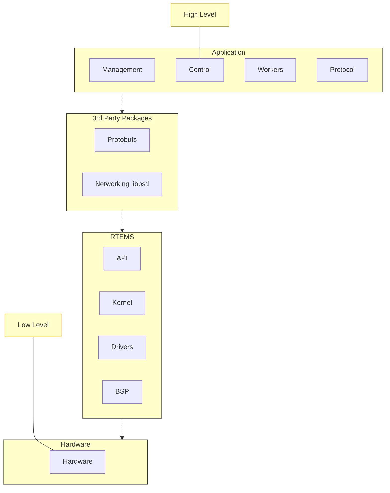

Fig. 9.1: Vertical Software Stack

# 9.2 Building an Application

RTEMS views any code it is running and using it's interfaces as an application. RTEMS conforms to a number of international standards such as POSIX and can build and run portable code written in languages such as C, C++ and Ada.

Applications are built from source into ELF object files, third-party packages can be built as libraries or they can be imported as source into an application code base. The application, third-party packages, RTEMS and standard libraries are linked to create the RTEMS executable. The executable is transferred to the target and a bootloader loads it from the non-volatile storage into RAM or the code is executed in place in the non-volatile storage. The target hardware defines what happens.

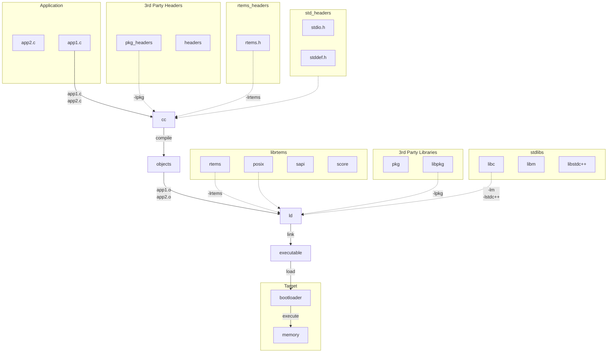

<center>Fig. 9.2: Building an Application</center>

The standard and third-party libraries are a collection of object files built using the same set of tools the application source is compiled with. The package collects it's object files into an archive or library.

RTEMS does not provide a standard application build system. The RTEMS ecosystem provides support so a range of build systems can be used. Applications can be built with make, autotools, cmake, waf and more. User should select a build system that meets their project, system, corporate or personal needs.

### 9.2.1 Machine Flags and ABI

All code in an RTEMS executable must be built with the same machine flags. The machine flags control the instruction set and application binary interface (ABI) the compiler generates. As the executable is statically linked all code must use the same instruction set the hardware is configured to support and all code must conform to the same ABI. Any variation can result in unpredictable behavior such as crashes, failures or lock ups. It is recommend an executable is built with the same or equivalent tool set. Mixing of tool set versions can also result in undefined behavior. The RTEMS tool `rtems-execinfo` can audit an RTEMS executable and list the machine flags and compilers used.

RTEMS by default does not support instruction emulation for unsupported instructions. RTEMS applications are normally built from source so binary compatibility is not as important as performance. Instruction emulation is costly to execute and rebuilding the executable with the correct instruction set only needs to be done once.

# 9.3 Target Execution

Fixed position statically linked executables have a fixed address in a target’s address space. The location in the address space for code, data and read-only data is fixed. The BSP defines the memory map and it is set by the BSP developer based on the target’s hardware requirements and it’s bootloader.

Targets typically contains a bootloader that is executed after the target’s processor exits reset. A bootloader is specific to a target’s processor and hardware configuration and is responsible for the low level initialization of the hardware resources needed to load and execute an operating system’s kernel. In the case of RTEMS this is the RTEMS executable.

Bootloaders vary in size, complexity and functionality. Some architectures have a number of bootloader stages and others have only minimal support. An example of a high end system is Xilinx’s Zynq processor with three stages. First a mask ROM in the System On Chip (SOC) executes after reset loading a first stage bootloader (FSBL) from an SD card, QSPI flash or NAND flash depending on signals connected to the device. The FSBL loads a second stage bootloader (SSBL) such as U-Boot and this loads the kernel. U-Boot can be configured to load a kernel from a range of media and file system formats as well as over a network using a number of protocols. This structure provides flexibility at the system level to support development environments such as a workshop or laboratory through to tightly control production configurations.

Bootloaders often have custom formats for the executable image they load. The formats can be simple to keep the bootloader simple or complex to support check-sums, encryption or redundancy in case an image becomes corrupted. A bootloader often provides a host tool that creates the required file from the RTEMS executable’s ELF file.

If RTEMS is to run from RAM the bootloader reads the image and loads the code, initialized data and read-only data into the RAM and then jumps to a known entry point. If the code is executed from non-volatile storage the process to write the image into that storage will have extracted the various binary parts and written those to the correct location.

The important point to note is the binary parts of the executable are somehow loaded into the target’s address space ready to execute. The way this done may vary but the out come is always the same, the binary code, data and read-only data is resident in the processor’s address space at the BSP defined addresses.

## 9.4 BSP Initialization

The bootloader jumps or calls the RTEMS executable’s entry point, normally a fixed address. The BSP entry point or start up code performs:

1. Low level processor specific initialization that such as setting control registers so the processor is operating in a mode RTEMS is built for
2. Cache flushing, clearing and invalidation
3. Memory management unit (MMU) set up if required
4. Clear the uninitialized data section
5. Process a command line if supported by the bootloader
6. Call bootcard which disabled interrupts, saves away a command line if the BSP supports it then call the RTEMS kernel early initialize entry point `rtems_initialize_executive`. This call never returns.

Further BSP initialization happens as part of RTEMS kernel’s System Initialization process. The following handlers are declared and if provided are placed at the beginning of the initialization handler list. The BSP can provides:

**bsp_work_area_initialize**
> This function determines the amount of memory that can be given to RTEMS for the workspace and the C library heap which malloc uses. The call typically uses the `bsp_work_area_initialize_default` to perform actually perform the initialization.

**bsp_start**
> This function is specialized for each architecture and even for some BSPs. It performs the low level initialization RTEMS needs so it can run on the architecture and BSP.

**bsp_predriver_hook**
> This function can be used to initialize hardware drivers depend on such as configuring an interrupt controller. The default version is empty and does nothing.

BSPs all perform similar operations with common functionality and the RTEMS kernel provides common code that can be shared between BSPs. The use of the common code is encouraged for all new BSPs.

# 9.5 RTEMS Initialization

The RTEMS kernel initialization is:

1. Invoke the registered system initialization handlers
2. Set the system state to **up**
3. If the kernel supports SMP request multitasking start. All online cores are transferred to the **ready to start multitasking** state.
4. Start threaded multitasking. RTEMS starts multitasking by getting the first thread to run and dispatching it.

C++ static object constructors are called in the context of the first running thread before the thread body is entered.

### 9.5.1 System Initialization Handlers

RTEMS supports the automatic registration of services used in applications. This method of initialization automatically configures RTEMS with only the services used in an application. There is no manual configuration of services used and no updating of initialization function tables.

RTEMS uses specialized sections in the ELF executable to perform this task. The system is based on the FreeBSD SYSINT Framework. Ordered initialization is performed before multitasking is started.

The RTEMS Tool `rtems-exeinfo` can provide some detail about the registered handlers. The following shows the initialization handlers for the Hello World sample application in the RTEMS kernel's testsuite:

```
1  $ rtems-exeinfo --init arm-rtems7/c/xilinx_zynq_zedboard/testsuites/samples/hello.
   ↪exe
2  RTEMS Executable Info 7.5416cfa39dd6
3  exe: arm-rtems7/c/xilinx_zynq_zedboard/testsuites/samples/hello.exe
4
5  Compilation:
6     Producers: 2
7     |  GNU AS 2.31.1: 14 objects
8     |  GNU C11 7.3.0 20180125 (RTEMS 7, RSB␣
   ↪e55769c64cf1a201588565a5662deafe3f1ccdcc, Newlib␣
   ↪103b055035fea328f8bc7826801760fb1c055683): 284 objects
9     Common flags: 4
10    | -march=armv7-a -mthumb -mfpu=neon -mfloat-abi=hard
11
12 Init sections: 2
13    .init_array
14    0x001047c1 frame_dummy
15    .rtemsroset
16    0x00104c05 bsp_work_area_initialize
17    0x00104c41 bsp_start
18    0x0010eb45 zynq_debug_console_init
19    0x0010ec19 rtems_counter_sysinit
20    0x0010b779 _User_extensions_Handler_initialization
```
(continues on next page)

(continued from previous page)
```
21    0x0010c66d rtems_initialize_data_structures
22    0x00107751 _RTEMS_tasks_Manager_initialization
23    0x0010d4f5 _POSIX_Keys_Manager_initialization
24    0x0010dd09 _Thread_Create_idle
25    0x0010cf01 rtems_libio_init
26    0x001053a5 rtems_filesystem_initialize
27    0x0010546d _Console_simple_Initialize
28    0x0010c715 _IO_Initialize_all_drivers
29    0x001076d5 _RTEMS_tasks_Initialize_user_tasks_body
30    0x0010cfa9 rtems_libio_post_driver
```

The section `.rtemsroset` lists the handlers called in order. The handlers can be split into the BSP initialization handlers that start the BSP:

* `bsp_work_area_initialize`
* `bsp_start`
* `zynq_debug_console_init`
* `rtems_counter_sysinit`

And the remainder are handlers for services used by the application. The list varies based on the services the application uses.

## 9.6 Dynamic Loader

RTEMS supports dynamically loading of executable code and data in the form of object files into a running system where the run-time loaded code can be executed and data accessed.

This section describes RTEMS loader, preparing and loading executable code into a running system, the supported architectures and any limitation that may exist with an architecture.

The RTEMS operating system contains a link editor that runs on the target. The link editor supports loading Extendable Linker Format (ELF) relocatable executable object files locating the code and data in the target's address space as it is loaded. An executable object file's external references to function identifiers and data object identifiers are resolved and any external symbols can be made available in the global symbol table. The executing performance of dynamically loaded code is similar to the same code statically linked into an executable. This is a core requirement of the RTEMS link editor.

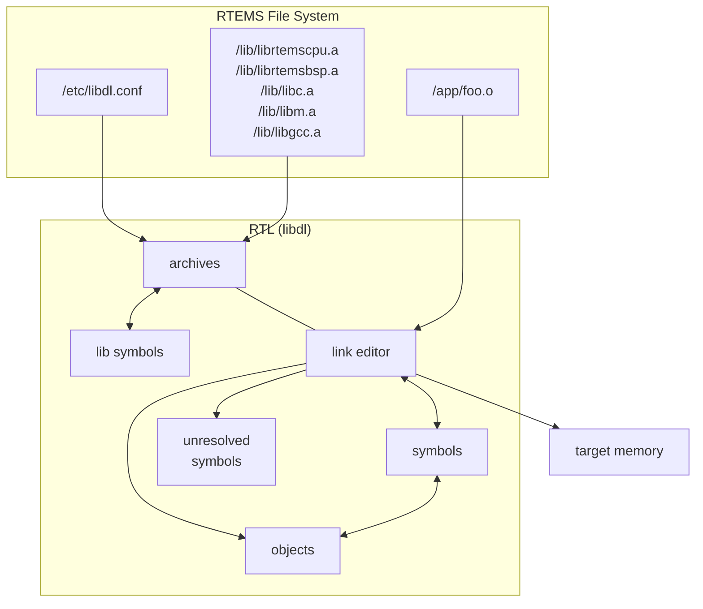

Fig. 9.3: Run Time Loader (libdl)

The RTEMS operating system's dynamic loader is not the same as the dynamic shared library support Unix or Windows have. Those operating systems use dynamic loading to share code between processes and this is an important feature in their design. RTEMS is a single address space operating system and that means there is no ability to share code at run-time. As a result code is loaded in a similar manner to static linking removing the need for any overheads sharing code may have.

To load an executable object file it must be resident on a target and accessible by RTEMS's file system. The executable object file can be a single file or a collection in a library stored using the Unix standard archive format. The RTEMS loader supports the extended GNU format for long file names in archives.

The RTEMS developers do not see dynamically loading of code as a real-time activity. A system should not respond to real-time external events by loading code. The loading of code should happen before a system is considered available and the activity the system is experiencing is low and stable.

The statically linked executable that is loaded and run after reset is called the *base image*. The *base image* contains your base application that is used to dynamically load code, a global symbol table, the parts of the RTEMS operating system code used in the base image as well as functions and data from the tool suite libraries and packages you are using. Only the software referenced is used to create the base image. The parts of the libraries not referenced are not part of the executable or present in the global symbol table.

Application software can locate a symbol by name and call the address or reference the data at that address. A function identifier located by a symbol does not have it's signatures checked, it is the responsibility of the caller to make sure the function is called with the correct arguments. It is the same for data objects, there is no type checking. Symbol versioning is not supported and supporting it does not make sense within the RTEMS operating system. An RTEMS target system is closed to normal users and software needs to be built from the same tool set and header files used to the build the base image.

An executable object file's text or code has to be built for the target's architecture it is loaded on and it must be built with the same ABI flags the base image is built with. See *Machine Flags and ABI* (page 188).

### 9.6.1 System Design

The use of dynamic loading in a project is a system design decision. Some systems will have strict requirements where loading code into a live system is not allowed while other projects will benefit from the system level flexibility dynamically loading code provides.

Code loaded at run time needs to be resident or accessible to the target via RTEMS's file system. Targets that have suitable media or a network interface to NFS servers to hold the executable object and library files are best suited.

Dynamically loading code uses more memory than statically linking the same code into the base image. The link editor maintains symbol tables where each symbol is a string, an address, and some additional data. The executable object files resident in memory each have data to manage them, the memory they use, and any dependencies they might have. The link editor is designed to minimize the memory overheads however only statically linked executables have no memory overhead.

The link editor relocates the code and data into RAM fixing it to the load address as it is loaded. A target needs to have suitably configured memory available for the executable object file to reside in. The memory must be able to support read, write and executable type access. Fine control of the memory and it's modes can be supported using a customer allocator. Examples are systems that have a custom memory map, specialized memory for the execution of code or a requirement for read-only executable sections.

The load address of an executable object file is determined by the load order and the allocator used. The default allocator for the link editor is the system heap which means the location a specific executable object file is loaded at depends on the memory allocated before it is loaded and when in the load order it is loaded. A statically linked executable's address map is fixed and this is considered important in some systems. A dynamically loaded system can be loaded in a repeatable manner if the load order is the same and the initialization sequence of the system is controlled. A custom allocator may also help.

Management of dynamically loadable object files and libraries adds to the configuration management of the hosts in a project. The loadable files need to be released and tracked in a suitable configuration management process just like the base image is. Executable object files and libraries are specific to a version of RTEMS and cannot be mixed or moved and this needs

to be carefully managed. Currently there are no checks an executable object file matches the version of the base image it is being loaded on. These extra configuration controlled items add to the overheads of a project and need to be considered.

Dynamically loadable systems have a number of features that benefit some systems and products. Systems can be built on a base of trusted or *golden* modules. A number of projects using a common base of hardware can make use of proven modules reducing the testing and qualification overhead for each new release. A tested base image with libraries for common and available boards provides a simple and fast way for new users to trial and use RTEMS.

A project can use dynamic loading during development, shipping statically linked executables in production. Hardware used by a development team can have more memory, extra media for disk drives, or a network interface.

### 9.6.2 Loader Interface

Run-time executable object file loading and management is via the standard's based calls provided by the header file `<dlfcn.h>`. The details of the calls follow.

`void* dlopen(const char* path, int mode);`

* The `dlopen()` function makes the symbols (function identifiers and data object identifiers) in the executable object file specified by file available to the calling program.
* The executable object files eligible for this operation are in the ELF format.
* The link loader may load embedded dependencies in executable object files. In such cases, a `dlopen()` operation may load those dependencies in addition to the executable object file specified by file.
* A successful `dlopen()` returns a handle which the caller may use on subsequent calls to `dlsym()`, `dlinfo()` and `dlclose()`.
* The value of the handle should not be interpreted in any way by the caller.
* Subsequent calls to `dlopen()` for the same executable object file increases the references to it.
* The `file` argument is used to construct a pathname to the executable object file or archive library of executable object files. If the `file` argument contains a colon (:) the name of the executable object file in the library follows and this file name may optionally end with @ followed by a number which is the absolute offset in the library file where the executable object file starts. If an executable object file is not detected at the offset the archive library's file table is searched.
* If `file` is a null pointer, `dlopen()` returns a global symbol table handle. This handle provides access to the global symbols from an ordered set of executable object files consisting of the original base image file, the set of executable object files loaded using `dlopen()` operations with the `RTLD_GLOBAL` flag, and any dependencies loaded. As the latter sets of executable object files can change during execution, the set of symbols made available by this handle can also change dynamically.
* Only a single copy of an executable object file is brought into the address space, even if `dlopen()` is invoked multiple times in reference to the executable object file, and even if different pathnames are used to reference the executable object file.
* Unresolved external symbols do not cause an error to be returned allowing the loading of jointly dependent executable object files.

If `dlopen()` fails, it returns a null pointer, and sets an error condition which may be interrogated with `dlerror()`.

The mode parameter describes how `dlopen()` operates upon file with respect to the processing of relocations and the scope of visibility of the symbols provided within file. When an executable object file is brought into the address space, it may contain references to symbols whose addresses are not known until the executable object file is loaded.

If a loaded executable object file and any dependent executable object files loaded with it contain any initialiser functions, they are called in the order loaded before `dlopen()` returns.

The modes `RTLD_LAZY` and `RTLD_NOW` do not effect the type of relocation performed, it is same for both modes. All relocations of an executable object file and any dependent executable object files loaded with it are completed before the `dlopen()` call returns. The execution performance of the code loaded can be considered deterministic once `dlopen()` has returned.

Any executable object file loaded by `dlopen()` can reference global symbols in the base image, any executable object files loaded included in the same `dlopen()` invocation, and any executable object files that were loaded in any `dlopen()` invocation and which specified the `RTLD_GLOBAL` flag. To determine the scope of visibility for the symbols loaded with a `dlopen()` invocation, the mode parameter should be a bitwise-inclusive OR with one of the following values:

**RTLD_GLOBAL**
The executable object file's symbols are made available for relocation processing of any other executable object file. In addition, symbol lookup using `dlopen(NULL,mode)` and an associated `dlsym()` allows executable object files loaded with this mode to be searched.

**RTLD_LOCAL**
The executable object file's symbols shall not be made available for relocation processing of any other executable object files.

If neither `RTLD_GLOBAL` nor `RTLD_LOCAL` is specified, the default behavior is unspecified.

If `RTLD_GLOBAL` has been specified, the executable object file maintains it's `RTLD_GLOBAL` status regardless of any previous or future specification of `RTLD_LOCAL`, as long as the executable object file remains in the address space.

Symbols introduced through calls to `dlopen()` may be used in relocation activities. Symbols that duplicate symbols already defined by the base image or previous `dlopen()` calls are treated as an error and the object file is not loaded. Symbols introduced through loading dependent executable object files are ignored or not loaded depending on the method used to build the executable object files.

The symbols introduced by `dlopen()` operations and available through `dlsym()` are at a minimum those which are exported as identifiers of global scope by the executable object file. Typically, such identifiers shall be those that were specified in (for example) C source code as having extern linkage.

**int dlclose(void\* handle);**
Releases a reference to the executable object file referenced by handle. If the reference count drops to 0, the executable object file's global symbol table is made unavailable. When all references to the global symbols the executable object file provided have been removed the object file is removed from the address space.

If the executable object being removed has any termination routines in it they are called.

`void* dlsym(void* handle, const char* symbol);`
> The `dlsym()` function obtains the address of a symbol (a function identifier or a data object identifier) defined in the symbol table identified by the `handle` argument. The `handle` argument is a symbol table handle returned from a call to `dlopen()` (and which has not since been released by a call to `dlclose()`), and `name` is the symbol's name as a character string. The return value from `dlsym()`, cast to a pointer to the type of the named symbol, can be used to call (in the case of a function) or access the contents of (in the case of a data object) the named symbol.
>
> The `dlsym()` function searches for the named symbol in the symbol table referenced by `handle` and returns the address of the code or data location specified by the null-terminated character string `symbol`. Which libraries and objects are searched depends on the `handle` parameter.
>
> Upon successful completion, if `name` names a function identifier, `dlsym()` returns the address of the function converted from type pointer to function to type pointer to void; otherwise, `dlsym()` shall return the address of the data object associated with the data object identifier named by `name` converted from a pointer to the type of the data object to a pointer to void. If `handle` does not refer to a valid symbol table handle or if the symbol named by `name` cannot be found in the symbol table associated with `handle`, `dlsym()` shall return a null pointer.

`int dlinfo(void* handle, int request, void* args);`
> The `dlinfo()` function provides information about dynamically loaded object. The action taken by `dlinfo()` and exact meaning and type of the argument `args` depend on value of the `request` argument provided by the caller.
>
> **RTLD_DI_UNRESOLVED**
> Return 1 in an indexer value pointed to by `args` if the symbol table handle has unresolved relocation records to symbols. If the handle is the global symbol table handle or `RTLD_SELF` return 1 if any unresolved relocation records to symbols are present in any loaded executable object files. . .

`const char *dlerror(void);`
> The `dlerror()` function returns a null-terminated character string (with no trailing `<newline>`) that describes the last error that occurred during dynamic linking processing. If no dynamic linking errors have occurred since the last invocation of `dlerror()`, `dlerror()` returns NULL. Thus, invoking `dlerror()` a second time, immediately following a prior invocation, results in NULL being returned.

This example opens an object file, checks for any unresolved symbols the object file may have, locates a global symbol in the object file, calls it then closes the object file:

```c
1  #include <stdbool.h>
2  #include <stdio.h>
3  #include <dlfcn.h>
4
5  typedef int (*call_sig)(void);
6
7  bool load_object (void)
8  {
9    void*      handle;
10   call_sig   call;
11   int        unresolved;
12
```
(continues on next page)

(continued from previous page)
```c
13     handle = dlopen ("/code.o", RTLD_NOW | RTLD_GLOBAL);
14     if (handle == NULL)
15     {
16       printf ("dlopen failed: %s\n", dlerror ());
17       return false;
18     }
19
20     if (dlinfo (handle, RTLD_DI_UNRESOLVED, &unresolved) < 0)
21     {
22       printf ("dlinfo failed: %s\n", dlerror ());
23       dlclose (handle);
24       return false;
25     }
26
27     if (unresolved != 0)
28     {
29       printf ("object.o has unresolved external symbols\n");
30       dlclose (handle);
31       return false;
32     }
33
34     call = dlsym (handle, "foo");
35     if (call == NULL)
36     {
37       printf("dlsym failed: symbol 'foo' not found\n");
38       dlclose (handle);
39       return false;
40     }
41
42     printf ("'foo()' returns: %i\n", call ());
43
44     if (dlclose (handle) < 0)
45     {
46       printf("dlclose failed: %s\n", dlerror());
47       return false;
48     }
49
50     return true;
51    }
```

### 9.6.3 Symbols

The RTEMS link editor manages the symbols for the base image and all resident executable object files. A symbol is an identifier string and a pointer value to a function identifier or a data object identifier. The symbols held in the symbol tables are used in the relocation of executable object files or they can be accessed by application code using the `dlsym()` (page 196) call.

An executable object file's symbols are removed from the global symbol table when it is closed or orphaned. An executale object file cannot be unloaded if a symbol it provides is referenced by another object and that object is still resident. An executable object file that has no references to

any of its symbols and was not explicitly loaded using the `dlopen()` (page 195) call is orphaned and automatically removed from the address space.

### 9.6.3.1 Base Image Symbols

The base image symbol table provides access to the function and data objects statically linked into the base image. Loaded executable object files can be directly linked to the code and data resident in the base image.

A statically linked RTEMS executable does not contain a symbol table, it has to be generated and either embedded into the executable or loaded as a specially created executable object file.

The base image symbol table is dependent on the contents of the base image and this is not known until it has been linked. This means the base image symbol table needs to be constructed after the base image executable has been linked and the list of global symbols is known.

The RTEMS Tools command **rtems-syms** (see *RTEMS Symbols* (page 277)) extracts the global and weak symbols from an RTEMS static executable file, creates a C file and compiles it creating a relocatable executable object file. This file can be linked with the static executable's object files and libraries to create a static executables with an embedded symbol table or the executable file can be loaded dynamically at run-time. The following needs to be observed:

1. The option `-e` or `--embedded` to **rtems-syms** creates an executable object file to be embedded in the base image and not providing either of these options creates a symbols executable object file that is loaded at run-time. The same executable object file cannot be used to embedded or load.
2. The target C compiler and machine options need to be provided to make sure the correct ABI for the target is used. See *Machine Flags and ABI* (page 188).

### 9.6.3.2 Embedded Symbols

An embedded symbol table is *embedded* within the base image executable file and loaded when the static executable is loaded into memory by the bootloader. The symbol table is automatically added to the link editor's global symbol table when the first executable object file is loaded.

The process to embed the symbol table requires linking the base image twice. The first link is to create a static executable that collects together the symbols to make the symbol table. The RTEMS Tools command **rtems-syms** extracts the global and weak symbols from the static executable ELF file, creates a C file and compiles it to create an executable object file. The base image is linked a second time and this time the symbol table executable object file is added to the list of object files.

Embedding the symbol table means the chances of the symbol table and base image not matching is low, however it also means the symbol table is always present in the kernel image when dynamic loading may be optional. A project's build system is made more complex as it needs to have extra steps to link a second time.

This example shows creating an embedded symbol table object file and linking it into the base image.

```bash
1 $ sparc-rtems7-gcc -mcpu=cypress foo.o -lrtemsbsp -lrtemscpu -o foo.pre
2 $ rtems-syms -e -C sparc-rtems7-gcc -c "-mcpu=cypress" -o foo-sym.o foo.pre
3 $ sparc-rtems7-gcc -mcpu=cypress foo.o foo-sym.o -lrtemsbsp -lrtemscpu -o foo.exe
```

The link command line steps in this example are not complete.

### 9.6.3.3 Loadable Symbols

A run-time loaded symbol table is the default for the command `rtems-syms`. The symbol table executable object file is packaged with the other files to be dynamically loaded at run-time and placed on the target's file system. It needs to be loaded before any other executable object file are loaded or unresolved symbols can occur that will not be resolved.

A run-time loaded symbol table does not consume any target resources until it is loaded. This is useful in a system that optionally needs to dynamically load code, for example as a development environment. The symbol table executable needs to exactly match the base image loading it or the behavior is unpredictable. No checks are made.

The example shows creating and loading a symbol table executable object file. First create the symbol table's executable object file:

```bash
1 $ sparc-rtems7-gcc -mcpu=cypress foo.o -lrtemsbsp -lrtemscpu -o foo.exe
2 $ rtems-syms -C sparc-rtems7-gcc -c "-mcpu=cypress" -o foo-sym.o foo.exe
```

The link command line steps in this example are not complete.

Load the symbol table:

```c
1 #include <stdbool.h>
2 #include <stdio.h>
3 #include <dlfcn.h>
4 
5 bool load (void)
6 {
7    void* handle = dlopen ("/foo-sym.o", RTLD_NOW | RTLD_GLOBAL);
8    if (handle == NULL)
9    {
10     printf ("failed to load the symbol table: %s\n", dlerror ());
11     return false;
12    }
13    return true;
14 }
```

### 9.6.4 Unresolved Symbols

The RTEMS link editor does not return an error when an executable object file is loaded with unresolved symbols. This allows dependent object files to be loaded. For example an executable object file `foo.o` contains the function `foo()` and that function calls `bar()` and an executable object file `bar.o` contains a function `bar()` that calls the function `foo()`. Either of these executable object files can be loaded first as long both are loaded before any symbols are accessed.

The link editor defers the resolution of unresolved symbols until the symbol is available in the global symbol table. Executing code or accessing data in a loaded executable object file with unresolved external symbols results in unpredictable behavior.

All unresolved symbols are checked after an executable object file has been loaded. If a symbol is found and resolved any relocations that reference the symbol are fixed. If valid library files have been configured the symbol table's of each library are searched and if the symbol is found the dependent executable object file is loaded. This process repeats until no more symbols can be resolved.

The `dlinfo()` call can be used to see if a loaded executable object file has any unresolved symbols:

```c
1 #include <stdbool.h>
2 #include <stdio.h>
3 #include <dlfcn.h>
4 
5 bool has_unresolved(void* handle)
6 {
7   int unresolved;
8   if (dlinfo(handle, RTLD_DI_UNRESOLVED, &unresolved) < 0)
9   {
10    printf ("dlinfo failed: %s\n", dlerror ());
11    return false;
12  }
13  return unresolved != 0;
14 }
```

The handle `RTLD_SELF` checks for any unresolved symbols in all resident object files:

```c
1 if (has_unresolved(RTLD_SELF))
2   printf("system has unsolved symbols\n");
```

### 9.6.5 Libraries

The RTEMS link editor supports loading executable object files from libraries. Executable object files can be explicitly loaded from a library using a specific path to `dlopen()` (page 195) and treated the same as loading a stand alone executable object file. Libraries can be searched and an executable object file containing the search symbol can be loaded automatically as a dependent executable object file. A dependent executable object file loaded from a library with no symbol references to it's symbols is orphaned and automatically unloaded and removed from the address space.

A library is an archive format file created using the RTEMS architecture prefixed **ar** command. The RTEMS tool suite provides the **ar** program and system libraries such as `libc.a` and `libm.a` for each architecture and ABI. Libraries used by the RTEMS link editor for searching must contain a symbol table created by the **ranlib** program from the RTEMS tool suite.

Searching a library's symbol table and loading an executable object file containing the symbol is called *dependent loading*. Dependent loading provides a simple way to manage the dependencies when loading an executable object file. If code in an executable object file references functions or data objects that are part of a library and the symbols are not part of the base image those symbols will not resolve unless the library is on the target and available for searching and loading. Dependent loading from libraries on the target provides a simple and understandable way to manage the dependency issue between the base image, loaded code and the system libraries.

The RTEMS link editor checks for the configuration file `/etc/libdl.conf` on each call to `dlopen()` (page 195). If the file has changed since the last check it is loaded again and the contents processed. The file format is:

1. Comments start with the # character.

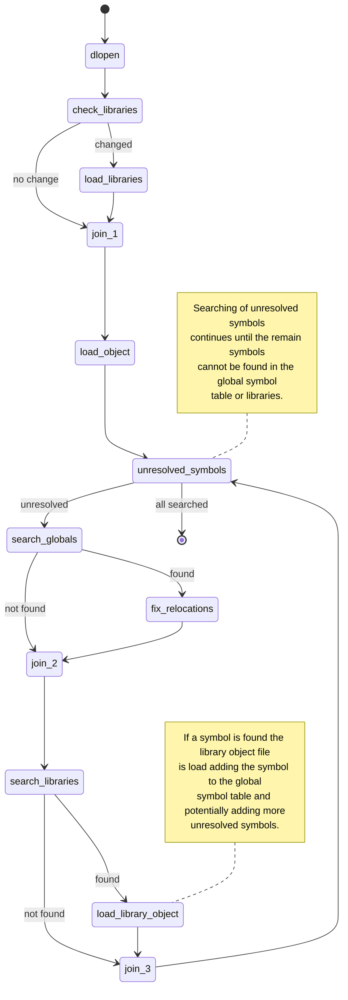

Fig. 9.4: Loading Executable Object Files

2. A line is a wildcard path of libraries to search for. The wildcard search uses the `fnmatch()` call. The `fnmatch()` function matches patterns according to the rules used by a shell.

Files that match the search pattern are verified as a library and if a symbol table is found it is loaded and the symbols it contains made search-able.

A call to `dlopen()` (page 195) checks the global symbols table and any references to relocation symbols not found are *unresolved* and added to the unresolved symbol table. Once the executable object file is loaded the link editor attempts to resolve any unresolved symbols. The unresolved symbol resolver checks each unresolved symbol against the global symbol table and if not found the available library symbol tables are searched. If a symbol is found in a library the dependent executable object file is loaded. The process repeats until all unresolved symbols have been resolved and the remaining unresolved symbols are not in the global symbol table or any libraries. The loading of a library executable object file will resolve at least one symbol and it may add more unresolved symbols requiring further searching of the libraries.

A library of executable object files built by the RTEMS Tool suite can contain debug information and this should be stripped before loading on to the target. The tool suite's command **strip** can strip all the object files in a library with a single command.

```
1 $ sparc-rtems7-strip libc.a
```

### 9.6.6 Large Memory

The RTEMS link editor supports large memory relocations. Some architectures have instructions where the relative branch or jump offset from the instruction to the target address is limited. These instructions provide improved performance because less code generated compared to larger instructions which contain full address space references. The compact code helps lower cache pressure as well and providing improved performance for localalized functions and loops. The compiler defaults to generating the smaller instruction and as the final address map not known when generating the code, linkers need to provide glue code to extend the small address range to the enitre address space. This is called a trampoline. A trampoline is transparent to the execution of the code.

The link editor parses an executable object file's relocation records to determine the number of trampolines needed. Added to this value are all unresolved symbols present in an executable object file after it is loaded. There is a slot allocated even if the symbol ends up being within range as there is no way to determine a symbol's address until it is loaded and the range calculated.

The trampoline table is allocated a separate block of memory to the executable object file's text, data and constants memory. The trampoline parsing requires the executable object file's instructions (text) be in memory as the instructions are inspected by the architecture specific relocation support to determine an instruction's range. As a result the allocation for the trampoline table has to occur after the text memory has been allocated. Most instructions have relative offsets and the trampoline table is allocated at one end limiting the size of an object to half the maximum range.

Trampolines support is available for the ARM and PowerPC architectures. The SPARC and Intel x86 architectures do not need trampolines and MIPS needs support added.

### 9.6.7 Allocator

The RTEMS link editor supports custom allocators. A custom allocator lets you manage the memory used by the RTEMS link editor as it runs. Allocators could provide:

1. Support for the various types of memory that can be allocated allowing specialised target support for specific use cases.
2. Locking of read-only memory. The link editor unlocks read-only memory when it needs to write to it.
3. Separation of memory holding code and data from the heap.

The allocator can be hooked using the `rtems_rtl_alloc_hook` call before any calls to `dlopen()` (page 195) are made. The hook call returns the current allocate allowing the allocators to be chained.

The default allocator uses the heap.

The allocator tags specify the type of memory the allocator is handling. The tag used to allocate memory at an address must be used when making allocator calls. The `rtems_rtl_alloc_tags` are:

**RTEMS_RTL_ALLOC_OBJECT**
> Allocate a generic object. The link editor uses this memory for data structures it uses to manage the linking process and resident executable object files.

**RTEMS_RTL_ALLOC_SYMBOL**
> Allocate memory to hold symbol data.

**RTEMS_RTL_ALLOC_EXTERNAL**
> Allocate memory for unresolved external symbols.

**RTEMS_RTL_ALLOC_READ**
> Allocate memory for read-only data such as constants and exception tables.

**RTEMS_RTL_ALLOC_READ_WRITE**
> Allocate memory for read-write data such as a initialised, uninitialized and common variables.

**RTEMS_RTL_ALLOC_READ_EXEC**
> Allocate memory for code to be executed in. The address space is configure for read and execute.

The commands are used to control the action the allocator performs. The `rtems_rtl_alloc_cmd` are:

**RTEMS_RTL_ALLOC_NEW**
> Allocate memory of the tag type. Returns NULL if the allocation fails.

**RTEMS_RTL_ALLOC_DEL**
> Delete a previous allocation freeing the memory. The tag has to match address of the memory being deleted.

**RTEMS_RTL_ALLOC_WR_ENABLE**
> Enable writes to a region of memory previously allocated. The tag has to match the address of the memory being write enabled. The link editor may call issue this command for memory that is already write enabled.

**RTEMS_RTL_ALLOC_WR_DISABLE**
> Disable writes to a region of memory previously allocated. The tag has to match address of the memory being write disabled. The link editor may call issue this command for memory that is writable and not to be write disabled. The allocator need to manage this case.

The allocator handler is a single call to handle all allocator requests. The handler called on evey allocation action made by the link editor. The type of the function you need is:

```c
1 typedef void (*rtems_rtl_allocator)(rtems_rtl_alloc_cmd cmd,
2                                     rtems_rtl_alloc_tag tag,
3                                     void**          address,
4                                     size_t          size);
```

The arguments are:

**cmd**
> The command to action. See [rtems_rtl_alloc_cmd].

**tag**
> The type of memory the command is for. The tag must match the address for commands other than RTEMS_RTL_ALLOC_OBJECT. See [rtems_rtl_alloc_tags].

**address**
> Pointer to the address. This is set of the RTEMS_RTL_ALLOC_OBJECT command and read for the other commands. The tag must match the address for commands that read the address from the pointer.

**size**
> The size of the memory to allocate. This is only valid for the RTEMS_RTL_ALLOC_OBJECT command.

The call to hook the allocator is:

```c
1 rtems_rtl_allocator rtems_rtl_alloc_hook (rtems_rtl_allocator handler);
```

The current allocator is returned. You can provide a full allocator or you can filter commands.

### 9.6.8 Languages

C is supported.

C++ is supported. Initializer functions are called when an object is loaded and finalizer functions are called before it is unloaded and removed. Static constructions are initializer functions and static destructors are finalizer functions.

C++ exceptions are handled across modules. The compiler generated exception tables present in an executable object file are registered with the architecture specific mechanism when loaded and deregistered when unloaded. An exception thrown in loaded code can be caught in the base image or another loaded module. If you are using C++ and exceptions it is recommended some exception code is added to the base image to place the architecture specific support in the base image.

### 9.6.9 Thread Local Storage

Thread local storage (TLS) is currenly not supported by the RTEMS link editor. The RTEMS executive needs to have a special allocator added to manage dynamically allocating TLS variables in a thread.

If you need TLS support in dynamically loaded code please consider the RTEMS support options.

### 9.6.10 Architectures

The following architectures are supported:

* AArch64
* ARM
* Intel x86 (i386)
* M68K
* MicroBlaze
* MIPS
* Moxie
* PowerPC
* SPARC

#### 9.6.10.1 AArch64

The AArch64 relocation backend supports veneers which is trampolines.

The veneer implementation is two instructions and a 64bit target address making the overhead 16 bytes for each veneer. The performance overhead is two instructions.

#### 9.6.10.2 ARM

The ARM relocation backend supports veneers.

The veneer implementation is a single instruction and a 32bit target address making the overhead 8 bytes for each veneer. The performance overhead is a single instruction.

#### 9.6.10.3 PowerPC

The PowerPC relocation backend support trampolines and small data.

The trampoline is four instructions and uses register 12 which the PowerPC ABI reserves for scratch use. The implementation loads the counter register and branches to the address it contains. The trampoline size is 16 bytes. The performance overhead is four instructions.

The PowerPC relocation backend also supports small data. The sections of an executable object file are parsed and small data are tagged as needing architecture specific allocations. These sections are not allocated as part of the standard section allocation. Small data sections are allocated in the global small data region of memory. The size of this region is defined in the BSP's linker command file by setting `bsp_section_small_data_area_size` variable:

```
1 bsp_section_small_data_area_size = 65536;
```

The maximum size of the small data region is 65536 bytes. It is recommended code built for loading uses the same settings for small base as the base image.

# 9.7 Device Tree

A Device Tree is a data structure that is used to describe properties of non-discoverable hardware instead of hardcoding them in the kernel. The device tree data is generally stored in a .dts or a Device Tree Source (DTS) file. This file is then compiled into a binary format called Device Tree Blob (DTB) with .dtb extension. RTEMS preferably uses a DTB built from the FreeBSD source tree matching the freebsd-org HEAD commit hash in libBSD.

### 9.7.1 Building the DTB

A single DTB file can be built using the dtc tool in libfdt using the following command:

```bash
1 dtc -@ -I dts -O dtb -o my-devicetree.dtb my-devicetree.dts
```

For building the DTB from the FreeBSD source, the `make_dtb.sh` script from `freebsd/sys/tools/fdt` must be used as most of the DTS files in FreeBSD have included .dtsi files from their source tree. An example is given below as a reference for how to build the device tree from the FreeBSD source.

NOTE: The following example uses FreeBSD main branch from github mirror as an example. It is advised to always use the source from the commit matching the freebsd-org HEAD in libBSD.

```bash
1  #We're using the script from freebsd/sys/tools/make_dtb.sh
2  #Target device: Beaglebone Black.
3  #Architecture: Arm.
4  #DTS source name: am335x-boneblack.dts
5
6  #The make_dtb.sh script uses environment variable MACHINE
7  export MACHINE='arm'
8
9  SCRIPT_DIR=$HOME/freebsd/sys/tools/fdt
10
11 #The arguments to the script are
12 # $1 -> Build Tree (This is the path to freebsd/sys/ directory)
13 # $2 -> DTS source file
14 # $3 -> output path of the DTB file
15
16 ${SCRIPT_DIR}/make_dtb.sh ${SCRIPT_DIR}/../../ \
17 ${SCRIPT_DIR}/../../gnu/dts/arm/am335x-boneblack.dts \
18 $(pwd)
```

### 9.7.2 Using Device Tree Overlay

Device tree overlay is used either to add properties or devices to the existing device tree. Adding any property to DTS using an overlay will override the current values in the DTB. The Overlays enable us to modify the device tree using a small maintainable plugin without having to edit the whole Base Tree.

There are two ways of applying an overlay on top of the built DTB.

1. Use `fdtoverlay` from libfdt
2. Add the overlay in the root partition of the SD card and apply it using U-Boot

The fdtoverlay command can be used as follows:

```
1 fdtoverlay -i my-base-tree.dtb -o output-tree.dtb my-overlay.dtbo
```

To apply it from U-Boot during system initialization we have to add the device tree overlay file in the root directory of the SD card and use U-Boot commands to apply the overlay.

Below is given the series of U-Boot commands that can be used to apply the overlay, given that the overlay blob (.dtbo) file is already in the card.

```
1 fatload mmc 0:1 0x80800000 rtems-app.img
2 fatload mmc 0:1 0x88000000 my-base-tree.dtb
3 fdt addr 0x88000000
4 fatload mmc 0:1 0x88100000 my-overlay.dtbo
5 fdt resize 0x1000
6 fdt apply 0x88100000
7 bootm 0x80800000 - 0x88000000
```

# DEBUGGING

Debugging is a critical process in software development that involves identifying and resolving bugs or defects in a program. A debugger is a tool that allows developers to inspect the internal state of a program while it runs or after it crashes (like with a core dump), providing insights into the program’s execution flow and state.

A debugger allows us to:

1. Set breakpoints to pause execution at specific points
2. Step through code line-by-line or instruction by instruction
3. Inspect/modify variables and memory
4. Monitor a program’s call stack and thread states

Debugging an RTEMS executable involves loading its code, data and read-only data into the target system while a debugger on a host computer connects to it. The debugger reads the ELF (Executable and Linkable Format) file to accesses the embedded debug information.

To enable effective debugging, the executable must be build with compiler and linker options that include debug information (the `-g` tag in GCC, for example). Although this debug information increases the size of the ELF file, it does not impact the binary footprint (loadable memory size) of the executable on the target system. Target bootloaders and file conversion tools extract the necessary binary code, data, and read-only data to create the file for the target.

An ELF file with debug information contains DWARF (Debugging With Attributed Record Formats) data. This detailed information allows the debugger to:

* Locate functions
* Find and inspect variables
* Understand the type and structure of different data
* Determine the entry code for every function call

With DWARF information, the debugger can set breakpoints, step through functions or individual instructions, view data, and perform many other tasks critical for debugging.

It is highly recommended to always enable compiler and linker debug options. An ELF file with debug information is invaluable for post-mortem, such as investigating a crash report from a production system, provided the production ELF image is archived. The RTEMS toolchain includes utilities that can translate an address from a crash dump into the corresponding source line and instruction. The extra size of debug information is negligible on the host compared to the significant benefits it provides for debugging.

Remote debugging is essential for embedded systems where the target hardware might not be directly accessible from the host system. In this setup, an additional component called a debug agent facilitates communication between the debugger on the host and the target system. The following diagram illustrates this setup:

```mermaid
graph LR
    ELF([ELF]) --> GDB
    GDB[GDB] <-->|TCP| DA[Debug Agent<br/>(GDB server)]
    DA <-->|agent<br/>connection| Target[Target]

    style GDB border-style:solid
    style DA border-style:solid
    style Target border-style:solid
```

Fig. 10.1: Embedded Executable Debugging

A desktop or server operating system's kernel hosts the executable being debugged, handling the interaction with the executable and the debugger. The debugger knows how to communicate with the kernel to obtain the necessary information. However, debugging an embedded executable requires an extra piece, an agent, to connect the target to the debugger. The agent provides a standard remote interface to the debugger and an agent-specific connection to the target.

The RTEMS tool chain provides the GNU debugger (GDB). GDB has a remote protocol that can run over networks using TCP and UDP protocols. The GDB remote protocol is available in a number of open-source and commercial debugging solutions. Network debugging using the remote protocol helps set up an environment where the targets can be remote from the developer's desktop, allowing for better control of the target hardware while avoiding the need to plug devices into an expensive desktop or server machine.

## 10.1 Debugging with GDB

To add support for auto-loading pretty-printing scripts for GDB in RTEMS, a small section containing a Python script is added to all executable files. This section is responsible for registering the pretty-printers provided by GCC and all RTEMS pretty-printers, and is automatically loaded and run each time you load an executable file into GDB.

In order for GDB to be able to execute this Python script each time you load an executable, a certain "safe-path" needs to be configured accordingly, to let GDB know which paths it is okay to run these scripts from. Not configuring this path properly can cause GDB to emit warnings such as this:

```
1 warning: File "executable" auto-loading has been declined by your `auto-load
2 safe-path' set to "$debugdir:$datadir".
```

There are many ways in which you can configure this path (or even choose not to), depending on how frequently you will be debugging applications.

1. **Suggested safe method**
   A less easy (but safer) way, would be to only add specific paths as safe to your `~/.gdbinit` file. For example, if you only use trusted applications in your `/home/user/*` directory, you can add it to the list of paths GDB counts as safe in your `~/.gdbinit` file as follows:

   ```
   1 add-auto-load-safe-path /home/user
   ```

   You can add any number of paths as trusted using this method.

2. **Lazy unsafe method**
   The easiest (and most unsafe) way is to add this line to your `~/.gdbinit` file:

   ```
   1 set auto-load safe-path /
   ```

   > **Warning**
   >
   > This will allow GDB to run gdb-inlined scripts in any executable you load from any path. It is disabling a security feature within GDB, so use it at your own discretion and only load trusted executables in GDB.

3. **One time solution**
   If you are only going to be debugging an application a handful of times, you can utilise GDB's command line options to do so. To enable auto-loading for your application for a single session only, you can invoke GDB like so:

   ```
   1 gdb -iex "set auto-load safe-path /" executable
   ```

If you do not want to allow for these changes, and want to continue GDB without pretty-printing support, adding the following line to `~/.gdbinit` will disable all forms of auto-loading and no pretty-printing will take place. It will also suppress warnings that GDB emits with regards to auto-loading paths.

```
1 set auto-load no
```

### 10.1.1 Debugging with GDB and QEMU

QEMU contains a debugging agent for the target being simulated. A QEMU command line option enables a GDB server, and the simulator manages the interaction with the target processor, its memory, and caches. The following diagram illustrates this setup:

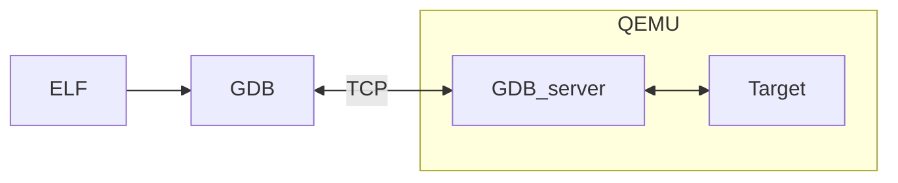

Fig. 10.2: QEMU Executable Debugging

We will be using the arm processor with the `xilinx_zynq_a9_qemu` BSP in this example, but it can be generalised for any architecture/BSP pair.

#### 10.1.1.1 Steps to Set Up Remote Debugging with QEMU

1.  **Start the Debug Agent (GDB Server) on the Target**
    The debug agent needs to be running on the target system, or in the case of a simulator like QEMU, it is started as part of the simulation.

    ```bash
    1 qemu-system-arm -M xilinx-zynq-a9 -m \
    2   256M -no-reboot -serial \
    3   null -serial mon:stdio -nographic \
    4   -s
    ```

    A brief summary of the options being used:
    *   `-M`: machine type: xilinx-zynq-a9
    *   `-m 256`: 256 megabytes of memory for emulation
    *   `no-reboot`: prevents the machine from automatically rebooting after shutdown
    *   `-serial null`: serial port output is piped to /dev/null
    *   `-serial mon:stdio`: redirects serial monitor output through stdio
    *   `-nographic`: disables graphics
    *   `-s`: enables GDB to debug. The server is begun by default locally at port 1234

2.  **Connect GDB to the Debug Agent from the Host**
    On the host system, start GDB and connect it to the debug agent running on the target system

    ```bash
    1 arm-rtems7-gdb sample_executable.exe
    2 (gdb) target extended-remote <target-ip>:<port>
    ```

    Replace `<target-ip>` with the IP address of the target system and `<port>` with the port number where the GDB server is listening (e.g., `localhost:1234` if using QEMU).

### 3. Debugging commands
Once connected, the code needs to be loaded before it can be run.

```gdb
1 (gdb) load
2 (gdb) break main
3 (gdb) continue
```

### 10.1.2 Debugging with GDB and OpenOCD
OpenOCD is a JTAG debugging tool that works with various JTAG devices. JTAG is a fast, low-level serial interface found in modern processors, allowing control over the core processing logic. The features of JTAG depend on the specific processor and architecture. Common functions include:

1. Processor control and register access
2. System level register access to allow SOC initialization
3. General address space access
4. Cache and MMU control
5. Break and watch points

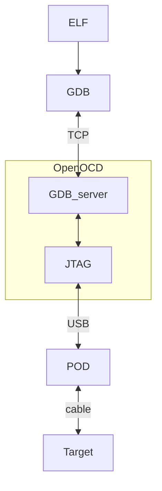

Fig. 10.3: OpenOCD JTAG Executable Debugging

### 10.1.3 Debugging with GDB and libdebugger
The RTEMS kernel has a debugging agent called `libdebugger`. This is a software based agent that runs within RTEMS using network services to provide a remote GDB protocol interface. A growing number of architectures are supported. The RTEMS debugging agent is for application development providing thread aware stop model debug experience.

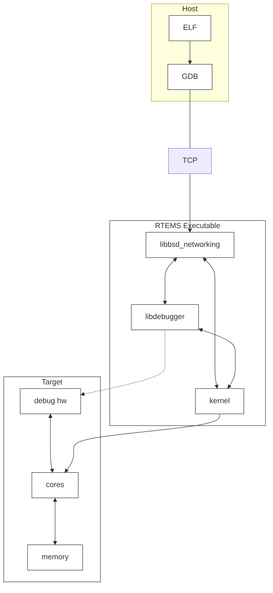

Fig. 10.4: Libdebugger Executable Debugging

## 10.2 Pretty Printing and GDB

Pretty-printing in GDB refers to the customisation of the output format for complex data structures during debugging sessions. By default, GDB may display raw data that can be difficult to interpret, especially for intricate structures. Pretty-printers are user-defined scripts that transform this raw data into a more human-readable and informative format, making it easier for developers to understand the current state of their application.

For instance, instead of showing the internal memory representation of a linked list or a C++ STL Vector, a pretty-printer can display a user-friendly view of the list’s elements and structure. This enhanced visualization aids in quickly identifying issues and comprehending the program’s state without manually parsing the data.

### 10.2.1 Enabling Pretty-printing in RTEMS

Pretty-printing support in RTEMS has been made possible through a combination of custom sections in the executable and Python scripts that register the necessary pretty-printers. An overview of the setup is as follows:

1.  ***Custom section in executable***
    To ensure that the pretty-printers are automatically loaded when debugging, a custom section named `.debug_gdb_scripts` is added to each executable being linked in RTEMS. This section contains a small assembly code snippet that, when the executable is loaded into GDB, automatically imports a Python script responsible for setting up the pretty-printers. You can dump the code present with the following command:

    ```bash
    arm-rtems7-objdump -s -j .debug_gdb_scripts build/arm-rtems7-xilinx_zynq_
    ↪a9_qemu/iostream.exe
    ```

2.  ***Python script for Pretty-printer Registration***
    The `pprinter.py` script, located in the `rtems` directory within the GDB Python directory, is imported and executed when the executable (and thereby, the custom section) is loaded. This script is responsible for registering all the pretty-printers defined for various RTEMS kernel structures, as well as `libstdcxx` printers (which are shipped and maintained by GCC).

# TESTING

RTEMS developers run test executables when adding new features or testing a bug fix. All tests are run to make sure changes do not introduce regressions. Users can run the RTEMS tests to be certain the build of the kernel they have is functioning.

The section describes using and configuring the RTEMS Tester and RTEMS Run tools, the types of laboratory set ups supported and how to add your BSP to the framework. The tools command line interfaces are detailed in *RTEMS Tester and Run* (page 292).

An RTEMS Test is an RTEMS executable where the application code is a test. Tests in RTEMS print banners to the console to indicate the configuration of the test and if it has start and finished.

The RTEMS Tools Project provides the RTEMS Tester and RTEMS Run tools. The RTEMS Tester command is `rtems-test` and the RTEMS Run command is `rtems-run`. These commands manage the complexity of running embedded executables. The commands provide a consistent command line interface to a testing framework that supports the various run time and testing scenarios we encounter such as simulators, GDB and executing directly on target hardware.

The RTEMS kernel code contains an extensive set of tests to exercise and test the RTEMS kernel. The tests check functionality, provide coverage testing and make sure the kernel is operating as intended on your target system. The testsuite has support to make creating a test simple and uniform.

The tests are built by adding `BUILD_TESTS = True` to a BSP section in `config.ini`. There are over 600 tests and building them does extend the RTEMS kernel's build time and use more disk space but it worth building and running them. The RTEMS test executables have the `.exe` file extension.

## 11.1 Test Banners

All test output banners or strings are embedded in each test and the test outputs the banners to the BSP's console as it executes. The RTEMS Tester captures the BSP's console and uses this information to manage the state of the executing test. The banner strings are:

**`*** BEGIN TEST <name> ***`**
> The test has loaded, RTEMS has initialized and the test specific code is about to start executing. The `<name>` field is the name of the test. The test name is internal to the test and may not match the name of the executable. The test name is informative and not used by the RTEMS Tester.

**`*** END TEST <name> ***`**
> The test has finished without error and has passed. The `<name>` field is the name of the test. See the *Test Begin Banner* (page 220) for details about the name.

**`*** TEST VERSION: <version>`**
> The test prints the RTEMS version return by the RTEMS Version API as `<version>`. All tests must match the first test's version or the Wrong Version error count is incremented.

**`*** TEST STATE: <state>`**
> The test is tagged in the RTEMS sources with a special `<state>` for this BSP. See *Test States* (page 221) for the list of possible states. The state banner lets the RTEMS Tester categorize and manage the test. For example a user input test typically needing user interaction may never complete producing an *invalid* test result. A user input test is terminated to avoid extended delays in a long test run.

**`*** TEST BUILD: <build>`**
> The test prints the RTEMS build as a space separated series of labels as `<build>`. The build labels are created from the configuration settings in the Super Score header file `rtems/score/cputops.h`. All tests must match the first test's build or the Wrong Build error count is incremented.

**`*** TEST TOOLS: <version>`**
> The test prints the RTEMS tools version returned the GGC internal macro `__VERSION__` as `<version>`. All tests must match the first test's tools version string or the Wrong Tools error count is incremented.

## 11.2 Test Controls

The tests in the RTEMS kernel testsuite can be configured for each BSP. The expected state of the test can be set as well as any configuration parameters a test needs to run on a BSP.

The test states are:

**passed**
The test start and end banners have been sent to the console.

**failure**
The test start banner has been sent to the console and no end banner has been seen when a target restart is detected.

**excepted-fail**
The test is tagged as expected-fail in the RTEMS sources for this BSP and outputs the banner `*** TEST STATE: EXPECTED_FAIL`. The test is known not to pass on this BSP. The RTEMS Tester will let the test run as far as it can and if the test passes it is recorded as a pass in the test results otherwise it is recorded as *expected-fail*.

**indeterminate**
The test is tagged as indeterminate in the RTEMS sources for this BSP and outputs the banner `*** TEST STATE: INDETERMINATE`. The test may or may not pass so the result is not able to be determined. The RTEMS Tester will let the test run as far as it can and record the result as indeterminate.

**user-input**
The test is tagged as user-input in the RTEMS sources and outputs the banner `*** TEST STATE: USER_INPUT`. The RTEMS Tester will reset the target if the target's configuration provides a target reset command.

**benchmark**
The test is tagged as benchmark in the RTEMS sources and outputs the banner `*** TEST STATE: BENCHMARK`. Benchmarks can take a while to run and performance is not regression tested in RTEMS. The RTEMS Tester will reset the target if the target's configuration provides a target reset command.

**timeout**
The test start banner has been sent to the console and no end banner is seen within the *timeout* period and the target has not restart. A default *timeout* can be set in a target configuration, a user configuration or provide on the RTEMS Tester's command line using the `--timeout` option.

**invalid**
The test did not output a start banner and the RTEMS Tester has detected the target has restarted. This means the executable did not load correctly, the RTEMS kernel did not initialize or the RTEMS kernel configuration failed for this BSP.

### 11.2.1 Expected Test States

A test's expected state is set in the RTEMS kernel's testsuite. The default for a tested is to pass. If a test is known to fail it can have it's state set to expected-fail. Setting tests that are known to fail to expected-fail lets everyone know a failure is not to be countered and consider a regression.

Expected test states are listed in test configuration files

### 11.2.2 Test Configuration

Tests can be configured for each BSP using test configuration files. These files exist under the `spec` directory and have the form `tst*.yml`. Global default test states exist as part of the tests themselves and are applied to all BSPs. BSPs can provide a test configuration that applies to just that BSP and these files can include subsets of test configurations.

The configuration supports:

1. Including test configuration files to allow sharing of common configurations.
2. Excluding tests from being built that do not build for a BSP.
3. Setting the test state if it is not passed.
4. Specifying a BSP specific build configuration for a test.

The test configuration file format is described in the engineering manual. Expected test state is configured using `set-test-state` action blocks in build type YAML configuration files. These `set-test-state` action blocks contain one or more sub blocks that each describe a reason, an expected state, and a list of tests to which the state and reason apply.

The reason is a text description of why the expected test state is being changed from the default and will typically include a ticket number that further documents the status of the listed tests.

The state is one of:

**include**
  The test list is the name of a test configuration file to include

**exclude**
  The tests listed are not build. This can happen if a BSP cannot support a test. For example it does not have enough memory.

**expected-fail**
  The tests listed are set to expected fail. The test will fail on the BSP being built.

**user-input**
  The tests listed require user input to run and are not supported by automatic testers.

**indeterminate**
  The tests listed may pass or may not, the result is not reliable.

**benchmark**
  The tests listed are benchmarks. Benchmarks are flagged and not left to run to completion because they may take too long.

By default all tests are included, specific excluded tests using the `exclude` state are excluded and cannot be included again.

## 11.3 Test Builds

The test reports the build of RTEMS being tested. The build are:

**default**
> The build is the default. No RTEMS configure options have been used.

**posix**
> The build includes the POSIX API. The RTEMS configure option `RTEMS_POSIX_API` has been set to True. The `cpuopts.h` define `RTEMS_POSIX` has defined and it true.

**smp**
> The build is an SMP kernel. The RTEMS configure option `RTEMS_SMP` has been set to True. The `cpuopts.h` define `RTEMS_SMP` has defined and it true.

**mp**
> The build is an MP kernel. The RTEMS configure option `RTEMS_MULTIPROCESSING` has been set to True. The `cpuopts.h` define `RTEMS_MULTIPROCESSING` has defined and it true.

**paravirt**
> The build is a paravirtualization kernel. The `cpuopts.h` define `RTEMS_PARAVIRT` has defined and it true.

**debug**
> The build includes kernel debugging support. The RTEMS configure option `RTEMS_DEBUG` has been set to True. The `cpuopts.h` define `RTEMS_DEBUG` has defined and it true.

**profiling**
> The build include profiling support. The RTEMS configure option `RTEMS_PROFILING` has been set to True. The `cpuopts.h` define `RTEMS_PROFILING` has defined and it true.

## 11.4 Tester Configuration

The RTEMS Tester and RTEMS Run are controlled by configuration data and scripts. The user specifies a BSP on the command line using the `--rtems-bsp` option as well as optionally specifying a user configuration file using `--user-config`.

The Figure *RTEMS Tester and Run Configuration Files* (page 224) shows the various sources of configuration data and their format. The `ini` files are the standard INI format, the `mc` are the internal RTEMS Toolkit's Macro format, and `cfg` is the RTEMS Toolkit's Configuration script format, the same format used by the RTEMS Source Builder.

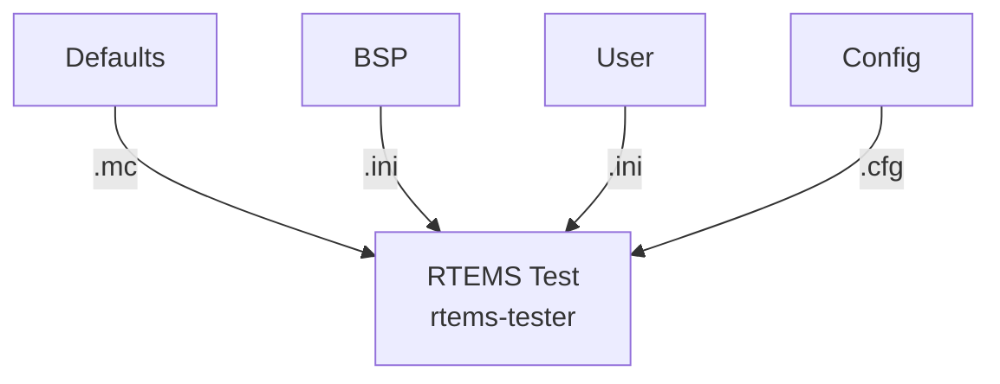

Fig. 11.1: RTEMS Tester and Run Configuration Files

Configuration data is held in a macro database keyed on the macro name. Macros can be expanded in configuration scripts using the syntax `%{name}`. The macro database is layered using maps. The defaults and values created when a configure script runs live the in the global map. Values read from the BSP and User INI configuration files are loaded into maps based on the BSP name. This lets a single User configuration file contain specialized configuration values for a number of BSPs and the tester and run commands select the values based on the selected BSP. Macros are expanded using the BSP map first giving those values the highest priority. User defined values are loaded after the BSP configuration values overwriting them letting a user speckles a BSP's default configuration for their local needs.

Figure *RTEMS Tester and Run Configuration Load and Execute Sequence* (page 225) shows the configuration loading and script execution order.

### 11.4.1 Defaults

The RTEMS Tester and RTEMS Run are primed using defaults from the file `rtems/testing/testing.mc`. All default settings can be overridden in a BSP or User configuration file.

### 11.4.2 BSP and User Configuration

The BSP and User configuration files are INI format files. The BSP configuration file has to have an INI section that is the name of the BSP passed on the command line. The section has the following mandatory values:

**bsp**
> The name of the BSP. The BSP name is used to create a macro map to hold the BSP's configuration data. Typically this is the same as the BSP name used on the command line.

**arch**
> The name of the BSP architecture. This is need for the GDB configuration scripts where the architecture specific GDB needs to run. It is mandatory so the *arch/bsp* standard RTEMS BSP string can be used.

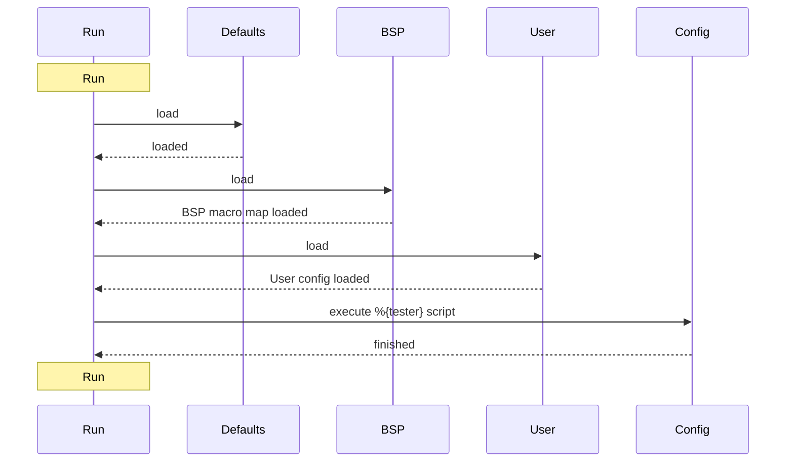

Fig. 11.2: RTEMS Tester and Run Configuration Load and Execute Sequence

**tester**
> The tester or run configuration script. This is the name of the configuration script the RTEMS Tester or RTEMS Run executes as a back end. The tester value is typically of the form `%{_rtscripts}/<script>` where `<script>` is name of the back end script to be run.

Target commands support expansion of specific tags to provide a convenient way for users to customize a local test environment. The parameters expanded are:

**@ARCH@**
> The BSP architecture.

**@BSP@**
> The BSP's name set by the bsp value.

**@EXE@**
> The executable name as an absolute path

**@FEXE@**
> The filtered executable if a `target_exe_filter` is provided else the executable's file name.

The following are optional and depend on the back end being used and the local target hardware set up:

**jobs**
> The jobs value sets the number of jobs that can be run at once. This setting only effects the RTEMS Tester. The tester can run up to the jobs value of tests concurrently. If the tester back end is a simulator running a job on each available core lowers the total test time. Overloading a machine with too many simulators running in parallel can slow down each simulation and test timeouts may be recorded.

**bsp_tty_dev**
> The BSP's tty device. This can be a real device on the host machine the executable is being run from or it can be a telnet server and port defined using the stand host format. See *Consoles*

(page 233) for details.

**target_pretest_command**
> The pre-test command is a host shell command that is called before each test runs. It can be used to construct a suitable environment or image needed by a simulator or target. The RTEMS executate being run is provided as an argument and the bootloader specific format is the output.

**target_posttest_command**
The post-test command is a host shell command that is called after each test has finished. It can be used to destroy any environment or image created by the pre-test command.

**target_exe_filter**
The target executable filter transforms the executable name into a filtered executable name. This filter lets the tester or run command track the name of any generated file a pre-test command may generate. The syntax is a simplified sed regular expression. The first character is a delimiter and there must be 2 sections therefore 3 delimiter. The first section is a Python regular expression and the second section is plain text that replaces anywhere the regular expression matches. For example `/\.exe/.exe.img/` will search for `.exe` in the executable name and replace it with `.exe.img`. Note, there is no need to escape the text in the second part, it is just plain test.

**test_restarts**
The number of restarts before the test is considered invalid. Currently not used.

**target_reset_regex**
The target reset regular expression. This is a Python regular expression used to filter the console input. If a match is made something has happened during the boot process that requires a reset. The target_reset_command is issued to perform the reset. Typically this field looks for boot loader error messages that indicate the boot process as failed.

**target_start_regex**
> The target start regular expression. This is a Python regular expression to filter the console input to asynchronously detect if a target has reset. If a board crashes running a test or at any point reset this filter detects the restart and ends the test with a suitable result.

**target_on_command**
The target on command is a host shell command that is called before the first test. This command powers on a target. Targets should be left powered off when not running tests or the target may request TFTP downloads that are for another target interfering with those test results. We recommend you implement this command as a target off command, a pause, then a target on command.

**target_off_command**
The target off command is a host shell command that is called after the last test powering off the target.

**target_reset_command**
The target reset command is a host shell command that is called when the target needs to be reset. This command can power cycle the target or toggle a reset signal connected to the target. If you are power cycling a target make sure you have a suitable pause to let the target completely power down.

### 11.4.3 Configuration Scripts

Configuration scripts are provided for each supported RTEMS Tester and RTEMS Run back end and console management. The scripts are in the standard RTEMS Toolkit Configuration Script format. Please refer to the RTEMS Source Builder documentation for the basic scripting syntax and usage.

The RTEMS Tester and RTEMS Run specializes the standard configuration syntax providing a directive for the console and each supported back end. The supported directives are:

* `%console`
* `%execute`
* `%gdb`
* `%tftp`
* `%wait`

#### 11.4.3.1 Console

The `%console` configures the console used to access the target's console. The console can be a process's stdout, a *termios* tty on Unix and MacOS and Telnet on all hosts. The directive accepts:

**stdio**
> The standard output stream from the executing processing.

**tty \<dev\> \<settings\>**
> The name of the tty to open and use. The tty device or `<dev>` can be a *termio* device and the `<settings>` are standard termios values.
>
> The Python termios document provides details of the settings that can be controlled. The settings are a single string where prefix the value with ~ negates the setting. Setting are:
> * B115200 (an example buadrate)
> * BRKINT
> * IGNBRK
> * IGNCR
> * ICANON
> * ISIG
> * IEXTEN
> * ECHO
> * CLOCAL
> * CRTSCTS
> * VMIN=\<value\>
> * VTIME=\<value

A example in a configuration script is:

```
1 %define bsp_tty_dev      /dev/ttyUSB2
2 %define bsp_tty_settings B115200,~BRKINT,IGNBRK,IGNCR,~ICANON,~ISIG,~IEXTEN,~ECHO,
  ↪CLOCAL,~CRTSCTS,VMIN=1,VTIME=2
```

A example BSP or User configuration file is:

```
1 [bsp-special]
2 bsp              = example-bsp
3 bsp_tty_dev      = /dev/ttyUSB2
4 bsp_tty_settings = B115200,~BRKINT,IGNBRK,IGNCR,~ICANON,~ISIG,~IEXTEN,~ECHO,
  ↪CLOCAL,~CRTSCTS,VMIN=1,VTIME=2
```

The console directive is managed in the `%{_rtscripts}/console.cfg` configuration script. If the `%{console_stdio}` is defined the console will be stdio else the console will be the BSP console or `%{bsp_tty_dev}`.

Telnet can be combined with the ser2net daemon to remotely access a target's physical serial UART interface. The syntax is `host:port`:

```
1 %define bsp_tty_dev      1.2.3.4:8989
```

### 11.4.3.2 Execute

The `%execute` directive executes a command for each rest. The execute forks the command and arguments supplied to the execute directive and captures the stdout stream as the console. If the console directive is set to stdout the sub-processes stdout stream is used as the console.

The RTEMS Tester will run parallel tests as jobs.

An example is:

```
1 %execute %{run_cmd} %{run_opts} %{test_executable} %{test_executable_opts}
```

### 11.4.3.3 GDB

The `%gdb` directive executes GDB in the machine interface mode give the RTEMS Tester and RTEMS Run commands control. The console is taken from GDB if it is stdout.

The RTEMS Tester will run parallel tests as jobs.

An example is:

```
1 %gdb %{gdb_cmd} %{test_executable} %{gdb_script}
```

### 11.4.3.4 TFTP

The `%tftp` directive starts a TFTP session on a specified port sending the test executable to the target over a networking using the TFTP protocol.

The RTEMS Tester will run only one test at a time. There is just one physical board running the test.

An example is:

```
1 %tftp %{test_executable} %{tftp_port}
```

The RTEMS Tester contains a TFTP server so an external TFTP is not needed. It is recommended a TFTP Proxy is set up to handle the TFTP sessions for your network. The internal TFTP server ignores the requrest file and serves the next executable. If the target requires the executable ne in a specific format provide a script via the `target_pretest_command` option in your user configuration file.

The RTEMS Tools provides a TFTP protocol proxy server. It takes a list of MAC addresses and proxies TFTP sessions for that MAC address to another IP address and port. A proxy provides the following benefits:

1. The TFTP proxy server is the only software required to run as root
2. All hardware targets can be configured to serve from a single machine and the proxy can distribute the sessions out to developer machines
3. There is no need to provide a globally writable file system a central TFTP server accese

If you have a central TFTP server refer to the `%wait` directive.

### 11.4.3.5 Wait

The `%wait` directive waits the timeout period for a test to complete. The directive monitors the console output and resets the timeout timer if console output is seen. If the test runs for too long while outputing data an error is reported.

The wait directive can be used in systems where there is an external mechanism being used to send the executable to the target hardware.

An example is:

```
1 %wait
```

Wait has no options. The timeouts are controlled in other ways.

If you have an external system wide TFTP server with global access wait can used by providing a \` \` script that places the file in the location the TFTP server can see. This is done as the test start so if networking loading there is normally enough time to get the executable image in place before the transfer starts. The MVME2700 (powerpc/mvme2307) is a BSP that supports the `%wait` directive.

The following is an example user configuration file (see `--user-config`):

```
1  #
2  # MVME2700 (mvme2307)
3  #
4  [mvme2307]
5  bsp_tty_dev            = 1.2.3.4:5678
6  target_pretest_command = mk-mvme2307-img @EXE@ /tftp/cjohns/rtems.img
7  target_exe_filter      = /\.exe/.exe.img/
8  target_on_command      = pw-ctl 1.2.3.4 toggle-on 3 1
9  target_off_command     = pw-ctl 1.2.3.4 off 3
10 target_reset_command   = pw-ctl 1.2.3.4 toggle-on 3 1
```

The script `mk-mvme2307-img` converts the RTEMS ELF executable into the PowerPC prep bootloader format and copies the file to the TFTP server's network wide location. The MVME2700 is configured to request `rtems.img` from this location. The command `pw-ctl` is a command to control the power to the board.

## 11.5 Coverage Analysis

RTEMS is used in many critical systems. It is important that the RTEMS Project ensure that the RTEMS product is tested as thoroughly as possible. With this goal in mind, the RTEMS test suite was expanded with the goal that 100% of the RTEMS executive is tested.

RTEMS-TESTER takes the following arguments to produce coverage reports:

**--coverage :**
When the coverage option is enabled the tester produces coverage reports for all the symbols in cpukit. To generate a coverage report for a specific symbol-set ( e.g.: score) the symbol-set is passed as an argument to the option, e.g.: `--coverage=score`.

**--no-clean :**
Tells the script not to delete the .cov trace files generated while running the coverage. These trace files are used for debugging purposes and will not be needed for a normal user.

For example: To generate a coverage report of hello.exe for leon3 on SIS, the following command is used:

```bash
1 rtems-test \
2 --rtems-tools=$HOME/development/rtems/6 \
3 --log=coverage_analysis.log \
4 --no-clean \
5 --coverage \
6 --rtems-bsp=leon3-sis-cov \
7 $HOME/development/rtems/kernel/leon3/sparc-rtems6/c/leon3/testsuites/samples/
  ↪hello.exe
```

The command will create the coverage report in the following tree structure:

```text
1  ├── coverage_analysis.log
2  ├── leon3-sis-coverage
3  │   └── score
4  │       ├── annotated.html
5  │       ├── annotated.txt
6  │       ├── branch.html
7  │       ├── branch.txt
8  │       ├── covoar.css
9  │       ├── ExplanationsNotFound.txt
10 │       ├── index.html
11 │       ├── no_range_uncovered.html
12 │       ├── no_range_uncovered.txt
13 │       ├── NotReferenced.html
14 │       ├── sizes.html
15 │       ├── sizes.txt
16 │       ├── summary.txt
17 │       ├── symbolSummary.html
18 │       ├── symbolSummary.txt
19 │       ├── table.js
20 │       ├── uncovered.html
21 │       └── uncovered.txt
22 └── leon3-sis-report.html
```

The html on top of the directory, i.e., `leon3-sis-report.html` is the top level navigation for the coverage analysis report and will let the user browse through all the generated reports from different subsystems.

## 11.6 Consoles

The RTEMS Tester uses the target’s console output to determine the state of a test. Console interfaces vary depending on the testing mode, the BSP, and the target hardware.

Consoles for simulator work best if mapped to the simulator’s stdout interface. The RTEMS Tester can capture and process the stdout data from a simulator while it is running.

Target hardware console interfaces can vary. The most universal and stable interface target hardware is a UART interface. There are a number of physical interfaces for UART data these days. They are:

1. RS232
2. TTL
3. USB

RS232 is still present on a number of targets. The best solution is to use a RS232 to USB pod and convert the port to USB.

TTL is common on a number of boards where cost is important. A console interface is typically a development tool and removing the extra devices need to convert the signal to RS232 or directly to USB is not needed on production builds of the target. There is a standard header pin out for TTL UART consoles and you can purchase low cost cables with the header and a built in UART to USB converter. The cables come is different voltage levels so make sure you check and use the correct voltage level.

The USB interface on a target is typcially a slave or OTG interface and all you need to a standard USB cable.

We recommend a low cost and low power device to be a terminal server. A Raspberry Pi or similar low cost computer running Linux can be set up quickly and with a powered USB hub and can support a number of USB UART ports. A USB hub with a high power port is recommended that can suppy the Raspberry Pi.

The open source daemon `ser2net` is easy to configure to map the USB UART ports to the Telnet protocol. There is no need for security because a typical test environment is part of a lab network that should be partitioned off from an enginnering or corportate network and not directly connected to the internet.

A test set up like this lets you place a terminal server close to your target hardware providing you with the flexibility to select where you run the RTEMS Tester. It could be your desktop or an expensive fast host machine in a server rack. None of this equipment needs to directly interface to the target hardware.

The RTEMS Tester directly supports the telnet protcol as a console and can interface to the `ser1net` server. The telnet console will poll the server waiting for the remote port to connect. If the terminal server `ser2net` does not have a tty device it will not listen on the port assigned to that tty. A USB tty can come and go depending on the power state of the hardware and the target hardware’s design and this can cause timing issues if the target hardware is power cycled as part of a reset process.

## 11.7 Simulation

Simulation is a important regression and development tool for RTEMS. Developers use simulation to work on core parts of RTEMS as it provides excellent debugging supporting. Simulation run via the RTEMS Tester allows a test to run on each core of your testing host machine lower the time to run all tests.

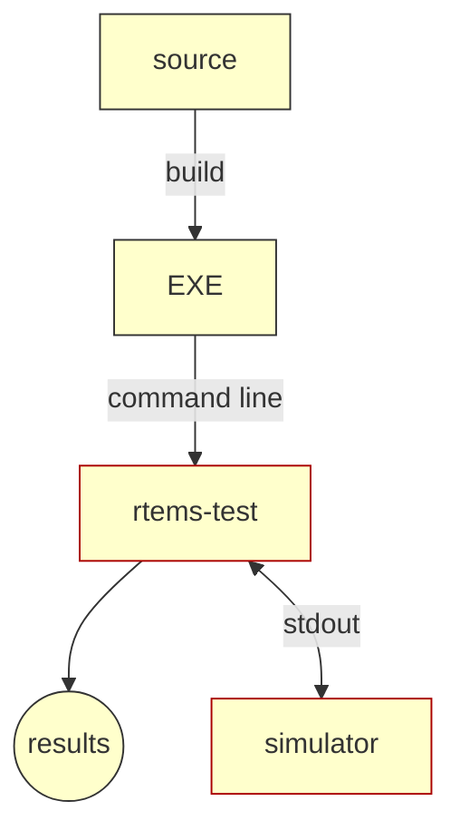

Fig. 11.3: RTEMS Tester Simulation

The *RTEMS Tester Simulation* (page 234) figure shows the structure of RTEMS Testing using simulation. The executables are built and the `rtems-test` command is run from the top of the build directory. The RTEMS Tester executes the BSP specific simulator for each test capturing the output

## 11.8 GDB and JTAG

GDB with JTAG provides a low level way to runs tests on hardware with limited resources. The RTEMS Tester runs and controls an instance of GDB per test and GDB connects via the GDB remote protocol to a GDB server that interfaces to the JTAG port of a target.

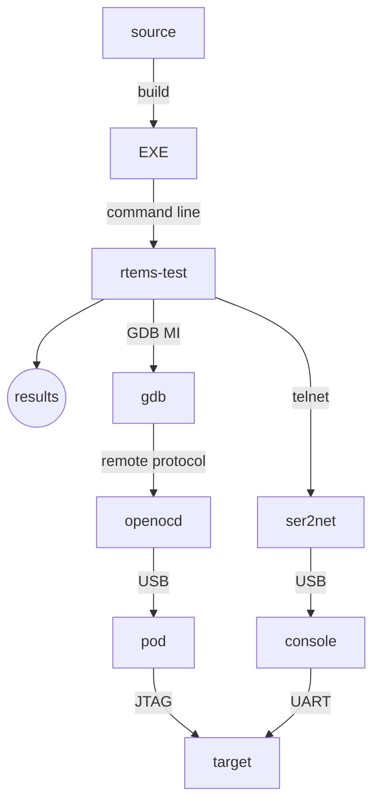

Fig. 11.4: RTEMS Tester using GDB and JTAG

The Figure *RTEMS Tester using GDB and JTAG* (page 235) shows the structure of RTEMS Testing using GDB and JTAG. The executables are built and the `rtems-test` command is run from the top of the build directory. The RTEMS Tester executes the BSP architecture's GDB and expects the user to provide a gdb-script to connect t the JTAG GDB server.

## 11.9 TFTP and U-Boot

TFTP and U-Boot provides a simple way to test RTEMS on a network capable target. The RTEMS Tester starts a TFTP server session for each test and the target's boot monitor, in this case U-Boot request a file, any file, which the TFTP server supplies. U-Boot loads the executable and boots it using a standard U-Boot script.

The RTEMS Tester contains a TFTP server so no external TFTP server or configuration is required. If you have an external TFTP server and wish to use that resource the Wait (page 229) directive can be used.

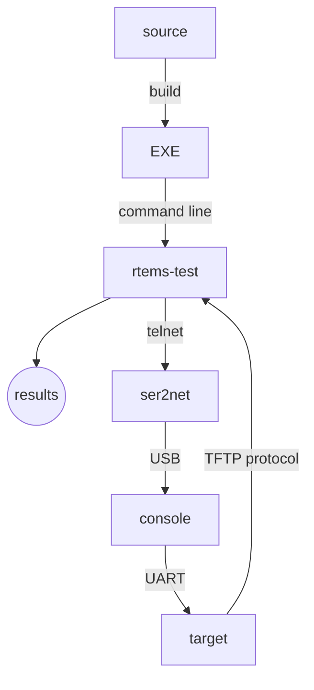

Fig. 11.5: RTEMS Tester using TFTP and U-Boot.

The Figure *RTEMS Tester using TFTP and U-Boot.* (page 236) figure shows the structure and control flow of the RTEMS Tester using TFTP and U-boot. The executables are built and the `rtems-test` command is run from the top of the build directory.

This test mode can only support a single test job running at once. You cannot add more test target hardware and run the tests in parallel.

### 11.9.1 Target Hardware

The RTEMS Tester TFTP and U-Boot method of testing requires:

1. A target with network interface.
2. U-Boot, iPXE or similar boot loader with network driver support for your target hardware and support for the TFTP protocol.
3. Network power of IO switch.
4. Network DHCP server.
5. Console interface cable that matches your target’s console UART interface.
6. Telnet terminal server. See *Consoles* (page 233).

The network power or IO switch is a device that can control power or an IO pin over a network connection using a script-able protocol such as Telnet or curl. This device can be used with the target control commands.

#### 11.9.1.1 U-Boot Set Up

Obtain a working image of the U-Boot boot loader for your target. We suggest you follow the instructions for you target.

Configure U-Boot to network boot using the TFTP protocol. This is U-Boot script for a Zedboard:

```
1 loadaddr=0x02000000
2 uenvcmd=echo Booting RTEMS Zed from net; set autoload no; dhcp; set serverip 10.
  ↪10.5.2; tftpboot zed/rtems.img; bootm; reset;
```

The load address variable `loadaddr` is specific to the Zedboard and can be found in the various examples scripts on the internet. The script then sets U-Boot environment variable `autoload` to `no` causing DHCP to only request a DHCP lease from the DHCP server. The script sets the `serverip` to the host that will be running the RTEMS Tester then issues a TFTP request. The file name can be anything because the RTEMS Tester ignores it sending the executable image under test. Finally the script boots the download executable and if that fails the catch all reset resets the board and starts the boot process over.

Test the target boots and U-Boot runs and obtains a valid DHCP lease. Manually connect the console’s telnet port.

### 11.9.2 BSP Configuration

The BSP’s configuration file must contain the standard fields:

* bsp
* arch
* jobs - Must be set to 1.
* tester - Set to `%{_rtscripts}/tftp.cfg`

For example the Zedboard’s configuration is:

```
1 [xilinx_zynq_zedboard]
2 bsp   = xilinx_zynq_zedboard
```
(continues on next page)

(continued from previous page)
```
3 arch     = arm
4 jobs     = 1
5 tester   = %{_rtscripts}/tftp.cfg
```

The TFTP configuration supports the following field's:

**bsp_tty_dev**
> The target's tty console. For telnet this is a host and port pair written in the standard networking format, for example `serserver:12345`.

**test_restarts**
> The number of restarts before the test is considered invalid.

**target_reset_regex**
> The target reset regular expression. This is a Python regular expression used to filter the console input. If a match is made something has happened during the boot process that requires a reset. The `target_reset_command` is issued to perform the reset. This field is typically looks for boot loader error messages that indicate the boot process as failed.

**target_start_regex**
> The target start regular expression. This also a Python regular expression to filter the console input to detect if a target has reset. If a board crashes running a test or at any point in time and reset this filter detects this as happened and end the test with a suitable result.

**target_on_command**
> The target on command is a host shell command that is called before the first test. This command powers on a target. Targets should be left powered off when not running tests or the target may request TFTP downloads that are for another target interfering with those test results. We recommend you implement this command as a target off command, a pause, then a target on command.

**target_off_command**
> The target off command is a host shell command that is called after the last test powering off the target.

**target_reset_command**
> The target reset command is a host shell command that is called when the target needs to be reset. This command can power cycle the target or toggle a reset signal connected to the target. If you are power cycling a target make sure you have a suitable pause to let the target completely power down.

**target_pretest_command**
> The target pretest command is a host shell comment that is called before the test is run

The commands in the listed fields can include parameters that are substituted. The parameters are:

**@ARCH@**
> The BSP architecture

**@BSP@**
> The BSP's name

**@EXE@**
> The executable name.

**@FEXE@**
The

**. The**
@ARCH is the

substituted

Some of these field are normally provided by a user’s configuration. To do this use:

```
1 requires = bsp_tty_dev, target_on_command, target_off_command, target_reset_
  ↪command
```

The `requires` value requires the user provide these settings in their configuration file.

The Zedboard’s configuration file is:

```
1 [xilinx_zynq_zedboard]
2 bsp                   = xilinx_zynq_zedboard
3 arch                  = arm
4 jobs                  = 1
5 tester                = %{_rtscripts}/tftp.cfg
6 test_restarts         = 3
7 target_reset_regex = ^No ethernet found.*|^BOOTP broadcast 6.*|^.+complete\.+_
  ↪TIMEOUT.*
8 target_start_regex = ^U-Boot SPL .*
9 requires              = target_on_command, target_off_command, target_reset_command,_
  ↪bsp_tty_dev
```

The `target_start_regex` searches for U-Boot’s first console message. This indicate the board can restarted.

The `target_reset_regex` checks if no ethernet interface is found. This can happen if U-Boot cannot detect the PHY device. It also checks if too many DHCP requests happen and finally a check is made for any timeouts reported by U-Boot.

An example of a user configuration for the Zedboard is:

```
1 [xilinx_zynq_zedboard]
2 bsp_tty_dev                = selserver:12345
3 target_pretest_command = zynq-mkimg @EXE@
4 target_exe_filter          = /\.exe/.exe.img/
5 target_on_command          = power-ctl toggle-on 1 4
6 target_off_command         = power-ctl off 1
7 target_reset_command       = power-ctl toggle-on 1 3
```

### 11.9.3 TFTP Sequences

Running a large number of tests on real hardware exposes a range of issues and RTEMS Tester is designed to be tolerant of failures in booting or loading that can happen, for example a hardware design. These sequence diagrams document some of the sequences that can occur when errors happen.

The simplest sequence is running a test. The target is powered on, the test is loaded and executed and a pass or fail is determined:

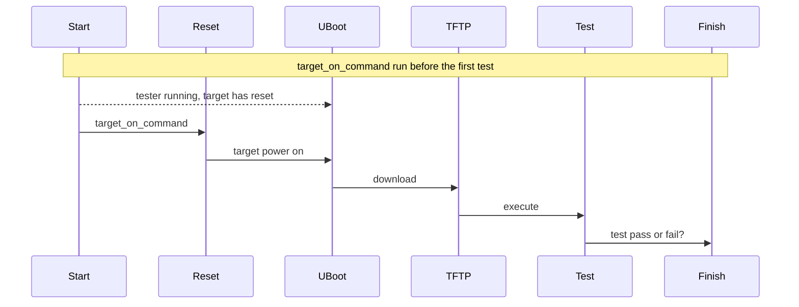

Fig. 11.6: Test Pass and Fail Sequences

The target start filter triggers if a start condition is detected. This can happen if the board crashes or resets with no output. If this happens repeatedly the test result is invalid:

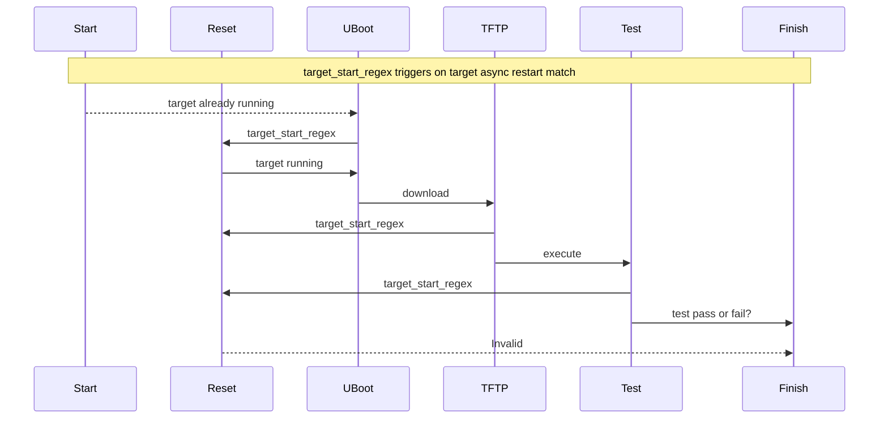

Fig. 11.7: Target Start Filter Trigger

The reset filter triggers if an error condition is found such as the bootloader not being able to load the test executable. If the filter triggers the `target_reset_command` is run:

If the RTEMS Tester does not detect a test has started it can restart the test by resetting the target. The reset command can toggle an IO pin connected to reset, request a JTAG pod issue a reset or turn the power off and on:

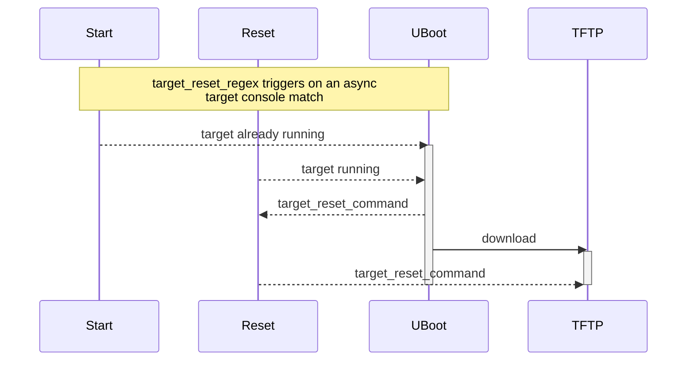

Fig. 11.8: Target Reset Filter Trigger

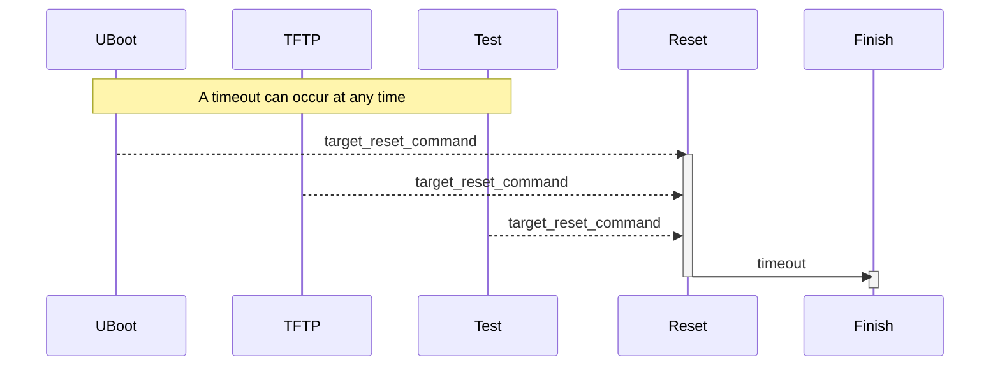

Fig. 11.9: Target Timeout

# TRACING

RTEMS Tracing Framework is an on-target software based system which helps track the ongoings inside the operation of applications, third-party packages, and the kernel in real time.

Software based tracing is a complex process which requires components on both the target and the host to work together. However its portability across all architectures and board support packages makes it a useful asset. A key requirement in RTEMS trace process is to take existing code in compiled format (ELF) and instrument it in order to log various events and records in real time. However instrumenting of the code for tracing should happen without rebuilding the code from the source and without annotating the source with trace code.

# 12.1 Introduction to Tracing

Tracing is an important function which has several applications including identification of complex threading, detection of deadlocks, tracing functions along with their argument values, and return values through progression of several function calls and audit the performance of an application according to required specifications.

RTEMS tracing framework is under development and welcomes contribution by users.

RTEMS has the following trace components:

* *RTEMS Trace Linker* (page 253)
* *RTEMS Capture Engine* (page 250)
* *RTEMS Event Recording* (page 262)
* Common Trace Format Integration

RTEMS trace framework can currently function using the following methods. Both of the methods make use of the *Trace Linker* (page 253) :

### 12.1.1 RTEMS Trace Using Trace Buffering

This scheme of tracing goes through the flow of events described in a subsequent flowchart:

Step 1: The user creates an application and user configuration file. The configuration file specifies the use of the trace buffer generator and other standard initializations. The user then configures their BSP and invokes the trace linker using a command to link the application executable. The trace linker uses the application files in compiled format (ELF) and the libraries used to build the application for performing this link.

Step 2: The RTEMS Trace Linker reads the user’s configuration file and that results in it reading the standard Trace Buffering Configuration files installed with the RTEMS Trace Linker. The trace linker uses the target compiler and linker to create the trace enabled application executable. It wraps the functions defined in the user’s configuration with code that captures trace records into the statically allocated buffer. The trace wrapper code is compiled with the target compiler and the resulting ELF object file is added to the standard link command line used to link the application and the application is re-linked using the wrapping option of the GNU linker.

Step 3: The trace linker creates an executable which is capable of running on the target hardware or simulator.

Step 4: RTEMS shell provides the “rtrace” command to display and save trace buffers.

### 12.1.2 RTEMS Trace Using Printk

This scheme of tracing goes through the flow of events described in a subsequent flowchart:

Step 1: The user creates an RTEMS application in the normal manner as well as a Trace Linker configuration file. The configuration file specifies using the Printk trace mode and the functions to trace. The user invokes the Trace Linker with the configuration and the normal link command line used to the link the application executable. The application ELF object files and libraries, including the RTEMS libraries are standard and do not need to be built specially.

Step 2: The RTEMS Trace Linker reads the user’s configuration file and that results in it reading the standard Printk Trace Configuration files installed with the RTEMS Trace Linker. The trace

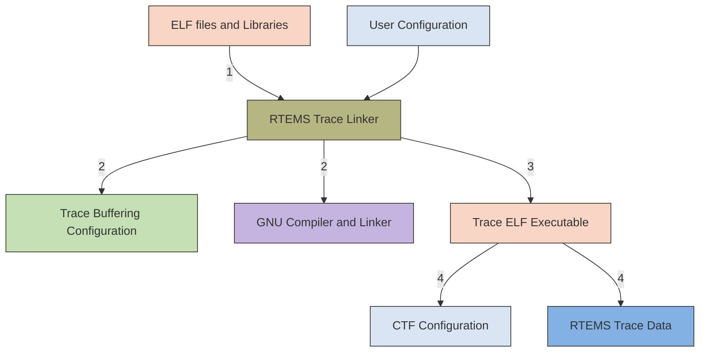
**RTEMS Trace Buffering**

linker uses the target compiler and linker to create the trace enabled application executable. It wraps the functions defined in the user's configuration with code that prints the entry with arguments and exit and return value if any. The trace wrapper code is compiled with the target compiler and the resulting ELF object file is added to the standard link command line used to link the application and the application is relinked using the wrapping option of the GNU linker.

Step 3: The trace linker creates and RTEMS ELF executable that can be run on the target hardware or simulator.

Step 4: The application is run in the hardware directly or using a debugger. The printk() output appears on the target console and the user can save that to a file.

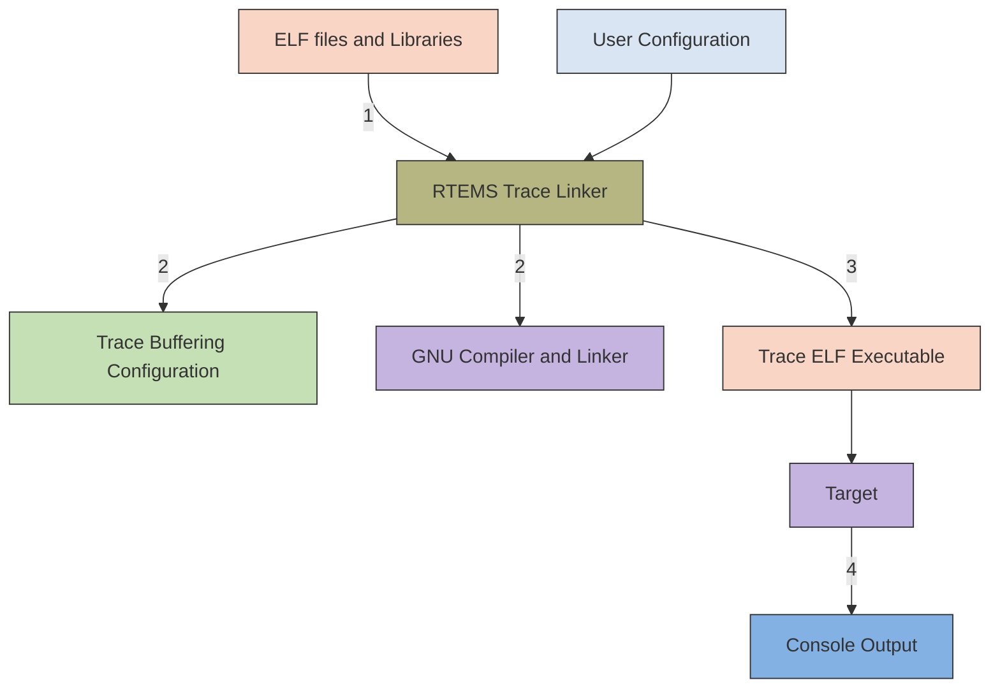
**RTEMS Trace using Printk**

The *Tracing Examples* (page 246) section describes generation of traces using Trace Buffering technique for the fileio testsuite available with RTEMS installation.

## 12.2 Tracing Examples

The following example executes RTEMS trace using trace buffering for the fileio sample test-case.

### 12.2.1 Features

Tracing using trace buffering consists of the following sets of features:

* Individual entry and exit records.
* Task details such as CPU, current priority, real priority, task state and interrupt state.
* Nano-second timestamp.
* Interrupt safe buffer management.
* Function argument capture.
* Return value capture.
* Shell command support to report to the console, save a buffer, assess status of tracing, or view buffers between specified index ranges.

### 12.2.2 Prerequisites

1. Setup RTEMS for the sparc/erc32 architecture-bsp pair to run the following example.
2. Download the fileio configuration file and store it on the top of the installed BSP's directory.
3. Change the value of the keys: `rtems-path` and `prefix` according to your rtems installation. The `rtems-path` is the path to the bsp installation and `prefix` is the path to the tools used to build rtems. Also set the value of the `rtems-bsp` key to `sparc/erc32`.

### 12.2.3 Demonstration

Inside the RTEMS build directory (the directory where the fileio configuration has been stored) run the following commands to generate traces:

BSP is configured with the following command -

```
1 ../rtems/configure --target=sparc-rtems7 --prefix=/development/rtems/5 \
2 --enable-networking --enable-tests --enable-rtemsbsp=erc32 --enable-cxx
```

The next two commands are used to link the fileio executable. The `-B` option signifies the use of the complete path to the required directory or file. Write the full path instead of the path file: `sparc-rtems7/erc32/lib/` in the following commands according to your installation. Also confirm the path of the fileio's executable and object files in the last line of the command according to your installation.

```
1 sparc-rtems7-gcc -Bsparc-rtems7/erc32/lib/ \
2 -qrtems -mcpu=cypress -O2 -g -ffunction-sections \
3 -fdata-sections -Wall -Wmissing-prototypes -Wimplicit-function-declaration \
4 -Wstrict-prototypes -Wnested-externs -Wl,--gc-sections -mcpu=cypress \
5 -o sparc-rtems5/c/erc32/testsuites/samples/fileio.exe sparc-rtems5/c/erc32/\
6 testsuites/samples/fileio/fileio-init.o
```

This is the trace linker command to generate and compile the wrapper c file for the application. The link command follows the escape sequence “--”. “-C” option denotes the name of the user configuration file and “-W” specifies the name of the wrapper c file.

```
1 rtems-tld -C fileio-trace.ini -W fileio-wrapper -- -Bsparc-rtems5/erc32/lib/ \
2 -qrtems -mcpu=cypress -O2 -g -ffunction-sections \
3 -fdata-sections -Wall -Wmissing-prototypes -Wimplicit-function-declaration \
4 -Wstrict-prototypes -Wnested-externs -Wl,--gc-sections -mcpu=cypress \
5 -o sparc-rtems5/c/erc32/testsuites/samples/fileio.exe sparc-rtems5/c/erc32/\
6 testsuites/samples/fileio/fileio-init.o
```

The following command is used to run the application. Hit enter key quickly and type “s” and “root” and “pwd” to run the rtems shell. Use the rtrace status, rtrace trace and rtrace save commands to know the status of the tracing, display the contents of the trace buffer and save the buffer to disk in the form of binary files. Use `rtrace -l` to list the availalble options for commands with rtrace.

```
1 sparc-rtems5-run sparc-rtems5/c/erc32/testsuites/samples/fileio.exe
```

The output from the above commands will be as follows:

```
1 *** BEGIN OF TEST FILE I/O ***
2 *** TEST VERSION: 7.0.0.de9b7d712bf5da6593386fd4fbca0d5f8b8431d8
3 *** TEST STATE: USER_INPUT
4 *** TEST BUILD: RTEMS_NETWORKING RTEMS_POSIX_API
5 *** TEST TOOLS: 7.3.0 20180125 (RTEMS 7, RSB␣
  ˓→a3a6c34c150a357e57769a26a460c475e188438f, Newlib 3.0.0)
6 Press any key to start file I/O sample (20s remaining)
7 Press any key to start file I/O sample (19s remaining)
8 Press any key to start file I/O sample (18s remaining)
9 Press any key to start file I/O sample (17s remaining)
10 Press any key to start file I/O sample (16s remaining)
11 Press any key to start file I/O sample (15s remaining)
12 Press any key to start file I/O sample (14s remaining)
13    =========================
14    RTEMS FILE I/O Test Menu
15    =========================
16     p -> part_table_initialize
17     f -> mount all disks in fs_table
18     l -> list  file
19     r -> read  file
20     w -> write file
21     s -> start shell
22     Enter your selection ==>s
23 Creating /etc/passwd and group with four useable accounts:
24    root/pwd
25    test/pwd
26    rtems/NO PASSWORD
27    chroot/NO PASSWORD
28 Only the root user has access to all available commands.
29 =========================
```
(continues on next page)

(continued from previous page)

```
30      starting shell
31    =========================
32
33    Welcome to rtems-7.0.0 (SPARC/w/FPU/erc32)
34    COPYRIGHT (c) 1989-2008.
35    On-Line Applications Research Corporation (OAR).
36
37    Login into RTEMS
38    /dev/foobar login: root
39    Password:
40
41    RTEMS Shell on /dev/foobar. Use 'help' to list commands.
42    SHLL [/] # rtrace status
43    RTEMS Trace Bufferring: status
44      Running:     yes
45      Triggered:   yes
46           Level:      0%
47           Traces:     25
48    SHLL [/] # rtrace stop
49    RTEMS Trace Bufferring: stop
50    SHLL [/] # rtrace trace
51    RTEMS Trace Bufferring: trace
52      Trace buffer: 0x20921d8
53      Words traced: 1487
54           Traces: 25
55        0:00:40.983197010    2081910     0a010002 [     2/ 2] > malloc((size_t) 00000130)
56        0:00:40.983333119     136109     0a010002 [     2/ 2] < malloc => (void*) 0x219bb88
57        0:00:40.983471669     138550     0a010002 [     2/ 2] > malloc((size_t) 00000006)
58        0:00:40.983606557     134888     0a010002 [     2/ 2] < malloc => (void*) 0x219bcc0
59        0:00:40.983684682      78125     0a010002 [     2/ 2] > malloc((size_t) 00000007)
60        0:00:40.983819569     134887     0a010002 [     2/ 2] < malloc => (void*) 0x219bcd0
61        0:00:40.983909901      90332     0a010002 [     2/ 2] > malloc((size_t) 000003fc)
62        0:00:40.984046620     136719     0a010002 [     2/ 2] < malloc => (void*) 0x219bce0
63        0:00:40.986624137    2577517     0a010003 [200/200] > malloc((size_t) 00000080)
64        0:00:40.986767569     143432     0a010003 [200/200] < malloc => (void*) 0x219bce0
65        0:00:40.987531119     763550     0a010003 [200/200] > calloc((size_t) 00000001, 
       ↪(size_t) 0000005d)
66        0:00:40.987603751      72632     0a010003 [200/200] > malloc((size_t) 0000005d)
67        0:00:40.987744743     140992     0a010003 [200/200] < malloc => (void*) 0x219bce0
68        0:00:40.987824699      79956     0a010003 [200/200] < calloc => (void*) 0x219bce0
69        0:00:40.988302604     477905     0a010003 [200/200] > malloc((size_t) 00000080)
70        0:00:40.988446647     144043     0a010003 [200/200] < malloc => (void*) 0x219bd48
71        0:00:40.988667595     220948     0a010003 [200/200] > calloc((size_t) 00000001, 
       ↪(size_t) 00000080)
72        0:00:40.988740837      73242     0a010003 [200/200] > malloc((size_t) 00000080)
73        0:00:40.988884880     144043     0a010003 [200/200] < malloc => (void*) 0x219bdd0
74        0:00:40.988964836      79956     0a010003 [200/200] < calloc => (void*) 0x219bdd0
75        0:00:40.989042961      78125     0a010003 [200/200] > calloc((size_t) 00000001, 
       ↪(size_t) 00000080)
```

(continues on next page)

(continued from previous page)
```
76     0:00:40.989110100      67139     0a010003 [200/200] > malloc((size_t) 00000080)
77     0:00:40.989254143     144043     0a010003 [200/200] < malloc => (void*) 0x219be58
78     0:00:40.989334099      79956     0a010003 [200/200] < calloc => (void*) 0x219be58
79     0:00:40.990118401     784302     0a010003 [200/200] > calloc((size_t) 00000001,
       ↪(size_t) 00000061)
80     0:00:40.990176995      58594     0a010003 [200/200] > malloc((size_t) 00000061)
81     0:00:40.990309441     132446     0a010003 [200/200] < malloc => (void*) 0x219bd48
82     0:00:40.990384515      75074     0a010003 [200/200] < calloc => (void*) 0x219bd48
83     0:00:40.990870355     485840     0a010003 [200/200] > malloc((size_t) 00000080)
84     0:00:40.991011346     140991     0a010003 [200/200] < malloc => (void*) 0x219bee0
85     0:00:40.991227411     216065     0a010003 [200/200] > calloc((size_t) 00000001,
       ↪(size_t) 00000080)
86     0:00:40.991296380      68969     0a010003 [200/200] > malloc((size_t) 00000080)
87     0:00:40.991438593     142213     0a010003 [200/200] < malloc => (void*) 0x219bf68
88     0:00:40.991514276      75683     0a010003 [200/200] < calloc => (void*) 0x219bf68
89     0:00:40.991589349      75073     0a010003 [200/200] > calloc((size_t) 00000001,
       ↪(size_t) 00000080)
90     0:00:40.991653437      64088     0a010003 [200/200] > malloc((size_t) 00000080)
91     0:00:40.991794428     140991     0a010003 [200/200] < malloc => (void*) 0x219bff0
92     0:00:40.991871332      76904     0a010003 [200/200] < calloc => (void*) 0x219bff0
93     0:00:40.992283320     411988     0a010003 [200/200] > malloc((size_t) 00000008)
94 SHLL [/] # rtrace save fileio-trace.bin
95 RTEMS Trace Bufferring: trace
96   Trace File: fileio-trace.bin
97   Trace buffer: 0x20921d8
98   Words traced: 1487
99     Traces: 25
100 SHLL [/] #
```

## 12.3 Capture Engine

Capture Engine is a trace tool built inside the RTEMS operating system. Capture Engine is designed to cause the lowest load on the system when operating. Hence it does not effect RTEMS when operating or when disabled. It binds to RTEMS at runtime and does not require RTEMS or your application to be rebuilt in order to use it.

The Capture Engine’s sample testcase for the sparc/erc32 is available in build directory created when building RTEMS in the path file: `sparc-rtems7/c/erc32/testsuites/samples`. In order to access the capture testcase perform the following set of operations inside the RTEMS build directory.

```
1 $ cd /sparc-rtems7/c/erc32/testsuites/samples
2 $ sparc-rtems7-run ./capture.exe
3
4
5 *** BEGIN OF TEST CAPTURE ENGINE ***
6 *** TEST VERSION: 7.0.0.de9b7d712bf5da6593386fd4fbca0d5f8b8431d8
7 *** TEST STATE: USER_INPUT
8 *** TEST BUILD: RTEMS_NETWORKING RTEMS_POSIX_API
9 *** TEST TOOLS: 7.3.0 20180125 (RTEMS 7, RSB
  ↪a3a6c34c150a357e57769a26a460c475e188438f, Newlib 3.0.0)
10 Press any key to start capture engine (20s remaining)
11 Press any key to start capture engine (19s remaining)
12 Press any key to start capture engine (18s remaining)
13
14 Monitor ready, press enter to login.
15
16 1-rtems $
```

Capture Engine comes with a set of commands to perform various actions.

### 12.3.1 Capture Engine Commands

1. `copen <buffer-size>`: Used to initialize the Capture Engine with the trace buffer size in bytes. By default the Capture Engine is not initialized and not running.
2. `cwceil <priority-value>`: Capture Engine filter used to put an upper limit on the event priority to be captured.
3. `cwfloor <priority-value>`: Capture Engine filter used to put a lower limit on the event priority to be captured.
4. `cwglob <on/off>`: Enable or disable the global watch.
5. `cenable`: Enables the Capture Engine. Capture Engine is by default disabled after being opened.
6. `cdisable`: Disables the Capture Engine.
7. `ctlist`: Lists the watch and trigger configurations.
8. `ctrace`: Dumps the recorded traces. By default this command displays 24 trace records. Repeated use of this command will display all the recorded traces.
9. `cwadd <task-name>`: Add watch on a particular task.

10. `cwtctl <task-name> <on/off>`: Enable or disable watch on a particular task.
11. `ctset`: Used to set a trigger. The general form of the command is:

`ctset [-?] type [to name/id] [from] [from name/id]`

type in the above command refers to the type of trigger needed. The types of triggers that currently exist are:

* switch : a context switch from one task to another task
* create : the executing task creates a task
* start : the executing task starts a task
* restart : the executing task restarts a task
* delete : the executing task deletes a task
* begin : a task is beginning
* exitted : a task is exitting

### 12.3.2 Example

The following is a sample run of the capture testsuite. The `test1` command on the Capture Engine Command Line Interface (CLI) makes the RMON task invoke a call to the `capture_test_1()` command. This function (in the `test1.c` source code) creates and starts three tasks : CT1a, CT1b and CT1c. These tasks are passed the object id of a semaphore as a task argument. This run through traces the context switches between these tasks. `cwceil` and `cwfloor` are set to a narrow range of task priorities to avoid creating noise from a large number of context switches between tasks we are not interested in.

```
1  *** BEGIN OF TEST CAPTURE ENGINE ***
2  *** TEST VERSION: 7.0.0.de9b7d712bf5da6593386fd4fbca0d5f8b8431d8
3  *** TEST STATE: USER_INPUT
4  *** TEST BUILD: RTEMS_NETWORKING RTEMS_POSIX_API
5  *** TEST TOOLS: 7.3.0 20180125 (RTEMS 7, RSB 
   ↪a3a6c34c150a357e57769a26a460c475e188438f, Newlib 3.0.0)
6  Press any key to start capture engine (20s remaining)
7  Press any key to start capture engine (19s remaining)
8  Press any key to start capture engine (18s remaining)
9  Press any key to start capture engine (17s remaining)
10 
11 Monitor ready, press enter to login.
12 
13 1-rtems $ copen 50000
14 capture engine opened.
15 1-rtems $ cwceil 100
16 watch ceiling is 100.
17 1-rtems $ cwfloor 102
18 watch floor is 102.
19 1-rtems $ cwglob on
20 global watch enabled.
21 1-rtems $ ctset RMON
22 trigger set.
```
(continues on next page)

(continued from previous page)
```
23 1-rtems $ cenable
24 capture engine enabled.
25 1-rtems $ test1
26 1-rtems $ cdisable
27 capture engine disabled.
28 1-rtems $ ctrace
29 0 0:18:17.462314124                         0a010003 CT1a 102 102 102     4096  TASK_RECORD
30 0 0:18:17.462398963     0 0a010003              CT1a 102 102                        CREATED
31 0 0:18:17.462647987     249024 0a010003         CT1a 102 102                        STARTED
32 0 0:18:17.462904334     256347 0a010003         CT1a 102 102                        SWITCHED_IN
33 0 0:18:17.463069129     164795 0a010003         CT1a 102 102                        BEGIN
34 0 0:18:17.463335853     266724 0a010003         CT1a 102 102                        SWITCHED_OUT
35 0 0:18:18.461348547                         0a010004 CT1b 101 101 101     4096  TASK_RECORD
36 0 0:18:18.461433997      998098144 0a010004     CT1b 101 101                        CREATED
37 0 0:18:18.461683631     249634 0a010004         CT1b 101 101                        STARTED
38 0 0:18:18.461934485     250854 0a010004         CT1b 101 101                        SWITCHED_IN
39 0 0:18:18.462099891     165406 0a010004         CT1b 101 101                        BEGIN
40 0 0:18:19.460935339      998835448 0a010004     CT1b 101 101                        SWITCHED_OUT
41 0 0:18:19.461431555                         0a010005 CT1c 100 100 100     4096  TASK_RECORD
42 0 0:18:19.461516394     581055 0a010005         CT1c 100 100                        CREATED
43 0 0:18:19.461765418     249024 0a010005         CT1c 100 100                        STARTED
44 0 0:18:19.462019324     253906 0a010005         CT1c 100 100                        SWITCHED_IN
45 0 0:18:19.462184119     164795 0a010005         CT1c 100 100                        BEGIN
46 0 0:18:19.462475257     291138 0a010005         CT1c 100 100                        SWITCHED_OUT
47 0 0:18:19.462551551          76294 0a010004     CT1b 101 101                        SWITCHED_IN
48 0 0:18:19.960935645      498384094 0a010004     CT1b 101 101                        SWITCHED_OUT
49 0 0:18:19.961012549          76904 0a010003     CT1a 102 102                        SWITCHED_IN
50 0 0:18:19.961341528     328979 0a010003         CT1a 102 102                        SWITCHED_OUT
51 1-rtems $ ctrace
52 0 0:18:19.961418433     0 0a010005              CT1c 100 100                        SWITCHED_IN
53 0 0:18:19.961672339     253906 0a010005         CT1c 100 100                        SWITCHED_OUT
54 0 0:18:19.961749854          77515 0a010004     CT1b 101 101                        SWITCHED_IN
55 0 0:18:20.460967077      499217223 0a010004     CT1b 101 101                        SWITCHED_OUT
56 0 0:18:20.461219763     252686 0a010005         CT1c 100 100                        SWITCHED_IN
57 0 0:18:20.461424231     204468 0a010005         CT1c 100 100                        TERMINATED
58 0 0:18:20.461747107     322876 0a010005         CT1c 100 100                        SWITCHED_OUT
59 0 0:18:20.461824011          76904 0a010004     CT1b 101 101                        SWITCHED_IN
60 0 0:18:20.462015052     191041 0a010004         CT1b 101 101                        TERMINATED
61 0 0:18:20.462336707     321655 0a010004         CT1b 101 101                        SWITCHED_OUT
62 0 0:18:20.462414222          77515 0a010003     CT1a 102 102                        SWITCHED_IN
63 0 0:18:20.462608924     194702 0a010003         CT1a 102 102                        TERMINATED
64 0 0:18:20.462933021     324097 0a010003         CT1a 102 102                        SWITCHED_OUT
65 1-rtems $ ctrace
66 1-rtems $
```

# 12.4 Trace Linker

RTEMS trace linker is a post link tool central to the RTEMS trace framework. It is installed as a part of the RTEMS Tool Project. The RTEMS Trace Linker is a post link tool that performs a re-link of your application to produce a trace executable. A trace executable has been instrumented by the RTEMS Trace Linker with additional code that implements software tracing. A key requirement of the trace process in RTEMS is to take existing code in a compiled format (ELF) and instrument it without rebuilding that code from source and without annotating that source with trace code.

## 12.4.1 Command Line

A typical command to invoke the trace linker consists of two parts separated by `--`. The first part controls the trace linker and provides the various options it needs and the second part is a standard linker command line you would use to link an RTEMS application. The current command line for trace linker consists of:

```
 1 $ rtems-tld -h
 2 rtems-trace-ld [options] objects
 3 Options and arguments:
 4  -h          : help (also --help)
 5  -V          : print linker version number and exit (also --version)
 6  -v          : verbose (trace import parts), can supply multiple times
 7                 to increase verbosity (also --verbose)
 8  -w          : generate warnings (also --warn)
 9  -k          : keep temporary files (also --keep)
10  -c compiler : target compiler is not standard (also --compiler)
11  -l linker   : target linker is not standard (also --linker)
12  -E prefix   : the RTEMS tool prefix (also --exec-prefix)
13  -f cflags   : C compiler flags (also --cflags)
14  -r path     : RTEMS path (also --rtems)
15  -B bsp      : RTEMS arch/bsp (also --rtems-bsp)
16  -W wrapper  : wrapper file name without ext (also --wrapper)
17  -C ini      : user configuration INI file (also --config)
18  -P path     : user configuration INI file search path (also --path)
```

The trace linker generates code that needs to be compiled and linked to the application executable so it needs to know the target compiler and CFLAGS. There are a couple of ways to do this. The simplest is to provide the path to RTEMS using the `-r` option and the architecture and BSP name in the standard RTEMS format of arch/bsp. The trace linker will extract the compiler and flags used to build RTEMS and will use them. If you require specific options you can use the `-f`, `-c`, `-l`, and `-E` options to provide them. If the functions you are tracing use types from your code then add the include path to the CFLAGS.

The trace linker requires you to provide a user configuration file using the `-C` or `--config` option. This is an INI format file detailed in the Configuration section. You can also provide an INI file search path using the `-P` option.

If you are working with new configuration files and you want to view the files the trace linker generates, add the `-k` option to keep the temporary files, and `-W` to specify an explicit wrapper C file name. If you set the dump-on-error option in the configuration options section you will get a dump of the configuration on an error.

### 12.4.2 Configuration (INI) files

The Trace Linker is controlled using configuration files. Configuration files are categorized into 3 types:

* **User Configuration**: These are specific to the user application to be traced. This file initializes the values of the trace generator, triggers, enables, and traces.
* **Tracer Configuration**: These are like a library of common or base trace functions that can be referenced by an application. These files tend to hold the details needed to wrap a specific set of functions. Examples provided with the RTEMS Linker are the RTEMS API and Libc.
* **Generator Configuration**: This is used to encapsulate a specific method of tracing. RTEMS currently provides generators for trace buffering, printk, and printf.

The configuration files are in the *INI file format* which is composed of sections. Each section has a section name and set of *keys* which consist of *names* and *values*. A typical key is of the form `name=value`. Keys can be used to include other INI files using the `include` key name. This is shown in the following example where the values indicate rtems and rtld-base configuration files:

```ini
1 include = rtems.ini, rtld-base.ini
```

The trace linker also uses values in keys to specify other sections. In this example the functions name lists test-trace-funcs and that section contains a headers key that further references a section called test-headers:

```ini
1 functions = test-trace-funcs, rtems-api
2
3 [test-trace-funcs]
4 ; Parsed via the 'function-set', not parse as a 'trace'.
5 headers = test-headers
6
7 [test-headers]
8 header = '#include "test-trace-1.h"'
```

The format of a configuration file is explained next. Snippets of the file: `test-trace.ini` have been used for explicit understanding. This file can be found in the rtems-tools directory of the rtems installation.

#### 12.4.2.1 Tracer Section

The topmost level section is the tracer section. It can contains the following keys:

* **name**: The name of trace being linked.
* **options**: A list of option sections.
* **defines**: A list of sections containing defines or define record.
* **define**: A list of define string that are single or double quoted.
* **enables**: The list of sections containing enabled functions to trace.
* **triggers**: The list of sections containing enabled functions to trigger trace on.
* **traces**: The list of sections containing function lists to trace.

*   functions: The list of sections containing function details.
*   include: The list of files to include.

The tracer section of the file:`test-trace.ini` is shown below with explanatory comments.

```ini
1  ;
2  ; RTEMS Trace Linker Test Configuration.
3  ;
4  ; We must provide a top level trace section.
5  ;
6  [tracer]
7  ;
8  ; Name of the trace.
9  ;
10 name = RTEMS Trace Linker Test
11 ;
12 ; The BSP.
13 ;
14 bsp = sparc/sis
15 ;
16 ; Functions to trace.
17 ;
18 traces = test-trace, test-trace-funcs, rtems-api-task
19 ;
20 ; Specify the options.
21 ;
22 options = test-options
23 ;
24 ; Define the function sets. These are the function's that can be
25 ; added to the trace lists.
26 ;
27 functions = test-trace-funcs, rtems-api
28 ;
29 ; Include RTEMS Trace support.
30 ;
31 include = rtems.ini, rtld-base.ini
```

### 12.4.2.2 Options section

The options section in the `fileio-trace.ini` is called the `fileio-options`. A general options section can contain following sets of keys:

*   dump-on-error: Dump the parsed configuration data on error. The value can be true or false.
*   verbose: Set the verbose level. The value can be true or a number value.
*   prefix: The prefix for the tools and an install RTEMS if `rtems-path` is not set.
*   cc: The compiler used to compile the generated wrapper code. Overrides the BSP configuration value if a BSP is specified.
*   ld: The linker used to link the application. The default is the `cc` value as read from the BSP configuration if specified. If your application contains C++ code use this setting to

the change the linker to g++.

*   **cflags**: Set the CFLAGS used to compiler the wrapper. These flags are pre-pended to the BSP read flags if a BSP is specified. This option is used to provide extra include paths to header files in your application that contain types referenced by functions being traced.
*   **rtems-path**: The path to an install RTEMS if not installed under the prefix.
*   **rtems-bsp**: The BSP we are building the trace executable for. The is an arch and bsp pair. For example sparc/erc32.

The options section of the file: `test-trace.ini` uses two of the aforementioned keys as shown below:

```
1 ;
2 ; Options can be defined here or on the command line.
3 ;
4 [test-options]
5 prefix = /development/rtems/5
6 verbose = true
```

### 12.4.2.3 Trace Section

A trace section defines how trace wrapper functions are built. To build a trace function that wraps an existing function in an ELF object file or library archive we need to have the function's signature. A signature is the function's declaration with any types used. The signature has specific types and we need access to those types which means the wrapper code needs to include header files that define those types. There may also be specific defines needed to access those types. A trace section can contain the following keys:

*   **generator**: The generator defines the type of tracing being used.
*   **headers**: List of sections that contain header file's keys.
*   **header**: A header key. Typically the include code.
*   **defines**: List of sections that contain defines.
*   **define**: A define key. Typically the define code.
*   **signatures**: List of function signature sections.
*   **trace**: Functions that are instrumented with trace code.

The trace section of the file: `test-trace.ini` is shown below. A trace section can reference other trace sections of a specific type. This allows a trace sections to build on other trace sections.

```
1 ; User application trace example.
2 ;
3 [test-trace]
4 generator = printf-generator
5 ; Just here for testing.
6 trace = test_trace_3
7 
8 [test-trace-funcs]
9 ; Parsed via the 'function-set', not parse as a 'trace'.
10 headers = test-headers
```

(continues on next page)

(continued from previous page)
```ini
11 header = '#include "test-trace-2.h"'
12 defines = test-defines
13 define = "#define TEST_TRACE_2 2"
14 signatures = test-signatures
15 ; Parsed via the 'trace', not parsed as a function-set
16 trace = test_trace_1, test_trace_2
17
18 [test-headers]
19 header = '#include "test-trace-1.h"'
20
21 [test-defines]
22 define = "#define TEST_TRACE_1 1"
23
24 [test-signatures]
25 test_trace_1 = void, int
26 test_trace_2 = test_type_2, test_type_1
27 test_trace_3 = float, float*
```

### 12.4.2.4 Function Section

Function sections define functions that can be traced. Defining a function so it can be traced does not mean it is traced. The function must be added to a trace list to be traced. Function sections provide any required defines, header files, and the function signatures.

A function signature is the function's declaration. It is the name of the function, the return value, and the arguments. Tracing using function wrappers requires that we have accurate function signatures and ideally we would like to determine the function signature from the data held in ELF files. ELF files can contain DWARF data, the ELF debugging data format. In time the trace project would like to support libdwarf so the DWARF data can be accessed and used to determine a function's signature. This work is planned but not scheduled to be done and so in the meantime we explicitly define the function signatures in the configuration files.

A function section can consist of the following keys:

* headers: A list of sections containing headers or header records.
* header: A list of include string that are single or double quoted.
* defines: A list of sections containing defines or define record.
* defines: A list of define string that are single or double quoted.
* signatures: A list of section names of function signatures.
* includes: A list of files to include.

Function signatures are specified with the function name being the key's name and the key's value being the return value and a list of function arguments. You need to provide void if the function uses void. Variable argument list are currently not supported. There is no way to determine statically a variable argument list. The function section in the file: `test-trace.ini` has been labeled as `test-trace-funcs`. This can be seen in the file snippet of the previous section.

### 12.4.2.5 Generators

The trace linker’s major role is to wrap functions in the existing executable with trace code. The directions on how to wrap application functions is provided by the generator configuration. The wrapping function uses a GNU linker option called `--wrap=symbol`. The GNU Ld manual states:

“Use a wrapper function for symbol. Any undefined reference to symbol will be resolved to `__wrap_symbol`. Any undefined reference to `__real_symbol` will be resolved to symbol.”

Generator sections specify how to generate trace wrapping code. The trace linker and generator section must match to work. The trace linker expects a some things to be present when wrapping functions. The section’s name specifies the generator and can be listed in a generator key in a tracer or trace section. If the generator is not interested in a specific phase it does not need to define it. Nothing will be generated in regard to this phase. For example code to profile specific functions may only provide the entry-trace and exit-trace code where a nano-second time stamp is taken.

The generate code will create an entry and exit call and the generator code block can be used to allocate buffer space for each with the lock held. The entry call and argument copy is performed with the lock released. The buffer space having been allocated will cause the trace events to be in order. The same goes for the exit call. Space is allocated in separate buffer allocate calls so the blocking calls will have the exit event appear in the correct location in the buffer.

The following keys can be a part of the generator configuration:

*   **headers**: A list of sections containing headers or header records.
*   **header**: A list of include string that are single or double quoted.
*   **defines**: A list of sections containing defines or define record.
*   **define**: A list of define string that are single or double quoted.
*   **entry-trace**: The wrapper call made on a function’s entry. Returns bool where true is the function is being traced. This call is made without the lock being held if a lock is defined.
*   **arg-trace**: The wrapper call made for each argument to the trace function if the function is being traced. This call is made without the lock being held if a lock is defined.
*   **exit-trace**: The wrapper call made after a function’s exit. Returns bool where true is the function is being traced. This call is made without the lock being held if a lock is defined.
*   **ret-trace**: The wrapper call made to log the return value if the function is being traced. This call is made without the lock being held if a lock is defined.
*   **lock-local**: The wrapper code to declare a local lock variable.
*   **lock-acquire**: The wrapper code to acquire the lock.
*   **lock-release**: The wrapper code to release the lock.
*   **buffer-local**: The wrapper code to declare a buffer index local variable.
*   **buffer-alloc**: The wrapper call made with a lock held if defined to allocate buffer space to hold the trace data. A suitable 32bit buffer index is returned. If there is no space an invalid index is returned. The generator must handle any overhead space needed. The generator needs to make sure the space is available before making the alloc all.
*   **code-blocks**: A list of code block section names.
*   **code**: A code block in `<<CODE — CODE` (without the single quote).

* includes: A list of files to include.

The following macros can be used in wrapper calls:

* `@FUNC_NAME@`: The trace function name as a quote C string.
* `@FUNC_INDEX@`: The trace function index as a held in the sorted list of trace functions by the trace linker. It can be used to index the names, enables, and triggers data.
* `@FUNC_LABEL@`: The trace function name as a C label that can be referenced. You can take the address of the label.
* `@FUNC_DATA_SIZE@`: The size of the data in bytes.
* `@FUNC_DATA_ENTRY_SIZE@`: The size of the entry data in bytes.
* `@FUNC_DATA_RET_SIZE@`: The size of the return data in bytes.
* `@ARG_NUM@`: The argument number to the trace function.
* `@ARG_TYPE@`: The type of the argument as a C string.
* `@ARG_SIZE@`: The size of the type of the argument in bytes.
* `@ARG_LABEL@`: The argument as a C label that can be referenced.
* `@RET_TYPE@`: The type of the return value as a C string.
* `@RET_SIZE@`: The size of the type of the return value in bytes.
* `@RET_LABEL@`: The return value as a C label that can be referenced.

The buffer-alloc, entry-trace, and exit-trace can be transformed using the following macros:

* `@FUNC_NAME@`
* `@FUNC_INDEX@`
* `@FUNC_LABEL@`
* `@FUNC_DATA_SZIE@`
* `@FUNC_DATA_ENTRY_SZIE@`
* `@FUNC_DATA_EXIT_SZIE@`

The arg-trace can be transformed using the following macros:

* `@ARG_NUM@`
* `@ARG_TYPE@`
* `@ARG_SIZE@`
* `@ARG_LABEL@`

The ret-trace can be transformed using the following macros:

* `@RET_TYPE@`
* `@RET_SIZE@`
* `@RET_LABEL@`

The file: `test-trace.ini` specifies `printf-generator` as its generator. This section can be found in the file: `rtld-print.ini` in the rtems-tools directory and is shown below:

```ini
1  ;
2  ; A printf generator prints to stdout the trace functions.
3  ;
4  [printf-generator]
5  headers = printf-generator-headers
6  entry-trace = "rtld_pg_printf_entry(@FUNC_NAME@, (void*) &@FUNC_LABEL@);"
7  arg-trace = "rtld_pg_printf_arg(@ARG_NUM@, @ARG_TYPE@, @ARG_SIZE@, (void*) &@ARG_
   ˓→LABEL@);"
8  exit-trace = "rtld_pg_printf_exit(@FUNC_NAME@, (void*) &@FUNC_LABEL@);"
9  ret-trace = "rtld_pg_printf_ret(@RET_TYPE@, @RET_SIZE@, (void*) &@RET_LABEL@);"
10 code = <<<CODE
11 static inline void rtld_pg_printf_entry(const char* func_name,
12                                         void*       func_addr)
13 {
14  printf (">>> %s (0x%08x)\n", func_name, func_addr);
15 }
16 static inline void rtld_pg_printf_arg(int         arg_num,
17                                       const char* arg_type,
18                                       int         arg_size,
19                                       void*       arg)
20 {
21  const unsigned char* p = arg;
22  int  i;
23  printf (" %2d] %s(%d) = ", arg_num, arg_type, arg_size);
24  for (i = 0; i < arg_size; ++i, ++p) printf ("%02x", (unsigned int) *p);
25  printf ("\n");
26 }
27 static inline void rtld_pg_printf_exit(const char* func_name,
28                                        void*       func_addr)
29 {
30  printf ("<<< %s (0x%08x)\n", func_name, func_addr);
31 }
32 static inline void rtld_pg_printf_ret(const char* ret_type,
33                                       int         ret_size,
34                                       void*       ret)
35 {
36  const unsigned char* p = ret;
37  int  i;
38  printf (" rt] %s(%d) = ", ret_type, ret_size);
39  for (i = 0; i < ret_size; ++i, ++p) printf ("%02x", (unsigned int) *p);
40  printf ("\n");
41 }
42 CODE
43
44 [printf-generator-headers]
45 header = "#include <stdio.h>"
```

The trace linker generates C code with a wrapper for each function to be instrumented. The trace code generated is driven by the configuration INI files.

### 12.4.3 Development

The Trace Linker is part of the RTEMS tools git repository. The RTEMS tools project utilizes the waf build system. Use the following commands in the topmost build directory to build the tools project:

First we configure using:

```bash
1 $./waf configure --prefix=$HOME/development/rtems/5
```

Then we build and install using:

```bash
1 $./waf build install
```

## 12.5 Event Recording

The *event recording* support focuses on the recording of high frequency events such as
* thread switches,
* thread queue enqueue and surrender,
* interrupt entry and exit,
* heap/workspace memory allocate/free,
* UMA zone allocate/free,
* Ethernet packet input/output, and
* etc.

There is a fixed set of 512 system reserved and 512 user defined events which are identified by an event number (`rtems_record_event`).

The event recording support allows post-mortem analysis in fatal error handlers, e.g. the last events are in the record buffers, the newest event overwrites the oldest event. It is possible to detect record buffer overflows for consumers that expect a continuous stream of events, e.g. to display the system state changes in real-time.

The implementation supports high-end SMP machines (more than 1GHz processor frequency, more than four processors). It uses per-processor ring buffers to record the events. Synchronization is done without atomic read-modify-write operations in the event production path. The CPU counter is used to get the time of events. It is combined with periodic uptime events to synchronize it with the monotonic system clock (`CLOCK_MONOTONIC`).

To use the event recording three things come into play. Firstly, there is the generation of event records on the target system (the application running with RTEMS). Secondly, means to transfer the recorded events to the host computer for analysis. Thirdly, the analysis of the recorded events on the host computer.

### 12.5.1 Target System: Configuration and Event Generation

The application enables the event recording support via the application configuration option `CONFIGURE_RECORD_PER_PROCESSOR_ITEMS`. The application configuration option `CONFIGURE_RECORD_EXTENSIONS_ENABLED` enables the generation of thread create, start, restart, delete, switch, begin, exitted, and terminate events. This covers all threads of the system throughout the entire application runtime. The application configuration option `CONFIGURE_RECORD_INTERRUPTS_ENABLED` enables the generation of interrupt entry and exit events. Dumps of the event records in a fatal error handler can be enabled by the mutually exclusive `CONFIGURE_RECORD_FATAL_DUMP_BASE64` and `CONFIGURE_RECORD_FATAL_DUMP_BASE64_ZLIB` application configuration options.

Custom events can be recorded for example with the `rtems_record_produce()`, `rtems_record_line()`, `rtems_record_caller()`, etc. functions.

```c
1 #include <rtems/record.h>
2
3 void f( void )
4 {
5   rtems_record_produce( RTEMS_RECORD_USER( 0 ), 123 );
6   rtems_record_line();
7   rtems_record_caller();
8 }
```

The variants of `rtems_record_line()` and `rtems_record_caller()` can be used to easily generate control flow events in the area of interest. The `rtems-record-lttng` tool can use these events to associate source code files and line numbers to them using the ELF file of the application.

The following code can be used together with the GCC option `-finstrument-functions` to generate function entry/exit events for instrumented functions:

```c
1  __attribute__(( __no_instrument_function__ ))
2  void __cyg_profile_func_enter( void *this_fn, void *call_site )
3  {
4    rtems_record_produce_2(
5      RTEMS_RECORD_CALLER,
6      (rtems_record_data) call_site,
7      RTEMS_RECORD_FUNCTION_ENTRY,
8      (rtems_record_data) this_fn
9    );
10 }
11
12 __attribute__(( __no_instrument_function__ ))
13 void __cyg_profile_func_exit( void *this_fn, void *call_site )
14 {
15   rtems_record_produce(
16     RTEMS_RECORD_FUNCTION_EXIT,
17     (rtems_record_data) this_fn
18   );
19 }
```

### 12.5.2 Transfer of Event Records to the Host Computer

The event records produced by the application on the target system need to be transferred to a development host for analysis. For a running application on the target system, this can be done through a TCP stream provided by the record server on the target system. When the application on the target system terminates, the latest event records can be dumped to the console device. Custom record transfers can be done by using the `rtems_record_dump()` or `rtems_record_fetch()` functions. Each processor has its own ring buffer for event records. The ring buffer synchronization assumes that there is a single producer and a single consumer. You cannot run the record server and a dump or custom fetcher concurrently. The fatal error handler puts all other online processors into an idle state, so it is safe to use a record server and enable one of the fatal dump application configuration options.

Use the command line tool `rtems-record-lttng` to get recorded events from the record server running on the target system or from a file to convert the event records into CTF. It can be also used to read the dumps in Base64 encoding generated by a fatal error handler. The tool outputs the event records in the Common Trace Format (CTF) with some extra support for the Linux Trace Toolkit Next Generation (LTTng). This format can be analysed using babeltrace or Eclipse Trace Compass. The command line tool `rtems-record-lttng` optionally uses LLVM to translate addresses to functions and source file locations. Make sure you have the LLVM development package installed when you build the RTEMS Tools to enable this feature. The tool is installed by the RTEMS Source Builder (page 317).

#### 12.5.2.1 Get the Event Records Through a TCP Stream

Recorded events can be sent to a host computer through a TCP stream provided by the record server running on the target system. The record server is started by `rtems_record_start_server()` on the target system. To get the event records from the record server use a command like this:

```
1 mkdir new-trace
2 rtems-record-lttng -e application.exe -H 192.168.188.84 -l 100000 -o new-trace
```

The `-e` option specifies the ELF file of the application and may be used to translate addresses to functions and source file locations. The `-H` option specifies the IPv4 address of the record server. The `-l` option limits the data transfer size to 100000 bytes. Without the `-l` option, the tool runs until it is stopped by a termination signal (for example Ctrl+C). The `-o` option specifies a directory into which the CTF files created by the tool are placed. This directory should be empty.

This command fetches the event records from the target and produces the CTF files `metadata`, `stream_0`, `stream_1`, ... for further analysis placed into the `new-trace` directory:

```
1 $ ls -l
2 -rw-r--r-- 1 user group 108350 Nov 12 13:44 metadata
3 -rw-r--r-- 1 user group  24792 Nov 12 13:44 stream_0
4 -rw-r--r-- 1 user group  24225 Nov 12 13:44 stream_1
5 -rw-r--r-- 1 user group  24153 Nov 12 13:44 stream_2
6 -rw-r--r-- 1 user group  24447 Nov 12 13:44 stream_3
```

### 12.5.2.2 Get the Event Records Through a Fatal Error Handler

Dumping the event records through a fatal error handler is enabled by the mutually exclusive `CONFIGURE_RECORD_FATAL_DUMP_BASE64` and `CONFIGURE_RECORD_FATAL_DUMP_BASE64_ZLIB` application configuration options.

In the fatal error handler, the event records can be dumped via `rtems_putc()` in Base64 encoding. Optionally, the event records can be compressed via zlib before they are dumped in Base64 encoding. The compression needs roughly 512KiB of statically allocated memory.

A dump from the fatal error handler may look like this:

```
1 [... more output ...]
2 *** BEGIN OF RECORDS BASE64 ZLIB ***
3 eNqtlE1vE1cUhsdJWgg0jU2GABILpxUVkaJcTxzH8QqThKpRKTIJlcoyeIKIhGCCEFnAAtAoKgXa
4 phqx6gKk/AAXWHTpTMYZlg0rdpBdF7Dvsuec91jYFEo+HOnq0b33Oe/9mOtks9ns7Y1TK5ZlJah1
5 Uluw8HfJstqYA1b3WJG4a+p4aZpJbZzaXOlrw+4cte+p2Zcuz15kUstS3FhmZGiWOTs6nGM65Xye
6 6TqZEeZQNnOOWZh1y8KZFHEG3ewMszYE+XJ2hHnyg71Brs9lhtIZpuMUHoBR9LDwuxNnppgDufQ0
7 c2x6Ko35nLBcKOSEeXeYOXM+P8o8lR7oZ85dXJB1HDFN6+aGnbx4/YUR3t/+zgTfUaL3xMmJSe7v
8 0X7ameTzX9N7m6d7WyNetqyOI93HVgx7xKOWtTdJHOSc7rElo6TxrgvEQfHGbxl/PFb8F/2GSX8
9 133wX6WMEv6rlPjJ638YpfhE8ZM3Hhml+ETxUwdOG6X4RPFTB48bpfhE+E82jBL+kw34T9eNEv7T
10 dfH3leaNUnyl+PtOzxil+ET4r1NGCf91Cv6bhFHCF5MQv+FHR0YpPlH8njtLRik+UXz7iGOU4hPF
11 t7/qM0rxifCr60YJv7oOv/rX2aLVk1QetqvP5RFoP0N9/12R95x/TG32SsTjo8Td4qE/0ddvFB/j
12 Z94zvqch58L/z081tqt3cxPeZ8Q09X/fgt9F/ETrqtuo+5z4qdb/vYP6bv7fZIcVyrFtInLCCnLC
13 CnLCCnLCCnLCCnLCCnLCSj0nSdytecUW5qX4/yyxt2gdGtD8b97p/2CHjy1dr3Hco3G8p/Bxm67f
14 OH+JYZ+N4/fes//G+YCfPN/qMrzVZfb+JMJBXYa3ulz3cA/N/otN+Li35rp/tlCH+26q3394G/X4
15 Xs05EzViwXdvzvNakId3FAXIjQLOfUHEbhQgNwqQGwxIjQLkRgFyowC5UYDcKKjn4n1GD9qRX2c9
16 /91+fb0Pjdf38bH5+j436+l5aovwaz78mg+/5sOv+Fbrvvo+zr/tOh/3tuN6H/feshwf36/leT7e
17 Q22xQ3LXrii905L/to/11jys9x/P+wnj313Zx0fnvXuyz0173n05z5Z972c5/7brvf/k3nZc7/0q
18 9x6fR07sIid2kRO7yIld5MQucmIXObGLnNjVHHdJvL/L89zf5D3E7rdF6+BV4knJf1b6Uuqelb7g
19 df4FFmd4DQ==
```
(continues on next page)

(continued from previous page)

```
20 *** END OF RECORDS BASE64 ZLIB ***
21 [... more output ...]
```

Copy at least everything between the `*** BEGIN OF RECORDS BASE64 ZLIB ***` and the `*** END OF RECORDS BASE64 ZLIB ***` markers into a file, for example `trace.txt`. Use the following command to convert the event records into the CTF files `metadata`, `stream_0`, `stream_1`, ... for further analysis placed into the `new-trace` directory:

```
1 mkdir new-trace
2 rtems-record-lttng -e application.exe -t trace.txt -o new-trace
```

If everything is set up correctly, then the command produces a metadata file and one stream file `stream_0`, etc. for each processor which generated event records:

```
1 $ ls -l
2 -rw-r--r-- 1 user group 108350 Nov 12 13:44 metadata
3 -rw-r--r-- 1 user group  24792 Nov 12 13:44 stream_0
4 -rw-r--r-- 1 user group  24225 Nov 12 13:44 stream_1
5 -rw-r--r-- 1 user group  24153 Nov 12 13:44 stream_2
6 -rw-r--r-- 1 user group  24447 Nov 12 13:44 stream_3
```

### 12.5.3 Analysis of Event Records on the Host Computer

#### 12.5.3.1 Analyse Event Records Using Babeltrace

The CTF files created by the rtems-record-lttng tool can be processed by babeltrace for further analysis, for example:

```
1 $ babeltrace new-trace
2 [07:28:15.909340000] (+?.?????????) RTEMS THREAD_STACK_CURRENT: { cpu_id = 0 }, { 
  ↪data = 0xB10 }
3 [07:28:15.909340000] (+0.000000000) RTEMS sched_switch: { cpu_id = 0 }, { prev_
  ↪comm = "UI1 ", prev_tid = 167837697, prev_prio = 0, prev_state = 0, next_comm = 
  ↪"IDLE/0", next_tid = 0, next_prio = 0 }
4 [07:28:15.909519999] (+0.000179999) RTEMS THREAD_STACK_CURRENT: { cpu_id = 0 }, { 
  ↪data = 0xD68 }
5 [07:28:15.909519999] (+0.000000000) RTEMS sched_switch: { cpu_id = 0 }, { prev_
  ↪comm = "IDLE/0", prev_tid = 0, prev_prio = 0, prev_state = 1026, next_comm = 
  ↪"UI1 ", next_tid = 167837697, next_prio = 0 }
6 [07:28:15.909579999] (+0.000060000) RTEMS THREAD_STACK_CURRENT: { cpu_id = 0 }, { 
  ↪data = 0xB10 }
7 ...
8 [07:28:15.999940999] (+0.000000000) RTEMS USER_4: { cpu_id = 0 }, { data = 
  ↪0x4000192C }
9 [07:28:15.999940999] (+0.000000000) RTEMS RETURN_0: { cpu_id = 0 }, { data = 0x0 }
10 [07:28:15.999940999] (+0.000000000) RTEMS RETURN_1: { cpu_id = 0 }, { data = 0x1 }
11 [07:28:15.999940999] (+0.000000000) RTEMS RETURN_2: { cpu_id = 0 }, { data = 0x2 }
12 [07:28:15.999940999] (+0.000000000) RTEMS RETURN_3: { cpu_id = 0 }, { data = 0x3 }
13 [07:28:15.999940999] (+0.000000000) RTEMS RETURN_4: { cpu_id = 0 }, { data = 0x4 }
14 [07:28:15.999940999] (+0.000000000) RTEMS RETURN_5: { cpu_id = 0 }, { data = 0x5 }
15 [07:28:15.999940999] (+0.000000000) RTEMS RETURN_6: { cpu_id = 0 }, { data = 0x6 }
16 [07:28:15.999940999] (+0.000000000) RTEMS RETURN_7: { cpu_id = 0 }, { data = 0x7 }
17 [07:28:15.999940999] (+0.000000000) RTEMS RETURN_8: { cpu_id = 0 }, { data = 0x8 }
18 [07:28:15.999940999] (+0.000000000) RTEMS RETURN_9: { cpu_id = 0 }, { data = 0x9 }
19 [07:28:15.999940999] (+0.000000000) RTEMS ISR_DISABLE: { cpu_id = 0 }, { code = 
  ↪"generate_events at init.c:154" }
20 [07:28:15.999940999] (+0.000000000) RTEMS ISR_ENABLE: { cpu_id = 0 }, { code = 
  ↪"Init at init.c:181" }
```

#### 12.5.3.2 Analyse Event Records Using Trace Compass

Install Eclipse Trace Compass to get visualizations for the event records. Let us assume you have the trace data available on your host in the `new-trace` directory:

```
1 ls -l new-trace
2 -rw-r--r-- 1 user group 108350 Nov 12 13:44 metadata
3 -rw-r--r-- 1 user group  24792 Nov 12 13:44 stream_0
4 -rw-r--r-- 1 user group  24225 Nov 12 13:44 stream_1
5 -rw-r--r-- 1 user group  24153 Nov 12 13:44 stream_2
6 -rw-r--r-- 1 user group  24447 Nov 12 13:44 stream_3
```

Start tracecompass and follow the steps below.

The image shows the Trace Compass user interface. In the Project Explorer view, it displays the message: "There are no projects in your workspace. To add a project:". Below this, there are three links: "Create a new Tracing project", "Create a project...", and "Import projects...". The link "Create a new Tracing project" is highlighted with a red oval.

Fig. 12.1: After starting *Trace Compass* the first time, the *Project Explorer* tells you that there are no projects in your workspace. Select *Create a new Tracing project*. This will open the *Tracing Project* dialog box.

The image shows the "Tracing Project" dialog window. It contains a field labeled "Project name:" where "new-trace" has been entered, highlighted with a red oval and a yellow circle with the number 1. Below the project name, the "Use default location" checkbox is checked, and the location is shown as `/tmp/.tracecompass/new-trace`. At the bottom of the dialog, the "Finish" button is highlighted with a red oval and a yellow circle with the number 2.

Fig. 12.2: In the *Tracing Project* dialog box, select a name for your tracing project. We select *new-trace*. Afterwards, continue with a click to *Finish*.

The image shows a software interface (likely Eclipse with Trace Compass) where the user is interacting with the Project Explorer. Under a project named `new-trace`, there is an `Experiments [0]` folder and a `Traces [0]` folder. A context menu is open for the `Traces [0]` folder, with the option "Open Trace..." highlighted by a red oval and a mouse cursor.

Fig. 12.3: Open the context menu of the *Traces [0]* folder and select *Open Trace. . .*

The image shows an "Open trace file" dialog window. The file path navigation bar shows `/ tmp / new-trace`. Inside this directory, several files are listed in a table:

| Name      | Size     | Type    | Modified |
| --------- | -------- | ------- | -------- |
| metadata  | 108.3 kB | Text    | 13:44    |
| stream\_0 | 24.8 kB  | Unknown | 13:44    |
| stream\_1 | 24.2 kB  | Unknown | 13:44    |
| stream\_2 | 24.2 kB  | Unknown | 13:44    |
| stream\_3 | 24.4 kB  | Unknown | 13:44    |


The file `metadata` is selected (highlighted in blue and circled in red with a label '1'). At the bottom right of the dialog, the "Open" button is circled in red with a label '2'.

Fig. 12.4: Navigate to a directory containing the CTF files created by the `rtems-record-lttng` tool. We select `metadata` located in `/tmp/new-trace`. Afterwards, continue with a click to *Open*.

The image shows a screenshot of the Trace Compass application interface. It includes several panels:
- **Project Explorer**: On the left, showing a "new-trace" under Experiments.
- **Resources View**: At the top right, displaying a timeline with CPU 0, CPU 1, CPU 2, and CPU 3 states. Different colors represent different thread executions or interrupt states across the CPUs.
- **Trace Log**: In the middle, a table listing events with columns for Timestamp, Channel, CPU, Event type, Contents, TID, Prio, PID, and Source.
- **CPU Usage View**: At the bottom right, a line chart showing the percentage of CPU usage over time.

Fig. 12.5: Once a trace is opened, the main window shows you a couple of views, for example *Resources*, the trace log, and *CPU Usage*. The *Resources* view shows you the CPU utilization at a given time. A CPU may be idle, executing a thread, or executing an interrupt. The selected trace item in the trace log is shown as a vertical time bar in the *Resources* and *CPU Usage* view.

The image shows the "Control Flow" view in Trace Compass. It consists of a table on the left and a Gantt-style timeline on the right.
- **Table Columns**: Process, TID, PID, PTID, Birth time.
- **Rows**: Lists various threads (e.g., TAB, TBB, TAJ, TDA, TBA, etc.) and idle states (IDLE/0, IDLE/1, etc.).
- **Timeline**: Shows horizontal bars representing when each thread is active. Green bars indicate execution. Vertical arrows between the horizontal bars indicate thread switches and transitions between different processes/threads across the CPUs.

Fig. 12.6: The *Control Flow* view shows which threads execute when on which CPU. The arrows indicate thread switches.

# CHANGING VERSIONS

The following sections provide support and advice for migrating applications from the previous version of RTEMS to this version. For migration from older versions, please see the relevant section in the previous user manual.

# 13.1 RTEMS 6 Highlights

This section describes some of the major improvements and changes in RTEMS 6. Please refer to the release notes for more detailed updates as this is not an exhaustive list of changes.

### 13.1.1 Chat with RTEMS Community on Discord

We have established an active community on our Discord that has pretty much replaced our mailing lists, although you're still more than welcome to use those too. Hop on by and say Hi!

### 13.1.2 Contribute to RTEMS through GitLab

We have upgraded our development infrastructure to use a self-hosted GitLab instance. This has replaced both our Trac ticket system and also our use of the Developers Mailing List for patch submissions. Check it out at our Developer Site and maybe review some MRs, open an Issue, or send us some code! Hit us up on the Discord if you need any help. We have really seen a lot of engagement and faster pace of development with GitLab, and we are hopeful that it allows us to improve the pace and quality of delivering RTEMS.

### 13.1.3 Flight Readiness and Pre-Qualification

One of the major efforts during the version 6 development is what we call the pre-qualification of RTEMS. This effort was sponsored primarily by the European Space Agency (ESA) and included several contributors. From the RTEMS community, the primary contributors were from embedded brains GmbH & Co. KG. The outcome of this effort can be seen in both the high quality of the RTEMS 6 code and in the improved documentation. Most notably is the creation of a new RTEMS Manual for RTEMS Software Engineering to help guide RTEMS contributors and document our community processes in a way that supports flight readiness and similar rigorous safety-critical systems engineering efforts.

### 13.1.4 Revamping the Network Stacks

A major undertaking in this release cycle is the refactoring and improving of our various network stacks. The Legacy Network stack has been pulled out of RTEMS (cpukit/libnetworking) and now resides in the rtems-net-legacy.git repository. This effort was led by Vijay Banerjee, and allows us to gracefully maintain this stack without having to carry it in rtems.git. We have also started to adopt an lwIP stack in the rtems-lwip.git repository for use with RTEMS on lightweight targets with several contributions from community members including Vijay, Pavel Pisa, and Kinsey Moore. Meanwhile, the rtems-libbsd.git repository holds the high-performance networking stack we borrow from FreeBSD. The rtems-libbsd has also undergone some major changes during this release cycle, and we are pleased to offer networking stack versions based on FreeBSD 12 and FreeBSD 14 for use with RTEMS 6. This stack has especially been improved by the work of embedded brains GmbH & Co. KG., OAR Corporation, and by a newer face in our community, Aaron Nyholm. Thank you to all who are contributing to make our networking stacks modern, performant, and secure while continuing to support users with backwards-compatibility needs.

### 13.1.5 New Build System

Another big contribution early in the 6 development cycle was the introduction of a modern build system using waf `<BSPBuildSystem>`. This build system has a lot of advantages over our previous system that used configure and make. Chief among them is the build speed! In addition to being much faster, the new system encapsulates configuration in a more flexible and

programmatic way. Accomplishing all this resulted in many changes to the internal layout of the source code and header files in RTEMS.

### 13.1.6 Debugging with GDB

As part of a Google Summer of Code project completed by Suraj Kumar under the guidance of Chris Johns, we now have pretty printing integrated with gdb for RTEMS. This capability is documented in *Pretty Printing and GDB* (page 217).

## 13.2 RTEMS 5 to RTEMS 6

This section provides helpful information when migrating from RTEMS 5 to RTEMS 6.

### 13.2.1 Update Development Sites to GitLab

The source code repos and ticket tracking systems have been migrated from the previous sites at git.rtems.org and devel.rtems.org to a new Developer Site built with GitLab. GitLab lets you have repositories structured as projects. We have a top level namespace called RTEMS and our repositories reside under this namespace. We have updated the RTEMS Documentation to reflect the new worfklow and use of this GitLab service. If you have cloned repositories from RTEMS you may need to correct the remote or re-clone those repositories. Additional help can be found in #gitlab-support on our Discord.

### 13.2.2 Update to GCC 10 and Later

The tool suite for RTEMS 6 uses at least GCC 10. GCC 10 and later enable `-fno-common` by default. Code bases which never used this option before may observe now multiple definition linker errors. For example, if global variables are declared and defined in header files (usually a missing `extern` in the header file).

### 13.2.3 No -specs bsp_specs GCC Option

The `-spec bsp_specs` GCC Option is no longer needed to build RTEMS applications and there is no `bsp_specs` file installed. If you use this option, then you get an error like this:

```
1 sparc-rtems6-gcc: fatal error: cannot read spec file 'bsp_specs': No such file or 
  ↪directory
```

You can remove this GCC option from your build to fix this error. Alternatively, you can add an empty `bsp_specs` file.

### 13.2.4 Replacements for Removed APIs

Please refer to the release notes.

# HOST TOOLS

The RTEMS kernel is developed on host computers cross-compiled and linking the kernel, language runtime libraries, third-party packages and application source code so it can run on target hardware. RTEMS and some of the hardware it support cannot self-host so we need a range of tools to support the wide range of avaliable host computers users wish to develop on. This section details the tools available on the host computers to help support RTEMS users and developers.

## 14.1 RTEMS Linker

The RTEMS Linker is an RTEMS tool to help build RTEMS application that dynamically loader code into a running RTEMS system.

[ NOT COMPLETE ]

## 14.2 RTEMS Symbols

The RTEMS Symbols (`rtems-syms`) command is an RTEMS tool to generate symbol tables used by the RTEMS Runtime Loader (RTL). The symbol table contains the exported base kernel symbols user code dynamically loaded can reference.

The RTEMS Runtime Loader supports two methods of loading a symbol table, embedded and runtime loading. Embedding the table requires linking the symbol table with the base image and runtime loading loads the table using the dynamic loader when RTEMS is running.

> **Filtering Symbols**
>
> Currently there is no filtering of symbols in the symbol table. This means all base kernel image symbols are present in the symbol table when only a sub-set of the symbols are referenced.

Embedding the symbol table creates self contained images. A target may not have any external media, for example RTEMS tests, or there is a requirement to avoid the management need to match the symbol table with the kernel base image. Embedding the symbol table requires a 2-pass link process making the application's build system more complicated.

A dynamically loadable symbol table is simpler to create however the symbol table and the kernel base image must match or the behaviour is undefined. There is currently no mechnanisum to ensure the symbol table and the kernel image match The `rtems-syms` command is run against the base kernel image and the generated symbol table is installed on to the target hardware and loaded before any other modules.

### 14.2.1 Symbol Table

The symbol table is an ELF object file in the target's ELF format and is built using the target's RTEMS C compiler. The `rtems-syms` command searches for the C compller under the prefix this command is installed under or the system path. If the target's C compiler is not located in either of these paths use the option `-c` or `--cc` to specify the path to the compiler.

The `rtems-syms` command loads the base kernel image's ELF file and reads the global or public symbols, creates a temporary C file and then compiles it using the target's RTEMS C compiler. The command automatically detects the architecture from the base kernel image's ELF file and uses it to create the C compiler's name. The option `-E` or `--exec-prefix` can be used to override the executable prefix used.

It is important to supply suitable C compiler flags (`cflags`) that match the kernel image's so the symbol table can be linked or loaded.

### 14.2.2 2-Pass Linking

2-Pass linking is used to embed a symbol table in a base kernel image. The first link pass is a normal RTEMS kernel link process. The link output is passed to the `rtems-syms` command and the `-e` or `--embed` option is used. The symbol table object file created by `rtems-syms` is added to the linker command used in the first pass to create the second pass. The address map will change between the first pass and second pass without causing a problem, the symbol table embedded in the second link pass will adjust the symbol addresses to match.

### 14.2.3 Command

**rtems-syms** [options] kernel

**-V, --version**
> Display the version information and then exit.

**-v, --verbose**
> Increase the verbose level by 1. The option can be used more than once to get more detailed trace and debug information.

**-w, --warn**
> Enable build warnings. This is useful when debugging symbol table generation.

**-k, --keep**
> Do not delete temporary files on exit, keep them.

**-e, --embed**
> Create a symbol table that can be embedded in the base kernel image using a 2-pass link process.

**-S, --symc**
> Specify the symbol's C source file. The defautl is to use a temporary file name.

**-o, --output**
> Specify the ELF output file name.

**-m, --map**
> Create a map file using the provided file name.

**-C, --cc**
> Specify the C compile executable file name. The file can be absolute and no path is search or relative and the environment's path is searched.

**-E, --exec-prefix**
> Specify the RTEMS tool prefix. For example for RTEMS 5 and the SPARC architecture the prefix is sparc-rtems5.

**-c, --cflags**
> Specify the C compiler flags used to build the symbol table with. These should be the same or compatible with the flags used to build the RTEMS kernel.

**-?, -h**
> Reort the usage help.

### 14.2.4 Examples

Create a dynamlically loaded symbol table for the `minimum.exe` sample program for the i386/pc686 BSP:

```
1 $ rtems-syms -o ms.o i386-rtems5/c/pc686/testsuites/samples/minimum/minimum.exe
2 $ file ms.o
3 ms.o: ELF 32-bit LSB relocatable, Intel 80386, version 1 (SYSV), not stripped
```

Run the same command, this time create a map file:

```
1 $ rtems-syms -o ms.o -m ms.map i386-rtems5/c/pc686/testsuites/samples/minimum/
  ↪minimum.exe
2 $ head -10 ms.map
3 RTEMS Kernel Symbols Map
4 kernel: i386-rtems5/c/pc686/testsuites/samples/minimum/minimum.exe
5
6 Globals:
7 No. Index Scope      Type        SHNDX Address    Size   Name
8     0   931 STB_GLOBAL STT_OBJECT     11 0x0012df08      4 BSPBaseBaud ␣
  ↪(minimum.exe)
9     1  1124 STB_GLOBAL STT_OBJECT     11 0x0012d894      4 BSPPrintkPort ␣
  ↪(minimum.exe)
10    2   836 STB_GLOBAL STT_FUNC        1 0x00104b00    302 BSP_dispatch_isr ␣
  ↪(minimum.exe)
11    3  1156 STB_GLOBAL STT_FUNC        1 0x001082d0     92 BSP_install_rtems_
  ↪shared_irq_handler (minimum.exe)
12    4   876 STB_GLOBAL STT_FUNC        1 0x00106500    138 BSP_outch (minimum.
  ↪exe)
```

Run the same command with a raise verbose level to observe the stages the command performs:

```
1 $ rtems-syms -vvv -o ms.o i386-rtems5/c/pc686/testsuites/samples/minimum/minimum.
  ↪exe
2 RTEMS Kernel Symbols 5.a72a462adc18
3 kernel: i386-rtems5/c/pc686/testsuites/samples/minimum/minimum.exe
4 cache:load-sym: object files: 1
5 cache:load-sym: symbols: 1043
6 symbol C file: /tmp/rld--X7paaa.c
7 symbol O file: ms.o
8 execute: i386-rtems5-gcc -O2 -c -o ms.o /tmp/rld--X7paaa.c
9 execute: status: 0
```

## 14.3 RTEMS Executable Infomation

The RTEMS Executable Information (`rtems-exeinfo`) command is an RTEMS tool to display some important parts of an RTEMS executable. RTEMS uses ELF as the final linker output and this tool displays useful RTEMS specific information held in the ELF executable. The tool does not replace tools like readelf, rather it focuses on reporting specific information RTEMS builds into the executable.

### 14.3.1 System Initialisation

Linker based system initialisation automatically lets RTEMS only link into the executable the system initialisation code referenced by the user's application or indirectly by RTEMS. The technique is a varation of the system initialisation process used in the FreeBSD kernel. It is also similar to the process used by the C++ language to run static constructors before entering `main` and destructors after `exit` is called.

Linker based system initialisation collects the address of referenced system initialisation functions in specially named sections. The system initialisation function's address is placed in a variable and the section attribute of the variable is set to a special section name. The linker is instructed via a special linker command file to collect these variables together to create a table. The start-up code in RTRMS loops over the table of addresses and calling each address or system initialisation function. Special section names given to the variables sorts the table placing the functions in a specific order.

A user places a call to an API function in their application and the linker pulls the API code from the RTEMS kernel library adding it to the executing. The API code the linker loads references the variable containing the address of the that API's system initialisation function. The linker loads the API system initialisation code into the executable to resolve the external refernece created by the variable. If the user does not reference the API the variables is loaded into the executable and no reference to the API system initialisation code is made so it is not linked into the executable.

The design automatically creates a unique system intialisation table for each executable and the code in RTEMS does not change, there is no special build system tricks, or stub libraries.

The RTEMS Execuable Information reports the tables created and you can use this information to debug any initialisation issues.

### 14.3.2 Command

The `rtems-exeinfo` tool reports RTEMS specific information about the executable. The `init` and `fini` tables print the symbol referenced for each table entry and if the symbol is from the C++ language it is demangled.

**rtems-exeinfo**

`-V`
> Display the version information and then exit.

`-v`
> Increase the verbose level by 1. The option can be used more than once to get more detailed trace and debug information.

`-a`
> Report all types of output data.

-I
> Report the init or initialisation table.

-F
> Report the fini or finialisation table.

-S
> Report the sections.

-?, -h
> Reort the usage help.

### 14.3.3 Examples

Prints all reports for the hello.exe for the i386/pc686 BSP:

```
1  $ rtems-exeinfo -a i386-rtems5/c/pc686/testsuites/samples/hello/hello.exe
2  RTEMS Executable Info 5.6f5cfada964c
3  rtems-exeinfo -a i386-rtems5/c/pc686/testsuites/samples/hello/hello.exe
4  exe: i386-rtems5/c/pc686/testsuites/samples/hello/hello.exe
5  Sections: 22
6                     -------------- addr: 0x00000000 0x00000000 size:      0 
         ↪align:    0 relocs:  0
7       .bss          WA------------ addr: 0x00135760 0x0013b300 size:     23456 
         ↪align:    32 relocs:  0
8       .comment      ---MS--------- addr: 0x00000000 0x00000083 size:     131 
         ↪align:    1 relocs:   0
9          .ctors     WA------------ addr: 0x0013322c 0x00133234 size:      8 
         ↪align:    4 relocs:   0
10      .data         WA------------ addr: 0x00133240 0x0013574c size:     9484 
         ↪align:    32 relocs:  0
11      .debug_abbrev -------------- addr: 0x00000000 0x0003c5ce size:     247246 
         ↪align:    1 relocs:   0
12      .debug_aranges -------------- addr: 0x00000000 0x00003a18 size:    14872 
         ↪align:    8 relocs:   0
13      .debug_info   -------------- addr: 0x00000000 0x0032496d size:    3295597 
         ↪align:    1 relocs:   0
14      .debug_line   -------------- addr: 0x00000000 0x0006606b size:     417899 
         ↪align:    1 relocs:   0
15      .debug_loc    -------------- addr: 0x00000000 0x0003b704 size:     243460 
         ↪align:    1 relocs:   0
16      .debug_ranges -------------- addr: 0x00000000 0x00008128 size:     33064 
         ↪align:    1 relocs:   0
17      .debug_str    ---MS--------- addr: 0x00000000 0x0001a9d7 size:     109015 
         ↪align:    1 relocs:   0
18         .dtors     WA------------ addr: 0x00133234 0x0013323c size:      8 
         ↪align:    4 relocs:   0
19      .eh_frame     -A------------ addr: 0x0012b884 0x0013222c size:     27048 
         ↪align:    4 relocs:   0
20      .fini         -AE----------- addr: 0x00127fdd 0x00127fe5 size:      8 
         ↪align:    1 relocs:   0
21      .init         -AE----------- addr: 0x00127fd0 0x00127fdd size:      13 
```
(continues on next page)

```
                                                          (continued from previous page)
       ↪align:     1 relocs:    0
22          .rodata    -A------------ addr: 0x00128000 0x0012b884 size:     14468␣
       ↪align:    32 relocs:    0
23      .rtemsroset    WA------------ addr: 0x00127f94 0x00127fd0 size:     60␣
       ↪align:     4 relocs:    0
24      .shstrtab      -------------- addr: 0x00000000 0x000000c6 size:     198␣
       ↪align:     1 relocs:    0
25          .strtab    -------------- addr: 0x00000000 0x000068ca size:     26826␣
       ↪align:     1 relocs:    0
26          .symtab    -------------- addr: 0x00000000 0x00006290 size:     25232␣
       ↪align:     4 relocs:    0
27      .text          WAE----------- addr: 0x00100000 0x00127f91 size:    163729␣
       ↪align:    16 relocs:    0
28
29    Init sections: 3
30      .ctors
31         0xffffffff RamSize
32      0x00000000 REG_EFLAGS
33      .init
34      0xfd81ebe8 no symbol
35      0xff86e8ff no symbol
36      0x00c2ffff no symbol
37      .rtemsroset
38      0x00100310 bsp_work_area_initialize
39      0x00100440 bsp_start_default
40      0x001160e0 _User_extensions_Handler_initialization
41      0x0010fe60 rtems_initialize_data_structures
42      0x0010fcf0 _RTEMS_tasks_Manager_initialization
43      0x0010f310 _Semaphore_Manager_initialization
44      0x0010ed90 _POSIX_Keys_Manager_initialization
45      0x00113af0 _Thread_Create_idle
46      0x0010c100 rtems_libio_init
47      0x0010bec0 rtems_filesystem_initialize
48      0x00100420 bsp_predriver_hook
49      0x0010bfb0 _Console_simple_Initialize
50      0x0010ff30 _IO_Initialize_all_drivers
51      0x0010fc10 _RTEMS_tasks_Initialize_user_tasks_body
52      0x0010ccb0 rtems_libio_post_driver
53
54    Fini sections: 2
55      .dtors
56      0xffffffff RamSize
57      0x00000000 REG_EFLAGS
58      .fini
59      0xfd815ee8 no symbol
60      0x0000c2ff no symbol
```

The Init section `.rtemsroset` shows the initialisation call order for the `hello.exe` sample application. The order is initialise the BSP work area, call the BSP start up, initialise the User extensions, initialise the RTEMS data structures, then call the various Classic API managers that

have been linked into the application. Next any POSIX managers are initialisations, in this case the POSIX Keys manager which is used by the thread local storage (TLS) support. Finally the IO and file system is initialise followed by the drivers.

Print the Init section data for the cdtest.exe for the i386/pc686 BSP:

```
1  $ rtems-exeinfo -I i386-rtems5/c/pc686/testsuites/samples/cdtest/cdtest.exe
2  RTEMS Executable Info 5.6f5cfada964c
3      rtems-exeinfo -I i386-rtems5/c/pc686/testsuites/samples/cdtest/cdtest.exe
4  exe: i386-rtems5/c/pc686/testsuites/samples/cdtest/cdtest.exe
5  Init sections: 3
6      .ctors
7      0xffffffff RamSize
8      0x00100ea0 _GLOBAL__sub_I_rtems_test_name
9      0x001015d0 __gnu_cxx::__freeres()
10     0x00101df0 __cxxabiv1::__terminate(void (*)())
11     0x00102ac0 _GLOBAL__sub_I___cxa_get_globals_fast
12     0x00103260 std::nothrow
13     0x00000000 REG_EFLAGS
14     .init
15     0xfcb3dbe8 no symbol
16     0xff86e8ff no symbol
17     0x00c2ffff no symbol
18     .rtemsroset
19     0x001112c0 bsp_work_area_initialize
20     0x001113f0 bsp_start_default
21     0x001276c0 _User_extensions_Handler_initialization
22     0x00121260 rtems_initialize_data_structures
23     0x001210f0 _RTEMS_tasks_Manager_initialization
24     0x00120710 _Semaphore_Manager_initialization
25     0x0011ff70 _POSIX_Keys_Manager_initialization
26     0x001250d0 _Thread_Create_idle
27     0x0011d220 rtems_libio_init
28     0x0011cfe0 rtems_filesystem_initialize
29     0x001113d0 bsp_predriver_hook
30     0x0011d0d0 _Console_simple_Initialize
31     0x00121310 _IO_Initialize_all_drivers
32     0x00121010 _RTEMS_tasks_Initialize_user_tasks_body
33     0x0011ddd0 rtems_libio_post_driver
```

The C++ constructor section `.ctors` shows you the C++ static objects the RTEMS kernel will construct before calling main.

# 14.4 RTEMS BSP Builder

The RTEMS BSP Builder is an RTEMS developer tool to build RTEMS in ways users do not to test changes to RTEMS. RTEMS has large number of architectures, board support packages and configuration options. This tool provides a standard way to test a change.

### 14.4.1 Developer Workflows

There are a number of RTEMS developers each with a different view or expertise in RTEMS. Developers can work in the generic areas such as scheduling, file systems or the shell, or users can become developers adding a new BSP, or even a new port to a new architecture. A common approach for all these developers is to select a BSP and to work with that BSP. Developers working in a generic areas of RTEMS tend to select a BSP that has good simulator support with good debugging such as QEMU, while developers of a new BSP or a new port tend to work on target hardware. This type of development does not check the other architectures, BSP, and build options and a change may change the number of warnings or introduce build errors. It is important for the RTEMS project to have developers fix these issues before pushing the changes to the development repository to avoid breaking the code for other developers. It is best for a developer to resolve as many issues as they work on changes because coming back to a problem often proves difficult.

The RTEMS BSP Builder forms part of a developers workflow where patches are tested before being pushed to the repository.

### 14.4.2 Build Characteristics

Build characteristic are the various parts of a build that can varied changing what is built. RTEMS can vary builds based on:

1. Architecture
2. Board Support Package (BSP)
3. Build options
4. BSP Options

The BSP Builder provides a template of builds to try and reduce the possble combinations to something manageable. It is not realistic to build all possible combinations on a single machine in reasonible time.

The RTEMS BSP Builder specifies it builds in terms of:

1. Profiles
2. Architectures
3. BSPs
4. Builds

The RTEMS BSP Builder builds are created by user options that vary these parameters.

#### 14.4.2.1 Profiles

A profile is named collection of architectures and board support packages. When the RTEMS BSP Builder is asked to build a specific profile it builds the BSPs in the specified architectures.

The default configuration provides standard profiles for *Tiers* (page 81). They are:

1. `tier-1` (default)
2. `tier-2`
3. `tier-3`
4. `tier-4`

The `everythings` profile allows all BSPs to be built.

#### 14.4.2.2 Builds

A build is a list of builds or a build set and each BSP in a profile, architecture of BSP is built with.

The default configuration provides standard builds based around the commonly varied configure options.

The builds are:

1. `all` (default)
2. `tests`
3. `standard`, also `no-tests`
4. `debug`
5. `profiling`
6. `smp`
7. `smp-debug`
8. `posix`
9. `no-posix`
10. `posix-debug`
11. `posix-profiling`
12. `network`
13. `no-network`
14. `network-debug`
15. `smp-network`
16. `smp-network-debug`

### All Build

The all build is:

* debug
* profiling
* smp
* smp-debug
* posix
* no-posix
* posix-debug
* posix-profiling
* network
* no-network
* network-debug
* smp-network
* smp-network-debug

A build maps to specific configuration options. The mappings are:

| debug             | config:base, config:debug                             |
| ----------------- | ----------------------------------------------------- |
| profiling         | config:base, config:profiling                         |
| smp               | config:base, config:smp                               |
| smp-debug         | config:base, config:smp, config:debug                 |
| posix             | config:base, config:posix                             |
| no-posix          | config:base, config:no-posix                          |
| posix-debug       | config:base, config:posix, config:debug               |
| posix-profiling   | config:base, config:posix, config:profiling           |
| network           | config:base, config:network                           |
| no-network        | config:base, config:no-network                        |
| network-debug     | config:base, config:network, config:debug             |
| smp-network       | config:base, config:smp, config:network               |
| smp-network-debug | config:base, config:smp, config:network, config:debug |


### 14.4.3 Build Configurations

Build configurations are configure options. These are mapped to the various builds. The configurations are:

| base         | --target=@ARCH\@-rtems\@RTEMS\_VERSION@<br/>--enable-rtemsbsp=@BSP@ --prefix=@PREFIX@ |
| ------------ | ------------------------------------------------------------------------------------- |
| tests        | --enable-tests                                                                        |
| debug        | --enable-debug                                                                        |
| no-debug     | --disable-debug                                                                       |
| profiling    | --enable-profiling                                                                    |
| no-profiling | --disable-profiling                                                                   |
| smp          | --enable-smp                                                                          |
| no-smp       | --disable-smp                                                                         |
| posix        | --enable-posix                                                                        |
| no-posix     | --disable-posix                                                                       |
| network      | --enable-networking                                                                   |
| no-network   | --disable-networking                                                                  |


### 14.4.4 Performance

The RTEMS BSP Builder is designed to extract the maximum performance from your hardware when building RTEMS. The RTEMS build system is based on autoconf, automake and GNU make. Building consists of two phases:

1. Configuring
2. Building

The Configuring phase and the start of the Build phase runs autoconf’s configure scripts. These execute as a single linear process and are not run in parallel even if you specify more than one job to make. The configure part of a build is approximately 30% of the total time and higher if building the tests. Performing a single build at a time will not fully utilized a multi-core machine because of the large amount of time the system is idle.

The RTEMS BSP Builder can run more than one build in parallel. A build can also request make run its build with more than one job. The `--jobs` option lets a user specify the number of build jobs to run at once and the number of make jobs each build runs with. Together these options can fully load a system and can overload a machine.

Tuning the best ratio of buld jobs to make jobs requires running some builds and observing the system’s performance. If the build job count is too low the system will show idle periods and if you have too many build jobs with too many make jobs the system will have too many processing running and the operating system’s overheads in administting too processes at once lowers the overall performance.

A fast eight core machine where the operating system shows sixteen cores can support a build option of `--jobs=5/10`. The machine will be fully loaded the average build time is around 18 seconds.

The type of build selected effects the optimum jobs option. For example building the tests changes the percentage of time spent configuring copmared to bulding so the make jobs parameter becomes a dominant factor. Lowering the make jobs value avoids having too many active processes running at once.

### 14.4.5 Command

`rtems-bsp-builder` [options]

- **-?**
  Display a compact help.

- **-h, --help**
  Display the full help.

- **--prefix**
  Prefix to pass to configure when building a BSP.

- **--rtems-tools**
  The path the RTEMS tools such as the C compiler. This option avoid polluting your path. This path is to the tool's prefix used to build and install the tools and not exact path to an executable.

- **--rtems**
  The path the RTEMS source tree to build.

- **--build-path**
  The path to build the BSP and place the build output. This can be any path and away from your current directory or the RTEMS source code. The storage does not need to be fast like an SSD.

- **--log**
  The log file.

- **--config-report**
  Print a configuration report and exit.

- **--warnings-report**
  Create a warnings report once all builds have finished.

- **--stop-on-error**
  Stop the build on an error. The default is to build all the builds for a profile.

- **--no-clean**
  Do not remove the build once finished. This option lets you inspect the built output. The amount of output can be large and disks can fill with this option.

- **--profiles**
  Build the comma separated list of profiles. The default is `tier-1`.

- **--arch**
  A comma separated list of architecures to build using the selected build.

- **--bsp**
  A comma separated list of BSPs to build where a BSP is of the format `arch/bsp` using the selected build.

- **--build**
  The build to be used. The default is `all`. See `--config-report` for a list of vlaid builds.

**--jobs**
> The jobs options where the format is build-jobs/make-jobs. The default is 1/num-cores where num-cores is the operating system reported number of cores.

**--dry-run**
> Do not do the actual builds just show what would be built.

### 14.4.5.1 Examples

The following is a *tier-1* profile build of *all* on a machine where all the source and tools are located on fast SSD disks and the build happens on a spinning disk mounted under build. The build uses a development source tree that is bootstrapped and ready to build. The source can have local patches that need to be regression tested:

```
1  $ /opt/rtems/5/bin/rtems-bsp-builder --build-path=/build/rtems \
2            --rtems-tools=/opt/work/rtems/5 \
3            --rtems=/opt/work/chris/rtems/kernel/rtems.git \
4            --profiles=tier-1 \
5            --jobs=5/10
6  RTEMS Tools Project - RTEMS Kernel BSP Builder, 5.not_released
7  Profile(s): tier-1
8  Cleaning: bsp-builds
9  [  1/655] arm/altcycv_devkit (debug)                          Start
10 [  1/655] arm/altcycv_devkit (debug)                          Creating: bsp-builds/
   ↪arm/altcycv_devkit.debug
11 [  2/655] arm/altcycv_devkit (no-posix)                       Start
12 [  2/655] arm/altcycv_devkit (no-posix)                       Creating: bsp-builds/
   ↪arm/altcycv_devkit.no-posix
13 [  3/655] arm/altcycv_devkit (posix)                          Start
14 [  1/655] arm/altcycv_devkit (debug)                          Configuring
15 [  3/655] arm/altcycv_devkit (posix)                          Creating: bsp-builds/
   ↪arm/altcycv_devkit.posix
16 [  2/655] arm/altcycv_devkit (no-posix)                       Configuring
17 [  4/655] arm/altcycv_devkit (posix-debug)                    Start
18 [  1/655] arm/altcycv_devkit (debug)                          Building
19 [  3/655] arm/altcycv_devkit (posix)                          Configuring
20 [  4/655] arm/altcycv_devkit (posix-debug)                    Creating: bsp-builds/
   ↪arm/altcycv_devkit.posix-debug
21 [  2/655] arm/altcycv_devkit (no-posix)                       Building
22 [  5/655] arm/altcycv_devkit (posix-profiling)                Start
23 [  4/655] arm/altcycv_devkit (posix-debug)                    Configuring
24 [  3/655] arm/altcycv_devkit (posix)                          Building
25 ....
26 [654/655] sparc/ngmp (posix-profiling)                        PASS
27 [654/655] sparc/ngmp (posix-profiling)                        Warnings:0 exes:0 ␣
   ↪objs:0 libs:0
28 [654/655] sparc/ngmp (posix-profiling)                        Finished␣
   ↪(duration:0:01:49.002189)
29 [654/655] sparc/ngmp (posix-profiling)                        Status: Pass: 655 ␣
   ↪Fail: 0 (configure:0 build:0)
30 [655/655] sparc/ngmp (profiling)                              PASS
                                                                 (continues on next page)
```

(continued from previous page)
```
31 [655/655] sparc/ngmp (profiling)                                   Warnings:0 exes:0 ␣
   ↪objs:0  libs:0
32 [655/655] sparc/ngmp (profiling)                                   Finished␣
   ↪(duration:0:01:260.002098)
33 [655/655] sparc/ngmp (profiling)                                   Status: Pass:  655 ␣
   ↪Fail:      0 (configure:0 build:0)
34 [651/655] sparc/ngmp (no-posix)                                    Cleaning: bsp-builds/
   ↪sparc/ngmp.no-posix
35 [652/655] sparc/ngmp (posix)                                       Cleaning: bsp-builds/
   ↪sparc/ngmp.posix
36 [653/655] sparc/ngmp (posix-debug)                                 Cleaning: bsp-builds/
   ↪sparc/ngmp.posix-debug
37 [654/655] sparc/ngmp (posix-profiling)                             Cleaning: bsp-builds/
   ↪sparc/ngmp.posix-profiling
38 [655/655] sparc/ngmp (profiling)                                   Cleaning: bsp-builds/
   ↪sparc/ngmp.profiling
39 Total: Warnings:31689  exes:6291    objs:793839    libs:37897
40 Failures:
41 No failure(s)
42 Average BSP Build Time: 0:00:18.165000
43 Total Time 3:41:48.075006
44 Passes: 655  Failures: 0
```

To build a couple of BSPs you are interested in with tests:

```
1  $ /opt/rtems/5/bin/rtems-bsp-builder --build-path=/build/rtems \
2            --rtems-tools=/opt/work/rtems/5 \
3            --rtems=/opt/work/chris/rtems/kernel/rtems.git \
4            ----log=lpc-log \
5            --bsp=arm/lpc2362,arm/lpc23xx_tli800 \
6            --build=tests \
7            --jobs=5/12
8  RTEMS Tools Project - RTEMS Kernel BSP Builder, 5.not_released
9  BSPS(s): arm/lpc2362, arm/lpc23xx_tli800
10 Cleaning: bsp-builds
11 [1/2] arm/lpc2362 (tests)           Start
12 [1/2] arm/lpc2362 (tests)           Creating: bsp-builds/arm/lpc2362.tests
13 [2/2] arm/lpc23xx_tli800 (tests) Start
14 [2/2] arm/lpc23xx_tli800 (tests) Creating: bsp-builds/arm/lpc23xx_tli800.tests
15 [1/2] arm/lpc2362 (tests)           Configuring
16 [2/2] arm/lpc23xx_tli800 (tests) Configuring
17 [1/2] arm/lpc2362 (tests)           Building
18 [2/2] arm/lpc23xx_tli800 (tests) Building
19 [1/2] arm/lpc2362 (tests)           FAIL
20 [1/2] arm/lpc2362 (tests)           Warnings:74    exes:58  objs:1645  libs:74
21 [1/2] arm/lpc2362 (tests)           Finished (duration:0:01:31.708252)
22 [1/2] arm/lpc2362 (tests)           Status: Pass:  0        Fail:  2 (configure:0␣
   ↪build:2)
23 [2/2] arm/lpc23xx_tli800 (tests) FAIL
```
(continues on next page)

(continued from previous page)
```
24 [2/2] arm/lpc23xx_tli800 (tests) Warnings:74  exes:51  objs:1632  libs:74
25 [2/2] arm/lpc23xx_tli800 (tests) Finished (duration:0:01:31.747582)
26 [2/2] arm/lpc23xx_tli800 (tests) Status: Pass:     0  Fail:     2 (configure:0␣
   ˓→build:2)
27 [1/2] arm/lpc2362 (tests)         Cleaning: bsp-builds/arm/lpc2362.tests
28 [2/2] arm/lpc23xx_tli800 (tests) Cleaning: bsp-builds/arm/lpc23xx_tli800.tests
29 Total: Warnings:74  exes:109  objs:3277  libs:148
30 Failures:
31  1 tests arm/lpc2362 build:
32   configure: /opt/work/chris/rtems/kernel/rtems.git/configure --target\
33   =arm-rtems5 --enable-rtemsbsp=lpc2362 --prefix=/opt/rtems/5\
34   --enable-tests
35  error: ld/collect2:0 error: math.exe section '.rodata' will not fit
36            in region 'ROM_INT'; region 'ROM_INT' overflowed by 7284 bytes
37
38  2 tests arm/lpc23xx_tli800 build:
39   configure: /opt/work/chris/rtems/kernel/rtems.git/configure --target\
40   =arm-rtems5 --enable-rtemsbsp=lpc23xx_tli800\
41   --prefix=/opt/rtems/5 --enable-tests
42  error: ld/collect2:0 error: math.exe section '.text' will not fit in
43            region 'ROM_INT'; region 'ROM_INT' overflowed by 13972 bytes
44
45 Average BSP Build Time: 0:00:46.658257
46 Total Time 0:01:33.316514
47 Passes: 0  Failures: 2
```

The summary report printed shows both BSP builds failed with the error detail shown. In this case both are linker related errors where the test do not fit into the target’s available resources.

## 14.5 RTEMS Tester and Run

The RTEMS Tester is a test tool that provides a command line interface to run test executables on supported targets. The tool provides back end support for common simulators, debuggers and boot loaders. Board support package (BSP) configurations for RTEMS are provided and can be used to run all the tests in the RTEMS test suite. The tool and its framework is not specific to RTEMS and can be configured to run any suitable application.

RTEMS is an embedded operating system and is cross-compiled on a range of host machines. The executables run on hardware which can vary widely from open source simulators, commercial simulators, debuggers with simulators, debuggers with hardware specific pods and devices, and targets with boot loaders. Testing RTEMS requires that the cross-compiled test executable is transferred to the target hardware, executed, the output captured and returned to the test host where it is analyzed to determine the test result.

Running the RTEMS tests on your target is very important. It provides you with a traceable record showing that your RTEMS version and its tools are working at the level the RTEMS development team expect when releasing RTEMS. Being able to easily run the tests and verify the results is critical in maintaining high standards.

### 14.5.1 Available BSP testers

You can list the available BSP testers with (not all shown):

```
 1 $ rtems-test --list-bsps
 2 arm920
 3 beagleboardxm
 4 beagleboneblack
 5 jmr3904-run
 6 jmr3904
 7 mcf5235
 8 pc
 9 psim-run
10 psim
11 realview_pbx_a9_qemu
12 sis-run
13 sis
14 xilinx_zynq_a9_qemu
15 xilinx_zynq_a9_qemu_smp
16 xilinx_zynq_zc706
17 xilinx_zynq_zc706_qemu
18 xilinx_zynq_zedboard
```

> **Note**
>
> The list is growing all the time and if your BSP is not supported we encourage you to add it and submit the configuration back to the project.

Some of the BSPs may appear more than once in the list. These are aliased BSP configurations that may use different back ends. We will show how to use `rtems-test` command with the erc32 BSP because it is easy to build and use.

### 14.5.2 Building RTEMS Tests

Build the RTEMS Kernel (See rtems-kernel) by cloning the repository, building with tests enabled, and finally installing the kernel. Be sure to enable tests by using `BUILD_TESTS` option set to True. There are similar configure options to control individual test suites. The following is an example ini file for the sparc/erc32 BSP:

```
1 [sparc/erc32]
2 BUILD_SAMPLES=True
3 BUILD_TESTS=True
4 RTEMS_DEBUG=True
5 RTEMS_POSIX_API=True
```

Add the `-j` option to the make command with the number of parallel jobs to run a parallel build (e.g. `-j 8`).

Building all the tests takes time and it uses more disk so be patient. When make finishes, all the tests will have been built.

> **Note**
>
> Some BSPs may require a post-build process to be run on the RTEMS ELF executable to create an image suitable for execution. This can be built into the configuration script and the tester will perform a pre-test command to convert the executable to a suitable format for your target.

Before running all the tests it is a good idea to run the hello test. The hello test is an RTEMS version of the classic "Hello World" example and running it shows you have a working toolchain and build of RTEMS ready to run the tests. Running the example using SIS:

```
1 $ sparc-rtems5-sis sparc-rtems5/c/erc32/testsuites/samples/hello/hello.exe
2 SIS - SPARC/RISCV instruction simulator 2.20,  copyright Jiri Gaisler 2019
3 Bug-reports to jiri@gaisler.se
4 ERC32 emulation enabled
5
6 Loaded sparc-rtems5/c/erc32/testsuites/samples/hello.exe, entry 0x02000000
7
8 sis> run
9
10
11 *** BEGIN OF TEST HELLO WORLD ***
12 *** TEST VERSION: 5.0.0.c6d8589bb00a9d2a5a094c68c90290df1dc44807
13 *** TEST STATE: EXPECTED-PASS
14 *** TEST BUILD: RTEMS_POSIX_API
15 *** TEST TOOLS: 7.5.0 20191114 (RTEMS 5, RSB 
   ↪83fa79314dd87c0a8c78fd642b2cea3138be8dd6, Newlib 3e24fbf6f)
16 Hello World
17
18 *** END OF TEST HELLO WORLD ***
19
20
```

(continues on next page)

(continued from previous page)
```
21 *** FATAL ***
22 fatal source: 0 (INTERNAL_ERROR_CORE)
23 fatal code: 5 (INTERNAL_ERROR_THREAD_EXITTED)
24 RTEMS version: 5.0.0.c6d8589bb00a9d2a5a094c68c90290df1dc44807
25 RTEMS tools: 7.5.0 20191114 (RTEMS 5, RSB 
   ˓→83fa79314dd87c0a8c78fd642b2cea3138be8dd6, Newlib 3e24fbf6f)
26 executing thread ID: 0x08a010001
27 executing thread name: UI1
28 cpu 0 in error mode (tt = 0x101)
29      116401 02009ae0: 91d02000 ta 0x0
30
31 sis> q
```

The examples can also be run using GDB with SIS as the back end. SIS can be connected to gdb through a network socket using the gdb remote interface.

Either start SIS with `-gdb`, or issue the `gdb` command inside SIS, and connect gdb with `target remote:1234`. The default port is 1234, the port can be changed using the `-port` option.

Open a terminal and issue the following command:

```
1 $ sparc-rtems5-sis -gdb
2 SIS - SPARC/RISCV instruction simulator 2.20, copyright Jiri Gaisler 2019
3 Bug-reports to jiri@gaisler.se
4 ERC32 emulation enabled
5
6 gdb: listening on port 1234
```

Now open another terminal and issue the following command:

```
1 $ sparc-rtems5-gdb sparc-rtems5/c/erc32/testsuites/samples/hello/hello.exe
2 GNU gdb (GDB) 8.3
3 Copyright (C) 2019 Free Software Foundation, Inc.
4 License GPLv3+: GNU GPL version 3 or later <http://gnu.org/licenses/gpl.html>
5 This is free software: you are free to change and redistribute it.
6 There is NO WARRANTY, to the extent permitted by law.
7 Type "show copying" and "show warranty" for details.
8 This GDB was configured as "--host=x86_64-linux-gnu --target=sparc-rtems5".
9 Type "show configuration" for configuration details.
10 For bug reporting instructions, please see:
11 <http://www.gnu.org/software/gdb/bugs/>.
12 Find the GDB manual and other documentation resources online at:
13    <http://www.gnu.org/software/gdb/documentation/>.
14
15 For help, type "help".
16 Type "apropos word" to search for commands related to "word"...
17 Reading symbols from sparc-rtems5/c/erc32/testsuites/samples/hello.exe...
18 (gdb) target remote:1234
```

The `target remote:1234` will tell gdb to connect to the sis simulator. After this command the output of the first terminal will change to:

```
1 $ sparc-rtems5-sis -gdb
2 SIS - SPARC/RISCV instruction simulator 2.20,  copyright Jiri Gaisler 2019
3 Bug-reports to jiri@gaisler.se
4 ERC32 emulation enabled
5
6 gdb: listening on port 1234 connected
```

Before running the executable, it must be loaded, this is done using the load command in gdb, and to run it, issue the continue command.

```
1 $ sparc-rtems5-gdb sparc-rtems5/c/erc32/testsuites/samples/hello/hello.exe
2 GNU gdb (GDB) 8.3
3 Copyright (C) 2019 Free Software Foundation, Inc.
4 License GPLv3+: GNU GPL version 3 or later <http://gnu.org/licenses/gpl.html>
5 This is free software: you are free to change and redistribute it.
6 There is NO WARRANTY, to the extent permitted by law.
7 Type "show copying" and "show warranty" for details.
8 This GDB was configured as "--host=x86_64-linux-gnu --target=sparc-rtems5".
9 Type "show configuration" for configuration details.
10 For bug reporting instructions, please see:
11 <http://www.gnu.org/software/gdb/bugs/>.
12 Find the GDB manual and other documentation resources online at:
13     <http://www.gnu.org/software/gdb/documentation/>.
14
15 For help, type "help".
16 Type "apropos word" to search for commands related to "word"...
17 Reading symbols from sparc-rtems5/c/erc32/testsuites/samples/hello.exe...
18 (gdb) target remote:1234
19 Remote debugging using :1234
20 0x00000000 in ?? ()
21 (gdb) load
22 Loading section .text, size 0x17170 lma 0x2000000
23 Loading section .rtemsroset, size 0x40 lma 0x2017170
24 Loading section .data, size 0x600 lma 0x20181c0
25 Start address 0x2000000, load size 96176
26 Transfer rate: 4696 KB/sec, 270 bytes/write.
27 (gdb) continue
28 Continuing.
```

You can see your executable running in the first terminal.

```
1 SIS - SPARC/RISCV instruction simulator 2.20,  copyright Jiri Gaisler 2019
2 Bug-reports to jiri@gaisler.se
3
4 ERC32 emulation enabled
5
6 gdb: listening on port 1235 connected
7 X2000000,0:#40
8
9
```

(continues on next page)

(continued from previous page)
```
10 *** BEGIN OF TEST HELLO WORLD ***
11 *** TEST VERSION: 5.0.0.c6d8589bb00a9d2a5a094c68c90290df1dc44807
12 *** TEST STATE: EXPECTED-PASS
13 *** TEST BUILD: RTEMS_POSIX_API
14 *** TEST TOOLS: 7.5.0 20191114 (RTEMS 5, RSB 
   ↪83fa79314dd87c0a8c78fd642b2cea3138be8dd6, Newlib 3e24fbf6f)
15 Hello World
16
17 *** END OF TEST HELLO WORLD ***
18
19 ^Csis> q
```

For more information on the sis simulator refer to this doc: https://gaisler.se/sis/sis.pdf

There are currently close to 500 separate tests and you can run them all with a single RTEMS Tester command.

### 14.5.3 Running the Tests

The `rtems-test` command line accepts a range of options. These are discussed later in the manual. Command line arguments without a `--` prefix are test executables or paths to directories. When using a path to a directory, the directories under that path are searched for any file with a `.exe` extension. This is the default extension for RTEMS executables built within RTEMS. You can pass more than one executable on the command line.

To run the erc32 tests enter the following command from the top of the erc32 BSP build tree:

```
1  $ ~/development/rtems/test/rtems-tools.git/tester/rtems-test \
2             --log=log_erc32_sis \
3             --rtems-bsp=erc32-sis \
4                 sparc-rtems5/c/erc32/testsuites/samples
5  RTEMS Testing - Tester, 5.not_released
6  [ 1/13] p:0    f:0     u:0     e:0     I:0     B:0     t:0     i:0     | sparc/erc32: base_sp.exe
7  [ 2/13] p:0    f:0     u:0     e:0     I:0     B:0     t:0     i:0     | sparc/erc32: capture.exe
8  [ 3/13] p:0    f:0     u:0     e:0     I:0     B:0     t:0     i:0     | sparc/erc32: cdtest.exe
9  [ 4/13] p:0    f:0     u:0     e:0     I:0     B:0     t:0     i:0     | sparc/erc32: fileio.exe
10 [ 5/13] p:2    f:0     u:0     e:0     I:0     B:0     t:0     i:0     | sparc/erc32: hello.exe
11 [ 6/13] p:2    f:0     u:0     e:0     I:0     B:0     t:0     i:0     | sparc/erc32: cxx_iostream.exe
12 [ 8/13] p:2    f:0     u:0     e:0     I:0     B:0     t:2     i:0     | sparc/erc32: minimum.exe
13 [ 7/13] p:2    f:0     u:0     e:0     I:0     B:0     t:2     i:0     | sparc/erc32: loopback.exe
14 [ 9/13] p:3    f:0     u:0     e:0     I:0     B:0     t:3     i:0     | sparc/erc32: nsecs.exe
15 [10/13] p:3    f:0     u:0     e:0     I:0     B:0     t:3     i:0     | sparc/erc32: paranoia.exe
16 [11/13] p:4    f:0     u:0     e:0     I:0     B:0     t:3     i:0     | sparc/erc32: pppd.exe
17 [12/13] p:6    f:0     u:0     e:0     I:0     B:0     t:3     i:0     | sparc/erc32: ticker.exe
18 [13/13] p:6    f:0     u:0     e:0     I:0     B:0     t:3     i:0     | sparc/erc32: unlimited.exe
19 Passed:            7
20 Failed:            0
21 User Input:        0
22 Expected Fail:     0
23 Indeterminate:     0
24 Benchmark:         0
```
(continues on next page)

(continued from previous page)
```
25 Timeout:       5
26 Invalid:       1
27 Total:        13
28 Average test time: 0:00:27.963000
29 Testing time    : 0:06:03.519012
```

The output has been shortened so it fits nicely here. Following the order of appearance above, we have the following:

* The RTEMS Tester's test command. In this example we are using an absolute path.
* The `--log` option sends the output to a log file. By default only failed tests log the complete output.
* The `--rtems-bsp` option selects the erc32 BSP.
* The path to the erc32 BSP tests to run. If you add subdirectories to the path specific tests can be run.
* The test results so far. See details below.
* Overall results of the run. In this run, 13 tests passed, 5 tests timed out and 1 is invalid. The timeouts are probably due to the tests not having enough time to complete. The default timeout is 180 seconds and some of the interrupt tests need more time. The amount of time each test takes depends on the performance of your host CPU when running the simulations.
* The average time per test and the total time taken to run all the tests.

> **Note**
>
> If the path to the testsuites was set to `sparc-rtems5/c/erc32/testsuites` instead of `sparc-rtems5/c/erc32/testsuites/samples` then all the executables would have been tested and not just those in samples.

> **Note**
>
> Some BSPs require the use of the specific target architecture GDB command (e.g. RTEMS 5 SPARC GDB command is `sparc-rtems5-gdb`). As this command is part of the RTEMS tools, the `--rtems-tools` option should be added to the `rtems-test` command line, e.g. `--rtems-tools=$HOME/development/rtems/5`. Not every BSP requires this option so you will need to check the specifics of the BSP configuration you are using in order to determine if this option is needed.

An output line is printed for each test that is executed. The `rtems-test` command by default runs multiple tests in parallel so you will see a number of tests starting quickly and then new tests start as others finish. For example, the output shown above is from an 8-core processor. Thus, the first 8 tests started in parallel and the status shows the order in which they actually started, which is not necessarily sequential, as it happens in the example above where test 8 started before test 7.

Each output line shows information about the current status of the tests. The status reported

in each line is the status when the test starts and not the result of that particular test. Thus, a fail, timeout or invalid count changing means a test running before this test failed. The overall status in the end shows that 7 tests passed, no failures, 5 timeouts and 1 invalid test.

Concerning the output of each line, we have the following:

```
[ 5/13] p:2  f:0  u:0  e:0  I:0  B:0  t:0  i:0  | sparc/erc32: hello.exe
```

* `[ 5/13]` indicates the test number, in this case test 5 out of 13 tests.
* `p` is the passed test count (2 in this case).
* `f` is the failed test count (0 in this case).
* **`u` is the count for test marked as "user-input" (tests that expect input from the user).**
* `e` is the expected-fail count (tests that are expected to fail).
* `I` is the count for tests the results of which are indeterminate.
* `B` is the count for benchmarked tests.
* `t` is the timeout test count.
* `i` is the invalid test count.
* `sparc/erc32` is the architecture and BSP names.
* `hello.exe` is the executable name.

The test log records all the tests and results. The logging mode by default only provides the output history if a test fails, times out, or is invalid. The time taken by each test is also recorded.

The tests must complete in a specified period of time or the test is marked as timed out. The default timeout is 3 minutes and can be globally changed using the `--timeout` command line option. The time required to complete a test can vary. When simulators are run in parallel, the time taken depends on the resources available on the host machine being used. A test per core is the most stable method even though more tests can be run than available cores. If your machine needs longer or you are using a VM you may need to lengthen the timeout.

### 14.5.4 Test Status

Tests can be marked with one of the following:

* Pass
* Fail
* User-input
* Expected-fail
* Indeterminate
* Benchmark
* Timeout
* Invalid

The RTEMS console or stdout output from the test is needed to determine the result of the test.

#### 14.5.4.1 Pass

A test passes if the start and end markers are seen in the test output. The start marker is `***` and the end mark is `*** END OF TEST`. All tests in the RTEMS test suite have these markers.

#### 14.5.4.2 Fail

A test fails if the start marker is seen and there is no end marker.

#### 14.5.4.3 User-input

A test marked as "user-input" as it expects input from user.

#### 14.5.4.4 Expected-fail

A test that is expected to fail.

#### 14.5.4.5 Indeterminate

A test the results of which are indeterminate.

#### 14.5.4.6 Benchmark

A benchmarked test.

#### 14.5.4.7 Timeout

If the test does not complete within the timeout setting the test is marked as having timed out.

#### 14.5.4.8 Invalid

If no start marker is seen the test is marked as invalid. If you are testing on real target hardware things can sometimes go wrong and the target may not initialize or respond to the debugger in an expected way.

### 14.5.5 Logging

The following modes of logging are available:

* All (`all`)
* Failures (`failures`)
* None (`none`)

This mode is controlled using the command line option `--log-mode` using the values listed above.

#### 14.5.5.1 All

The output of all tests is written to the log.

#### 14.5.5.2 Failures

The output of the all tests that do not pass is written to the log.

#### 14.5.5.3 None

No output is written to the log.

The output is tagged so you can determine where it comes from. The following is the complete output for the In Memory File System test `imfs_fslink.exe` running on a Coldfire MCF5235 using GDB and a BDM pod:

```text
1  [ 11/472] p:9    f:0  t:0    i:1   | m68k/mcf5235: imfs_fslink.exe
2  > gdb: ..../bin/m68k-rtems4.11-gdb -i=mi --nx --quiet ..../imfs_fslink.exe
3  > Reading symbols from ..../fstests/imfs_fslink/imfs_fslink.exe...
4  > done.
5  > target remote | m68k-bdm-gdbserver pipe 003-005
6  > Remote debugging using | m68k-bdm-gdbserver pipe 003-005
7  > m68k-bdm: debug module version 0
8  > m68k-bdm: detected MCF5235
9  > m68k-bdm: architecture CF5235 connected to 003-005
10 > m68k-bdm: Coldfire debug module version is 0 (5206(e)/5235/5272/5282)
11 > Process 003-005 created; pid = 0
12 > 0x00006200 in ?? ()
13 > thb *0xffe254c0
14 > Hardware assisted breakpoint 1 at 0xffe254c0
15 > continue
16 > Continuing.
17 ]
18 ]
19 ] External Reset
20 ]
21 ] ColdFire MCF5235 on the BCC
22 ] Firmware v3b.1a.1a (Built on Jul 21 2004 17:31:28)
23 ] Copyright 1995-2004 Freescale Semiconductor, Inc. All Rights Reserved.
24 ]
25 ] Enter 'help' for help.
26 ]
27 > Temporary breakpoint
28 > 1, 0xffe254c0 in ?? ()
29 > load
30 > Loading section .text, size 0x147e0 lma 0x40000
31 > Loading section .data, size 0x5d0 lma 0x547e0
32 > Start address 0x40414, load size 85424
33 > Transfer rate: 10 KB/sec, 1898 bytes/write.
34 > b bsp_reset
35 > Breakpoint 2 at 0x41274: file ..../shared/bspreset_loop.c, line 14.
36 > continue
37 > Continuing.
38 ] dBUG>
39 ]
40 ] *** FILE SYSTEM TEST ( IMFS ) ***
41 ] Initializing filesystem IMFS
42 ]
43 ]
44 ] *** LINK TEST ***
```
(continues on next page)

(continued from previous page)
```
45 ] link creates hardlinks
46 ] test if the stat is the same
47 ] chmod and chown
48 ] unlink then stat the file
49 ] *** END OF LINK TEST ***
50 ]
51 ]
52 ] Shutting down filesystem IMFS
53 ] *** END OF FILE SYSTEM TEST ( IMFS ) ***
54 > Breakpoint
55 > 2, bsp_reset () at ..../m68k/mcf5235/../../shared/bspreset_loop.c:14
56 > 14    {
57 Result: passed   Time: 0:00:10.045447
```

* GDB command line (Note: paths with '...' have been shortened)
* Lines starting with `>` are from GDB's console.
* Line starting with `]` are from the target's console.
* The result with the test time.

### 14.5.6 Reporting
The RTEMS Tester supports output in a machine parsable format. This can be enabled using the options `--report-path` and `--report-format`. Currently, JSON output is supported using these options like so: `--report-path="report" --report-format=json`

This will produce a file `report.json` that contains output equivalent to the failure logging mode.

### 14.5.7 Running Tests in Parallel
The RTEMS Tester supports parallel execution of tests by default. This only makes sense if the test back end can run in parallel without resulting in resource contention. Simulators are an example of back ends that can run in parallel. A hardware debug tool like a BDM or JTAG pod can manage only a single test at once so the tests need to be run one at a time.

The test framework manages the test jobs and orders the output in the log in test order. Output is held for completed tests until the next test to be reported has finished.

### 14.5.8 Command Line Help
The `rtems-test` command line accepts a range of options. You can review the available options by using the `--help` option.

# 14.6 RTEMS Boot Image

The RTEMS Boot Image (`rtems-boot-image`) command is an RTEMS tool to create disk images suitable for SD cards to boot RTEMS on a range of boards. The supported hosts are:

* FreeBSD
* Linux
* MacOS

The tool captures the specific details for a host operating system to create a bootable disk image as well as capturing the specific detail of the boards that are supported. The tool brings these detail together under a sigle command line interface that is portable across the supported hosts.

The boot image tool can:

* Create a disk image to boot an RTEMS executable
* Create a disk image to network boot an RTEMS executable
* Convert an RTEMS executable into the format a board's bootloader can load.

The disk images are suitable for booting a range of hardware that have media interfaces, such as an SD card. The default partition type is the Master Boot Record (MBR) and a single root DOS-FS partition is created.

## 14.6.1 Boot Loaders

The boot image tool supports the following boot loaders:

* U-boot

### 14.6.1.1 U-Boot

The U-Boot boards supported are:

* BeagleBone (`arm-ti-am335x_evm`)
* Zedboard (`arm-xilinx-zynq-common`)

These boards can be booted with executable and Flat Device Tree (FDT) blobs on disk or view a network if supported by the boards.

The boot image tool can create the following boot configurations for U-Boot:

* **Executable**
  A kernel executable is copied in the disk image, loaded by U-Boot and control is passed to the kernel. A reset is performed if the load fails or the kernel returns control to U-Boot.
* **Executable and FDT**
  A kernel executable and FDT blob are copied to the disk image, loaded by U-boot and control is passed to the kernel. A reset is performed if the load fails or the kernel returns control to U-Boot.
* **Network DHCP and Executable**
  The board's network interface is initialised, a DHCP request made and a kernel image loaded using TFTP. The loaded kernel is passed control. A reset is performed if the load fails or the kernel returns control to U-Boot.

*   **Network DHCP, Executable and FDT**
    The board's network interface is initialised, a DHCP request made and a kernel image loaded using TFTP. The loaded kernel is passed control. A reset is performed if the load fails or the kernel returns control to U-Boot.
    The FDT can be installed in and disk image and loaded from it on each boot.

*   **Network Static IP and Executable**
    The board's network interface is initialised with a static IP address and a kernel image loaded using TFTP. The loaded kernel is passed control. A reset is performed if the load fails or the kernel returns control to U-Boot.

*   **Network Static IP, Executable and FDT**
    The board's network interface is initialised with a static IP address and a kernel image loaded using TFTP. The loaded kernel is passed control. A reset is performed if the load fails or the kernel returns control to U-Boot.
    The FDT can be installed in and disk image and loaded from it on each boot.

### 14.6.2 Hosts
The hosts each require specific set up to run the boot image buildier. The tool creates special devices to access the image as a disk and runs file system partitioning and formatting tools. These tools typically require super user or root access. It is not good practice to run commands like this one as root and so the tool dispatches any specific command that needs higher privileges via sudo. If you see a password prompt please enter your password, not a root password if you have one confgiured.

#### 14.6.2.1 FreeBSD
Install the sudo package. All commands used are in standard operating system paths and should not require any specific configurations.

#### 14.6.2.2 Linux
The loop back kernel module needs to be loaded.

#### 14.6.2.3 MacOS
All command used are part of the base OS. No external packages are required.

### 14.6.3 Configuration
The boot image tool is configured by the file `rtems-boot.ini` that is installed in the

### 14.6.4 Command
The **rtems-boot-image** tool creates a boot disk image for a specified board. The command line options are:

**rtems-boot-image**

**-h, --help**
> Display the command line help.

**-l, --log**
> Set the log file name. The default is `rtems-log-boot-image.txt`.

**-v, --trace**
> Enable trace or debug logging.

**-s IMAGE_SIZE, --image-size IMAGE_SIZE**
> Set the image size. The size can be in SI units of k, m, or g. The size needs to be something the host's parition and format tools will accept and it must be large enough to fit the root partition plus any alignments. The default is 64m.

**-F FS_FORMAT, --fs-format FS_FORMAT**
> Specify type type of format. The supported formats are fat16 and fat32. The default format is fat16.

**-S FS_SIZE, --fs-size FS_SIZE**
> Set the size of the first partition in the disk image. The partition need to be less than the size of the image plus the alignment. The default size is auto which will fill the image with the partition.

**-A FS_ALIGN, --fs-align FS_ALIGN**
> Set the alignment of the first partition. The default is 1m.

**-k KERNEL, --kernel KERNEL**
> Optionally provide a kernel image that is copied into the root partition of the disk image and loaded and run when the board boots. The file is an RTEMS executable in the ELF format which is converted to a format the boot loader can load.

**-d FDT, --fdt FDT**
> Optionally provide a FDT blob that is copied into the root partition of the disk image and loaded when the board boots. If a kernel is provided or a kernel is loaded via a net boot a kernel boot with FDT is executabled. The file is an FDT blob created by the FDT compiler.

**-f FILE, --file FILE**
> Optionally provide a file to be copied to the root partition of the disk image. This option can be provided more than once if more than one file needs to be installed.

**--net-boot**
> Not used and will be removed.

**--net-boot-dhcp**
> Configure a network boot using DHCP. The kernel will be loaded using TFTP and the file request can be specific by the `--net-boot-file` option.

**--net-boot-ip NET_BOOT_IP**
> Configure a network boot using a static IP address. The kernel will be loaded using TFTP and the file request can be specific by the `--net-boot-file` option. A server IP needs to be specified using the `--net-boot-server`.

**--net-boot-file NET_BOOT_FILE**
> Specify the kernel image file name requested using the TFTP protocol. The default is `rtems.img`.

**--net-boot-fdt** `NET_BOOT_FDT`
> Optionally specify the file name of a FDT blob loaded using the TFTP protocol. If a net boot FDT file is provide the kernel will be executable with a suitable kernel and FDT boot command.

**-U** `CUSTOM_UENV`, **--custom-uenv** `CUSTOM_UENV`
> Optionally provide a custom U-boot `uEnv.txt` file that is copied to into the root directory of the root partition of the disk image.

**-b** `BOARD`, **--board** `BOARD`
> Specify the board the disk image is built for. The default board is `list` which lists the available board configurations.

**--convert-kernel**
> Convert an RTEMS ELF executable into an image file the selected board's bootloader can load. This option does not create a disk image. The option can be used to create images that can be loaded when network booting.

**--no-clean**
> If provided the build directory will not be removed after the disk image has been created.

**-o** `OUTPUT`, **--output** `OUTPUT`
> The output file name for the image. If the `--convert-kernel` option is used the conversion is written as this file name and if it is not provided the output file is the built disk image.

**paths** `[paths ...]`
> The required paths depend on the mix of other options.
>
> If the `--convert-kernel` option is provided a single path to an RTEMS executable file is required. If this option is not provided the number of paths provided determine how they are processed.
>
> If a single path a built U-boot directory is provided the board configuration will automatically find and pick up the first and second stage boot loader executables.
>
> If two paths are provided they are paths to the first and second stage boot loader executables. This can be used with loader images they you have not built.

### 14.6.5 Examples

The examples show the output for FreeBSD. It may vary depending on your type of host, how it is configured and what is running.

If the board option is not provided a list of boards is displayed:

```
1 $ rtems-boot-image -o sd-card.img u-boot
2 RTEMS Tools - Boot Image, 5.0.not_released
3 Board list: bootloaders (1)
4  u-boot: 2
5   u-boot-beaglebone
6   u-boot-zedboard
```

Create a disk image from a built U-Boot sandbox:

```
1 $ rtems-boot-image -o sd-card.img -b u-boot-beaglebone u-boot
2 RTEMS Tools - Boot Image, 5.0.not_released
3 Create image: sd-card.img size 64m
4 Attach image to device: sd-card.img
5 Password:
6 Partition device: md0 as MBR
7 Format: /dev/md0s1 as fat16
8 Mount: /dev/md0s1
9 Install: MLO
10 Install: u-boot.img
11 Finished
12 Cleaning up
```

Create a 32M byte SD card image with the testsuite’s Hello World executable (hello.exe):

```
1 $ rtems-boot-image -o sd-card.img -b u-boot-beaglebone -s 32m -k hello.exe u-boot
2 RTEMS Tools - Boot Image, 5.0.not_released
3 Create image: sd-card.img size 32m
4 Attach image to device: sd-card.img
5 Password:
6 Partition device: md0 as MBR
7 Format: /dev/md0s1 as fat16
8 Mount: /dev/md0s1
9 Install: MLO
10 Install: u-boot.img
11 Install: hello.exe.img
12 Uenv template: uenv_exe
13 Install: uEnv.txt
14 Finished
15 Cleaning up
```

Build the same image using the first and second stage boot loaders:

```
1 $ rtems-boot-image -o sd-card.img -b u-boot-beaglebone -s 32m -k hello.exe MLO u-
  ↪boot.img
2 RTEMS Tools - Boot Image, 5.0.not_released
3 Create image: sd-card.img size 32m
4 Attach image to device: sd-card.img
5 Password:
6 Partition device: md0 as MBR
7 Format: /dev/md0s1 as fat16
8 Mount: /dev/md0s1
9 Install: MLO
10 Install: u-boot.img
11 Install: hello.exe.img
12 Uenv template: uenv_exe
13 Install: uEnv.txt
14 Finished
15 Cleaning up
```

Install and load the TI standard FDT for the Beaglebone Black board with the LibBSD DHCP 01

test application:

```
1  $ rtems-boot-image -o sd-card.img -b u-boot-beaglebone -s 32m \
2    -k dhcpcd01.exe -d am335x-boneblack.dtb MLO u-boot.img
3  RTEMS Tools - Boot Image, 5.0.not_released
4  Create image: sd-card.img size 32m
5  Attach image to device: sd-card.img
6  Password:
7  Partition device: md0 as MBR
8  Format: /dev/md0s1 as fat16
9  Mount: /dev/md0s1
10 Install: MLO
11 Install: u-boot.img
12 Install: dhcpcd01.exe.img
13 Install: am335x-boneblack.dtb
14 Uenv template: uenv_exe_fdt
15 Install: uEnv.txt
16 Finished
17 Cleaning up
```

Create a DHCP network boot image where the TFTP client requests `rtems.img`:

```
1  $ rtems-boot-image -o sd-card.img -b u-boot-beaglebone -s 32m \
2    --net-boot-dhcp MLO u-boot.img
3  RTEMS Tools - Boot Image, 5.0.not_released
4  Create image: sd-card.img size 32m
5  Attach image to device: sd-card.img
6  Password:
7  Partition device: md0 as MBR
8  Format: /dev/md0s1 as fat16
9  Mount: /dev/md0s1
10 Install: MLO
11 Install: u-boot.img
12 Uenv template: uenv_net_dhcp
13 Install: uEnv.txt
14 Finished
15 Cleaning up
```

Select a specific kernel image to load using TFTP and load a FDT blob from the SD card:

```
1  $ rtems-boot-image -o sd-card.img -b u-boot-beaglebone -s 32m \
2    --net-boot-dhcp --net-boot-file bbb1a.img \
3    -d am335x-boneblack.dtb MLO u-boot.img
4  RTEMS Tools - Boot Image, 5.0.not_released
5  Create image: sd-card.img size 32m
6  Attach image to device: sd-card.img
7  Password:
8  Partition device: md0 as MBR
9  Format: /dev/md0s1 as fat16
10 Mount: /dev/md0s1
11 Install: MLO
```
(continues on next page)

(continued from previous page)
```
12 Install: u-boot.img
13 Install: am335x-boneblack.dtb
14 Uenv template: uenv_net_dhcp
15 Install: uEnv.txt
16 Finished
17 Cleaning up
```

Create an image where a specific kernel image and FDT blob is loaded using the TFTP protocol:

```
1 $ rtems-boot-image -o sd-card.img -b u-boot-beaglebone -s 32m \
2   --net-boot-dhcp --net-boot-file bbb1a.img \
3   --net-boot-fdt bbb/am335x-boneblack.dtb MLO u-boot.img
4 RTEMS Tools - Boot Image, 5.0.not_released
5 Create image: sd-card.img size 32m
6 Attach image to device: sd-card.img
7 Password:
8 Partition device: md0 as MBR
9 Format: /dev/md0s1 as fat16
10 Mount: /dev/md0s1
11 Install: MLO
12 Install: u-boot.img
13 Uenv template: uenv_net_dhcp_net_fdt
14 Install: uEnv.txt
15 Finished
16 Cleaning up
```

# 14.7 RTEMS TFTP Proxy

The RTEMS TFTP Proxy (`rtems-tftp-proxy`) command is an RTEMS tool to simplify hardware testing using the RTEMS Test and Run commands. This command lets a test set up support a number of similarly configured boards running tests at the same time by proxying the TFTP session requests. The *TFTP and U-Boot* (page 236) section details the process to run a test executable on a network connected board.

The TFTP Proxy approach does not require any special modifications in a boot loader to work and works with any compliant TFTP boot client.

An identical SD card boot configuration can be used in similar board when a test set up has a number of similar boards. There is no need to specialize boot configurations. The TFTP proxy server identifies each board by MAC address.

A configuration file maps a board's MAC address to a TFTP server's IP address and port number. This provides a centralized means to partition hardware in a test rack between members of a team, continuous integration services or any other project demands.

The TFTP port number a proxied service runs with does not need to be the privileged TFTP port number removing the need to be root to run the RTEMS Test or Run commands. Only the TFTP Proxy needs to running as a privileged user. The RTEMS Test and Run commands lets you specified the TFTP port to bind too.

### 14.7.1 Operation

A network connected board with a suitable boot loader such as U-Boot is configured to boot using TFTP. The boot loader's configured TFTP server IP address is the address of the host computer running the TFTP Proxy server or the proxy. The TFTP Proxy runs as root or an administrator as it binds by default to the default TFTP port of 69.

A reset board sends a TFTP read request (RRQ) packet to the host machine running the TFTP proxy on the standard TFTP port (69). The proxy server searches the configuration data for a matching MAC address. A configuration match creates a session, forwarding the read request to the proxied IP and port.

The response from the proxied server identifies the remote session port number and the proxy server knows the board's client port number from the initial request. The proxy transfers the TFTP data transparently between the session's ports until the transfer finishes.

An example configuration is three different types of boards used for RTEMS kernel regression testing and application development.

The project has a continuous integration (CI) server on address `10.0.0.100` and two boards, a BeagleBone Black and Xilinx MicroZed board, are configured for testing. A developer on another host machine is using a RaspberryPi to develop an application. The configuration file is:

```ini
1 ;
2 ; Project Foo Test network.
3 ;
4 [default]
5 clients = bbb, uzed, rpi2
6
7 [bbb]
8 mac = 1c:ba:8c:96:20:bc
```
(continues on next page)

```mermaid
graph TD
    subgraph Clients
        B1[Beaglebone]
        M1[MicroZed]
        R1[RPi2]
    end

    subgraph Proxy_Server [Proxy]
        TFTP[TFTP Proxy]
    end

    subgraph CI_Tester [CI Tester]
        B2[Beaglebone Black]
        M2[MicroZed ARM Zynq]
    end

    subgraph Developer_Station [Developer]
        R2[RasberryPi 2]
    end

    B1 -- "(10.0.0.10:69)" --- TFTP
    M1 -- "(10.0.0.10:69)" --- TFTP
    R1 -- "(10.0.0.10:69)" --- TFTP

    TFTP -. "(10.0.0.100:9001)" .-> B2
    TFTP -. "(10.0.0.100:9002)" .-> M2
    TFTP -. "(10.0.0.110:9001)" .-> R2
```

Fig. 14.1: RTEMS TFTP Proxy Test Lab

(continued from previous page)
```
9   host = 10.0.0.100:9001
10
11  [uzed]
12  mac = 6e:3a:1c:22:aa:5f, 8a:3d:5f:67:55:cb
13  host = 10.0.0.100:9002
14
15  [rpi2]
16  mac = b8:27:eb:29:6b:bc
17  host = 10.0.0.110:9001
```

The MicroZed board can be seen by different MAC addresses depending on how U-Boot starts. As a result both are listed.

### 14.7.2 Configuration

The boot image tool is configured by an INI file that is passed to the TFTP proxy on the command line when it starts.

The `[default]` section has to contain a `clients` entry that lists the clients. There needs to be a client section for each listed client.

A client section header is a client name listed in the `clients` record in the defaults section. A client section has to contain a `mac` record and a `host` record. The MAC record is a comma separated list of MAC addresses in the standard 6 octet hex format separated by `:`. A list of MAC addresses will match for any address listed. The host record is the IP address and port number of the proxied TFTP server.

### 14.7.3 Command

The `rtems-tftp-proxy` tool runs a TFTP proxy server using a user provided configuration file. The command line options are:

**rtems-tftp-proxy**

**-h, --help**
> Display the command line help.

**-l, --log**
> Set the log file name.

**-v, --trace**
> Enable trace or debug logging.

**-c CONFIG, --config CONFIG**
> The INI format configuration file.

**-B BIND, --bind BIND**
> The interface address the proxy binds too. The default is `all` which means the proxy binds to all interfaces.

**-P PORT, --port PORT**
> The port the proxy server binds too. The default is the TFTP standard port of 69. This is a privileged port so if using this port number run the TFTP proxy with root or administrator privileges.

### 14.7.4 Examples

The examples show running the TFTP Proxy as a privileged user:

```
1 $ sudo rtems-tftp-proxy -c foo-test-lab.ini
2 Password:
3 RTEMS Tools - TFTP Proxy, 5.1.0
4  Command Line: rtems-tftp-proxy -c foo-test-lab.ini
5  Host: FreeBSD ruru 12.0-RELEASE-p3 FreeBSD 12.0-RELEASE-p3 GENERIC amd64
6  Python: 3.6.9 (default, Nov 14 2019, 01:16:50) [GCC 4.2.1 Compatible FreeBSD
  ↪Clang 6.0.1 (tags/RELEASE_601/final 335540)]
7 Proxy: all:6
```

## 14.8 RTEMS CodeQL

The `rtems-codeql.py` script is a command-line interface that provides a simplified workflow for running CodeQL static analysis on the RTEMS source code. The tool offers a consistent set of commands to create, analyze, filter, and manage CodeQL databases, tailored specifically for the RTEMS development environment.

Static analysis is a powerful method for finding potential bugs, security vulnerabilities, and maintainability issues by analyzing source code without executing it. Integrating this process into development is critical for ensuring the quality, security, and robustness of the RTEMS project.

Using the `rtems-codeql.py` wrapper makes it easy for developers to perform these checks regularly. It provides a traceable and repeatable process, helping to maintain the high engineering standards expected for the RTEMS real-time operating system.

### 14.8.1 Commands Overview

You can list the available commands with the `--help` option:

```
1 $ ./rtems-codeql.py --help
2 usage: rtems-codeql.py [-h] <command> ...
3
4 RTEMS CodeQL CLI wrapper
5
6 positional arguments:
7   <command>
8     path_check       Checks if CodeQL is added to path
9     create_db        Create a CodeQL database for the RTEMS source.
10    analyze_db       Analyze an existing CodeQL database.
11    delete_db        Deletes the database generated by codeql
12    exclude_path     Filter CSV rows based on glob patterns in specified path
      column.
13
14 options:
15   -h, --help        show this help message and exit
```

> **Note**
>
> This wrapper is designed to be extensible. We encourage developers to contribute improvements and new features back to the project.

### 14.8.2 Prerequisites

Before using the wrapper, you must have the CodeQL CLI installed on your host machine and available in your system's PATH. You can verify this using the `path_check` command. If the command fails, please follow the official CodeQL installation guide.

```
1 $ ./rtems-codeql.py path_check
2 Starting 'path_check' command checking if CodeQL is in path...
3 CodeQL is set to path
```

### 14.8.3 Example Workflow

This section provides a complete workflow for creating a database, running an analysis, and filtering the results. These commands should be run from the directory containing the `rtems-codeql.py` script.

#### 14.8.3.1 Step 1: Create the CodeQL Database

The first step is to build a CodeQL database from a compiled RTEMS source tree. The wrapper instruments the build process to extract detailed information about the code.

**Usage**

```
1 $ ./rtems-codeql.py create_db --help
2 usage: rtems-codeql.py create_db [-h] [--rtems-source <path>] [--rtems-db-name
  ↪<name>] --rtems-build <path>
3
4 Builds a CodeQL database from the RTEMS source code. Requires a source directory
  ↪and a build command.
5
6 options:
7  -h, --help                show this help message and exit
8  --rtems-source <path>
9                            Absolute path to RTEMS source code directory.
10 --rtems-db-name <name>
11                           Name of the CodeQL database to create default 'rtems-db'
  ↪name is used.
12 --rtems-build <path>      Path containing build.sh file to build the RTEMS source
  ↪(e.g., './build.sh').
```

**Example**

```
1 $ ./rtems-codeql.py create_db \
2                         --rtems-source /path/to/rtems-source \
3                         --rtems-build /path/to/rtems-source/build.sh \
4                         --rtems-db-name rtems-project-db
```

This command will invoke the RTEMS build script and create a database in a new directory named `rtems-project-db`.

#### 14.8.3.2 Step 2: Run the Analysis

Once the database is created, you can run queries against it. CodeQL provides various query suites for finding different types of issues. This example uses the `cpp-cert.qls` suite to check for CERT C++ violations.

**Usage**

```
1 $ ./rtems-codeql.py analyze_db --help
2 usage: rtems-codeql.py analyze_db [-h] --rtems-db-path <path> --rtems-report-
  ↪output <path> --rtems-query <path>
```
(continues on next page)

(continued from previous page)
```
3                                   [--rtems-db-analyze-ram <MB>] [--rtems-db-analyze-
    ↪threads <count>]
4                                   [--csv-format {line-column,line}]
5
6  Runs queries against a specified CodeQL database and outputs the results to a CSV
    ↪file.
7
8  options:
9   -h, --help                             show this help message and exit
10  --rtems-db-path <path>                 Path to CodeQL database directory (eg:
    ↪rtems-db/cpp for cpp and rtems-db/python)
11  --rtems-report-output <path>           Output path for the resulting CSV report
    ↪file.
12  --rtems-query <path>                   Path to a .ql query file or a .qls query
    ↪suite, or a directory of queries.
13  --rtems-db-analyze-ram <MB>            RAM in MB to allocate to the CodeQL
    ↪analyzer (default: 8000MB).
14  --rtems-db-analyze-threads <count>     Number of threads for the CodeQL analyzer
    ↪to use (default: 4).
15  --csv-format {line-column,line}        Format for location in the CSV output
    ↪(default: line-column).
```

> **Note**
>
> The script does not automatically create output directory. Before running the command, ensure the destination directory (in this example, reports/) exists. If it does not, you can create it with `mkdir reports`.

### Example

```bash
1 $ ./rtems-codeql.py analyze_db \
2                            --rtems-db-path rtems-project-db/cpp \
3                            --rtems-report-output reports/cert-cpp-full-report.csv \
4                            --rtems-query queries/cert-cpp.qls
```

The output will be a CSV file containing all the findings. The wrapper automatically adds headers and handles oversized fields to ensure the report is usable.

```
1 Analysis complete. Results saved to reports/cert-cpp-full-report.csv
2 Adding headers to CSV report...
3 Formatted CSV saved as reports/cert-cpp-full-report_formatted.csv
4 Original file 'reports/cert-cpp-full-report.csv' has been removed.
5 Successfully added headers.
```

### 14.8.3.3 Step 3: Filter the Report (Optional)

The full report may contain findings in third-party libraries or test code that you wish to exclude. The `exclude_path` command can filter a CSV report based on glob patterns.

#### Usage

```
1 $ ./rtems-codeql.py exclude_path --help
2 usage: rtems-codeql.py exclude_path [-h] --input-csv <path> --output-csv <path> -
  ↪e <path> [-c COLUMN]
3
4 Excludes paths present under 'exclude_patterns.txt' using glob patterns
5
6 options:
7     -h, --help            show this help message and exit
8     --input-csv <path>    Path to the input CSV file.
9     --output-csv <path>   Path to the output CSV file.
10    -e <path>, --excluding-file <path>
11                          Path to the text file containing exclusion glob patterns␣
  ↪(one per line).
12    -c COLUMN, --column COLUMN
13                          The name of the column in the CSV that contains the paths.
  ↪(default: Path)
```

#### Example

First, create a file (e.g., `exclude-patterns.txt`) with the patterns of paths to ignore:

```
1 # Exclude all test suites
2 */testsuites/*
3
4 # Exclude a specific library
5 */cpukit/some-library/*
```

Next, run the filter command:

```
1 $ ./rtems-codeql.py exclude_path \
2         --input-csv reports/cert-cpp-full-report_formatted.csv \
3         --output-csv reports/cert-cpp-filtered-report.csv \
4         --excluding-file exclude-patterns.txt
```

This creates a new, shorter report with the unwanted paths removed.

### 14.8.3.4 Step 4: Clean Up the Database

CodeQL databases can be large. Once you are finished with your analysis, you can remove the database to free up disk space.

Usage

```
1 $ ./rtems-codeql.py delete_db --help
2 usage: rtems-codeql.py delete_db [-h] --rtems-db-path <path>
3
4 Deletes the database generated by codeql
5
6 options:
7   -h, --help              show this help message and exit
8   --rtems-db-path <path>  Path to CodeQL database directory (eg: rtems-db/)
```

Example

```
1 $ ./rtems-codeql.py delete_db --rtems-db-path rtems-project-db
```

### 14.8.4 Command Line Help

Each command has its own set of options. You can review all available options for a specific command by using the `--help` flag after the command name.

# SOURCE BUILDER

The RTEMS Source Builder or RSB is a tool to build packages from source. The RTEMS project uses it to build it's compilers, tools, kernel and 3rd party packages. The tool is aimed at developers of software for RTEMS who use tool sets for embedded development.

The RSB consolidates the details you need to build a package from source in a controlled and verifiable way. The RSB is not limited to building tools for RTEMS, you can build bare metal development environments.

The RSB section of this manual caters for a range of users from new to experienced RTEMS developers who want to understand the RTEMS Source Builder. New users who just want to build tools should follow *Quick Start* (page 11) in this manual. Users building a binary tool set for release can read the "Installing and Tar Files". Users wanting to run and test bleeding edge tools or packages, or wanting update or extend the RSB's configuration can read the remaining sections.

Embedded development typically uses cross-compiling tool chains, debuggers, and debugging aids. Together we call these a **tool set**. The RTEMS Source Builder is designed to fit this specific niche but is not limited to it. The RSB can be used outside of the RTEMS project and we welcome this.

The RTEMS Source Builder is typically used to build a set of packages or a **build set**. A **build set** is a collection of packages and a package is a specific tool, for example GCC, GDB, or library of code and a single **build set** can build them all in a single command. The RTEMS Source Builder attempts to support any host environment that runs Python and you can build the package on. The RSB is not some sort of magic that can take any piece of source code and make it build. Someone at some point in time has figured out how to build that package from source and taught this tool.

> **Setting up your Host**
>
> See *Preparation* (page 12) for details on setting up hosts.

The RTEMS Source Builder is known to work on:

* ArchLinux
* CentOS
* Fedora
* Raspbian

* Ubuntu (includes XUbuntu)
* Linux Mint
* openSUSE
* FreeBSD
* NetBSD
* Solaris
* MacOS
* Windows

The RTEMS Source Builder has two types of configuration data. The first is the *build set*. A *build set* describes a collection of packages that define a set of tools you would use when developing software for RTEMS. For example the basic GNU tool set is Binutils, GCC, and GDB and is the typical base suite of tools you need for an embedded cross-development type project. The second type of configuration data are the configuration files and they define how a package is built. Configuration files are scripts loosely based on the RPM spec file format and they detail the steps needed to build a package. The steps are *preparation*, *building*, and *installing*. Scripts support macros, shell expansion, logic, includes plus many more features useful when build packages.

The RTEMS Source Builder does not interact with any host package management systems. There is no automatic dependence checking between various packages you build or packages and software your host system you may have installed. We assume the build sets and configuration files you are using have been created by developers who do. Support is provided for package config or `pkgconfig` type files so you can check and use standard libraries if present.

The RSB is not intended to be run with administrator privileges, and it is known to break in certain builds if run as the *root* or *superuser* account. If you need to install with elevated privileges, you should stage your build into a tar file using `--bset-tar-file --no-install` and then unpack it to the destination, as described in *Building and Deploying Tool Binaries* (page 370).

If you have a problem please ask on our Developers Mailing List.

> ### Bug Reporting
>
> If you think you have found a problem please see Bugs, Crashes, and Build Failures.

## 15.1 Why Build from Source?

The RTEMS Source Builder is not a replacement for the binary install systems you have with commercial operating systems or open source operating system distributions. Those products and distributions are critically important and are the base that allows the RSB to work. The RTEMS Source Builder sits somewhere between you manually entering the commands to build a tool set and a tool such as yum or apt-get to install binary packages made specifically for your host operating system. Building manually or installing a binary package from a remote repository are valid and real alternatives. The RSB provides the specific service of repeatably being able to build tool sets from source code. The process leaves you with the source code used to build the tools and the ability to rebuild it.

If you are developing a system or product that has a long shelf life or is used in a critical piece of infrastructure that has a long life cycle being able to build from source is important. It insulates the project from the fast ever changing world of the host development machines. If your tool set is binary and you have lost the ability to build it you have lost a degree of control and flexibility open source gives you. Fast moving host environments are fantastic. We have powerful multi-core computers with huge amounts of memory and state of the art operating systems your development uses however the product or project you are part of may need to be maintained well past the life time of these host. Being able to build from source is an important and critical part of this process because you can move to a newer host and create an equivalent tool set.

Building from source provides you with control over the configuration of the package you are building. If all or the most important dependent parts are built from source you limit the exposure to host variations. For example the GNU Compiler Collection (GCC) currently uses a number of third-party libraries internally (GMP, ISL, MPC, MPFR, etc.). If your validated compiler generating code for your target processor is dynamically linked against the host’s version of these libraries any change in the host’s configuration may effect you. The changes the host’s package management system makes may be perfectly reasonable in relation to the distribution being managed however this may not extend to you and your tools. Building your tools from source and controlling the specific version of these dependent parts means you are not exposing yourself to unexpected and often difficult to resolve problems. On the other side you need to make sure your tools build and work with newer versions of the host operating system. Given the stability of standards based libraries like libc and ever improving support for standard header file locations this task is becoming easier.

The RTEMS Source Builder is designed to be audited and incorporated into a project’s verification and validation process. If your project is developing critical applications that needs to be traced from source to executable code in the target, you need to also consider the tools and how to track them.

If your IT department maintains all your computers and you do not have suitable rights to install binary packages, building from source lets you create your own tool set that you install under your home directory. Avoiding installing any extra packages as a super user is always helpful in maintaining a secure computing environment.

## 15.2 Project Sets

The RTEMS Source Builder supports project configurations. Project configurations can be public or private and can be contained in the RTEMS Source Builder project if suitable.

The configuration file loader searches the macro `_configdir` and by default this is set to `%{_topdir}/config:%{_sbdir}/config` where `_topdir` is your current working directory, or the directory you invoke the RTEMS Source Builder command in. The macro `_sbdir` is the directory where the RTEMS Source Builder command resides. Therefore the config directory under each of these is searched so all you need to do is create a config in your project and add your configuration files. They do not need to be under the RTEMS Source Builder source tree. Public projects are included in the main RTEMS Source Builder such as RTEMS.

You can add your own patches directory next to your config directory as the `%patch` command searches the `_patchdir` macro variable and it is by default set to `%{_topdir}/patches:%{_sbdir}/patches`.

The source-builder/config directory provides generic scripts for building various tools. You can specialise these in your private configurations to make use of them. If you add new generic configurations please contribute them back to the project

Build sets can be controlled via the command line to enable (`--with-<feature>`) and disable (`--without-<feature>`) various features. There is no definitive list of build options that can be listed because they are implemented with the configuration scripts. The best way to find what is available is to grep the configuration files for with and without.

### 15.2.1 Bare Metal

The RSB contains a bare configuration tree and you can use this to add packages you use on the hosts. For example 'qemu' is supported on a range of hosts. RTEMS tools live in the rtems/config directory tree. RTEMS packages include tools for use on your host computer as well as packages you can build and run on RTEMS.

The bare metal support for GNU Tool chains. An example is the `lang/gcc491` build set. You need to provide a target via the command line `--target` option and this is in the standard 2 or 3 tuple form. For example for an ARM compiler you would use arm-eabi or arm-eabihf, and for SPARC you would use sparc-elf:

```
1 $ cd rtems-source-builder/bare
2 $ ../source-builder/sb-set-builder --log=log_arm_eabihf \
3     --prefix=$HOME/development/bare --target=arm-eabihf lang/gcc491
4 RTEMS Source Builder - Set Builder, v0.3.0
5 Build Set: lang/gcc491
6 config: devel/expat-2.1.0-1.cfg
7 package: expat-2.1.0-x86_64-apple-darwin13.2.0-1
8 building: expat-2.1.0-x86_64-apple-darwin13.2.0-1
9 config: devel/binutils-2.24-1.cfg
10 package: arm-eabihf-binutils-2.24-1
11 building: arm-eabihf-binutils-2.24-1
12 config: devel/gcc-4.9.1-newlib-2.1.0-1.cfg
13 package: arm-eabihf-gcc-4.9.1-newlib-2.1.0-1
14 building: arm-eabihf-gcc-4.9.1-newlib-2.1.0-1
15 config: devel/gdb-7.7-1.cfg
16 package: arm-eabihf-gdb-7.7-1
```
(continues on next page)

(continued from previous page)
```
17 building: arm-eabihf-gdb-7.7-1
18 installing: expat-2.1.0-x86_64-apple-darwin13.2.0-1 -> /Users/chris/development/
   ˓→bare
19 installing: arm-eabihf-binutils-2.24-1 -> /Users/chris/development/bare
20 installing: arm-eabihf-gcc-4.9.1-newlib-2.1.0-1 -> /Users/chris/development/bare
21 installing: arm-eabihf-gdb-7.7-1 -> /Users/chris/development/bare
22 cleaning: expat-2.1.0-x86_64-apple-darwin13.2.0-1
23 cleaning: arm-eabihf-binutils-2.24-1
24 cleaning: arm-eabihf-gcc-4.9.1-newlib-2.1.0-1
25 cleaning: arm-eabihf-gdb-7.7-1
```

### 15.2.2 RTEMS

The RTEMS Configurations are found in the `rtems` directory. The configurations are grouped by RTEMS version and a release normally only contains the configurations for that release... In RTEMS the tools are specific to a specific version because of variations between Newlib and RTEMS. Restructuring in RTEMS and Newlib sometimes moves `libc` functionality between these two parts and this makes existing tools incompatible with RTEMS.

RTEMS allows architectures to have different tool versions and patches. The large number of architectures RTEMS supports can make it difficult to get a common stable version of all the packages. An architecture may require a recent GCC because an existing bug has been fixed, however the more recent version may have a bug in other architecture. Architecture specific patches should only be appliaed when build the related architecture. A patch may fix a problem on one architecture however it could introduce a problem in another architecture. Limiting exposure limits any possible crosstalk between architectures.

If you have a configuation issue try adding the `--dry-run` option. This will run through all the configuration files and if any checks fail you will see this quickly rather than waiting for until the build fails a check.

Following features can be enabled/disabled via the command line for the RTEMS build sets:

**`--without-cxx`**
> Do not build a C++ compiler.

**`--with-ada`**
> Attempt to build an Ada compiler. You need a native GNAT installed.

**`--with-fortran`**
> Attempt to build a Fortran compiler.

**`--with-objc`**
> Attempt to build a C++ compiler.

**`--with-newlib-tls` or `--without-newlib-tls`**
> Enable or disable the `--enable-newlib-reent-thread-local` Newlib configuration option. This option is enabled by default on the aarch64, arm, nios2, powerpc, riscv, and sparc targets. If this option is enabled, then each member of the Newlib struct `_reent` is replaced by a dedicated thread-local object. The thread-local objects are defined in translation units which use the corresponding object so that only objects used by the application are linked in.

The RSB provides build sets for some BSPs. These build sets will build:

* Compiler, linker, debugger and RTEMS Tools.

* RTEMS Kernel for the BSP
* Optionally LibBSD if supported by the BSP.
* Third party packages if supported by the BSP.

### 15.2.3 Patches

Packages being built by the RSB need patches from time to time and the RSB supports patching upstream packages. The patches are held in a seperate directory called patches relative to the configuration directory you are building. For example `%{_topdir}/patches:%{_sbdir}/patches`. Patches are declared in the configuration files in a similar manner to the package's source so please refer to the `%source` documentation. Patches, like the source, are to be made publically available for configurations that live in the RSB package and are downloaded on demand.

If a package has a patch management tool it is recommended you reference the package's patch management tools directly. If the RSB does not support the specific patch manage tool please contact the mailing list to see if support can be added.

Referenced patches should be placed in a location that is easy to access and download with a stable URL. We recommend attaching a patch to an RTEMS ticket in it's bug reporting system or posting to a mailing list with online archives.

RTEMS's former practice of placing patches in the RTEMS Tools Git repository has been stopped.

Patches are added to a component's name and in the `%prep:` section the patches can be set up, meaning they are applied to source. The patches are applied in the order they are added. If there is a dependency make sure you order the patches correctly when you add them. You can add any number of patches and the RSB will handle them efficiently.

Patches can have options. These are added before the patch URL. If no options are provided the patch's setup default options are used.

Patches can be declared in build set up files.

This example shows how to declare a patch for gdb in the sparc architecture:

```
1 %patch add <1> gdb <2> %{rtems_gdb_patches}/gdb-8.2.1-disable-sis.patch <3>
```

> **Items:**
> 1. The patch's add command.
> 2. The group of patches this patch belongs too.
> 3. The patch's URL. It is downloaded from here.

Patches require a checksum to avoid a warning. The `%hash` directive can be used to add a checksum for a patch that is used to verify the patch:

```
1 %hash sha512 <1> gdb-8.2.1-disable-sis.patch <2> 295f91 ... 051c6960 <3>
```

> **Items:**

1. The type of checksum, in the case an SHA512 hash.
2. The patch file the checksum is for.
3. The SHA512 hash.

The patches are applied when a patch setup command is issued in the `%prep:` section. All patches in the group are applied. To apply the GDB patch above use:

```
%patch setup <1> gdb <2> -p1 <3>
```

> **Items:**
>
> 1. The patch's setup command.
> 2. The group of patches to apply.
> 3. The patch group's default options. If no option is given with the patch these options are used.

Architecture specific patches live in the architecture build set file isolating the patch to that specific architecture. If a patch is common to a tool it resides in the RTEMS tools configuration file. Do not place patches for tools in the `source-builder/config` template configuration files.

To test a patch simply copy it to your local patches directory. The RSB will see the patch is present and will not attempt to download it. Once you are happy with the patch submit it to the project and a core developer will review it and add it to the RTEMS Tools git repository.

### 15.2.3.1 Testing a Newlib Patch

To test a local patch for newlib, you need to add the following two lines to the `.cfg` file in `rsb/rtems/config/tools/` that is included by the bset you use:

> **Steps:**
>
> 1. Create patches for the changes you want to test. (Note: For RSB, before creating Newlib patch, you must run `autoreconf -fvi` in the required directory after you make changes to the code. This is not required when you create patch to send to newlib-devel. But if you want RSB to address your changes, your patch should also include regenerated files.)
> 2. Calculate sha512 of your patch.
> 3. Place the patches in `rsb/rtems/patches` directory.
> 4. Open the `.bset` file used by your BSP in `rsb/rtems/config`. For example, for rtems5, SPARC, the file will be `rsb/rtems/config/5/rtems-sparc.bset`.
> 5. Inside it you will find the name of `.cfg` file for Newlib, used by your BSP. For example, I found `tools/rtems-gcc-7.4.0-newlib-1d35a003f`.
> 6. Edit your `.cfg` file. In my case it will be, `rsb/rtems/config/tools/rtems-gcc-7.4.0-newlib-1d35a003f.cfg`. And add the information about your patch as mentioned below.

```
1 %patch add newlib -p1 file://0001-Port-ndbm.patch <1>
2 %hash sha512 0001-Port-ndbm.patch \
  7d999ceeea4f3dc82e8e0aadc09d983a7a68b44470da8a3d61ab6fc558fdba6f2c2de3acc2f32c0b0b97fcc9ab799c \
  <2>
```

> **Items:**
>
> 1. The diff file prepended with `file://` to tell RSB this is a local file.
> 2. The output from sha512sum on the patch file.

# 15.3 Cross and Canadian Cross Building

Cross building and Canadian Cross building is the process of building on one machine an executable that runs on another machine. An example is building a set of RTEMS tools on Linux to run on Windows. The RSB supports cross building and Canadian cross building.

This sections details how to the RSB to cross and Canadian cross build.

### 15.3.1 Cross Building

Cross building is where the *build* machine and *host* are different. The *build* machine runs the RSB and the *host* machine is where the output from the build runs. An example is building a package such as Curl for RTEMS on your development machine.

To build the Curl package for RTEMS you enter the RSB command:

```bash
1 $ ../source-builder/sb-set-builder \
2   --log=log_curl_arm.txt \
3   --prefix=$HOME/development/rtems/5 \ <1>
4   --host=arm-rtems5 \ <2>
5   --with-rtems-bsp=xilinx_zynq_zc706 \ <3>
6   5/ftp/curl
```

> **Items:**
>
> 1. The tools and the RTEMS BSP are installed under the same prefix.
> 2. The `--host` command is the RTEMS architecture and version.
> 3. The BSP is built and installed in the prefix. The architecture must match the `--host` architecture.

### 15.3.2 Canadian Cross Building

A Canadian cross builds are where the **build**, **host** and **target** machines all differ. For example building an RTEMS compiler for an ARM processor that runs on Windows is built using a Linux machine. The process is controlled by setting the build triplet to the host you are building, the host triplet to the host the tools will run on and the target to the RTEMS architecture you require. The tools needed by the RSB are:

* Build host C and C++ compiler
* Host C and C++ cross compiler

The RTEMS Source Builder requires you provide the build host C and C++ compiler and the final host C and C++ cross-compiler. The RSB will build the build host RTEMS compiler and the final host RTEMS C and C++ compiler, the output of this process.

The Host C and C++ compiler is a cross-compiler that builds executables for the host you want the tools for. You need to provide these tools. For Windows a number of Unix operating systems provide MinGW tool sets as packages.

The RSB will build an RTEMS tool set for the build host. This is needed when building the final host's RTEMS compiler as it needs to build RTEMS runtime code such as *libc* on the build host.

TIP: Make sure the host’s cross-compiler tools are in your path before run the RSB build command.

TIP: Canadian Cross built tools will not run on the machine being used to build them so you should provide the `--bset-tar-files` and `--no-install` options. The option to not install the files lets you provide a prefix that does not exist or you cannot access.

To perform a cross build add `--host=` to the command line. For example to build a MinGW tool set on FreeBSD for Windows add `--host=mingw32` if the cross compiler is `mingw32-gcc`:

```bash
1 $ ../source-builder/sb-set-builder --host=mingw32 \
2       --log=l-mingw32-4.11-sparc.txt \
3       --prefix=$HOME/development/rtems/5 \
4       5/rtems-sparc
```

If you are on a Linux Fedora build host with the MinGW packages installed the command line is:

```bash
1 $ ../source-builder/sb-set-builder --host=i686-w64-mingw32 \
2       --log=l-mingw32-4.11-sparc.txt \
3       --prefix=$HOME/development/rtems/5 \
4       5/rtems-sparc
```

# 15.4 Third-Party Packages

This section describes how to build and add an RTEMS third-party package to the RSB.

A third-party package is a library or software package built to run on RTEMS, examples are Curl, NTP, Net-Snmp, libjpeg and more. These pieces of software can be used to help build RTEMS applications. The package is built for a specific BSP and so requires a working RTEMS tool chain, an installed RTEMS Board Support Package (BSP), and a network stack if the package uses networking resources.

> **Help**
>
> If you have any issues using, building or adding third party packages please ask on the RTEMS users mailing list.

The RSB support for building third-party packages is based around the `pkgconfig` files (PC) installed with the BSP. The pkgconfig support in RTEMS is considered experimental and can have some issues for some BSPs. This issue is rooted deep in the RTEMS build system.

### 15.4.1 Vertical Integration

The RSB supports horizontal integration with support for multiple architectures. Adding packages to the RSB as libraries is vertical integration. Building the GCC tool chain requires you build an assembler before you build a compiler. The same can be done for third-party libraries, you can create build sets that stack library dependences vertically to create a *stack*.

### 15.4.2 Building

To build a package you need to have a suitable RTEMS tool chain and RTEMS BSP installed. The set builder command line requires you provide the tools path, the RTEMS architecture (host), the BSP, and the prefix path used to the install RTEMS BSP.

The RSB prefix option (`--prefix`) provided when building a package is the path to:

1. The tools, RTEMS kernel and any dependent libraries such as LibBSD. The package will be installed into the prefix path. This build configuration can be used to make a complete set of development tools and libraries for a project or product under a single path.
2. The RTEMS kernel and any dependent libraries such as LibBSD. The tools path needs to be in the environment path (not recommended) or provided to the set builder command by the `--with-tools` option. The package will be installed into the prefix path. This build configuration can be used when you have a set of tools used with a number of RTEMS BSPs. The tools can be shared between the different BSPs.
3. The path the package is installed into. The tools path needs to be in the environment path (not recommended) or provided to the set builder command using the `--with-tools` option. The path to the RTEMS kernel and any dependent libraries such as LibBSD needs to be supplied to the set builder command using the `--with-rtems` option. This build configuration can be used when you have a set of libraries you are testing with a changing RTEMS kernel. Becareful using this configuration as changes in RTEMS interfaces may require rebuilding these packages.

The set builder command option `--host` is used to provide the RTEMS architecture the package is being built for. For example `--host=arm-rtems5` is used for any ARM BSP.

The set builder command option `--with-rtems-bsp` is the RTEMS BSP the package is being built for. The BSP is searched for under the path provided by the command option `--with-rtems` and if this option is not provided the provided prefix is searched.

The following example builds and installs the Curl networking package for the ARM BeagleBone Black BSP installing it into the same path the tools, RTEMS kernel and LibBSD are installed in.

```
1 $ ../source-builder/sb-set-builder --prefix=$HOME/development/cs/rtems/5 \
2                                     --log=curl.txt --host=arm-rtems5 --with-rtems-bsp=beagleboneblack ftp/curl
3 RTEMS Source Builder - Set Builder, 5 (2bdae1f169e4)
4 Build Set: ftp/curl
5 config: ftp/curl-7.65.1-1.cfg
6 package: curl-v7.65.1-arm-rtems5-1
7 download: https://curl.haxx.se/download/curl-7.65.1.tar.xz -> sources/curl-7.65.1.
  tar.xz
8 downloading: sources/curl-7.65.1.tar.xz - 2.3MB of 2.3MB (100%)
9 building: curl-v7.65.1-arm-rtems5-1
10 sizes: curl-v7.65.1-arm-rtems5-1: 87.055MB (installed: 2.238MB)
11 cleaning: curl-v7.65.1-arm-rtems5-1
12 reporting: ftp/curl-7.65.1-1.cfg -> curl-v7.65.1-arm-rtems5-1.txt
13 reporting: ftp/curl-7.65.1-1.cfg -> curl-v7.65.1-arm-rtems5-1.xml
14 installing: curl-v7.65.1-arm-rtems5-1 -> /Users/chris/development/cs/rtems/5
15 cleaning: curl-v7.65.1-arm-rtems5-1
16 Build Set: Time 0:01:10.006872
```

### 15.4.3 Adding

Adding a package requires you first build it manually by downloading the source for the package and building it for RTEMS using the command line of a standard shell. If the package has not been ported to RTEMS you will need to port it and this may require asking questions on the package's user or development support lists as well as RTEMS's developers list. Your porting effort may end up with a patch. RTEMS requires a patch be submitted upstream to the project's community as well as RTEMS. The RTEMS submission is best as a patch attached to ticket in Trac. A patch attached to a ticket can be referenced by an RSB configuration file and used in a build.

> **Patches in Trac**
>
> Attaching patches for packages to Trac tickets provides an easy to reference URL the RSB can fetch. The patch URL does not change across RTEMS versions and it does not depend on the state or layout of a git repo.

A package may create executables, for example Curl normally creates an executable called `curl` how ever it will probailty not run because the needed RTEMS configuration is not suitable. If found the RSB automatically adds the RTEMS library `librtemsdefaultconfig.a` to the `LIBS` variable used to link executables. This library provides a limited configuraiton suitable for linking an executable however it is not a set up that allows the resulting executable to run correctly. As a result it is best not to install these executables.

A custom RTEMS patch to an executate's source code can turn it into a function that can be called by the RTEMS shell. Users can call the function in their executables simulating the running of the package's command. If the package does not export the code in a suitable

manner please contact the project’s community and see if you can work with them to provide a way for the code to be exported. This may be difficult because exporting internal headers and functions opens the project up to API compatibility issues they did not have before. In the simplest case attempting to get the code into a static library with a single call entry point exported in a header would give RTEMS user’s access to the package’s main functionality.

A package requires at least three (3) files to be created:

*   **Published Package Name:**
    The first file is the RTEMS build set file and it resides under the `rtems/config` path in a directory tree based on the FreeBSD ports collection. For the Curl package and RTEMS 5 this is `rtems/config/ftp/curl.bset`. If you do not know the FreeBSD port path for the package you are adding please ask. The build set file references a specific configuration file therefore linking the RTEMS version to a specific version of the package you are adding. Updating the package to a new version requires changing the build set to the new configuration file.
*   **Package Version Configuration File:**
    The second file is an RTEMS version specific configuration file and it includes the RSB RTEMS BSP support. These configuration files reside in the `rtems/config` tree and under the FreeBSD port’s path name. For example the Curl package is found in the `ftp` directory of the FreeBSD ports tree so the Curl configuration path is `rtems/config/ftp/curl-7.65.1-1.cfg` for that specific version. The configuration file name typically provides version specific references and the RTEMS build set file references a specific version. This configuration file references the build configuration file held in the common configuration file tree. An SHA512 hash is required to verify the source package that is downloaded.
*   **Build Configuration File:**
    The build configuration. This is a common script that builds the package. It resides in the `source-builder/config` directory and typically has the packages’s name with the major version number. If the build script does not change for each major version number a *common* base script can be created and included by each major version configuration script. The `gcc` compiler configuration is an example. This approach lets you branch a version if something changes that is not backwards compatible. It is important to keep existing versions building. The build configuration should be able to build a package for the build host as well as RTEMS as the RSB abstracts the RTEMS specific parts. See Configuration (page 338) for more details.

### 15.4.4 Host and Build Flags

A package’s build is controlled by setting the compiler names and flags that are used when building. The RSB provides a macro called `%{host_build_flags}` to define these flags for you. Use this macro in the `%build` section of your config script file to define the set up needed to build a native package or to cross-compile to a specific host such as RTEMS . The typical `%build` section is:

```bash
1 %build
2   build_top=$(pwd)
3
4   %{build_directory}
5
```
(continues on next page)

(continued from previous page)
```
6     mkdir -p ${build_dir}
7     cd ${build_dir}
8
9     %{host_build_flags}
10
11    ../${source_dir_curl}/configure \
12     --host=%{_host} \
13     --prefix=%{_prefix} \
14     --bindir=%{_bindir} \
15     --exec_prefix=%{_exec_prefix} \
16     --includedir=%{_includedir} \
17     --libdir=%{_libdir} \
18     --libexecdir=%{_libexecdir} \
19     --mandir=%{_mandir} \
20     --infodir=%{_infodir} \
21     --datadir=%{_datadir}
22
23    %{__make} %{?_smp_mflags} all
24
25    cd ${build_top}
```

The `%{host_build_flags}` checks if the build is native for the development host or a cross-compile build.

For a cross-complication build the flags are:

**CC, CC_FOR_HOST:**
The C compiler used to build the package. For an RTEMS build this is the RTEMS C compiler. For example the ARM architecture and RTEMS 5 the value is set to `arm-rtems5-gcc`.

**CXX, CXX_FOR_HOST:**
The C++ compiler used to build the package. For an RTEMS build this is the RTEMS C++ compiler. For example the ARM architecture and RTEMS 5 the value is set to `arm-rtems5-g++`.

**CPPFLAGS, CPPFLAGS_FOR_HOST:**
The C compiler preprocessor flags used to build the package. Set any include paths in this variable as some configure scripts will warns you if include paths are set in the CFLAGS.

**CFLAGS, CFLAGS_FOR_HOST:**
The C compiler flags used when running the C compiler. Set any include paths in the CPPFLAGS variable as some configure scripts will warn you if include paths in this variable.

**CXXFLAGS, CXXFLAGS_FOR_HOST:**
The C++ compiler flags used when running the C++ compiler. Set any include paths in the CPPFLAGS variable as some configure scripts will warn you if include paths in this variable.

**LDFLAGS, LDFLAGS_FOR_HOST:**
The linker flags used whne link package executables. The C or C++ compiler is used to run the linker.

**LIBS, LIBS_FOR_HOST:**
A list of libraries passed to the linker when linking an executable.

**CC_FOR_BUILD:**
The native C compiler.

**CXX_FOR_BUILD:**
The native C++ compiler.

**CPPFLAGS_FOR_BUILD:**
The C preprocessor flags used when preprocessing a native C source file.

**CFLAGS_FOR_BUILD:**
The native C compiler flags used when running the native C compiler.

**CXXFLAGS_FOR_BUILD:**
The native C++ compiler flags used when running the native C++ compiler.

**LDFLAGS_FOR_BUILD:**
The native linker flags used when linking a native executable.

**LIBS_FOR_BUILD:**
The native libraries used to when linking a native executable.

For a native build the flags are:

**CC, CC_FOR_BUILD:**
The native C compiler.

**CXX, CXX_FOR_BUILD:**
The native C++ compiler.

**CPPFLAGS, CPPFLAGS_FOR_BUILD:**
The C preprocessor flags used when preprocessing a native C source file.

**CFLAGS, CFLAGS_FOR_BUILD:**
The native C compiler flags used when running the native C compiler.

**CXXFLAGS, CXXFLAGS_FOR_BUILD:**
The native C++ compiler flags used when running the native C++ compiler.

**LDFLAGS, LDFLAGS_FOR_BUILD:**
The native linker flags used when linking a native executable.

**LIBS, LIBS_FOR_BUILD:**
The native libraries used to when linking a native executable.

### 15.4.5 BSP Support

The RSB provides support to build packages for RTEMS. RTEMS applications can be viewed as statically linked executables operating in a single address space. As a result only the static libraries a package builds are required and these libraries need to be ABI compatible with the RTEMS kernel and application code. This means the compiler ABI flags used to build all the code in the executable must be the same. A 3rd party package must use the same compiler flags as the BSP used to build RTEMS.

> **Note**
>
> RTEMS’s dynamic loading support does not use the standard shared library support found in Unix and the ELF standard. RTEMS’s loader uses static libraries and the runtime link editor

> performs a similar function to a host based static linker. RTEMS will only reference static libraries even if dynamic libraries are created and installed.

The RSB provides the configuration file `rtems/config/rtems-bsp.cfg` to support building third-party packages and you need to include this file in your RTEMS version specific configuration file. For example the Curl configuration file `rtems/config/curl/curl-7.65.1-1.cfg`:

```
1  #
2  # Curl 7.65.1
3  #
4
5  %if %{release} == %{nil}
6  %define release 1  <1>
7  %endif
8
9  %include %{_configdir}/rtems-bsp.cfg  <2>
10
11 #
12 # Curl Version
13 #
14 %define curl_version 7.65.1  <3>
15
16 %hash sha512 curl-%{curl_version}.tar.xz aba2d979a...72b6ac55df4  <4>
17
18 #
19 # Curl Build configuration
20 #
21 %include %{_configdir}/curl-1.cfg <5>
```

> **Items:**
>
> 1. The release number.
> 2. Include the RSB RTEMS BSP support.
> 3. The Curl package's version.
> 4. The SHA512 hash for the source file. The hash here has been shortened.
> 5. The Curl standard build configuration.

The RSB RTEMS BSP support file `rtems/config/rtems-bsp.cfg` checks to make sure the required RSB command line options are provided. These include `--host` and `--with-rtems-bsp`. If the `--with-tools` command line option is not given the `${_prefix}` is used as the path to the tools. If the `--with-rtems` command line option is not given the `${_prefix}` is used as the path to the installed RTEMS BSP.

> **i Note**
>
> The RTEMS BSP and any dependent 3rd party packages must be installed to be seen as available. A path to the location the BSP has been built will not work.

The first check is to make sure a target is not specified. This is only used for Canadian cross-compilication builds and currently there is no support for RTEMS third party packages to build that way:

```
1 #
2 # The target is used by compilers or Cxc builds.
3 #
4 %if %{_target} != %{nil}
5  %error RTEMS BSP builds use --host and not --target
6 %endif
```

A host is required using the `--host` option:

```
1 #
2 # We need a host from the user to specifiy the RTEMS architecture and major
3 # version.
4 #
5 %if %{_host} == %{nil} && %{rtems_bsp_error} <1>
6  %error No RTEMS host or BSP specified: --host=<arch>-rtems<ver>
7 %endif
```

An RTEMS BSP is required using the `--with-bsp` option:

```
1 #
2 # We need a BSP from the user.
3 #
4 %ifn %{defined with_rtems_bsp}
5  %if %{rtems_bsp_error}
6   %error No RTEMS BSP specified: --rtems-bsp=arch/bsp (or --with-rtems-bsp=bsp)
7  %endif
8  %define with_rtems_bsp sparc/erc32
9 %endif
```

Check if the `--with-tools` or `--with-rtems` options have been provided and if they are not provided use the `--prefix` path:

```
1 #
2 # If no tools or RTEMS provided use the prefix.
3 #
4 %ifn %{defined with_tools}
5  %define with_tools %{_prefix}
6 %endif
7
8 %ifn %{defined with_rtems}
9  %define with_rtems %{_prefix}
10 %endif
```

Add the tools path to the envnironment path:

```
1 #
2 # Set the path to the tools.
```
(continues on next page)

(continued from previous page)
```
3 #
4 %{path prepend %{with_tools}/bin}
```

RTEMS exports the build configuration in *pkgconfig* (.pc) files. The RSB can read these files even when there is no *pkgconfig* support installed on your development machine. The *pkgconfig* support provides a BSP’s configuration and the RSB uses it to set the followng RSB macros variables:

```
1 %{pkgconfig prefix %{_prefix}/lib/pkgconfig} <1>
2 %{pkgconfig crosscompile yes} <2>
3 %{pkgconfig filter-flags yes} <3>
4
5 #
6 # The RTEMS BSP Flags
7 #
8 %define rtems_bsp             %{with_rtems_bsp}
9 %define rtems_bsp_ccflags     %{pkgconfig ccflags %{_host}-%{rtems_bsp}} <4>
10 %define rtems_bsp_cflags      %{pkgconfig cflags %{_host}-%{rtems_bsp}}
11 %define rtems_bsp_ldflags     %{pkgconfig ldflags %{_host}-%{rtems_bsp}}
12 %define rtems_bsp_libs        %{pkgconfig libs   %{_host}-%{rtems_bsp}}
```

> **Items:**
>
> 1. Set the path to the BSP’s pkgconfig file.
> 2. Let *pkgconfig* know this is a cross-compile build.
> 3. Filter flags such as warnings. Warning flags are specific to a package and RTEMS exports it’s warnings flags in the BSP configuration settings.
> 4. Ask *pkgconfig* for the various settings we require.

The flags obtained by *pkgconfig* and given a `rtems_bsp` prefix are used to set the RTEMS host variables CFLAGS, LDFLAGS and LIBS. When we build a third party library your host computer is the **build** machine and RTEMS is the **host** machine therefore we set the host variables:

```
1 %define host_cflags     %{rtems_bsp_cflags}
2 %define host_ldflags    %{rtems_bsp_ldflags}
3 %define host_libs       %{rtems_bsp_libs}
```

Finally we provide all the paths you may require when configuring a package. Packages by default consider the `_prefix` the base and install various files under this tree. The package you are building is specific to a BSP and needs to install it’s files into the RTEMS specific BSP path under the `_prefix`. This allows more than BSP build of this package to be installed under the same `_prefix` at the same time:

```
1 %define rtems_bsp_prefix     %{_prefix}/%{_host}/%{rtems_bsp} <1>
2 %define _exec_prefix         %{rtems_bsp_prefix}
3 %define _bindir              %{_exec_prefix}/bin
4 %define _sbindir             %{_exec_prefix}/sbin
5 %define _libexecdir          %{_exec_prefix}/libexec
```
(continues on next page)

(continued from previous page)
```
6  %define _datarootdir        %{_exec_prefix}/share
7  %define _datadir            %{_datarootdir}
8  %define _sysconfdir         %{_exec_prefix}/etc
9  %define _sharedstatedir     %{_exec_prefix}/com
10 %define _localstatedir      %{_exec_prefix}/var
11 %define _includedir         %{_libdir}/include
12 %define _lib                lib
13 %define _libdir             %{_exec_prefix}/%{_lib}
14 %define _libexecdir         %{_exec_prefix}/libexec
15 %define _mandir             %{_datarootdir}/man
16 %define _infodir            %{_datarootdir}/info
17 %define _localedir          %{_datarootdir}/locale
18 %define _localedir          %{_datadir}/locale
19 %define _localstatedir      %{_exec_prefix}/var
```

> **Items:**
>
> 1. The path to the installed BSP.

When you configure a package you can reference these paths and the RSB will provide sensible default or in this case map them to the BSP:

```
1  ../${source_dir_curl}/configure \ <1>
2    --host=%{_host} \
3    --prefix=%{_prefix} \
4    --bindir=%{_bindir} \
5    --exec_prefix=%{_exec_prefix} \
6    --includedir=%{_includedir} \
7    --libdir=%{_libdir} \
8    --libexecdir=%{_libexecdir} \
9    --mandir=%{_mandir} \
10   --infodir=%{_infodir} \
11   --datadir=%{_datadir}
```

> **Items:**
>
> 1. The configure command for Curl.

### 15.4.6 BSP Configuration

The following RSB macros are defined when building a package for RTEMS:

> **Note**
>
> A complete list can be obtained by building with the `--trace` flag. The log will contain a listing of all macros before and after the configuration is loaded.

**`%{rtems_bsp}`:**
The name of the RTEMS BSP.

**`%{rtems_bsp_cc}`:**
The C compiler name for the RTEMS BSP.

**`%{rtems_bsp_cflags}`:**
The C compiler flags for the RTEMS BSP.

**`%{rtems_bsp_ccflags}`:**
The C++ compiler flags for the RTEMS BSP.

**`%{rtems_bsp_incpath}`:**
The include path to teh RTEMS BSP header files.

**`%{rtems_bsp_ldflags}`:**
The linker flags for the RTEMS BSP.

**`%{rtems_bsp_libs}`:**
The libraries used when linking an RTEMS BSP executable.

**`%{rtems_bsp_prefix}`:**
The prefix for the RTEMS BSP.

**`%{rtems-libbsd}`:**
The variable is set to found if LibBSD is available.

**`%{rtems-defaultconfig}`:**
The path of the RSB helper script to locate find header files or libraries.

**`%{_host}`**
The host triplet passed on the command line to the set builder using the `--host` options. This is the RTEMS architecture and version. For example arm-rtems5.

**`%{host_cflags}`:**
The BSP CFLAGS returned by pkgconfig.

**`%{host_cxxflags}`:**
The BSP CXXFLAGS returned by pkgconfig.

**`%{host_includes}`:**
The BSP include paths returned by pkgconfig.

**`%{host_ldflags}`:**
The BSP LDFLAGS returned by pkgconfig.

**`%{host_libs}`:**
The libraries needed to be linked to create an executable. If LibBSD is installed the library `-lbsd` is added. If the BSP has installed the RTEMS default configuration library (`-lrtemsdefaultconfig`) it is added to the list of libraries.

**`%{host_build_flags}`:**
This macro is defined in `defaults.mc` and is a series of shell commands that set up the environment to build an RTEMS package. If the host and the build triplets are the same it is a native build for your development host. If the host is not the build machine it is a cross-complitation build. For either case the following are defined.

**`%{_host_os}`:**
The host operating system extracted from the `--host` command line option. For example the operating sstem for the host of arm-rtems5 is rtems5.

**%{_host_arch}:**
> The host architecture extracted from the `--host` command line option. For example the architecture for the host of `arm-rtems5` is arm.

**%{_host_cpu}:**
> The host cpu extracted from the `--host` command line option. For example the cpu for the host of `arm-rtems5` is arm.

# 15.5 Configuration

The RTEMS Source Builder has two types of configuration data:

* Build Sets
* Package Build Configurations

By default these files can be located in two separate directories and searched. The first directory is `config` in your current working directory (`_topdir`) and the second is `config` located in the base directory of the RTEMS Source Builder command you run (`_sbdir`). The RTEMS directory `rtems` located at the top of the RTEMS Source Builder source code is an example of a specific build configuration directory. You can create custom or private build configurations and if you run the RTEMS Source Builder command from that directory your configurations will be used.

The configuration search path is a macro variable and is reference as `%{_configdir}`. It's default is defined as:

```
1 _configdir : dir optional %{_topdir}/config:%{_sbdir}/config
```

> **Items:**
> 1. The `_topdir` is the directory you run the command from and `_sbdir` is the location of the RTEMS Source Builder command.
> 2. A macro definition in a macro file has 4 fields, the label, type, constraint and the definition.

Build set files have the file extension `.bset` and the package build configuration files have the file extension of `.cfg`. The `sb-set-builder` command will search for *build sets*.

Both types of configuration files use the `#` character as a comment character. Anything after this character on the line is ignored. There is no block comment.

### 15.5.1 Source and Patches

The RTEMS Source Builder provides a flexible way to manage source. Source and patches are declare in configurations file using the `source` and `patch` directives. These are a single line containing a Universal Resource Location or URL and can contain macros and shell expansions. The `%prep` (page 352) section details the *source* and *patch* directives

The URL can reference remote and local source and patch resources. The following schemes are provided:

**http:**
Remote access using the HTTP protocol.

**https:**
Remote access using the Secure HTTP protocol.

**ftp:**
Remote access using the FTP protocol.

**git:**
Remote access to a GIT repository.

**pm:**
Remote access to a patch management repository.

**file:**
Local access to an existing source directory.

### 15.5.1.1 HTTP, HTTPS, and FTP

Remote access to TAR or ZIP files is provided using HTTP, HTTPS and FTP protocols. The full URL provided is used to access the remote file including any query components. The URL is parsed to extract the file component and the local source directory is checked for that file. If the file is located locally the remote file is not downloaded. Currently no other checks are made. If a download fails you need to manually remove the file from the source directory and start the build process again.

The URL can contain macros. These are expanded before issuing the request to download the file. The standard GNU GCC compiler source URL is:

```
1 %source set gcc ftp://ftp.gnu.org/gnu/gcc/gcc-%{gcc_version}/gcc-%{gcc_version}.
  ↪tar.bz2
```

> **Items:**
> 1. The `%source` command's `set` command sets the source. The first is set and following sets are ignored.
> 2. The source package is part of the `gcc` group.

The type of compression is automatically detected from the file extension. The supported compression formats are:

**gz:**
GNU ZIP

**bzip2:**
BZIP2

**zip:**
ZIP

**xz:**
XZ

The output of the decompression tool is fed to the standard tar utility if not a ZIP file and unpacked into the build directory. ZIP files are unpacked by the decompression tool and all other files must be in the tar file format.

The `%source` directive typically supports a single source file tar or zip file. The `set` command is used to set the URL for a specific source group. The first `set` command encountered is registered and any further `set` commands are ignored. This allows you to define a base standard source location and override it in build and architecture specific files. You can also add extra source files to a group. This is typically done when a collection of source is broken down in a number of smaller files and you require the full package. The source's `setup` command must reside in the `%prep:` section and it unpacks the source code ready to be built.

If the source URL references the GitHub API server a tarball of the specified version is download. For example the URL for a Newlib snapshot GitHub is:

```
1 %define newlib_version 08eab6396f678cf5e5968acaed0bae9fd129983b
2 %define newlib_external 1
3 %define newlib_expand_name sourceware-mirror-newlib-cygwin-%{newlib_version}
4 %source set newlib --rsb-file=newlib-%{newlib_version}.tar.gz \
5  https://codeload.github.com/RTEMS/sourceware-mirror-newlib-cygwin/tar.gz/%
  ↪{newlib_version}
```

### 15.5.1.2 GIT

A GIT repository can be cloned and used as source. The GIT repository resides in the ‘source’ directory under the git directory. You can edit, update and use the repository as you normally do and the results will used to build the tools. This allows you to prepare and test patches in the build environment the tools are built in. The GIT URL only supports the GIT protocol. You can control the repository via the URL by appending options and arguments to the GIT path. The options are delimited by `?` and option arguments are delimited from the options with `=`. The options are:

**protocol:**
: Use a specific protocol. The supported values are `ssh`, `git`, `http`, `https`, `ftp`, `ftps`, `rsync`, and `none`.

**branch:**
: Checkout the specified branch.

**pull:**
: Perform a pull to update the repository.

**fetch:**
: Perform a fetch to get any remote updates.

**reset:**
: Reset the repository. Useful to remove any local changes. You can pass the `hard` argument to force a hard reset.

An example is:

```
1 %source set gcc git://gcc.gnu.org/git/gcc.git?branch=gcc-4_7-branch?reset=hard
```

This will clone the GCC git repository and checkout the 4.7-branch and perform a hard reset. You can select specific branches and apply patches. The repository is cleaned up before each build to avoid various version control errors that can arise.

The protocol option lets you set a specific protocol. The `git://` prefix used by the RSB to select a git repository can be removed using `none` or replaced with one of the standard git protocols.

### 15.5.2 Macros and Defaults

The RTEMS Source Builder uses tables of *macros* read in when the tool runs. The initial global set of macros is called the *defaults*. These values are read from a file called `defaults.mc` and modified to suite your host. This host specific adaption lets the Source Builder handle differences in the build hosts.

Build set and configuration files can define new values updating and extending the global macro table. For example builds are given a release number. This is typically a single number at the end of the package name. For example:

```
%define release 1
```

Once defined if can be accessed in a build set or package configuration file with:

```
%{release}
```

The `sb-defaults` command lists the defaults for your host. I will not include the output of this command because of its size:

```
$ ../source-builder/sb-defaults
```

A nested build set is given a separate copy of the global macro maps. Changes in one change set are not seen in other build sets. That same happens with configuration files unless inline includes are used. Inline includes are seen as part of the same build set and configuration and changes are global to that build set and configuration.

### 15.5.2.1 Macro Maps and Files

Macros are read in from files when the tool starts. The default settings are read from the defaults macro file called `defaults.mc` located in the top level RTEMS Source Builder command directory. User macros can be read in at start up by using the `--macros` command line option.

The format for a macro in macro files is:

```
Name Type Attribute String
```

where Name is a case insensitive macro name, the Type field is:

**none:**
> Nothing, ignore.

**dir:**
> A directory path.

**exe:**
> An executable path.

**triplet:**
> A GNU style architecture, platform, operating system string.

the Attribute field is:

**none:**
> Nothing, ignore

**required:**
> The host check must find the executable or path.

**optional:**
> The host check generates a warning if not found.

**override:**
> Only valid outside of the global map to indicate this macro overrides the same one in the global map when the map containing it is selected.

**undefine:**
> Only valid outside of the global map to undefine the macro if it exists in the global map when the map containing it is selected. The global map's macro is not visible but still exists.

and the String field is a single or tripled multiline quoted string. The 'String' can contain references to other macros. Macro that loop are not currently detected and will cause the tool to lock up.

Maps are declared anywhere in the map using the map directive:

```
1 # Comments
2 [my-special-map] <1>
3 _host:  none, override, 'abc-xyz'
4 multiline: none, override, '''First line,
5 second line,
6 and finally the last line'''
```

> **Items:**
> 1. The map is set to `my-special-map`.

Any macro definitions following a map declaration are placed in that map and the default map is global when loading a file. Maps are selected in configuration files by using the `%select` directive:

```
1 %select my-special-map
```

Selecting a map means all requests for a macro first check the selected map and if present return that value else the global map is used. Any new macros or changes update only the global map. This may change in future releases so please make sure you use the override attribute.

The macro files specified on the command line are looked for in the `_configdir` paths. See the definition of `_configdir` in *Configuration* (page 338) for details. Included files need to add the `%{_configdir}` macro to the start of the file.

Macro map files can include other macro map files using the `%include` directive. The macro map to build *binutils*, *gcc*, *newlib*, *gdb* and RTEMS from version control heads is:

```
1 #
2 # Build all tool parts from version control head.
3 #
4 %include %{_configdir}/snapshots/binutils-head.mc
5 %include %{_configdir}/snapshots/gcc-head.mc
6 %include %{_configdir}/snapshots/newlib-head.mc
7 %include %{_configdir}/snapshots/gdb-head.mc
```

> **Items:**
> 1. The file is `config/snapshots/binutils-gcc-newlib-gdb-head.mc`.

The macro map defaults to global at the start of each included file and the map setting of the macro file including the other macro files does not change.

#### 15.5.2.2 Personal Macros

When the tools start to run they will load personal macros. Personal macros are in the standard format for macros in a file. There are two places personal macros can be configured. The first is the environment variable `RSB_MACROS`. If present the macros from the file the environment variable points to are loaded. The second is a file called `.rsb_macros` in your home directory. You need to have the environment variable `HOME` defined for this work.

#### 15.5.3 Configuration Reports

A configuration report detailing a build configuration is generated by the `sb-set-builder` command. The report can also be generated separately from the build process by invoking the `sb-report` command on the build set used for the build, for example:

```bash
1 cd rtems
2 ../source-builder/sb-reports 5/rtems-sparc
3 less 5-rtems-sparc.txt
```

#### 15.5.3.1 Report Mailing

Configuration reports from a build can be mailed to a specific email address for logging and monitoring. Mailing requires a number of parameters to function. These are:

* To mail address
* From mail address
* SMTP host

The to mail address is taken from the macro `%{_mail_tools_to}` and the default is *rtems-tooltestresults at rtems.org*. You can override the default with a personal or user macro file or via the command line option `--mail-to`.

The from mail address is taken from:

* GIT configuration
* User `.mailrc` file
* Command line

If you have configured an email and name in git it will be used used. If you do not a check is made for a `.mailrc` file. The environment variable `MAILRC` is used if present else your home directory is check. If found the file is scanned for the from setting:

```bash
1 set from="Foo Bar <foo@bar>"
```

You can also support a from address on the command line with the `--mail-from` option.

The SMTP host is taken from the macro `%{_mail_smtp_host}` and the default is `localhost`. You can override the default with a personal or user macro file or via the command line option `--smtp-host`.

### 15.5.4 Build Set Files

Build set files lets you list the packages in the build set you are defining and have a file extension of `.bset`. Build sets can define macro variables, inline include other files and reference other build set or package configuration files.

Defining macros is performed with the `%define` macro:

```
1 %define _target m32r-rtems4.11
```

Inline including another file with the `%include` macro continues processing with the specified file returning to carry on from just after the include point:

```
1 %include rtems-4.11-base.bset
```

This includes the RTEMS 4.11 base set of defines and checks. The configuration paths as defined by `_configdir` are scanned. The file extension is optional.

You reference build set or package configuration files by placing the file name on a single line:

```
1 tools/rtems-binutils-2.22-1
```

The `_configdir` path is scanned for `tools/rtems-binutils-2.22-1.bset` or `tools/rtems-binutils-2.22-1.cfg`. Build set files take precedent over package configuration files. If `tools/rtems-binutils-2.22-1` is a build set a new instance of the build set processor is created and if the file is a package configuration the package is built with the package builder. This all happens once the build set file has finished being scanned.

### 15.5.5 Configuration Control

The RTEMS Souce Builder is designed to fit within most verification and validation processes. All of the RTEMS Source Builder is source code. The Python code is source and comes with a commercial friendly license. All configuration data is text and can be read or parsed with standard text based tools.

File naming provides configuration management. A specific version of a package is captured in a specific set of configuration files. The top level configuration file referenced in a *build set* relates to a specific configuration of the package being built. For example the RTEMS configuration file `rtems-gcc-4.7.2-newlib-2.0.0-1.cfg` creates an RTEMS GCC and Newlib package where the GCC version is 4.7.2, the Newlib version is 2.0.0, plus any RTEMS specific patches that related to this version. The configuration defines the version numbers of the various parts that make up this package:

```
1 %define gcc_version    4.7.2
2 %define newlib_version 2.0.0
3 %define mpfr_version   3.0.1
4 %define mpc_version    0.8.2
5 %define gmp_version    5.0.5
```

The package build options, if there are any are also defined:

```
1 %define with_threads 1
2 %define with_plugin  0
3 %define with_iconv   1
```

The generic configuration may provide defaults in case options are not specified. The patches this specific version of the package requires can be included:

```
1 Patch0: gcc-4.7.2-rtems4.11-20121026.diff
```

Finally including the GCC 4.7 configuration script:

```
1 %include %{_configdir}/gcc-4.7-1.cfg
```

The `gcc-4.7-1.cfg` file is a generic script to build a GCC 4.7 compiler with Newlib. It is not specific to RTEMS. A bare no operating system tool set can be built with this file.

The -1 part of the file names is a revision. The GCC 4.7 script maybe revised to fix a problem and if this fix effects an existing script the file is copied and given a -2 revision number. Any dependent scripts referencing the earlier revision number will not be effected by the change. This locks down a specific configuration over time.

### 15.5.6 Personal Configurations

The RSB supports personal configurations. You can view the RTEMS support in the `rtems` directory as a private configuration tree that resides within the RSB source. There is also the bare set of configurations. You can create your own configurations away from the RSB source tree yet use all that the RSB provides.

To create a private configuration change to a suitable directory:

```
1 $ cd ~/work
2 $ mkdir test
3 $ cd test
4 $ mkdir config
```

and create a config directory. Here you can add a new configuration or build set file. The section ‘Adding New Configurations’ details how to add a new confguration.

### 15.5.7 New Configurations

This section describes how to add a new configuration to the RSB. We will add a configuration to build the Device Tree Compiler. The Device Tree Compiler or DTC is part of the Flattened Device Tree project and compiles Device Tree Source (DTS) files into Device Tree Blobs (DTB). DTB files can be loaded by operating systems and used to locate the various resources such as base addresses of devices or interrupt numbers allocated to devices. The Device Tree Compiler source code can be downloaded from http://www.jdl.com/software. The DTC is supported in the RSB and you can find the configuration files under the `bare/config` tree. I suggest you have a brief look over these files.

#### 15.5.7.1 Layering by Including

Configurations can be layered using the `%include` directive. The user invokes the outer layers which include inner layers until all the required configuration is present and the package can be built. The outer layers can provide high level details such as the version and the release and the inner layers provide generic configuration details that do not change from one release to another. Macro variables are used to provide the specific configuration details.

### 15.5.7.2 Configuration File Numbering

Configuration files have a number at the end. This is a release number for that configuration and it gives us the ability to track a specific configuration for a specific version. For example lets say the developers of the DTC package change the build system from a single makefile to autoconf and automake between version 1.3.0 and version 1.4.0. The configuration file used to build the package would change have to change. If we did not number the configuration files the ability to build 1.1.0, 1.2.0 or 1.3.0 would be lost if we update a common configuration file to build an autoconf and automake version. For version 1.2.0 the same build script can be used so we can share the same configuration file between version 1.1.0 and version 1.2.0. An update to any previous release lets us still build the package.

### 15.5.7.3 Common Configuration Scripts

Common configuration scripts that are independent of version, platform and architecture are useful to everyone. These live in the Source Builder’s configuration directory. Currently there are scripts to build binutils, expat, DTC, GCC, GDB and libusb. These files contain the recipes to build these package without the specific details of the versions or patches being built. They expect to be wrapped by a configuration file that ties the package to a specific version and optionally specific patches.

### 15.5.7.4 DTC Example

We will be building the DTC for your host rather than a package for RTEMS. We will create a file called `source-builder/config/dtc-1-1.cfg`. This is a common script that can be used to build a specific version using a general recipe. The file name is `dtc-1-1.cfg` where the `cfg` extension indicates this is a configuration file. The first 1 says this is for the major release 1 of the package and the last 1 is the build configuration version.

The file starts with some comments that detail the configuration. If there is anything unusual about the configuration it is a good idea to add something in the comments here. The comments are followed by a check for the release. In this case if a release is not provided a default of 1 is used:

```
1 #
2 # DTC 1.x.x Version 1.
3 #
4 # This configuration file configure's, make's and install's DTC.
5 #
6
7 %if %{release} == %{nil}
8 %define release 1
9 %endif
```

The next section defines some information about the package. It does not effect the build and is used to annotate the reports. It is recommended this information is kept updated and accurate:

```
1 Name:        dtc-%{dtc_version}-%{_host}-%{release}
2 Summary:     Device Tree Compiler v%{dtc_version} for target %{_target} on host %{_
  ↪host}
3 Version:     %{dtc_version}
4 Release:     %{release}
```
(continues on next page)

(continued from previous page)
```
5 URL:        https://www.devicetree.org/
6 BuildRoot:  %{_tmppath}/%{name}-root-%(%{__id_u} -n)
```

The next section defines the source and any patches. In this case there is a single source package and it can be downloaded using the HTTP protocol. The RSB knows this is GZip’ped tar file. If more than one package is needed, add them increasing the index. The `gcc-8-1.cfg` configuration contains examples of more than one source package as well as conditionally including source packages based on the outer configuration options:

```
1 #
2 # Source
3 #
4 %source set dtc https://www.kernel.org/pub/software/utils/dtc/dtc-%{dtc_version}.
  ↪tar.gz
```

The remainder of the script is broken in to the various phases of a build. They are:

* Preparation
* Building
* Installing, and
* Cleaning

Preparation is the unpacking of the source, applying any patches as well as any package specific set ups. This part of the script is a standard Unix shell script. Be careful with the use of % and $. The RSB uses % while the shell scripts use $.

A standard pattern you will observe is the saving of the build’s top directory. This is used instead of changing into a subdirectory and then changing to the parent when finished. Some hosts will change in a subdirectory that is a link however changing to the parent does not change back to the parent of the link rather it changes to the parent of the target of the link and that is something the RSB nor you can track easily. The RSB configuration script’s are a collection of various subtle issues so please ask if you are unsure why something is being done a particular way.

The preparation phase will often include source and patch setup commands. Outer layers can set the source package and add patches as needed while being able to use a common recipe for the build. Users can override the standard build and supply a custom patch for testing using the user macro command line interface:

```
1  #
2  # Prepare the source code.
3  #
4  %prep
5   build_top=$(pwd)
6
7   %source setup dtc -q -n dtc-v%{dtc_version}
8   %patch setup dtc -p1
9
10  cd ${build_top}
```

The configuration file `gcc-common-1.cfg` is a complex example of source preparation. It contains a number of source packages and patches and it combines these into a single source tree for building. It uses links to map source into the GCC source tree so GCC can be built using the *single source tree* method. It also shows how to fetch source code from version control. Newlib is taken directly from its CVS repository.

Next is the building phase and for the DTC example this is simply a matter of running make. Note the use of the RSB macros for commands. In the case of `%{__make}` it maps to the correct make for your host. In the case of BSD systems we need to use the BSD make and not the GNU make.

If your package requires a configuration stage you need to run this before the make stage. Again the GCC common configuration file provides a detailed example:

```
1  %build
2    build_top=$(pwd)
3
4    cd dtc-v%{dtc_version}
5
6    %{build_build_flags}
7
8    %{__make} PREFIX=%{_prefix}
9
10   cd ${build_top}
```

You can invoke make with the macro `%{?_smp_flags}` as a command line argument. This macro is controlled by the `--jobs` command line option and the host CPU detection support in the RSB. If you are on a multicore host you can increase the build speed using this macro. It also lets you disabled building on multicores to aid debugging when testing.

Next is the install phase. This phase is a little more complex because you may be building a tar file and the end result of the build is never actually installed into the prefix on the build host and you may not even have permissions to perform a real install. Most packages install to the prefix and the prefix is typically supplied via the command to the RSB or the package's default is used. The default can vary depending on the host's operating system. To install to a path that is not the prefix the DESTDIR make variable is used. Most packages should honour the DESTDIR make variables and you can typically specify it on the command line to make when invoking the install target. This results in the package being installed to a location that is not the prefix but one you can control. The RSB provides a shell variable called `SB_BUILD_ROOT` you can use. In a build set where you are building a number of packages you can collect all the built packages in a single tree that is captured in the tar file.

Also note the use of the macro `%{__rmdir}`. The use of these macros allow the RSB to vary specific commands based on the host. This can help on hosts like Windows where bugs can effect the standard commands such as `rm`. There are many many macros to help you. You can find these listed in the `defaults.mc` file and in the trace output. If you are new to creating and editing configurations learning these can take a little time:

```
1  %install
2    build_top=$(pwd)
3
4    %{__rmdir} -rf $SB_BUILD_ROOT
5
6    cd dtc-v%{dtc_version}
7    %{__make} DESTDIR=$SB_BUILD_ROOT PREFIX=%{_prefix} install
8
9    cd ${build_top}
```

Finally there is an optional clean section. The RSB will run this section if `--no-clean` has not

been provided on the command line. The RSB does clean up for you.

To have a package installed automatically create a build set. A build set can build one or more packages from their configurations at once to create a single package. For example the GNU tools is typically seen as binutils, GCC and GDB and a build set will build each of these packages and create a single build set tar file or install the tools on the host into the prefix path.

The DTC build set file is called `dtc.bset` and contains:

```
1 #
2 # Build the DTC.
3 #
4
5 %define release 1
6
7 devel/dtc-1.2.0.cfg
```

To build this you can use something similar to:

```
1 $ ../source-builder/sb-set-builder --prefix=/usr/local --log=log_dtc \
2     --trace --bset-tar-file --no-install dtc
3 RTEMS Source Builder - Set Builder, v0.2.0
4 Build Set: dtc
5 config: devel/dtc-1.2.0.cfg
6 package: dtc-1.2.0-x86_64-freebsd9.1-1
7 building: dtc-1.2.0-x86_64-freebsd9.1-1
8 tarball: tar/x86_64-freebsd9.1-dtc-set.tar.bz2
9 cleaning: dtc-1.2.0-x86_64-freebsd9.1-1
10 Build Set: Time 0:00:02.865758
11 $ ls tar
12 dtc-1.2.0-x86_64-freebsd9.1-1.tar.bz2    x86_64-freebsd9.1-dtc-set.tar.bz2
```

The build is for a FreeBSD host and the prefix is for user installed packages. In this example I cannot let the source builder perform the install because I never run the RSB with root privileges so a build set or bset tar file is created. This can then be installed using root privileges.

The command also supplies the `--trace` option. The output in the log file will contain all the macros.

### 15.5.7.5 Debugging

New configuration files require debugging. There are two types of debugging. The first is debugging RSB script bugs. The `--dry-run` option is used here. Supplying this option will result in most of the RSB processing to be performed and suitable output placed in the log file. This with the `--trace` option should help you resolve any issues.

The second type of bug to fix are related to the execution of one of phases. These are usually a mix of shell script bugs or package set up or configuration bugs. Here you can use any normal shell script type debug technique such as `set +x` to output the commands or `echo` statements. Debugging package related issues may require you start a build with the RSB and supply `--no-clean` option and then locate the build directories and change directory into them and manually run commands until to figure what the package requires.

### 15.5.8 Scripting

Configuration files specify how to build a package. Configuration files are scripts and have a `.cfg` file extension. The script format is based loosely on the RPM spec file format however the use and purpose in this tool does not compare with the functionality and therefore the important features of the spec format RPM needs and uses.

The script language is implemented in terms of macros. The built-in list is:

**%{}**:
> Macro expansion with conditional logic.

**%()**:
> Shell expansion.

**%prep**:
> The source preparation shell commands.

**%build**:
> The build shell commands.

**%install**:
> The package install shell commands.

**%clean**:
> The package clean shell commands.

**%include**:
> Inline include another configuration file.

**%name**:
> The name of the package.

**%summary**:
> A brief package description. Useful when reporting about a build.

**%release**:
> The package release. A number that is the release as built by this tool.

**%version**:
> The package's version string.

**%buildarch**:
> The build architecture.

**%source**:
> Define a source code package. This macro has a number appended.

**%patch**:
> Define a patch. This macro has a number appended.

**%hash**:
> Define a checksum for a source or patch file.

**%{echo message}**:
> Print the following string as a message.

**%{warning message}**:
> Print the following string as a warning and continue.

**%{error message}:**
> Print the following string as an error and exit.

**%select:**
> Select the macro map. If there is no map nothing is reported.

**%define:**
> Define a macro. Macros cannot be redefined, you must first undefine it.

**%undefine:**
> Undefine a macro.

**%if:**
> Start a conditional logic block that ends with a `%endif`.

**%ifn:**
> Inverted start of a conditional logic block.

**%ifarch:**
> Test the architecture against the following string.

**%ifnarch:**
> Inverted test of the architecture

**%ifos:**
> Test the host operating system.

**%else:**
> Start the *else* conditional logic block.

**%endfi:**
> End the conditional logic block.

**%bconf_with:**
> Test the build condition *with* setting. This is the `--with-*` command line option.

**%bconf_without:**
> Test the build condition *without* setting. This is the `--without-*` command line option.

### 15.5.8.1 Expanding

A macro can be `%{string}` or the equivalent of `%string`. The following macro expansions supported are:

**%{string}:**
> Expand the ‘string’ replacing the entire macro text with the text in the table for the entry ‘string’. For example if ‘var’ is ‘foo’ then `${var}` would become foo.

**%{expand: string}:**
> Expand the ‘string’ and then use it as a string to the macro expanding the macro. For example if foo is set to bar and bar is set to foobar then `%{expand:foo}` would result in foobar. Shell expansion can also be used.

**%{with string}:**
> Expand the macro to 1 if the macro `with_string` is defined else expand to 0. Macros with the name `with_string` can be define with command line arguments to the RTEMS Source Builder commands.

**%{defined string}:**
> Expand the macro to 1 if a macro of name string is defined else expand to ‘0’.

**`%{?string: expression}`:**
Expand the macro to `expression` if a macro of name `string` is defined else expand to `%{nil}`.

**`%{!?string: expression}`:**
Expand the macro to `expression` if a macro of name `string` is not defined. If the macro is define expand to `%{nil}`.

**`%(expression)`:**
Expand the macro to the result of running the expression in a host shell. It is assumed this is a Unix type shell. For example `%(whoami)` will return your user name and `%(date)` will return the current date string.

### 15.5.8.2 %prep

The `%prep` macro starts a block that continues until the next block macro. The *prep* or preparation block defines the setup of the package's source and is a mix of RTEMS Source Builder macros and shell scripting. The sequence is typically `%source` macros for source, `%patch` macros to patch the source mixed with some shell commands to correct any source issues:

```
1 %source setup gcc -q -c -T -n %{name}-%{version}
```

> **Items:**
> 1. The source group to set up is gcc.
> 2. The source's name is the macro `%{name}`.
> 3. The version of the source is the macro `%{version}`.

The source set up are declared with the `source set` and `add` commands. For example:

```
1 %source set gdb http://ftp.gnu.org/gnu/gdb/gdb-%{gdb_version}.tar.bz2
```

This URL is the primary location of the GNU GDB source code and the RTEMS Source Builder can download the file from this location and by inspecting the file extension use bzip2 decompression with tar. When the `%prep` section is processed a check of the local source directory is made to see if the file has already been downloaded. If not found in the source cache directory the package is downloaded from the URL. You can append other base URLs via the command line option `--url`. This option accepts a comma delimited list of sites to try.

You could optionally have a few source files that make up the package. For example GNU's GCC was a few tar files for a while and it is now a single tar file. Support for multiple source files can be conditionally implemented with the following scripting:

```
1 %source set gcc ftp://ftp.gnu.org/gnu/gcc/gcc-%{gcc_version}/gcc-code-%{gcc_
  version}.tar.bz2
2 %source add gcc ftp://ftp.gnu.org/gnu/gcc/gcc-%{gcc_version}/gcc-g++-%{gcc_
  version}.tar.bz2
3 %source setup gcc -q -T -D -n gcc-%{gcc_version}
```

Separate modules use separate source groups. The GNU GCC compiler for RTEMS uses Newlib, MPFR, MPC, and GMP source packages. You define the source with:

```
1 %source set gcc ftp://ftp.gnu.org/gnu/gcc/gcc-%{gcc_version}/gcc-%{gcc_version}.
  ↪tar.bz2
2 %source set newlib ftp://sourceware.org/pub/newlib/newlib-%{newlib_version}.tar.gz
3 %source set mpfr http://www.mpfr.org/mpfr-%{mpfr_version}/mpfr-%{mpfr_version}.
  ↪tar.bz2
4 %source set mpc http://www.multiprecision.org/mpc/download/mpc-%{mpc_version}.tar.
  ↪gz
5 %source set gmp ftp://ftp.gnu.org/gnu/gmp/gmp-%{gmp_version}.tar.bz2
```

and set up with:

```
1 %source setup gcc -q -n gcc-%{gcc_version}
2 %source setup newlib -q -D -n newlib-%{newlib_version}
3 %source setup mpfr -q -D -n mpfr-%{mpfr_version}
4 %source setup mpc -q -D -n mpc-%{mpc_version}
5 %source setup gmp -q -D -n gmp-%{gmp_version}
```

Patching also occurs during the preparation stage. Patches are handled in a similar way to the source packages except you only add patches. Patches are applied using the setup command. The setup command takes the default patch option. You can provide options with each patch by adding them as arguments before the patch URL. Patches with no options uses the setup default.

```
1 %patch add gdb %{rtems_gdb_patches}/gdb-sim-arange-inline.diff
2 %patch add gdb -p0 %{rtems_gdb_patches}/gdb-sim-cgen-inline.diff
```

> **Items:**
> 1. This patch has the custom option of `-p0`.

To apply these patches:

```
1 %patch setup gdb -p1
```

> **Items:**
> 1. The default options for gdb set up.

### 15.5.8.3 %build

The `%build` macro starts a block that continues until the next block macro. The build block is a series of shell commands that execute to build the package. It assumes all source code has been unpacked, patch and adjusted so the build will succeed.

The following is an example take from the GitHub STLink project. The STLink is a JTAG debugging device for the ST ARM family of processors:

```
1 %build
2  export PATH="%{_bindir}:${PATH}"
```
(continues on next page)

(continued from previous page)

```
3
4   cd texane-stlink-%{stlink_version}
5
6   ./autogen.sh
7
8   %if "%{_build}" != "%{_host}"
9   CFLAGS_FOR_BUILD="-g -O2 -Wall" \
10  %endif
11  CPPFLAGS="-I $SB_TMPPREFIX/include/libusb-1.0" \
12  CFLAGS="$SB_OPT_FLAGS" \
13  LDFLAGS="-L $SB_TMPPREFIX/lib" \
14  ./configure \
15     --build=%{_build} --host=%{_host} \
16     --verbose \
17     --prefix=%{_prefix} --bindir=%{_bindir} \
18     --exec-prefix=%{_exec_prefix} \
19     --includedir=%{_includedir} --libdir=%{_libdir} \
20     --mandir=%{_mandir} --infodir=%{_infodir}
21
22  %{__make} %{?_smp_mflags} all
23
24  cd ..
```

> **Items:**
>
> 1. Set up the PATH environment variable by setting the PATH environment variable. This is not always needed.
> 2. This package builds in the source tree `texane-stlink-%{stlink_version}` so enter it before building.
> 3. The package is actually checked directly out from the github project and so it needs its autoconf and automake files generated. Invoke the provided script `autogen.sh`
> 4. If the build machine and host are not the same the build is a cross-compile. Update the flags for a cross-compiled build.
> 5. The flags set in the environment before configure are various settings that need to be passed to customise the build. In this example an include path is being set to the install point of libusb. This package requires libusb is built before it.
> 6. The configure command. The RTEMS Source Builder provides all the needed paths as macro variables. You just need to provide them to configure.
> 7. Run make. Do not use make directly, use the RTEMS Source Builder's defined value. This value is specific to the host. A large number of packages need GNU make and on BSD systems this is gmake. You can optionally add the SMP flags if the packages build system can handle parallel building with multiple jobs. The `_smp_mflags` value is automatically setup for SMP hosts to match the number of cores the host has.

### 15.5.8.4 %install

The `%install` macro starts a block that continues until the next block macro. The install block is a series of shell commands that execute to install the package. You can assume the package has built correctly when this block starts executing.

Never install the package to the actual *prefix* the package was built with. Always install to the RTEMS Source Builder’s temporary path defined in the macro variable `__tmpdir`. The RTEMS Source Builder sets up a shell environment variable called `SB_BUILD_ROOT` as the standard install point. Most packages support adding `DESTDIR=` to the `make install` command.

Looking at the same example as in *%build* (page 353):

```bash
1 %install
2   export PATH="%{_bindir}:${PATH}" <1>
3   rm -rf $SB_BUILD_ROOT <2>
4
5   cd texane-stlink-%{stlink_version} <3>
6   %{__make} DESTDIR=$SB_BUILD_ROOT install <4>
7
8   cd ..
```

> **Items:**
>
> 1. Setup the PATH environment variable. This is not always needed.
> 2. Clean any installed files. This makes sure the install is just what the package installs and not any left over files from a broken build or install.
> 3. Enter the build directory. In this example it just happens to be the source directory.
> 4. Run `make install` to install the package overriding the `DESTDIR` make variable.

### 15.5.8.5 %clean

The `%clean` macro starts a block that continues until the next block macro. The clean block is a series of shell commands that execute to clean up after a package has been built and install. This macro is currenly not been used because the RTEMS Source Builder automatically cleans up.

### 15.5.8.6 %include

The `%include` macro inline includes the specific file. The `__confdir` path is searched. Any relative path component of the include file is appended to each part of the `__configdir`. Adding an extension is optional as files with `.bset` and `.cfg` are automatically searched for.

Inline including means the file is processed as part of the configuration at the point it is included. Parsing continues from the next line in the configuration file that contains the `%include` macro.

Including files allow a kind of configuration file reuse. The outer configuration files provide specific information such as package version numbers and patches and then include a generic configuration script which builds the package:

```bash
1 %include %{_configdir}/gcc-4.7-1.cfg
```

### 15.5.8.7 %name

The name of the package being built. The name typically contains the components of the package and their version number plus a revision number. For the GCC with Newlib configuration the name is typically:

```
1 Name: %{_target}-gcc-%{gcc_version}-newlib-%{newlib_version}-%{release}
```

### 15.5.8.8 %summary

The %summary is a brief description of the package. It is useful when reporting. This information is not capture in the package anywhere. For the GCC with Newlib configuration the summary is typically:

```
1 Summary: GCC v%{gcc_version} and Newlib v%{newlib_version} for target %{_target}␣
  ↪on host %{_host}
```

### 15.5.8.9 %release

The %release is a packaging number that allows revisions of a package to happen where no package versions change. This value typically increases when the configuration building the package changes:

```
1 %define release 1
```

### 15.5.8.10 %version

The %version macro sets the version the package. If the package is a single component it tracks that component’s version number. For example in the libusb configuration the %version is the same as %libusb_version, however in a GCC with Newlib configuration there is no single version number. In this case the GCC version is used:

```
1 Version: %{gcc_version}
```

### 15.5.8.11 %buildarch

The %buildarch macro is set to the architecture the package contains. This is currently not used in the RTEMS Source Builder and may go away. This macro is more important in a real packaging system where the package could end up on the wrong architecture.

### 15.5.8.12 %source

The %source macro has 3 commands that controls what it does. You can set the source files, add source files to a source group, and setup the source file group getting it ready to be used.

Source files are source code files in tar or zip files that are unpacked, copied or symbolically linked into the package’s build tree. Building a package requires one or more dependent packages. These are typically the packages source code plus dependent libraries or modules. You can create any number of these source groups and set each of them up with a separate source group for each needed library or module. Each source group normally has a single tar, zip or repository and the set defines this. Some projects split the source code into separate tar or zip files and you install them by using the add command.

The first instance of a set command creates the source group and sets the source files to be set up. Subsequent set commands for the same source group are ignored. this lets you define the standard source files and override them for specific releases or snapshots. To set a source file group:

```
1 %source set gcc ftp://ftp.gnu.org/gnu/gcc/gcc-%{gcc_version}/gcc-%{gcc_version}.
  ↪tar.bz2
```

> **Items:**
> 1. The source group is gcc.

To add another source package to be installed into the same source tree you use the add command:

```
1 %source add gcc ftp://ftp.gnu.org/gnu/gcc/gcc-%{gcc_version}/g++-%{gcc_version}.
  ↪tar.bz2
```

The source setup command can only be issued in the `%prep:` section. The setup is:

```
1 %source gcc setup -q -T -D -n %{name}-%{version}
```

Accepted options are:

**-n:**
The -n option is used to set the name of the software’s build directory. This is necessary only when the source archive unpacks into a directory named other than `<name>-<version>`.

**-c:**
The -c option is used to direct `%setup` to create the top-level build directory before unpacking the sources.

**-D:**
The -D option is used to direct `%setup` to not delete the build directory prior to unpacking the sources. This option is used when more than one source archive is to be unpacked into the build directory, normally with the -b or -a options.

**-T:**
The -T option is used to direct `%setup` to not perform the default unpacking of the source archive specified by the first Source: macro. It is used with the -a or -b options.

**-b <n>:**
The -b option is used to direct `%setup` to unpack the source archive specified on the nth Source: macro line before changing directory into the build directory.

### 15.5.8.13 %patch

The `%patch` macro has the same 3 command as the `%source` command however the set commands is not really that useful with the `%patch` command. You add patches with the add command and setup applies the patches. Patch options can be added to each patch by placing them before the patch URL. If no patch option is provided the default options passed to the setup command are used. An option starts with a `-`. The setup command must reside inside the `%prep` section.

Patches are grouped in a similar way to the `%source` macro so you can control applying a group of patches to a specific source tree.

The `__patchdir` path is searched.

To add a patch:

```spec
1 %patch add gcc  gcc-4.7.2-rtems4.11-20121026.diff
2 %patch add gcc -p0  gcc-4.7.2-rtems4.11-20121101.diff
```

> **Items:**
>
> 1. The patch group is `gcc`.
> 2. Option `-p0` is this specific to this patch.

Placing `%patch setup` in the `%prep` section will apply the groups patches:

```spec
1 .. code-block:: spec
```

> `%patch setup gcc -p1`
>
> 1. The patch group is `gcc`.
> 2. The default option used to apply the patch is `-p1`.

### 15.5.8.14 %hash

The `%hash` macro requires 3 arguments and defines a checksum for a specific file. The checksum is not applied until the file is checked before downloading and once downloaded. A patch or source file that does not have a hash defined generates a warning.

A file to be checksummed must be unique in the source and patch directories. The basename of the file is used as the key for the hash.

The hash algorthim can be `md5`, `sha1`, `sha224`, `sha256`, `sha384`, and `sha512` and we typically use `md5`.

To add a hash:

```spec
1 %hash md5 <1> net-snmp-%{net_snmp_version}.tar.gz <2> ␣
  ↪7db683faba037249837b226f64d566d4 <3>
```

> **Items:**
>
> 1. The type of checksum.
> 2. The file to checksum. It can contain macros that are expanded for you.
> 3. The MD5 hash for the Net-SNMP file `net-snmp-5.7.2.1.tar.gz`.

Do not include a path with the file name. Only the basename is required. Files can be searched for from a number of places and having a path conponent would create confusion. This does mean files with hashes must be unique.

Downloading off repositories such as git and cvs cannot be checksummed. It is assumed those protocols and tools manage the state of the files.

### 15.5.8.15 %echo
The %echo macro outputs the following string to stdout. This can also be used as `%{echo: message}`.

### 15.5.8.16 %warning
The %warning macro outputs the following string as a warning. This can also be used as `%{warning: message}`.

### 15.5.8.17 %error
The %error macro outputs the follow string as an error and exits the RTEMS Source Builder. This can also be used as `%{error: message}`.

### 15.5.8.18 %select
The %select macro selects the map specified. If there is no map no error or warning is generated. Macro maps provide a simple way for a user to override the settings in a configuration file without having to edit it. The changes are recorded in the build report so they can be traced.

Configurations use different maps so macro overrides can target a specific package.

The default map is global:

```
1 %select gcc-4.8-snapshot <1>
2 %define one_plus_one 2 <2>
```

> **Items:**
> 1. The map switches to gcc-4.8-snapshot. Any overrides in this map will be used.
> 2. Defining macros only updates the global map and not the selected map.

### 15.5.8.19 %define
The %define macro defines a new macro or updates an existing one. If no value is given it is assumed to be 1:

```
1 %define foo bar
2 %define one_plus_one 2
3 %define one <1>
```

> **Items:**
> 1. The macro `_one_` is set to 1.

### 15.5.8.20 %undefine

The `%undefine` macro removes a macro if it exists. Any further references to it will result in an undefine macro error.

### 15.5.8.21 %if

The `%if` macro starts a conditional logic block that can optionally have a *else* section. A test follows this macro and can have the following operators:

| %{} | Check the macro is set or true, ie non-zero:<br/> |
| --- | ------------------------------------------------- |
<br/>1 %if ${foo}<br/>2  %warning The test passes, must not be␣<br/>   ˓→empty or is non-zero<br/>3 %else<br/>4  %error The test fails, must be empty␣<br/>   ˓→or zero<br/>5 %endif<br/>| ! | The not operator inverts the test of the macro:<br/> |
| - | ---------------------------------------------------- |
<br/>1 %if ! ${foo}<br/>2  %warning The test passes, must be␣<br/>   ˓→empty or zero<br/>3 %else<br/>4  %error The test fails, must not be␣<br/>   ˓→empty or is non-zero<br/>5 %endif<br/>| == | The left hand size must equal the right hand side. For example:<br/> |
| -- | -------------------------------------------------------------------- |
<br/>1 %define one 1<br/>2 %if ${one} == 1<br/>3  %warning The test passes<br/>4 %else<br/>5  %error The test fails<br/>6 %endif<br/>| != | The left hand size does not equal the right hand side. For example:<br/> |
| -- | ------------------------------------------------------------------------ |
<br/> 1 #<br/> 2 # Check a value not being equal.<br/> 3 #<br/> 4 %define one 1<br/> 5 %if ${one} != 2<br/> 6  %warning The test passes<br/> 7 %else<br/> 8  %error The test fails<br/> 9 %endif<br/>10 #<br/>11 # Check if a macro is set.<br/>12 #<br/>13 %if ${something} != %{nil}<br/>14  %warning The test passes<br/>15 %else<br/>16  %error The test fails<br/>17 %endif<br/>| > | The left hand side is numerically greater than the right hand side. |
| - | ------------------------------------------------------------------- |


### 15.5.8.22 %ifn

The `%ifn` macro inverts the normal `%if` logic. It avoids needing to provide empty *if* blocks followed by *else* blocks. It is useful when checking if a macro is defined:

```
1 %ifn %{defined foo}
2 %define foo bar
3 %endif
```

### 15.5.8.23 %ifarch

The `%ifarch` is a short cut for `%if %{_arch} == i386`. Currently not used.

### 15.5.8.24 %ifnarch

The `%ifnarch` is a short cut for `%if %{_arch} != i386`. Currently not used.

### 15.5.8.25 %ifos

The `%ifos` is a short cut for `%if %{_os} != mingw32`. It allows conditional support for various operating system differences when building packages.

### 15.5.8.26 %else

The `%else` macro starts the conditional *else* block.

### 15.5.8.27 %endif

The `%endif` macro ends a conditional logic block.

### 15.5.8.28 %bconf_with

The `%bconf_with` macro provides a way to test if the user has passed a specific option on the command line with the `--with-<label>` option.

### 15.5.8.29 %bconf_without

The `%bconf_without` macro provides a way to test if the user has passed a specific option on the command line with the `--without-<label>` option.

# 15.6 Commands

### 15.6.1 Checker (sb-check)

This commands checks your system is set up correctly. Most options are ignored:

```
1  $ ../source-builder/sb-check --help
2  sb-check: [options] [args]
3  RTEMS Source Builder, an RTEMS Tools Project (c) 2012-2013 Chris Johns
4  Options and arguments:
5  --force                : Force the build to proceed
6  --quiet                : Quiet output (not used)
7  --trace                : Trace the execution
8  --dry-run              : Do everything but actually run the build
9  --warn-all             : Generate warnings
10 --no-clean             : Do not clean up the build tree
11 --always-clean         : Always clean the build tree, even with an error
12 --jobs                 : Run with specified number of jobs, default: num CPUs.
13 --host                 : Set the host triplet
14 --build                : Set the build triplet
15 --target               : Set the target triplet
16 --prefix path          : Tools build prefix, ie where they are installed
17 --topdir path          : Top of the build tree, default is $PWD
18 --configdir path       : Path to the configuration directory, default: ./config
19 --builddir path        : Path to the build directory, default: ./build
20 --sourcedir path       : Path to the source directory, default: ./source
21 --patchdir path        : Path to the patches directory, default: ./patches
22 --tmppath path         : Path to the temp directory, default: ./tmp
23 --macros file[,[file]  : Macro format files to load after the defaults
24 --log file             : Log file where all build out is written too
25 --url url[,url]        : URL to look for source
26 --no-download          : Disable the source downloader
27 --targetcflags flags   : List of C flags for the target code
28 --targetcxxflags flags : List of C++ flags for the target code
29 --libstdcxxflags flags : List of C++ flags to build the target libstdc++ code
30 --with-<label>         : Add the --with-<label> to the build
31 --without-<label>      : Add the --without-<label> to the build
32 --regression           : Set --no-install, --keep-going and --always-clean
33 $ ../source-builder/sb-check
34 RTEMS Source Builder - Check, v0.2.0
35 Environment is ok
```

### 15.6.2 Defaults (sb-defaults)

This commands outputs and the default macros for your when given no arguments. Most options are ignored:

```
1  $ ../source-builder/sb-defaults --help
2  sb-defaults: [options] [args]
3  RTEMS Source Builder, an RTEMS Tools Project (c) 2012-2013 Chris Johns
4  Options and arguments:
```
(continues on next page)

(continued from previous page)
```
5  --force                : Force the build to proceed
6  --quiet                : Quiet output (not used)
7  --trace                : Trace the execution
8  --dry-run              : Do everything but actually run the build
9  --warn-all             : Generate warnings
10 --no-clean             : Do not clean up the build tree
11 --always-clean         : Always clean the build tree, even with an error
12 --jobs                 : Run with specified number of jobs, default: num CPUs.
13 --host                 : Set the host triplet
14 --build                : Set the build triplet
15 --target               : Set the target triplet
16 --prefix path          : Tools build prefix, ie where they are installed
17 --topdir path          : Top of the build tree, default is $PWD
18 --configdir path       : Path to the configuration directory, default: ./config
19 --builddir path        : Path to the build directory, default: ./build
20 --sourcedir path       : Path to the source directory, default: ./source
21 --patchdir path        : Path to the patches directory, default: ./patches
22 --tmppath path         : Path to the temp directory, default: ./tmp
23 --macros file[,[file]  : Macro format files to load after the defaults
24 --log file             : Log file where all build out is written too
25 --url url[,url]        : URL to look for source
26 --no-download          : Disable the source downloader
27 --targetcflags flags   : List of C flags for the target code
28 --targetcxxflags flags : List of C++ flags for the target code
29 --libstdcxxflags flags : List of C++ flags to build the target libstdc++ code
30 --with-<label>         : Add the --with-<label> to the build
31 --without-<label>      : Add the --without-<label> to the build
32 --regression           : Set --no-install, --keep-going and --always-clean
```

### 15.6.3 Set Builder (sb-set-builder)

This command builds a set:

```
1  $ ../source-builder/sb-set-builder --help
2  RTEMS Source Builder, an RTEMS Tools Project (c) 2012-2013 Chris Johns
3  Options and arguments:
4  --force                : Force the build to proceed
5  --quiet                : Quiet output (not used)
6  --trace                : Trace the execution
7  --dry-run              : Do everything but actually run the build
8  --warn-all             : Generate warnings
9  --no-clean             : Do not clean up the build tree
10 --always-clean         : Always clean the build tree, even with an error
11 --regression           : Set --no-install, --keep-going and --always-clean
12 ---jobs                : Run with specified number of jobs, default: num CPUs.
13 --host                 : Set the host triplet
14 --build                : Set the build triplet
15 --target               : Set the target triplet
16 --prefix path          : Tools build prefix, ie where they are installed
```
(continues on next page)

(continued from previous page)
```
17 --topdir path          : Top of the build tree, default is $PWD
18 --configdir path       : Path to the configuration directory, default: ./config
19 --builddir path        : Path to the build directory, default: ./build
20 --sourcedir path       : Path to the source directory, default: ./source
21 --patchdir path        : Path to the patches directory, default: ./patches
22 --tmppath path         : Path to the temp directory, default: ./tmp
23 --macros file[,[file]  : Macro format files to load after the defaults
24 --log file             : Log file where all build out is written too
25 --url url[,url]        : URL to look for source
26 --no-download          : Disable the source downloader
27 --no-install           : Do not install the packages to the prefix
28 --targetcflags flags   : List of C flags for the target code
29 --targetcxxflags flags : List of C++ flags for the target code
30 --libstdcxxflags flags : List of C++ flags to build the target libstdc++ code
31 --with-<label>         : Add the --with-<label> to the build
32 --without-<label>      : Add the --without-<label> to the build
33 --mail-from            : Email address the report is from.
34 --mail-to              : Email address to send the email too.
35 --mail                 : Send email report or results.
36 --smtp-host            : SMTP host to send via.
37 --no-report            : Do not create a package report.
38 --report-format        : The report format (text, html, asciidoc).
39 --bset-tar-file        : Create a build set tar file
40 --pkg-tar-files        : Create package tar files
41 --list-bsets           : List available build sets
42 --list-configs         : List available configurations
43 --list-deps            : List the dependent files.
```

The arguments are a list of build sets to build.

**Options:**

**--force:**
> Force the build to proceed even if the host check fails. Typically this happens if executable files are found in the path at a different location to the host defaults.

**--trace:**
> Trace enable printing of debug information to stdout. It is really only of use to RTEMS Source Builder’s developers.

**--dry-run:**
> Do everything but actually run the build commands. This is useful when checking a new configuration parses cleanly.

**--warn-all:**
> Generate warnings.

**--no-clean:**
> Do not clean up the build tree during the cleaning phase of the build. This leaves the source and the build output on disk so you can make changes, or amend or generate new patches. It also allows you to review configure type output such as `config.log`.

**--always-clean:**
Clean away the results of a build even if the build fails. This is normally used with `--keep-going` when regression testing to see which build sets fail to build. It keeps the disk usage down.

**--jobs:**
Control the number of jobs make is given. The jobs can be none for only 1 job, half so the number of jobs is half the number of detected cores, a fraction such as 0.25 so the number of jobs is a quarter of the number of detected cores and a number such as 25 which forces the number of jobs to that number.

**--host:**
Set the host triplet value. Be careful with this option.

**--build:**
Set the build triplet. Be careful with this option.

**--target:**
Set the target triplet. Be careful with this option. This is useful if you have a generic configuration script that can work for a range of architectures.

**--prefix path:**
Tools build prefix, ie where they are installed.

**--topdir path:**
Top of the build tree, that is the current directory you are in.

**--configdir path:**
Path to the configuration directory. This overrides the built in defaults.

**--builddir path:**
Path to the build directory. This overrides the default of build.

**--sourcedir path:**
Path to the source directory. This overrides the default of source.

**--patchdir path:**
Path to the patches directory. This overrides the default of patches.

**--tmppath path:**
Path to the temporary directory. This overrides the default of tmp.

**--macros files:**
Macro files to load. The configuration directory path is searched.

**--log file:**
Log all the output from the build process. The output is directed to stdout if no log file is provided.

**--url url:**
URL to look for source when downloading. This is can be comma separate list.

**--no-download:**
Disable downloading of source and patches. If the source is not found an error is raised.

**--targetcflags flags:**
List of C flags for the target code. This allows for specific local customisation when testing new variations.

**`--targetcxxflags flags`**:
List of C++ flags for the target code. This allows for specific local customisation when testing new variations.

**`--libstdcxxflags flags`**:
List of C++ flags to build the target libstdc++ code. This allows for specific local customisation when testing new variations.

**`--with-<label>`**:
Add the `--with-<label>` to the build. This can be tested for in a script with the `%bconf_with` macro.

**`--without-<label>`**:
Add the `--without-<label>` to the build. This can be tested for in a script with the `%bconf_without` macro.

**`--mail-from`**:
Set the from mail address if report mailing is enabled.

**`--mail-to`**:
Set the to mail address if report mailing is enabled. The report is mailed to this address.

**`--mail`**:
Mail the build report to the mail to address.

**`--smtp-host`**:
The SMTP host to use to send the email. The default is localhost.

**`--no-report`**:
Do not create a report format.

**`--report-format format`**:
The report format can be text or html. The default is html.

**`--keep-going`**:
Do not stop on error. This is useful if your build sets performs a large number of testing related builds and there are errors.

**`--always-clean`**:
Always clean the build tree even with a failure.

**`--no-install`**:
Do not install the packages to the prefix. Use this if you are only after the tar files.

**`--regression`**:
A convenience option which is the same as `--no-install`, `--keep-going` and `--always-clean`.

**`--bset-tar-file`**:
Create a build set tar file. This is a single tar file of all the packages in the build set.

**`--pkg-tar-files`**:
Create package tar files. A tar file will be created for each package built in a build set.

**`--list-bsets`**:
List available build sets.

**`--list-configs`**:
List available configurations.

**--list-deps:**
Print a list of dependent files used by a build set. Dependent files have a `dep[?]` prefix where `?` is a number. The files are listed alphabetically.

### 15.6.4 Track (sb-track)

This command checks build sets and configurations reporting any errors, the dependencies and which files are referenced. The command can list all the configuration files not referenced. If this option is used when checking all build set files a list of all configuration files not referenced can be found. The list can be used to purge the RSB of old and unused configurations.

The check runs a build set through a number of host configurations. This checks any logic that is specific to a host.

The command reports a dependency tree for a build set in the output report. For example the dependency tree for the `database/sqlite` build set is:

```mermaid
graph TD
    A["rtems/config/databases/sqlite.bset"]
    A --> B["rtems/config/databases/sqlite-3.31.1-1.cfg"]
    B --> C["rtems/config/rtems-bsp.cfg"]
    B --> D["source-builder/config/sqlite-3-1.cfg"]
    A --> E["rtems/config/rtems-package.bset"]
    E --> F["rtems/config/rtems-urls.bset"]
    E --> G["rtems/config/rtems-version.bset"]
```

The command is:

```
1 $ ../source-builder/sb-track --help
2 usage: sb-dep-check [-h] [--rtems-version RTEMS_VERSION] [--list-hosts]
3                    [--list-bsets] [--output OUTPUT] [--log LOG] [--trace]
4                    [--not-referenced]
5                    [bsets [bsets ...]]
6
7 RTEMS Track Dependencies a build set has for all hosts.
8
9 positional arguments:
10  bsets               Build sets.
11
12 optional arguments:
13  -h, --help          show this help message and exit
14  --rtems-version RTEMS_VERSION
15                      Set the RTEMS version.
16  --list-hosts        List the hosts.
17  --list-bsets        List the hosts.
18  --output OUTPUT     Output file.
19  --log LOG           Log file.
20  --trace             Enable trace logging for debugging.
21  --not-referenced    Write out the list of config files not referenced.
```

The bsets are a list of build sets to check. If none are provided all build sets are checked.

**Options:**

**-h, --help:**
> The command’s help.

**--rtems-version:**
> Set the RTEMS version number.

**--list-hosts:**
> List the hosts each build set of check against.

**--list-bsets:**
> List all the build set files.

**--output:**
> Write the report to the output file.

**--log:**
> The log file the build set check processing is written too.

**--trace:**
> Enable trace debugging.

**--not-referenced:**
> List the configration files not referenced by a build set in the output.

## 15.7 Building and Deploying Tool Binaries

If you wish to create and distribute your build or you want to archive a build you can create a tar file. We term this deploying a build. This is a more advanced method for binary packaging and installing of tools.

By default the RTEMS Source Builder installs the built packages directly and optionally it can also create a *build set tar file* or a *package tar file* per package built. The normal and default behaviour is to let the RTEMS Source Builder install the tools. The source will be downloaded, built, installed and cleaned up.

The tar files are created with the full build prefix present and if you follow the examples given in this documentation the path is absolute. This can cause problems if you are installing on a host you do not have super user or administrator rights on because the prefix path may references part you do not have write access too and tar will not extract the files. You can use the `--strip-components` option in tar if your host tar application supports it to remove the parts you do not have write access too or you may need to unpack the tar file somewhere and copy the file tree from the level you have write access from. Embedding the full prefix path in the tar files lets you know what the prefix is and is recommended. For example if `/home/chris/development/rtems/7.0` is the prefix used you cannot change directory to the root (/) and untar the file because the `/home` is root access only. To install a tar file you have downloaded into your new machine's Downloads directory in your home directoty you would enter:

```bash
1 $ cd /somewhere
2 $ tar --strip-components=3 -xjf \
3       $HOME/Downloads/rtems-4.11-sparc-rtems4.11-1.tar.bz2
```

A build set tar file is created by adding `--bset-tar-file` option to the `sb-set-builder` command:

```text
1 $ ../source-builder/sb-set-builder --log=l-sparc.txt \
2       --prefix=$HOME/development/rtems/7.0 \
3       --bset-tar-file \  <1>
4       4.11/rtems-sparc
5 Source Builder - Set Builder, v0.2.0
6 Build Set: 4.11/rtems-sparc
7 config: expat-2.1.0-1.cfg
8 package: expat-2.1.0-x86_64-freebsd9.1-1
9 building: expat-2.1.0-x86_64-freebsd9.1-1
10 config: tools/rtems-binutils-2.22-1.cfg
11 package: sparc-rtems4.11-binutils-2.22-1
12 building: sparc-rtems4.11-binutils-2.22-1
13 config: tools/rtems-gcc-4.7.2-newlib-1.20.0-1.cfg
14 package: sparc-rtems4.11-gcc-4.7.2-newlib-1.20.0-1
15 building: sparc-rtems4.11-gcc-4.7.2-newlib-1.20.0-1
16 config: tools/rtems-gdb-7.5.1-1.cfg
17 package: sparc-rtems4.11-gdb-7.5.1-1
18 building: sparc-rtems4.11-gdb-7.5.1-1
19 installing: rtems-4.11-sparc-rtems4.11-1 -> /home/chris/development/rtems/7.0 <2>
20 installing: rtems-4.11-sparc-rtems4.11-1 -> /home/chris/development/rtems/7.0
21 installing: rtems-4.11-sparc-rtems4.11-1 -> /home/chris/development/rtems/7.0
22 installing: rtems-4.11-sparc-rtems4.11-1 -> /home/chris/development/rtems/7.0
```
(continues on next page)

(continued from previous page)
```
23 tarball: tar/rtems-4.11-sparc-rtems4.11-1.tar.bz2  <3>
24 cleaning: expat-2.1.0-x86_64-freebsd9.1-1
25 cleaning: sparc-rtems4.11-binutils-2.22-1
26 cleaning: sparc-rtems4.11-gcc-4.7.2-newlib-1.20.0-1
27 cleaning: sparc-rtems4.11-gdb-7.5.1-1
28 Build Set: Time 0:15:25.92873
```

> **Items**
>
> 1. The option to create a build set tar file.
> 2. The installation still happens unless you specify `--no-install`.
> 3. Creating the build set tar file.

You can also suppress installing the files using the `--no-install` option. This is useful if your prefix is not accessible, for example when building Canadian cross compiled tool sets:

```
1  $ ../source-builder/sb-set-builder --log=l-sparc.txt \
2                                    --prefix=$HOME/development/rtems/7.0 \
3                                    --bset-tar-file \
4                                    --no-install \          <1>
5                                    4.11/rtems-sparc
6  Source Builder - Set Builder, v0.2.0
7  Build Set: 4.11/rtems-sparc
8  config: expat-2.1.0-1.cfg
9  package: expat-2.1.0-x86_64-freebsd9.1-1
10 building: expat-2.1.0-x86_64-freebsd9.1-1
11 config: tools/rtems-binutils-2.22-1.cfg
12 package: sparc-rtems4.11-binutils-2.22-1
13 building: sparc-rtems4.11-binutils-2.22-1
14 config: tools/rtems-gcc-4.7.2-newlib-1.20.0-1.cfg
15 package: sparc-rtems4.11-gcc-4.7.2-newlib-1.20.0-1
16 building: sparc-rtems4.11-gcc-4.7.2-newlib-1.20.0-1
17 config: tools/rtems-gdb-7.5.1-1.cfg
18 package: sparc-rtems4.11-gdb-7.5.1-1
19 building: sparc-rtems4.11-gdb-7.5.1-1
20 tarball: tar/rtems-4.11-sparc-rtems4.11-1.tar.bz2          <2>
21 cleaning: expat-2.1.0-x86_64-freebsd9.1-1
22 cleaning: sparc-rtems4.11-binutils-2.22-1
23 cleaning: sparc-rtems4.11-gcc-4.7.2-newlib-1.20.0-1
24 cleaning: sparc-rtems4.11-gdb-7.5.1-1
25 Build Set: Time 0:14:11.721274
26 $ ls tar
27 rtems-4.11-sparc-rtems4.11-1.tar.bz2
```

> **Items**
>
> 1. The option to supressing installing the packages.

> 2. Create the build set tar.

A package tar file can be created by adding the `--pkg-tar-files` to the `sb-set-builder` command. This creates a tar file per package built in the build set:

```
1  $ ../source-builder/sb-set-builder --log=l-sparc.txt \
2            --prefix=$HOME/development/rtems/7.0 \
3            --bset-tar-file \
4            --pkg-tar-files \           <1>
5            --no-install 4.11/rtems-sparc
6  Source Builder - Set Builder, v0.2.0
7  Build Set: 4.11/rtems-sparc
8  config: expat-2.1.0-1.cfg
9  package: expat-2.1.0-x86_64-freebsd9.1-1
10 building: expat-2.1.0-x86_64-freebsd9.1-1
11 config: tools/rtems-binutils-2.22-1.cfg
12 package: sparc-rtems4.11-binutils-2.22-1
13 building: sparc-rtems4.11-binutils-2.22-1
14 config: tools/rtems-gcc-4.7.2-newlib-1.20.0-1.cfg
15 package: sparc-rtems4.11-gcc-4.7.2-newlib-1.20.0-1
16 building: sparc-rtems4.11-gcc-4.7.2-newlib-1.20.0-1
17 config: tools/rtems-gdb-7.5.1-1.cfg
18 package: sparc-rtems4.11-gdb-7.5.1-1
19 building: sparc-rtems4.11-gdb-7.5.1-1
20 tarball: tar/rtems-4.11-sparc-rtems4.11-1.tar.bz2
21 cleaning: expat-2.1.0-x86_64-freebsd9.1-1
22 cleaning: sparc-rtems4.11-binutils-2.22-1
23 cleaning: sparc-rtems4.11-gcc-4.7.2-newlib-1.20.0-1
24 cleaning: sparc-rtems4.11-gdb-7.5.1-1
25 Build Set: Time 0:14:37.658460
26 $ ls tar
27 expat-2.1.0-x86_64-freebsd9.1-1.tar.bz2          sparc-rtems4.11-binutils-2.22-1.
   tar.bz2
28 sparc-rtems4.11-gdb-7.5.1-1.tar.bz2 <2>          rtems-4.11-sparc-rtems4.11-1.
   tar.bz2 <3>
29 sparc-rtems4.11-gcc-4.7.2-newlib-1.20.0-1.tar.bz2
```

> **Items**
>
> 1. The option to create packages tar files.
> 2. The GDB package tar file.
> 3. The build set tar file. All the others in a single tar file.

## 15.8 Bugs, Crashes, and Build Failures

The RTEMS Source Builder is a Python program and every care is taken to test the code however bugs, crashes, and build failures can and do happen. If you find a bug please report it via the Developer Site or email on the RTEMS Users list.

Please include the generated RSB report. If you see the following a report has been generated:

```
1 ...
2 ...
3 Build FAILED  <1>
4   See error report: rsb-report-7.0-rtems-sparc.txt  <2>
```

> **Items:**
>
> 1. The build has failed.
> 2. The report's file name.

The generated report contains the command line, version of the RSB, your host's uname details, the version of Python and the last 200 lines of the log.

If for some reason there is no report please send please report the following:

* Command line,
* The git hash,
* Host details with the output of the `uname -a` command,
* If you have made any modifications.

If there is a Python crash please cut and paste the Python backtrace into the bug report. If the tools fail to build please locate the first error in the log file. This can be difficult to find on hosts with many cores so it sometimes pays to re-run the command with the `--jobs=none` option to get a log that is correctly sequenced. If searching the log file seach for `error:` and the error should be just above it.

### 15.8.1 Contributing

We welcome all users adding, fixing, updating and upgrading packages and their configurations. The RSB is open source and open to contributions. These can be bug fixes, new features or new configurations. Please break patches down into changes to the core Python code, configuration changes or new configurations.

Please email patches generated using git so your commit messages and you are acknowledged as the contributor.

## 15.9 History

The RTEMS Source Builder is a stand alone tool based on another tool called the *SpecBuilder* written by Chris Johns. The *SpecBuilder* was written around 2010 for the RTEMS project to provide Chris with a way to build tools on hosts that did not support RPMs. At the time the RTEMS tools maintainer only supported *spec* files and these files held all the vital configuration data needed to create suitable tool sets. The available SRPM and *spec* files by themselves where of little use because a suitable rpm tool was needed to use them. At the time the available versions of rpm for a number of non-RPM hosts were broken and randomly maintained. The solution Chris settled on was to use the *spec* files and to write a Python based tool that parsed the *spec* file format creating a shell script that could be run to build the package. The approach proved successful and Chris was able to track the RPM version of the RTEMS tools on a non-RPM host for a number of years.

The *SpecBuilder* tool did not build tools or packages unrelated to the RTEMS Project where no suitable *spec* file was available so another tool was needed. Rather than start again Chris decided to take the parsing code for the *spec* file format and build a new tool called the RTEMS Source Builder.

# RUST

The number of users of the modern programming language Rust grows steadily. Fans can opt for RTEMS as OS when writing Rust applications on embedded devices. The sections of this chapter provide step by step instructions to get started.

There are two basic approaches to use Rust together with RTEMS:

**Bare metal Rust**
The Rust compiler translates the application code for a target without operating system – for example `sparc-unknown-none-elf`. The disadvantage of this approach is that no standard Rust library is available (`#![no_std]` in Rust code). The advantage is that all targets supported by both Rust and RTEMS can immediately be used.

**Rust with std lib**
The Rust compiler translates the application code for an RTEMS specific target – for example `armv7-unknown-rtems-eabi`. The advantage is that all functions from the standard Rust library are available. The disadvantage is that such targets are rare.

At the time of writing no such target exists. A first target for ARM is planed to be published soon. The reason for the lack of targets is that one must be implemented for each architecture, published to the Rust compiler sources and maintained by someone.

Common to all approaches is the general way how Rust is used with RTEMS:

1. The RTEMS tools for the architecture are needed. See *Install the Tool Suite* (page 18).
2. The RTEMS kernel for the BSP is compiled to libraries. See *Build a Board Support Package (BSP)* (page 22).
3. A Rust project for the application code is created and configured.
4. The Rust code of the application is compiled into a library for the target.
5. The Rust application library and the RTEMS kernel libraries are linked together into a single executable file.
6. The executable file is either run in an emulator or loaded onto the hardware and executed there.

At the time of writing, there is no common Rust interface for the pubic RTEMS functions available. Currently, developers must declare RTEMS functions they want to call. This is especially relevant when the *Bare metal Rust* approach is used.

# 16.1 Bare Metal Rust with RTEMS

To develop with Rust and RTEMS together, you must find a Rust bare metal target which matches an RTEMS BSP. The instructions in this section are for a SPARC and a Risc-V *hello world* program. These examples use the combinations shown in the table below:

| RTEMS Architecture | RTEMS BSP        | Rust Target                | Rust CPU     |
| ------------------ | ---------------- | -------------------------- | ------------ |
| rtems-sparc        | sparc/leon3      | sparc-unknown-none-elf     | leon3        |
| rtems-riscv        | riscv/rv64imafdc | riscv64gc-unknown-none-elf | generic-rv64 |


The following sources may be helpful to find a matching BSP and target:

* `./waf bsplist` – executed in an RTEMS git clone
* `source-builder/sb-set-builder --list-bsets` – executed in an RTEMS source builder git clone
* `./rtems-bsps` – executed in an RTEMS git clone
* `rustc --print target-list`
* `rustc --target=riscv64gc-unknown-none-elf --print target-features`
* `rustc --target=riscv64gc-unknown-none-elf --print target-cpus`
* Rust Platform Support

The sample instructions which follow build two executables using the same source code for the RTEMS configuration `init.c` and the Rust hello-world application `lib.rs`. Only the configuration as well as the compile and link commands differ for SPARC Leon3 and RISC-V 64 bit. The Rust application uses `printk()` from RTEMS to print text to the console.

After building the RTEMS BSP and installing Rust, the basic steps are:

1. Compile the RTEMS configuration in `init.c` into an object file using the GNU C compiler from the RTEMS tool chain.
2. Compile the Rust code containing `main()` into a static library using the Rust compiler.
3. Link the static library with the Rust code, the RTEMS configuration and the RTEMS OS libraries together into one single executable.
4. Finally run the executable on a simulator.

You can build the examples in a container. This is optional. If you prefer to follow these instructions directly on your machine simply skip the section *Build a Container*. Just make sure that you machine meets all prerequisites to build the RTEMS tools and install the Rust tools.

### 16.1.1 Build a Container

The container must be able to execute the RTEMS source builder and to install and run the Rust tools. In an empty directory of your choice create the following Dockerfile.

```bash
1 cat >Dockerfile <<"EOF"
2 # Dockerfile to build a container image to use Rust on top of RTEMS
3 FROM ubuntu:24.04
4 RUN apt-get update && \
```
(continues on next page)

(continued from previous page)

```dockerfile
5      apt-get -y upgrade && \
6      apt-get install -y \
7       bison \
8       build-essential \
9       curl \
10      flex \
11      g++ \
12      gdb \
13      git \
14      libncurses5-dev \
15      ninja-build \
16      pax \
17      pkg-config \
18      python3-dev \
19      python-is-python3 \
20      qemu-system-misc \
21      texinfo \
22      unzip \
23      zlib1g-dev && \
24     apt-get clean && \
25     rm -rf /var/lib/apt/lists/*
26  RUN useradd -c "Rust Developer" -g "users" \
27             -d "/home/ferris" --create-home "ferris" && \
28     mkdir -p /opt/rtems && \
29     chown ferris:users /opt/rtems && \
30     runuser -u ferris echo \
31             'export PATH=/opt/rtems/7/bin:${PATH}' \
32             >>/home/ferris/.bashrc
33  USER ferris
34  WORKDIR /home/ferris
35  CMD ["/bin/bash"]
36  EOF
```

Podman is used in the shell commands below. If you prefer Docker simply replace podman through docker.

Build the container image `rtems_rust`, create and start a container with these commands:

```bash
1 podman build -t rtems_rust .
2 podman run -it --name=rusty_rtems rtems_rust bash
```

To follow the step-by-step instructions of the next sub-sections, simply execute them as user ferris in the container. Note that this container will not automatically be deleted on exit. The building of the RTEMS tools takes a while and you probably want to keep the container for further experiments.

### 16.1.2 Build the RTEMS Tools

In an empty directory of your choice, clone the RTEMS source builder git repository:

```bash
1 git clone https://gitlab.rtems.org/rtems/tools/rtems-source-builder.git rsb
```

Next build the RTEMS tools. In this example, you need tools for *SPARC* and *RISC-V* architectures. The source builder installs them in the prefix directory `/opt/rtems/7`. The directory `/opt/rtems` must exist and the user must have read and write access.

```bash
1 cd rsb/rtems
2 ../source-builder/sb-set-builder --prefix /opt/rtems/7 \
3        7/rtems-sparc \
4        7/rtems-riscv
5 cd ../..
```

The tools will end up in `/opt/rtems/7/bin` and that directory should be part of the `$PATH` environment variable of the user. For example:

```bash
1 export PATH=/opt/rtems/7/bin:${PATH}
```

The following commands should work:

```bash
1 sparc-rtems7-gcc --version
2 riscv-rtems7-gcc --version
```

### 16.1.3 Build and Install the RTEMS BSPs

Clone the RTEMS git repository:

```bash
1 git clone https://gitlab.rtems.org/rtems/rtos/rtems.git
```

Create a `config.ini` file for the two BSPs for which your are going to build RTEMS:

```bash
1 cd rtems
2
3 cat >config.ini <<"EOF"
4 [sparc/leon3]
5 RTEMS_SMP = True
6 [riscv/rv64imafdc]
7 EOF
```

Build and install RTEMS:

```bash
1 ./waf configure --prefix=/opt/rtems/7
2 ./waf
3 ./waf install
```

Run some RTEMS tests to make sure the installation and the emulators are working:

```bash
1 sparc-rtems7-sis -leon3 -nouartrx -r m 4 \
2        build/sparc/leon3/testsuites/samples/hello.exe
3 sparc-rtems7-sis -leon3 -nouartrx -r m 4 \
```
(continues on next page)

(continued from previous page)
```
4       build/sparc/leon3/testsuites/samples/ticker.exe
5   qemu-system-riscv64 -M virt -nographic -bios     \
6       build/riscv/rv64imafdc/testsuites/samples/hello.exe
7   qemu-system-riscv64 -M virt -nographic -bios     \
8       build/riscv/rv64imafdc/testsuites/samples/ticker.exe
```

Finally, leave the git working tree:

```
1   cd ..
```

### 16.1.4 Install and Setup Rust Tools

Install Rust from the web-page with this command:

```
1   curl --proto '=https' --tlsv1.2 -sSf https://sh.rustup.rs | sh
```

At this point you must setup the environment variables:

```
1   source "$HOME/.cargo/env"
```

Check that rust is correctly setup:

```
1   rustup update
2   cargo --version
```

### 16.1.5 Setup a Rust Project and Create Sources

Write a simple RTEMS `init.c` to configure RTEMS in a new directory:

```
1   mkdir example-rust
2   cd example-rust
3
4   cat >init.c <<"EOF"
5   /*
6    * Simple RTEMS configuration
7    */
8
9   #define CONFIGURE_APPLICATION_NEEDS_CLOCK_DRIVER
10  #define CONFIGURE_APPLICATION_NEEDS_CONSOLE_DRIVER
11
12  #define CONFIGURE_UNLIMITED_OBJECTS
13  #define CONFIGURE_UNIFIED_WORK_AREAS
14
15  #define CONFIGURE_RTEMS_INIT_TASKS_TABLE
16
17  #define CONFIGURE_INIT
18
19  #include <rtems/confdefs.h>
20  EOF
```

Create a new Rust project which produces a static linked library:

```bash
1 cargo new --lib --vcs=none hello-rtems
2 cat >>hello-rtems/Cargo.toml <<"EOF"
3 
4 [lib]
5 crate-type = ["staticlib"]
6 EOF
```

Store the Rust application code:

```rust
1 cat >hello-rtems/src/lib.rs <<"EOF"
2 #![no_std]
3 #![no_main]
4 
5 use core::fmt::Write;
6 use core::ffi::c_char;
7 
8 unsafe extern "C" {
9     fn printk(fmt: *const core::ffi::c_char, ...) -> core::ffi::c_int;
10    fn rtems_panic(fmt: *const core::ffi::c_char, ...) -> !;
11    fn rtems_shutdown_executive(fatal_code: u32);
12 }
13 
14 /// Write text to the console using RTEMS `printk()` function
15 struct Console;
16 
17 impl core::fmt::Write for Console {
18     fn write_str(&mut self, message: &str) -> core::fmt::Result {
19         const FORMAT_STR: &core::ffi::CStr = {
20             let Ok(s) = core::ffi::CStr::from_bytes_with_nul(b"%.*s\0") else {
21                 panic!()
22             };
23             s
24         };
25         if message.len() != 0 {
26             unsafe {
27                 printk(FORMAT_STR.as_ptr(), message.len() as core::ffi::c_int, 
   ↪message.as_ptr());
28             }
29         }
30         Ok(())
31     }
32 }
33 
34 /// Our `Init()` calls `rust_main()` and handles errors
35 #[unsafe(no_mangle)]
36 pub extern "C" fn Init() {
37     if let Err(e) = rust_main() {
38         panic!("Main returned {:?}", e);
39     }
40     unsafe {
```
(continues on next page)

(continued from previous page)
```rust
41            rtems_shutdown_executive( 0 );
42       }
43    }
44
45    /// This is the main function of this program
46    fn rust_main() -> Result<(), core::fmt::Error> {
47       let mut console = Console;
48       writeln!(console, "Hello from Rust")?;
49       Ok(())
50    }
51
52    /// Handle panic by forwarding it to the `rtems_panic()` handler
53    #[panic_handler]
54    fn panic(panic: &core::panic::PanicInfo) -> ! {
55       // The panic message can only be reached from libcore in unstable
56       // (i.e. nightly builds). Print at least the location raising the panic.
57       // See https://www.ralfj.de/blog/2019/11/25/how-to-panic-in-rust.html
58       if let Some(location) = panic.location() {
59            const FORMAT_STR: *const c_char = {
60                const BYTES: &[u8] = b"Panic occurred at %.*s:%d:%d\n\0";
61                BYTES.as_ptr().cast()
62            };
63            if location.file().len() != 0 {
64                unsafe {
65                     rtems_panic(FORMAT_STR,
66                        location.file().len() as core::ffi::c_int,
67                        location.file().as_ptr(),
68                        location.line() as core::ffi::c_int,
69                        location.column() as core::ffi::c_int,
70                     );
71                }
72            }
73       }
74
75       // If there is no location, fall back to the basic.
76       let message = "Panic occured!";
77       const FORMAT_PTR: *const c_char = {
78            const BYTES: &[u8] = b"%.*s\n\0";
79            BYTES.as_ptr().cast()
80       };
81       unsafe {
82           rtems_panic(FORMAT_PTR,
83               message.len() as core::ffi::c_int,
84               message.as_ptr());
85       }
86    }
87    EOF
```

Create a configuration file for Cargo:

```bash
1 mkdir hello-rtems/.cargo
2
3 cat >hello-rtems/.cargo/config.toml <<"EOF"
4 [target.riscv64gc-unknown-none-elf]
5 # Either kind should work as a linker
6 linker = "riscv-rtems7-gcc"
7 # linker = "riscv-rtems7-clang"
8 rustflags = [
9    # See `rustc --target=riscv64gc-unknown-none-elf --print target-cpus`
10   "-Ctarget-cpu=generic-rv64",
11   # The linker is a gcc compatible C Compiler
12   "-Clinker-flavor=gcc",
13   # Pass these options to the linker
14   "-Clink-arg=-march=rv64imafdc",
15   "-Clink-arg=-mabi=lp64d",
16   "-Clink-arg=-mcmodel=medany",
17   # Rust needs libatomic.a to satisfy Rust's compiler-builtin library
18   "-Clink-arg=-latomic",
19 ]
20 runner = "qemu-system-riscv64 -M virt -nographic -bios"
21
22 # Target available in rust nightly from 2023-07-18
23 [target.sparc-unknown-none-elf]
24 # Either kind should work as a linker
25 linker = "sparc-rtems7-gcc"
26 # linker = "sparc-rtems7-clang"
27 rustflags = [
28    # The target is LEON3
29    "-Ctarget-cpu=leon3",
30    # The linker is a gcc compatible C Compiler
31    "-Clinker-flavor=gcc",
32    # Pass these options to the linker
33    "-Clink-arg=-mcpu=leon3",
34    # Rust needs libatomic.a to satisfy Rust's compiler-builtin library
35    "-Clink-arg=-latomic",
36 ]
37 runner = "sparc-rtems7-sis -leon3 -nouartrx -r m 4"
38
39 [build]
40 target = ["riscv64gc-unknown-none-elf", "sparc-unknown-none-elf"]
41
42 [unstable]
43 build-std = ["core"]
44 EOF
```

### 16.1.6 Build and Run on RISC-V

First, download some additional files needed for this target:

```bash
1 rustup target add riscv64gc-unknown-none-elf
```

Compile the Rust source file into a static library:

```bash
1 cd hello-rtems
2 cargo build --target=riscv64gc-unknown-none-elf
3 cd ..
```

This should create `hello-rtems/target/riscv64gc-unknown-none-elf/debug/libhello_rtems.a`. Note that the project directory (hello-rtems) is written with a minus “-” while the library (libhello_rtems.a) is written with an underscore “_”.

Compile the RTEMS init.c file and link everything together into a single executable:

```bash
1 export PKG_CONFIG_RISCV=/opt/rtems/7/lib/pkgconfig/riscv-rtems7-rv64imafdc.pc
2
3 riscv-rtems7-gcc -Wall -Wextra -O2 -g \
4       -fdata-sections -ffunction-sections \
5       $(pkg-config --cflags ${PKG_CONFIG_RISCV}) init.c -c -o init_riscv.o
6
7 riscv-rtems7-gcc init_riscv.o \
8  -Lhello-rtems/target/riscv64gc-unknown-none-elf/debug \
9  -lhello_rtems \
10 -ohello_rtems_riscv.exe \
11 $(pkg-config --variable=ABI_FLAGS ${PKG_CONFIG_RISCV}) \
12 $(pkg-config --libs ${PKG_CONFIG_RISCV})
```

This should produce the executable file hello_rtems_riscv.exe. Finally, run the executable on an emulator (qemu):

```bash
1 rtems-run --rtems-bsp=rv64imafdc hello_rtems_riscv.exe
```

The emulator run should produce the following output:

```text
1 RTEMS Testing - Run, 7.0.not_released
2 Command Line: /opt/rtems/7/bin/rtems-run --rtems-bsp=rv64imafdc hello_rtems_
  ↪riscv.exe
3 Host: Linux 0fa931a464ca 5.14.21-150500.55.62-default #1 SMP PREEMPT_DYNAMIC Tue
  ↪May 7 11:55:30 UTC 2024 (66dfe0d) x86_64
4 Python: 3.12.3 (main, Apr 10 2024, 05:33:47) [GCC 13.2.0]
5 Host: Linux-5.14.21-150500.55.62-default-x86_64-with-glibc2.39 (Linux
  ↪0fa931a464ca 5.14.21-150500.55.62-default #1 SMP PREEMPT_DYNAMIC Tue May 7
  ↪11:55:30 UTC 2024 (66dfe0d) x86_64 x86_64)
6 Hello from Rust
7
8 [ RTEMS shutdown ]
9 RTEMS version: 7.0.0.e74cea4172ee8564bef5f8500c5dd07512257d99
10 RTEMS tools: 13.2.1 20240502 (RTEMS 7, RSB
   ↪484c7a4095fe8cebba0320b58bf9477f2f40b1b6, Newlib 730703b)
11 executing thread ID: 0x0a010001
12 executing thread name: UI1
13 Run time : 0:00:00.254684
```

Version numbers may be different in your output.

### 16.1.7 Build and Run on SPARC

You need to use the Rust nightly build because the support for Gaisler LEON3/4/5 was added in July 2023 and is not yet available in stable Rust:

```bash
1 rustup toolchain add nightly
2 rustup component add rust-src --toolchain=nightly
```

Compile the Rust source file into a static library:

```bash
1 cd hello-rtems
2 cargo +nightly build --target=sparc-unknown-none-elf
3 cd ..
```

It should create `hello-rtems/target/sparc-unknown-none-elf/debug/libhello_rtems.a`.

Compile the RTEMS `init.c` file and link everything together into an executable:

```bash
1 export PKG_CONFIG_SPARC=/opt/rtems/7/lib/pkgconfig/sparc-rtems7-leon3.pc
2
3 sparc-rtems7-gcc -Wall -Wextra -O2 -g \
4        -fdata-sections -ffunction-sections \
5        $(pkg-config --cflags ${PKG_CONFIG_SPARC}) init.c -c -o init_sparc.o
6
7 sparc-rtems7-gcc init_sparc.o \
8        -qnolinkcmds -T linkcmds.leon3 \
9        -Lhello-rtems/target/sparc-unknown-none-elf/debug \
10       -lhello_rtems \
11       -ohello_rtems_sparc.exe \
12       $(pkg-config --libs ${PKG_CONFIG_SPARC})
```

This should produce the executable file `hello_rtems_sparc.exe`. Finally, run the executable on an emulator (sis):

```bash
1 rtems-run --rtems-bsp=leon3-sis hello_rtems_sparc.exe
```

The emulator run should produce the following output:

```text
1 RTEMS Testing - Run, 7.0.not_released
2 Command Line: /opt/rtems/7/bin/rtems-run --rtems-bsp=leon3-sis hello_rtems_sparc.
  ↪exe
3 Host: Linux 0fa931a464ca 5.14.21-150500.55.62-default #1 SMP PREEMPT_DYNAMIC Tue
  ↪May 7 11:55:30 UTC 2024 (66dfe0d) x86_64
4 Python: 3.12.3 (main, Apr 10 2024, 05:33:47) [GCC 13.2.0]
5 Host: Linux-5.14.21-150500.55.62-default-x86_64-with-glibc2.39 (Linux
  ↪0fa931a464ca 5.14.21-150500.55.62-default #1 SMP PREEMPT_DYNAMIC Tue May 7
  ↪11:55:30 UTC 2024 (66dfe0d) x86_64 x86_64)
6
7 SIS - SPARC/RISCV instruction simulator 2.30, copyright Jiri Gaisler 2020
8 Bug-reports to jiri@gaisler.se
9
10 LEON3 emulation enabled, 4 cpus online, delta 50 clocks
11
```

(continues on next page)

(continued from previous page)
```
12 Loaded hello_rtems_sparc.exe, entry 0x40000000
13 Hello from Rust
14 cpu 0 in error mode (tt = 0x80)
15     217550  40018f60:  91d02000   ta  0x0
16 Run time       : 0:00:00.253700
```

Version numbers may be different in your output.

# PACKAGES

This section provides information for various add-on-packages for RTEMS (like various network stacks) that are maintained by the RTEMS community.

Note that earlier versions (up to 5) of RTEMS included this kind of software into the RTEMS core repository. Starting from RTEMS 6, such add-on-packages should now be in separate repositories to allow more flexibility. For example, the network stack that had been included in RTEMS 5 is now maintained separately and alternative stacks have been added as separate packages.

# 17.1 lwIP Network Stack

RTEMS offers a port of the light weight IP (lwIP) stack. This stack is targeted at small code and memory size.

This library is supported on:
* Various BeagleBone boards
* A53 cores on ZynqMP
* R5 cores on ZynqMP
* TMS570

Basic installation and usage instructions can be found in the README in the package repository:
https://gitlab.rtems.org/rtems/pkg/rtems-lwip

### 17.1.1 lwIP Usage

This chapter is written for people who want to use lwIP in an application. It describes basic initialization and how to use various features of lwIP.

#### 17.1.1.1 Setting Up The Environment

The rtems-lwip project uses the `rtems_waf` submodule common to many RTEMS projects. The submodule must be initialized and updated with the appropriate git commands:

```
1 git submodule init
2 git submodule update rtems_waf
```

As with other RTEMS projects utilizing the `rtems_waf` submodule, the desired toolchain must be accessible via the PATH environment variable or may instead be provided as part of the waf configuration command using the `--rtems-tools=/absolute/path/to/toolchain` option (not including the trailing "/bin").

The rtems-lwip project expects to build against an installed RTEMS BSP and to be installed before it is usable by an application. The output directory can be provided using the `--prefix=...` argument. The output directory can be specified as the BSP install directory or the BSP install directory can be provided separately using the `--rtems=...` argument.

#### 17.1.1.2 Basic Configuration

It is possible to select the BSPs to be built via the waf configuration command argument `--rtems-bsps`, but this is not recommended as it provides no way to enable debugging or alter BSP settings.

The recommended method of configuring a BSP is to use `config.ini`. This allows for easier configuration management and for alteration of the configuration defaults.

Below is an example configuration for the ARM ZynqMP RPU:

```
1 [arm/zynqmp_rpu_split_0]
2 LWIP_DEBUG=LWIP_DBG_ON
3 DHCP_DEBUG=LWIP_DBG_ON
4 ZYNQMP_DEFAULT_INTERFACE=XPAR_PSU_ETHERNET_0_BASEADDR
```

This configuration enables general lwIP debugging and specifically DHCP debugging. This configuration also sets the default ethernet interface to interface 0.

Once the configuration in `config.ini` is complete, the `./waf configure` command must be executed with appropriate command line arguments.

### 17.1.1.3 Debugging

By default, no debugging is enabled in lwIP. This means that generally, lwIP will not output text to the console, even when intentionally dropping packets due to resource constraints. As shown in the example above, debugging must be enabled globally using `LWIP_DEBUG=LWIP_DBG_ON` in `config.ini` before it can be enabled for various subsystems in lwIP. A full listing of lwIP's debug options can be found in the lwIP documentation for the version of lwIP in use. A non-exhaustive selection of debug flags can be found below:

```
1 API_LIB_DEBUG = LWIP_DBG_ON
2 API_MSG_DEBUG = LWIP_DBG_ON
3 AUTOIP_DEBUG = LWIP_DBG_ON
4 BRIDGEIF_DEBUG = LWIP_DBG_ON
5 BRIDGEIF_FDB_DEBUG = LWIP_DBG_ON
6 BRIDGEIF_FW_DEBUG = LWIP_DBG_ON
7 DHCP_DEBUG = LWIP_DBG_ON
8 DNS_DEBUG = LWIP_DBG_ON
9 ETHARP_DEBUG = LWIP_DBG_ON
10 ICMP_DEBUG = LWIP_DBG_ON
11 IGMP_DEBUG = LWIP_DBG_ON
12 INET_DEBUG = LWIP_DBG_ON
13 IP_DEBUG = LWIP_DBG_ON
14 IP_REASS_DEBUG = LWIP_DBG_ON
15 MEM_DEBUG = LWIP_DBG_ON
16 MEMP_DEBUG = LWIP_DBG_ON
17 NETIF_DEBUG = LWIP_DBG_ON
18 PBUF_DEBUG = LWIP_DBG_ON
19 RAW_DEBUG = LWIP_DBG_ON
20 SOCKETS_DEBUG = LWIP_DBG_ON
21 SYS_DEBUG = LWIP_DBG_ON
22 TCP_DEBUG = LWIP_DBG_ON
23 TCP_INPUT_DEBUG = LWIP_DBG_ON
24 TCPIP_DEBUG = LWIP_DBG_ON
25 TCP_OUTPUT_DEBUG = LWIP_DBG_ON
26 TIMERS_DEBUG = LWIP_DBG_ON
27 UDP_DEBUG = LWIP_DBG_ON
```

### 17.1.1.4 Tests

Some sample applications are provided under `rtemslwip/test/` that allow for verification of basic functionality. Additional applications can be found in the `rtems-net-services` project.

#### 17.1.1.5 Tuning

The rtems-lwip project as configured by default is set up for very basic functionality such that it can pass light network traffic. If there is a need for more intense network traffic, adjustments need to be made. This will typically take the form of increased memory pools and mailboxes to reduce dropped packets.

It is important to enable the correct debugging to understand the limitations being encountered. Typically, `IP_DEBUG`, `ETHARP_DEBUG`, and `API_MSG_DEBUG` will expose the majority of these issues.

Common tuning parameters include `MEMP_NUM_NETBUF`, `MEMP_NUM_TCPIP_MSG_INPKT`, `MEMP_NUM_REASSDATA`, `IP_REASS_MAX_PBUFS`, `MEMP_NUM_PBUF`, and `PBUF_POOL_SIZE`, but every application is different and may require additional configuration options.

## 17.2 LibBSD - FreeBSD Network and Driver Stack

The RTEMS LibBSD is a framework to port various drivers and subsystems from FreeBSD to RTEMS. Main features are:

* full-featured network stack
* USB stack
* SDIO stack
* PCI(e) support
* libraries like OpenSSL
* user space tools for networking like dhcpcd

One of its main goals is to make it possible to keep in sync with an up-to-date FreeBSD version.

FIXME: This documentation is still under construction. Contributions are welcome.

### 17.2.1 LibBSD Usage

This chapter is thought for people who want to mainly use LibBSD in an application. It describes basic initialization and how to use various features of LibBSD.

FIXME: This documentation is still under construction. Contributions are welcome.

#### 17.2.1.1 Basics

There are two basic configuration models:

1. Using a configuration that is as close as possible to the FreeBSD configuration. That usually means that you create a `/etc/rc.conf` and some other configuration files. Advantage of this model is that it is simple and straightforward. Usually the FreeBSD documentation can be used to find out how to configure something. The disadvantage is that the configuration is not known at compile time and therefore extra code has to be linked in which results in bigger code sizes. This method is recommended for systems that do not have serious memory limitations.
2. Alternatively it is possible to do the configuration with calls to certain functions (like `ifconfig`). Disadvantage is that this needs a lot more detail knowledge about the internals of LibBSD and what has to be initialized. The advantage is that the linker can remove unused code and therefore it is more suitable for systems with a relatively small memory footprint.

### 17.2.2 LibBSD Drivers and Subsystems

This chapter describes internals of LibBSD and aides with porting or developing drivers or new subsystems for it.

FIXME: This documentation is still under construction. Contributions are welcome.

#### 17.2.2.1 LibBSD Network Drivers

**Tips for Testing a driver**

If you ported or wrote a driver and it does not work, try the following steps:

1. Connect the target to a separate network interface on a PC via a switch. Configure a fixed IP address on that interface. If possible: Disable checksum offload for the network interface (`ethtool` on Linux, driver settings on Windows). Otherwise, Wireshark can not detect checksum errors. Start Wireshark on that interface on the PC.
2. Start LibBSD `ftpd01` test on the target.
3. Configure a fixed IP address on the target using `ifconfig` on the RTEMS shell.
4. Ping the IP of your PC from the target and the target from the PC.
5. Check on the Wireshark if your PC receives packets from the target. If yes: Check if the PC responds to them. - If it responds, the target can send correctly formatted packets. - If your PC does not respond, check the packet content and checksums for
    > errors like endianness, missing bytes, wrong bytes (can be a cache issue), wrong checksum (only works if checksum offloading has been disabled).
6. Check interface statistics. Some drivers offer statistics via `sysctl`. Some basic information can also be printed using `netstat` independent of the driver.
7. `ftpd01` also provides a `tcpdump` that you can use to dump received packets on the target. With that it is possible to check whether the target receives packets but can not send them.

### Cache Issues

If you have problems with cache (wrong data sent or received, old data sent or received), check whether `CPU_DATA_CACHE_ALIGNMENT` is correctly defined for your target. Otherwise the `bus_dma*` functions will not work correctly.

# 17.3 RTEMS Legacy Network Stack

This document describes the RTEMS specific parts of the legacy FreeBSD TCP/IP stack. The stack is based on a old version of the FreeBSD network stack. A lot of RTEMS specific changes have been added and there is no realistic chance to ever update it to a newer FreeBSD version. There will be no further development of this stack. If you start with a new target, please select one of the other network stacks that support RTEMS.

### 17.3.1 Preface

This document describes the RTEMS specific parts of the FreeBSD TCP/IP stack. Much of this documentation was written by Eric Norum (mailto:eric@skatter.usask.ca) of the Saskatchewan Accelerator Laboratory who also ported the FreeBSD TCP/IP stack to RTEMS.

The following is a list of resources which should be useful in trying to understand Ethernet:

* *Charles Spurgeon’s Ethernet Web Site* “This site provides extensive information about Ethernet (IEEE 802.3) local area network (LAN) technology. Including the original 10 Megabit per second (Mbps) system, the 100 Mbps Fast Ethernet system (802.3u), and the Gigabit Ethernet system (802.3z).” The URL is: (http://www.ethermanage.com/ethernet/ethernet.html)
* *TCP/IP Illustrated, Volume 1 : The Protocols* by W. Richard Stevens (ISBN: 0201633469) This book provides detailed introduction to TCP/IP and includes diagnostic programs which are publicly available.
* *TCP/IP Illustrated, Volume 2 : The Implementation* by W. Richard Stevens and Gary Wright (ISBN: 020163354X) This book focuses on implementation issues regarding TCP/IP. The treat for RTEMS users is that the implementation covered is the BSD stack with most of the source code described in detail.
* *UNIX Network Programming, Volume 1 : 2nd Edition* by W. Richard Stevens (ISBN: 0-13-490012-X) This book describes how to write basic TCP/IP applications, again with primary focus on the BSD stack.

### 17.3.2 Quick Start

This legacy networking is now a standalone repository and needs to be built separately.

The repository can be found here: https://gitlab.rtems.org/rtems/pkg/rtems-net-legacy

There’s an RSB recipe to build rtems-net-legacy. Here’s an example of building rtems-net-legacy using RSB for powerpc/beatnik BSP with rtems version 6:

```bash
1 ../source-builder/sb-set-builder \
2 --prefix=/path/to/rtems/prefix \
3 6/rtems-net-legacy \
4 --host=powerpc-rtems6 \
5 --with-rtems-bsp=beatnik
```

Manually building the rtems-net-legacy repo:

```bash
1 git submodule init
2 git submodule update
3 ./waf configure --prefix=/path/to/rtems/prefix
```
(continues on next page)

(continued from previous page)
```
4 ./waf
5 ./waf install
```

Please refer to README.waf in rtems-net-legacy repository for more details on using waf with legacy networking.

### 17.3.3 Network Task Structure and Data Flow

A schematic diagram of the tasks and message *mbuf* queues in a simple RTEMS networking application is shown in the following figure:

```mermaid
graph TD
    UserApp[User Application Task]
    SocketQueue[/Socket Receive Queue/]
    NetCode[Network Code]
    RoutingTable[(Routing Table)]
    InterfaceOutputQueue[/Interface Output Queue/]
    InterfaceReceiveDaemon[Interface Receive Daemon]
    InterfaceTransmitDaemon[Interface Transmit Daemon]
    ReceiveInterruptHandler[Receive Interrupt Handler]
    TransmitInterruptHandler[Transmit Interrupt Handler]
    NetworkDaemon[Network Daemon]

    UserApp --> NetCode
    NetCode --> SocketQueue
    SocketQueue --> UserApp
    NetCode <--> RoutingTable
    NetCode --> InterfaceOutputQueue
    InterfaceOutputQueue --> InterfaceTransmitDaemon
    InterfaceTransmitDaemon -.-> TransmitInterruptHandler
    TransmitInterruptHandler -.-> InterfaceTransmitDaemon
    ReceiveInterruptHandler -.-> InterfaceReceiveDaemon
    InterfaceReceiveDaemon --> NetCode

    subgraph Hardware_Interface_Layer
        InterfaceReceiveDaemon
        InterfaceTransmitDaemon
        ReceiveInterruptHandler
        TransmitInterruptHandler
        InterfaceOutputQueue
    end
```

The transmit task for each network interface is normally blocked waiting for a packet to arrive in the transmit queue. Once a packet arrives, the transmit task may block waiting for an event from the transmit interrupt handler. The transmit interrupt handler sends an RTEMS event to the transmit task to indicate that transmit hardware resources have become available.

The receive task for each network interface is normally blocked waiting for an event from the receive interrupt handler. When this event is received the receive task reads the packet and forwards it to the network stack for subsequent processing by the network task.

The network task processes incoming packets and takes care of timed operations such as handling TCP timeouts and aging and removing routing table entries.

The ‘Network code’ contains routines which may run in the context of the user application tasks, the interface receive task or the network task. A network semaphore ensures that the data structures manipulated by the network code remain consistent.

### 17.3.4 Networking Driver

#### 17.3.4.1 Introduction

This chapter is intended to provide an introduction to the procedure for writing RTEMS network device drivers. The example code is taken from the ‘Generic 68360’ network device driver. The source code for this driver is located in the `bsps/m68k/gen68360/net` directory in the RTEMS source code distribution. Having a copy of this driver at hand when reading the following notes will help significantly.

#### 17.3.4.2 Learn about the network device

Before starting to write the network driver become completely familiar with the programmer’s view of the device. The following points list some of the details of the device that must be understood before a driver can be written.

*   Does the device use DMA to transfer packets to and from memory or does the processor have to copy packets to and from memory on the device?
*   If the device uses DMA, is it capable of forming a single outgoing packet from multiple fragments scattered in separate memory buffers?
*   If the device uses DMA, is it capable of chaining multiple outgoing packets, or does each outgoing packet require intervention by the driver?
*   Does the device automatically pad short frames to the minimum 64 bytes or does the driver have to supply the padding?
*   Does the device automatically retry a transmission on detection of a collision?
*   If the device uses DMA, is it capable of buffering multiple packets to memory, or does the receiver have to be restarted after the arrival of each packet?
*   How are packets that are too short, too long, or received with CRC errors handled? Does the device automatically continue reception or does the driver have to intervene?
*   How is the device Ethernet address set? How is the device programmed to accept or reject broadcast and multicast packets?
*   What interrupts does the device generate? Does it generate an interrupt for each incoming packet, or only for packets received without error? Does it generate an interrupt for each packet transmitted, or only when the transmit queue is empty? What happens when a transmit error is detected?

In addition, some controllers have specific questions regarding board specific configuration. For example, the SONIC Ethernet controller has a very configurable data bus interface. It can even be configured for sixteen and thirty-two bit data buses. This type of information should be obtained from the board vendor.

### 17.3.4.3 Understand the network scheduling conventions

When writing code for the driver transmit and receive tasks, take care to follow the network scheduling conventions. All tasks which are associated with networking share various data structures and resources. To ensure the consistency of these structures the tasks execute only when they hold the network semaphore (`rtems_bsdnet_semaphore`). The transmit and receive tasks must abide by this protocol. Be very careful to avoid ‘deadly embraces’ with the other network tasks. A number of routines are provided to make it easier for the network driver code to conform to the network task scheduling conventions.

* `void rtems_bsdnet_semaphore_release(void)` This function releases the network semaphore. The network driver tasks must call this function immediately before making any blocking RTEMS request.
* `void rtems_bsdnet_semaphore_obtain(void)` This function obtains the network semaphore. If a network driver task has released the network semaphore to allow other network-related tasks to run while the task blocks, then this function must be called to reobtain the semaphore immediately after the return from the blocking RTEMS request.
* `rtems_bsdnet_event_receive(rtems_event_set, rtems_option, rtems_interval, rtems_event_set *)` The network driver task should call this function when it wishes to wait for an event. This function releases the network semaphore, calls `rtems_event_receive` to wait for the specified event or events and reobtains the semaphore. The value returned is the value returned by the `rtems_event_receive`.

### 17.3.4.4 Network Driver Makefile

Network drivers are considered part of the BSD network package and as such are to be compiled with the appropriate flags. This can be accomplished by adding `-D__INSIDE_RTEMS_BSD_TCPIP_STACK__` to the command line. If the driver is inside the RTEMS source tree or is built using the RTEMS application Makefiles, then adding the following line accomplishes this:

```makefile
1 DEFINES += -D__INSIDE_RTEMS_BSD_TCPIP_STACK__
```

This is equivalent to the following list of definitions. Early versions of the RTEMS BSD network stack required that all of these be defined.

```makefile
1 -D_COMPILING_BSD_KERNEL_ -DKERNEL -DINET -DNFS \
2    -DDIAGNOSTIC -DBOOTP_COMPAT
```

Defining these macros tells the network header files that the driver is to be compiled with extended visibility into the network stack. This is in sharp contrast to applications that simply use the network stack. Applications do not require this level of visibility and should stick to the portable application level API.

As a direct result of being logically internal to the network stack, network drivers use the BSD memory allocation routines This means, for example, that `malloc` takes three arguments. See the SONIC device driver (`c/src/lib/libchip/network/sonic.c`) for an example of this. Because of this, network drivers should not include `<stdlib.h>`. Doing so will result in conflicting definitions of `malloc()`.

*Application level* code including network servers such as the FTP daemon are *not* part of the BSD kernel network code and should not be compiled with the BSD network flags. They should include `<stdlib.h>` and not define the network stack visibility macros.

### 17.3.4.5 Write the Driver Attach Function

The driver attach function is responsible for configuring the driver and making the connection between the network stack and the driver.

Driver attach functions take a pointer to an `rtems_bsdnet_ifconfig` structure as their only argument. and set the driver parameters based on the values in this structure. If an entry in the configuration structure is zero the attach function chooses an appropriate default value for that parameter.

The driver should then set up several fields in the `ifnet` structure in the device-dependent data structure supplied and maintained by the driver:

**`ifp->if_softc`**
> Pointer to the device-dependent data. The first entry in the device-dependent data structure must be an `arpcom` structure.

**`ifp->if_name`**
> The name of the device. The network stack uses this string and the device number for device name lookups. The device name should be obtained from the `name` entry in the configuration structure.

**`ifp->if_unit`**
> The device number. The network stack uses this number and the device name for device name lookups. For example, if `ifp->if_name` is `scc` and `ifp->if_unit` is 1, the full device name would be `scc1`. The unit number should be obtained from the 'name' entry in the configuration structure.

**`ifp->if_mtu`**
> The maximum transmission unit for the device. For Ethernet devices this value should almost always be 1500.

**`ifp->if_flags`**
> The device flags. Ethernet devices should set the flags to `IFF_BROADCAST|IFF_SIMPLEX`, indicating that the device can broadcast packets to multiple destinations and does not receive and transmit at the same time.

**`ifp->if_snd.ifq_maxlen`**
> The maximum length of the queue of packets waiting to be sent to the driver. This is normally set to `ifqmaxlen`.

**`ifp->if_init`**
> The address of the driver initialization function.

**`ifp->if_start`**
> The address of the driver start function.

**`ifp->if_ioctl`**
> The address of the driver ioctl function.

**`ifp->if_output`**
> The address of the output function. Ethernet devices should set this to `ether_output`.

RTEMS provides a function to parse the driver name in the configuration structure into a device name and unit number.

```c
1 int rtems_bsdnet_parse_driver_name (
2      const struct rtems_bsdnet_ifconfig *config,
```
(continues on next page)

(continued from previous page)
```c
3        char **namep
4    );
```

The function takes two arguments; a pointer to the configuration structure and a pointer to a pointer to a character. The function parses the configuration name entry, allocates memory for the driver name, places the driver name in this memory, sets the second argument to point to the name and returns the unit number. On error, a message is printed and -1 is returned.

Once the attach function has set up the above entries it must link the driver data structure onto the list of devices by calling `if_attach`. Ethernet devices should then call `ether_ifattach`. Both functions take a pointer to the device's `ifnet` structure as their only argument.

The attach function should return a non-zero value to indicate that the driver has been successfully configured and attached.

### 17.3.4.6 Write the Driver Start Function.

This function is called each time the network stack wants to start the transmitter. This occurs whenever the network stack adds a packet to a device's send queue and the `IFF_OACTIVE` bit in the device's `if_flags` is not set.

For many devices this function need only set the `IFF_OACTIVE` bit in the `if_flags` and send an event to the transmit task indicating that a packet is in the driver transmit queue.

### 17.3.4.7 Write the Driver Initialization Function.

This function should initialize the device, attach to interrupt handler, and start the driver transmit and receive tasks. The function

```c
1 rtems_id
2 rtems_bsdnet_newproc (char *name,
3        int stacksize,
4        void(*entry)(void *),
5        void *arg);
```

should be used to start the driver tasks.

Note that the network stack may call the driver initialization function more than once. Make sure multiple versions of the receive and transmit tasks are not accidentally started.

### 17.3.4.8 Write the Driver Transmit Task

This task is responsible for removing packets from the driver send queue and sending them to the device. The task should block waiting for an event from the driver start function indicating that packets are waiting to be transmitted. When the transmit task has drained the driver send queue the task should clear the `IFF_OACTIVE` bit in `if_flags` and block until another outgoing packet is queued.

### 17.3.4.9 Write the Driver Receive Task

This task should block until a packet arrives from the device. If the device is an Ethernet interface the function `ether_input` should be called to forward the packet to the network stack. The arguments to `ether_input` are a pointer to the interface data structure, a pointer to the ethernet header and a pointer to an `mbuf` containing the packet itself.

#### 17.3.4.10 Write the Driver Interrupt Handler

A typical interrupt handler will do nothing more than the hardware manipulation required to acknowledge the interrupt and send an RTEMS event to wake up the driver receive or transmit task waiting for the event. Network interface interrupt handlers must not make any calls to other network routines.

#### 17.3.4.11 Write the Driver IOCTL Function

This function handles ioctl requests directed at the device. The ioctl commands which must be handled are:

**SIOCGIFADDR**
**SIOCSIFADDR**
> If the device is an Ethernet interface these commands should be passed on to `ether_ioctl`.

**SIOCSIFFLAGS**
> This command should be used to start or stop the device, depending on the state of the interface `IFF_UP` and `IFF_RUNNING` bits in `if_flags`:
>
> **IFF_RUNNING**
> Stop the device.
>
> **IFF_UP**
> Start the device.
>
> **IFF_UP | IFF_RUNNING**
> Stop then start the device.
>
> **0**
> Do nothing.

#### 17.3.4.12 Write the Driver Statistic-Printing Function

This function should print the values of any statistic/diagnostic counters the network driver may use. The driver ioctl function should call the statistic-printing function when the ioctl command is `SIO_RTEMS_SHOW_STATS`.

### 17.3.5 Using Networking in an RTEMS Application

#### 17.3.5.1 Makefile changes

**Including the required managers**

The FreeBSD networking code requires several RTEMS managers in the application:

```
1 MANAGERS = io event semaphore
```

**Increasing the size of the heap**

The networking tasks allocate a lot of memory. For most applications the heap should be at least 256 kbytes. The amount of memory set aside for the heap can be adjusted by setting the `CFLAGS_LD` definition as shown below:

```
1 CFLAGS_LD += -Wl,--defsym -Wl,HeapSize=0x80000
```

This sets aside 512 kbytes of memory for the heap.

### 17.3.5.2 System Configuration

The networking tasks allocate some RTEMS objects. These must be accounted for in the application configuration table. The following lists the requirements.

**TASKS**
One network task plus a receive and transmit task for each device.

**SEMAPHORES**
One network semaphore plus one syslog mutex semaphore if the application uses openlog/syslog.

**EVENTS**
The network stack uses `RTEMS_EVENT_24` and `RTEMS_EVENT_25`. This has no effect on the application configuration, but application tasks which call the network functions should not use these events for other purposes.

### 17.3.5.3 Initialization

#### Additional include files

The source file which declares the network configuration structures and calls the network initialization function must include

```c
1 #include <rtems/rtems_bsdnet.h>
```

#### Network Configuration

The network configuration is specified by declaring and initializing the `rtems_bsdnet_config` structure.

```c
1  struct rtems_bsdnet_config {
2        /*
3         * This entry points to the head of the ifconfig chain.
4         */
5        struct rtems_bsdnet_ifconfig *ifconfig;
6        /*
7         * This entry should be rtems_bsdnet_do_bootp if BOOTP
8         * is being used to configure the network, and NULL
9         * if BOOTP is not being used.
10        */
11       void                       (*bootp)(void);
12       /*
13        * The remaining items can be initialized to 0, in
14        * which case the default value will be used.
15        */
16       rtems_task_priority        network_task_priority;  /* 100            */
17       unsigned long              mbuf_bytecount;         /* 64 kbytes      */
18       unsigned long              mbuf_cluster_bytecount; /* 128 kbytes     */
19       char                       *hostname;               /* BOOTP          */
20       char                       *domainname;             /* BOOTP          */
```
(continues on next page)

(continued from previous page)
```c
21        char                                 *gateway;                      /* BOOTP     */
22        char                                 *log_host;                     /* BOOTP     */
23        char                                 *name_server[3];               /* BOOTP     */
24        char                                 *ntp_server[3];                /* BOOTP     */
25        unsigned long                        sb_efficiency;                 /* 2         */
26        /* UDP TX: 9216 bytes */
27        unsigned long                        udp_tx_buf_size;
28        /* UDP RX: 40 * (1024 + sizeof(struct sockaddr_in)) */
29        unsigned long                        udp_rx_buf_size;
30        /* TCP TX: 16 * 1024 bytes */
31        unsigned long                        tcp_tx_buf_size;
32        /* TCP TX: 16 * 1024 bytes */
33        unsigned long                        tcp_rx_buf_size;
34        /* Default Network Tasks CPU Affinity */
35        #ifdef RTEMS_SMP
36                const cpu_set_t              *network_task_cpuset;
37                size_t                       network_task_cpuset_size;
38        #endif
39    };
```

The structure entries are described in the following table. If your application uses BOOTP/DHCP to obtain network configuration information and if you are happy with the default values described below, you need to provide only the first two entries in this structure.

**struct rtems_bsdnet_ifconfig *ifconfig**
> A pointer to the first configuration structure of the first network device. This structure is described in the following section. You must provide a value for this entry since there is no default value for it.

**void (*bootp)(void)**
> This entry should be set to `rtems_bsdnet_do_bootp` if your application by default uses the BOOTP/DHCP client protocol to obtain network configuration information. It should be set to NULL if your application does not use BOOTP/DHCP. You can also use `rtems_bsdnet_do_bootp_rootfs` to have a set of standard files created with the information return by the BOOTP/DHCP protocol. The IP address is added to `/etc/hosts` with the host name and domain returned. If no host name or domain is returned `me.mydomain` is used. The BOOTP/DHCP server's address is also added to `/etc/hosts`. The domain name server listed in the BOOTP/DHCP information are added to `/etc/resolv.conf`. A ``search`` record is also added if a domain is returned. The files are created if they do not exist. The default `rtems_bsdnet_do_bootp` and `rtems_bsdnet_do_bootp_rootfs` handlers will loop for-ever waiting for a BOOTP/DHCP server to respond. If an error is detected such as not valid interface or valid hardware address the target will reboot allowing any hardware reset to correct itself. You can provide your own custom handler which allows you to perform an initialization that meets your specific system requirements. For example you could try BOOTP/DHCP then enter a configuration tool if no server is found allowing the user to switch to a static configuration.

**int network_task_priority**
> The priority at which the network task and network device receive and transmit tasks will run. If a value of 0 is specified the tasks will run at priority 100.

**unsigned long mbuf_bytecount**
> The number of bytes to allocate from the heap for use as mbufs. If a value of 0 is specified, 64 kbytes will be allocated.

**unsigned long mbuf_cluster_bytecount**
> The number of bytes to allocate from the heap for use as mbuf clusters. If a value of 0 is specified, 128 kbytes will be allocated.

**char \*hostname**
> The host name of the system. If this, or any of the following, entries are NULL the value may be obtained from a BOOTP/DHCP server.

**char \*domainname**
> The name of the Internet domain to which the system belongs.

**char \*gateway**
> The Internet host number of the network gateway machine, specified in 'dotted decimal' (129.128.4.1) form.

**char \*log_host**
> The Internet host number of the machine to which syslog messages will be sent.

**char \*name_server[3]**
> The Internet host numbers of up to three machines to be used as Internet Domain Name Servers.

**char \*ntp_server[3]**
> The Internet host numbers of up to three machines to be used as Network Time Protocol (NTP) Servers.

**unsigned long sb_efficiency**
> This is the first of five configuration parameters related to the amount of memory each socket may consume for buffers. The TCP/IP stack reserves buffers (e.g. mbufs) for each open socket. The TCP/IP stack has different limits for the transmit and receive buffers associated with each TCP and UDP socket. By tuning these parameters, the application developer can make trade-offs between memory consumption and performance. The default parameters favor performance over memory consumption. See http://www.rtems.org/ml/rtems-users/2004/february/msg00200.html for more details but note that after the RTEMS 4.8 release series, the `sb_efficiency` default was changed from 8 to 2. The user should also be aware of the `SO_SNDBUF` and `SO_RCVBUF` IO control operations. These can be used to specify the send and receive buffer sizes for a specific socket. There is no standard IO control to change the `sb_efficiency` factor. The `sb_efficiency` parameter is a buffering factor used in the implementation of the TCP/IP stack. The default is 2 which indicates double buffering. When allocating memory for each socket, this number is multiplied by the buffer sizes for that socket.

**unsigned long udp_tx_buf_size**
> This configuration parameter specifies the maximum amount of buffer memory which may be used for UDP sockets to transmit with. The default size is 9216 bytes which corresponds to the maximum datagram size.

**unsigned long udp_rx_buf_size**
> This configuration parameter specifies the maximum amount of buffer memory which may be used for UDP sockets to receive into. The default size is the following length in bytes:

```c
1 40 * (1024 + sizeof(struct sockaddr_in))
```

**unsigned long tcp_tx_buf_size**
> This configuration parameter specifies the maximum amount of buffer memory which may be used for TCP sockets to transmit with. The default size is sixteen kilobytes.

**unsigned long tcp_rx_buf_size**
> This configuration parameter specifies the maximum amount of buffer memory which may be used for TCP sockets to receive into. The default size is sixteen kilobytes.

**const cpu_set_t \*network_task_cpuset**
> This configuration parameter specifies the CPU affinity of the network task. If set to 0 the network task can be scheduled on any CPU. Only available in SMP configurations.

**size_t network_task_cpuset_size**
> This configuration parameter specifies the size of the `network_task_cpuset` used. Only available in SMP configurations.

In addition, the following fields in the `rtems_bsdnet_ifconfig` are of interest.

**int port**
> The I/O port number (ex: 0x240) on which the external Ethernet can be accessed.

**int irno**
> The interrupt number of the external Ethernet controller.

**int bpar**
> The address of the shared memory on the external Ethernet controller.

### Network device configuration

Network devices are specified and configured by declaring and initializing a `struct rtems_bsdnet_ifconfig` structure for each network device.

The structure entries are described in the following table. An application which uses a single network interface, gets network configuration information from a BOOTP/DHCP server, and uses the default values for all driver parameters needs to initialize only the first two entries in the structure.

**char \*name**
> The full name of the network device. This name consists of the driver name and the unit number (e.g. "scc1"). The `bsp.h` include file usually defines `RTEMS_BSP_NETWORK_DRIVER_NAME` as the name of the primary (or only) network driver.

**int (\*attach)(struct rtems_bsdnet_ifconfig \*conf)**
> The address of the driver attach function. The network initialization function calls this function to configure the driver and attach it to the network stack. The `bsp.h` include file usually defines `RTEMS_BSP_NETWORK_DRIVER_ATTACH` as the name of the attach function of the primary (or only) network driver.

**struct rtems_bsdnet_ifconfig \*next**
> A pointer to the network device configuration structure for the next network interface, or NULL if this is the configuration structure of the last network interface.

**char \*ip_address**
> The Internet address of the device, specified in 'dotted decimal' (129.128.4.2) form, or NULL

if the device configuration information is being obtained from a BOOTP/DHCP server.

**char \*ip_netmask**
> The Internet inetwork mask of the device, specified in ‘dotted decimal’ (255.255.255.0) form, or NULL if the device configuration information is being obtained from a BOOTP/DHCP server.

**void \*hardware_address**
> The hardware address of the device, or NULL if the driver is to obtain the hardware address in some other way (usually by reading it from the device or from the bootstrap ROM).

**int ignore_broadcast**
> Zero if the device is to accept broadcast packets, non-zero if the device is to ignore broadcast packets.

**int mtu**
> The maximum transmission unit of the device, or zero if the driver is to choose a default value (typically 1500 for Ethernet devices).

**int rbuf_count**
> The number of receive buffers to use, or zero if the driver is to choose a default value

**int xbuf_count**
> The number of transmit buffers to use, or zero if the driver is to choose a default value Keep in mind that some network devices may use 4 or more transmit descriptors for a single transmit buffer.

A complete network configuration specification can be as simple as the one shown in the following example. This configuration uses a single network interface, gets network configuration information from a BOOTP/DHCP server, and uses the default values for all driver parameters.

```c
1 static struct rtems_bsdnet_ifconfig netdriver_config = {
2   RTEMS_BSP_NETWORK_DRIVER_NAME,
3   RTEMS_BSP_NETWORK_DRIVER_ATTACH
4 };
5 struct rtems_bsdnet_config rtems_bsdnet_config = {
6   &netdriver_config,
7   rtems_bsdnet_do_bootp,
8 };
```

### Network initialization

The networking tasks must be started before any network I/O operations can be performed. This is done by calling:

```c
1 rtems_bsdnet_initialize_network ();
```

This function is declared in `rtems/rtems_bsdnet.h`. It returns 0 on success and -1 on failure with an error code in `errno`. It is not possible to undo the effects of a partial initialization, though, so the function can be called only once regardless of the return code. Consequently, if the condition for the failure can be corrected, the system must be reset to permit another network initialization attempt.

### 17.3.5.4 Application Programming Interface

The RTEMS network package provides almost a complete set of BSD network services. The network functions work like their BSD counterparts with the following exceptions:

*   A given socket can be read or written by only one task at a time.
*   The `select` function only works for file descriptors associated with sockets.
*   You must call `openlog` before calling any of the `syslog` functions.
*   *Some of the network functions are not thread-safe.* For example the following functions return a pointer to a static buffer which remains valid only until the next call:
    `gethostbyaddr` `gethostbyname` `inet_ntoa` (`inet_ntop` is thread-safe, though).
*   The RTEMS network package gathers statistics.
*   Addition of a mechanism to "tap onto" an interface and monitor every packet received and transmitted.
*   Addition of `SO_SNDWAKEUP` and `SO_RCVWAKEUP` socket options.

Some of the new features are discussed in more detail in the following sections.

#### Network Statistics

There are a number of functions to print statistics gathered by the network stack. These function are declared in `rtems/rtems_bsdnet.h`.

**rtems_bsdnet_show_if_stats**
Display statistics gathered by network interfaces.

**rtems_bsdnet_show_ip_stats**
Display IP packet statistics.

**rtems_bsdnet_show_icmp_stats**
Display ICMP packet statistics.

**rtems_bsdnet_show_tcp_stats**
Display TCP packet statistics.

**rtems_bsdnet_show_udp_stats**
Display UDP packet statistics.

**rtems_bsdnet_show_mbuf_stats**
Display mbuf statistics.

**rtems_bsdnet_show_inet_routes**
Display the routing table.

#### Tapping Into an Interface

RTEMS add two new ioctls to the BSD networking code, `SIOCSIFTAP` and `SIOCGIFTAP`. These may be used to set and get a *tap function*. The tap function will be called for every Ethernet packet received by the interface.

These are called like other interface ioctls, such as `SIOCSIFADDR`. When setting the tap function with `SIOCSIFTAP`, set the `ifr_tap` field of the `ifreq` struct to the tap function. When retrieving the

tap function with SIOCGIFTAP, the current tap function will be returned in the ifr_tap field. To stop tapping packets, call SIOCSIFTAP with a ifr_tap field of 0.

The tap function is called like this:

```c
1 int tap (struct ifnet *, struct ether_header *, struct mbuf *)
```

The tap function should return 1 if the packet was fully handled, in which case the caller will simply discard the mbuf. The tap function should return 0 if the packet should be passed up to the higher networking layers.

The tap function is called with the network semaphore locked. It must not make any calls on the application levels of the networking level itself. It is safe to call other non-networking RTEMS functions.

### Socket Options

RTEMS adds two new SOL_SOCKET level options for setsockopt and getsockopt: SO_SNDWAKEUP and SO_RCVWAKEUP. For both, the option value should point to a sockwakeup structure. The sockwakeup structure has the following fields:

```c
1 void     (*sw_pfn) (struct socket *, caddr_t);
2 caddr_t sw_arg;
```

These options are used to set a callback function to be called when, for example, there is data available from the socket (SO_RCVWAKEUP) and when there is space available to accept data written to the socket (SO_SNDWAKEUP).

If `setsockopt` is called with the SO_RCVWAKEUP option, and the sw_pfn field is not zero, then when there is data available to be read from the socket, the function pointed to by the sw_pfn field will be called. A pointer to the socket structure will be passed as the first argument to the function. The sw_arg field set by the SO_RCVWAKEUP call will be passed as the second argument to the function.

If `setsockopt` is called with the SO_SNDWAKEUP function, and the sw_pfn field is not zero, then when there is space available to accept data written to the socket, the function pointed to by the sw_pfn field will be called. The arguments passed to the function will be as with SO_SNDWAKEUP.

When the function is called, the network semaphore will be locked and the callback function runs in the context of the networking task. The function must be careful not to call any networking functions. It is OK to call an RTEMS function; for example, it is OK to send an RTEMS event.

The purpose of these callback functions is to permit a more efficient alternative to the select call when dealing with a large number of sockets.

The callbacks are called by the same criteria that the select function uses for indicating "ready" sockets. In Stevens *Unix Network Programming* on page 153-154 in the section "Under what Conditions Is a Descriptor Ready?" you will find the definitive list of conditions for readable and writable that also determine when the functions are called.

When the number of received bytes equals or exceeds the socket receive buffer "low water mark" (default 1 byte) you get a readable callback. If there are 100 bytes in the receive buffer and you only read 1, you will not immediately get another callback. However, you will get another callback after you read the remaining 99 bytes and at least 1 more byte arrives. Using

a non-blocking socket you should probably read until it produces error `EWOULDBLOCK` and then allow the readable callback to tell you when more data has arrived. (Condition 1.a.)

For sending, when the socket is connected and the free space becomes at or above the "low water mark" for the send buffer (default 4096 bytes) you will receive a writable callback. You don't get continuous callbacks if you don't write anything. Using a non-blocking write socket, you can then call write until it returns a value less than the amount of data requested to be sent or it produces error `EWOULDBLOCK` (indicating buffer full and no longer writable). When this happens you can try the write again, but it is often better to go do other things and let the writable callback tell you when space is available to send again. You only get a writable callback when the free space transitions to above the "low water mark" and not every time you write to a non-full send buffer. (Condition 2.a.)

The remaining conditions enumerated by Stevens handle the fact that sockets become readable and/or writable when connects, disconnects and errors occur, not just when data is received or sent. For example, when a server "listening" socket becomes readable it indicates that a client has connected and accept can be called without blocking, not that network data was received (Condition 1.c).

### Adding an IP Alias

The following code snippet adds an IP alias:

```c
1  void addAlias(const char *pName, const char *pAddr, const char *pMask)
2  {
3     struct ifaliasreq    aliasreq;
4     struct sockaddr_in *in;
5
6     /* initialize alias request */
7     memset(&aliasreq, 0, sizeof(aliasreq));
8     sprintf(aliasreq.ifra_name, pName);
9
10    /* initialize alias address */
11    in = (struct sockaddr_in *)&aliasreq.ifra_addr;
12    in->sin_family = AF_INET;
13    in->sin_len    = sizeof(aliasreq.ifra_addr);
14    in->sin_addr.s_addr = inet_addr(pAddr);
15
16    /* initialize alias mask */
17    in = (struct sockaddr_in *)&aliasreq.ifra_mask;
18    in->sin_family = AF_INET;
19    in->sin_len    = sizeof(aliasreq.ifra_mask);
20    in->sin_addr.s_addr = inet_addr(pMask);
21
22    /* call to setup the alias */
23    rtems_bsdnet_ifconfig(pName, SIOCAIFADDR, &aliasreq);
24 }
```

Thanks to Mike Seirs <mailto:mikes@poliac.com> for this example code.

# Adding a Default Route

The function provided in this section is functionally equivalent to the command `route add default gw yyy.yyy.yyy.yyy`:

```c
1  void mon_ifconfig(int argc, char *argv[], unsigned32 command_arg, bool verbose)
2  {
3       struct sockaddr_in  ipaddr;
4       struct sockaddr_in  dstaddr;
5       struct sockaddr_in  netmask;
6       struct sockaddr_in  broadcast;
7       char               *iface;
8       int                 f_ip      = 0;
9       int                 f_ptp     = 0;
10      int                 f_netmask = 0;
11      int                 f_up      = 0;
12      int                 f_down    = 0;
13      int                 f_bcast   = 0;
14      int                 cur_idx;
15      int                 rc;
16      int                 flags;
17
18      bzero((void*) &ipaddr, sizeof(ipaddr));
19      bzero((void*) &dstaddr, sizeof(dstaddr));
20      bzero((void*) &netmask, sizeof(netmask));
21      bzero((void*) &broadcast, sizeof(broadcast));
22      ipaddr.sin_len = sizeof(ipaddr);
23      ipaddr.sin_family = AF_INET;
24      dstaddr.sin_len = sizeof(dstaddr);
25      dstaddr.sin_family = AF_INET;
26      netmask.sin_len = sizeof(netmask);
27      netmask.sin_family = AF_INET;
28      broadcast.sin_len = sizeof(broadcast);
29      broadcast.sin_family = AF_INET;
30      cur_idx = 0;
31
32      if (argc <= 1) {
33             /* display all interfaces */
34             iface = NULL;
35             cur_idx += 1;
36      } else {
37             iface = argv[1];
38             if (isdigit(*argv[2])) {
39                if (inet_pton(AF_INET, argv[2], &ipaddr.sin_addr) < 0) {
40                      printf("bad ip address: %s\n", argv[2]);
41                      return;
42                }
43                f_ip = 1;
44                cur_idx += 3;
45             } else {
46                cur_idx += 2;
```
(continues on next page)

(continued from previous page)

```c
47           }
48      }
49
50      if ((f_down !=0) && (f_ip != 0)) {
51           f_up = 1;
52      }
53
54      while(argc > cur_idx) {
55           if (strcmp(argv[cur_idx], "up") == 0) {
56                f_up = 1;
57                if (f_down != 0) {
58                   printf("Can't make interface up and down\n");
59                }
60           } else if(strcmp(argv[cur_idx], "down") == 0) {
61                f_down = 1;
62                if (f_up != 0) {
63                   printf("Can't make interface up and down\n");
64                }
65           } else if(strcmp(argv[cur_idx], "netmask") == 0) {
66                if ((cur_idx + 1) >= argc) {
67                   printf("No netmask address\n");
68                   return;
69                }
70                if (inet_pton(AF_INET, argv[cur_idx+1], &netmask.sin_addr) < 0) {
71                   printf("bad netmask: %s\n", argv[cur_idx]);
72                   return;
73                }
74                f_netmask = 1;
75                cur_idx += 1;
76           } else if(strcmp(argv[cur_idx], "broadcast") == 0) {
77                if ((cur_idx + 1) >= argc) {
78                   printf("No broadcast address\n");
79                   return;
80                }
81                if (inet_pton(AF_INET, argv[cur_idx+1], &broadcast.sin_addr) < 0) {
82                   printf("bad broadcast: %s\n", argv[cur_idx]);
83                   return;
84                }
85               f_bcast = 1;
86               cur_idx += 1;
87           } else if(strcmp(argv[cur_idx], "pointopoint") == 0) {
88                if ((cur_idx + 1) >= argc) {
89                   printf("No pointopoint address\n");
90                   return;
91                }
92                if (inet_pton(AF_INET, argv[cur_idx+1], &dstaddr.sin_addr) < 0) {
93                   printf("bad pointopoint: %s\n", argv[cur_idx]);
94                   return;
95                }
```

(continues on next page)

(continued from previous page)
```c
 96                   f_ptp = 1;
 97                   cur_idx += 1;
 98              } else {
 99                   printf("Bad parameter: %s\n", argv[cur_idx]);
100                   return;
101              }
102              cur_idx += 1;
103           }
104
105           printf("ifconfig ");
106
107           if (iface != NULL) {
108              printf("%s ", iface);
109              if (f_ip != 0) {
110                   char str[256];
111                   inet_ntop(AF_INET, &ipaddr.sin_addr, str, 256);
112                   printf("%s ", str);
113              }
114              if (f_netmask != 0) {
115                   char str[256];
116                   inet_ntop(AF_INET, &netmask.sin_addr, str, 256);
117                   printf("netmask %s ", str);
118              }
119              if (f_bcast != 0) {
120                   char str[256];
121                   inet_ntop(AF_INET, &broadcast.sin_addr, str, 256);
122                   printf("broadcast %s ", str);
123              }
124              if (f_ptp != 0) {
125                   char str[256];
126                   inet_ntop(AF_INET, &dstaddr.sin_addr, str, 256);
127                   printf("pointopoint %s ", str);
128              }
129              if (f_up != 0) {
130                   printf("up\n");
131              } else if (f_down != 0) {
132                   printf("down\n");
133              } else {
134                   printf("\n");
135              }
136           }
137
138           if ((iface == NULL) || ((f_ip == 0) && (f_down == 0) && (f_up == 0))) {
139              rtems_bsdnet_show_if_stats();
140              return;
141           }
142
143           flags = 0;
144           if (f_netmask) {
```
(continues on next page)

(continued from previous page)
```c
145             rc = rtems_bsdnet_ifconfig(iface, SIOCSIFNETMASK, &netmask);
146             if (rc < 0) {
147                printf("Could not set netmask: %s\n", strerror(errno));
148                return;
149             }
150     }
151     if (f_bcast) {
152             rc = rtems_bsdnet_ifconfig(iface, SIOCSIFBRDADDR, &broadcast);
153             if (rc < 0) {
154                printf("Could not set broadcast: %s\n", strerror(errno));
155                return;
156             }
157     }
158     if (f_ptp) {
159             rc = rtems_bsdnet_ifconfig(iface, SIOCSIFDSTADDR, &dstaddr);
160             if (rc < 0) {
161                printf("Could not set destination address: %s\n", strerror(errno));
162                return;
163             }
164             flags |= IFF_POINTOPOINT;
165     }
166
167     /* This must come _after_ setting the netmask, broadcast addresses */
168     if (f_ip) {
169             rc = rtems_bsdnet_ifconfig(iface, SIOCSIFADDR, &ipaddr);
170             if (rc < 0) {
171                printf("Could not set IP address: %s\n", strerror(errno));
172                return;
173             }
174     }
175     if (f_up != 0) {
176             flags |= IFF_UP;
177     }
178     if (f_down != 0) {
179             printf("Warning: taking interfaces down is not supported\n");
180     }
181
182     rc = rtems_bsdnet_ifconfig(iface, SIOCSIFFLAGS, &flags);
183     if (rc < 0) {
184             printf("Could not set interface flags: %s\n", strerror(errno));
185             return;
186     }
187    }
188
189    void mon_route(int argc, char *argv[], unsigned32 command_arg, bool verbose)
190    {
191     int                   cmd;
192     struct sockaddr_in    dst;
193     struct sockaddr_in    gw;
```
(continues on next page)

(continued from previous page)

```c
194           struct sockaddr_in    netmask;
195           int                   f_host;
196           int                   f_gw    = 0;
197           int                   cur_idx;
198           int                   flags;
199           int                   rc;
200
201           memset(&dst, 0, sizeof(dst));
202           memset(&gw, 0, sizeof(gw));
203           memset(&netmask, 0, sizeof(netmask));
204           dst.sin_len =  sizeof(dst);
205           dst.sin_family = AF_INET;
206           dst.sin_addr.s_addr = inet_addr("0.0.0.0");
207           gw.sin_len =   sizeof(gw);
208           gw.sin_family = AF_INET;
209           gw.sin_addr.s_addr = inet_addr("0.0.0.0");
210           netmask.sin_len =  sizeof(netmask);
211           netmask.sin_family = AF_INET;
212           netmask.sin_addr.s_addr = inet_addr("255.255.255.0");
213
214           if     (argc < 2) {
215                   rtems_bsdnet_show_inet_routes();
216                   return;
217           }
218
219           if     (strcmp(argv[1], "add") == 0) {
220                   cmd = RTM_ADD;
221           }  else if (strcmp(argv[1], "del") == 0) {
222                   cmd = RTM_DELETE;
223           }  else {
224                   printf("invalid command: %s\n", argv[1]);
225                   printf("\tit should be 'add' or 'del'\n");
226                   return;
227           }
228
229           if     (argc < 3) {
230                   printf("not enough arguments\n");
231                   return;
232           }
233
234           if     (strcmp(argv[2], "-host") == 0) {
235                   f_host = 1;
236           }  else if (strcmp(argv[2], "-net") == 0) {
237                   f_host = 0;
238           }  else {
239                   printf("Invalid type: %s\n", argv[1]);
240                   printf("\tit should be '-host' or '-net'\n");
241                   return;
242           }
```

(continues on next page)

(continued from previous page)

```c
243
244     if (argc < 4) {
245          printf("not enough arguments\n");
246          return;
247     }
248
249     inet_pton(AF_INET, argv[3], &dst.sin_addr);
250
251     cur_idx = 4;
252     while(cur_idx < argc) {
253          if (strcmp(argv[cur_idx], "gw") == 0) {
254              if ((cur_idx + 1) >= argc) {
255                   printf("no gateway address\n");
256                   return;
257              }
258              f_gw = 1;
259              inet_pton(AF_INET, argv[cur_idx + 1], &gw.sin_addr);
260              cur_idx += 1;
261          } else if(strcmp(argv[cur_idx], "netmask") == 0) {
262              if ((cur_idx + 1) >= argc) {
263                   printf("no netmask address\n");
264                   return;
265              }
266              f_gw = 1;
267              inet_pton(AF_INET, argv[cur_idx + 1], &netmask.sin_addr);
268              cur_idx += 1;
269          } else {
270              printf("Unknown argument\n");
271              return;
272          }
273          cur_idx += 1;
274     }
275
276     flags = RTF_STATIC;
277     if (f_gw != 0) {
278          flags |= RTF_GATEWAY;
279     }
280     if (f_host != 0) {
281          flags |= RTF_HOST;
282     }
283
284     rc = rtems_bsdnet_rtrequest(cmd, &dst, &gw, &netmask, flags, NULL);
285     if (rc < 0) {
286          printf("Error adding route\n");
287     }
288 }
```

Thanks to Jay Monkman <mailto:jtm@smoothmsmoothie.com> for this example code.

### Time Synchronization Using NTP

```c
int rtems_bsdnet_synchronize_ntp (int interval, rtems_task_priority priority);
```

If the interval argument is 0 the routine synchronizes the RTEMS time-of-day clock with the first NTP server in the `rtems_bsdnet_ntpserve` array and returns. The priority argument is ignored.

If the interval argument is greater than 0, the routine also starts an RTEMS task at the specified priority and polls the NTP server every ‘interval’ seconds. NOTE: This mode of operation has not yet been implemented.

On successful synchronization of the RTEMS time-of-day clock the routine returns 0. If an error occurs a message is printed and the routine returns -1 with an error code in errno. There is no timeout - if there is no response from an NTP server the routine will wait forever.

#### 17.3.6 Testing the Driver

##### 17.3.6.1 Preliminary Setup

The network used to test the driver should include at least:

* The hardware on which the driver is to run. It makes testing much easier if you can run a debugger to control the operation of the target machine.
* An Ethernet network analyzer or a workstation with an ‘Ethernet snoop’ program such as ethersnoop or tcpdump.
* A workstation.

During early debug, you should consider putting the target, workstation, and snooper on a small network by themselves. This offers a few advantages:

* There is less traffic to look at on the snooper and for the target to process while bringing the driver up.
* Any serious errors will impact only your small network not a building or campus network. You want to avoid causing any unnecessary problems.
* Test traffic is easier to repeatably generate.
* Performance measurements are not impacted by other systems on the network.

##### 17.3.6.2 Debug Output

There are a number of sources of debug output that can be enabled to aid in tracing the behavior of the network stack. The following is a list of them:

* **mbuf activity** There are commented out calls to printf in the file `sys/mbuf.h` in the network stack code. Uncommenting these lines results in output when mbuf’s are allocated and freed. This is very useful for finding memory leaks.
* **TX and RX queuing** There are commented out calls to printf in the file `net/if.h` in the network stack code. Uncommenting these lines results in output when packets are placed on or removed from one of the transmit or receive packet queues. These queues can be viewed as the boundary line between a device driver and the network stack. If the network stack is enqueuing packets to be transmitted that the device driver is not dequeuing, then that is indicative of a problem in the transmit side of the device driver. Conversely, if the device driver is enqueueing packets as it receives them (via a call to `ether_input`) and

they are not being dequeued by the network stack, then there is a problem. This situation would likely indicate that the network server task is not running.

* TCP state transitions
  In the unlikely event that one would actually want to see TCP state transitions, the `TCPDEBUG` macro can be defined in the file `opt_tcpdebug.h`. This results in the routine `tcp_trace()` being called by the network stack and the state transitions logged into the `tcp_debug` data structure. If the variable `tcpconsdebug` in the file `netinet/tcp_debug.c` is set to 1, then the state transitions will also be printed to the console.

### 17.3.6.3 Monitor Commands

There are a number of command available in the shell / monitor to aid in tracing the behavior of the network stack. The following is a list of them:

* `inet` This command shows the current routing information for the TCP/IP stack. Following is an example showing the output of this command.

```
1 Destination            Gateway/Mask/Hw     Flags   Refs   Use Expire Interface
2 10.0.0.0               255.0.0.0           U       0      0       17 smc1
3 127.0.0.1              127.0.0.1           UH      0      0        0 lo0
```

In this example, there is only one network interface with an IP address of 10.8.1.1. This link is currently not up. Two routes that are shown are the default routes for the Ethernet interface (10.0.0.0) and the loopback interface (127.0.0.1). Since the stack comes from BSD, this command is very similar to the `netstat` command. For more details on the network routing please look the following URL: (http://www.freebsd.org/doc/en_US.ISO8859-1/books/handbook/network-routing.html) For a quick reference to the flags, see the table below:

'U'
: Up: The route is active.

'H'
: Host: The route destination is a single host.

'G'
: Gateway: Send anything for this destination on to this remote system, which will figure out from there where to send it.

'S'
: Static: This route was configured manually, not automatically generated by the system.

'C'
: Clone: Generates a new route based upon this route for machines we connect to. This type of route is normally used for local networks.

'W'
: WasCloned: Indicated a route that was auto-configured based upon a local area network (Clone) route.

'L'
: Link: Route involves references to Ethernet hardware.

* `mbuf` This command shows the current MBUF statistics. An example of the command is shown below:

```
 1 ************ MBUF STATISTICS ************
 2 mbufs:4096      clusters: 256    free: 241
 3 drops:      0       waits:  0    drains:  0
 4 free:4080            data:16         header:0                socket:0
 5 pcb:0                rtable:0        htable:0                atable:0
 6 soname:0             soopts:0        ftable:0                rights:0
 7 ifaddr:0            control:0    oobdata:0
```

* **if** This command shows the current statistics for your Ethernet driver as long as the ioctl hook `SIO_RTEMS_SHOW_STATS` has been implemented. Below is an example:

```
 1 ************ INTERFACE STATISTICS ************
 2 ***** smc1 *****
 3 Ethernet Address: 00:12:76:43:34:25
 4 Address:10.8.1.1            Broadcast Address:10.255.255.255  Net mask:255.0.0.0
 5 Flags: Up Broadcast Running Simplex
 6 Send queue limit:50   length:0   Dropped:0
 7 SMC91C111 RTEMS driver A0.01 11/03/2002 Ian Caddy (ianc@microsol.iinet.net.
   ˓→au)
 8 Rx Interrupts:0                  Not First:0                 Not Last:0
 9 Giant:0                          Runt:0                   Non-octet:0
 10 Bad CRC:0                        Overrun:0                Collision:0
 11 Tx Interrupts:2                  Deferred:0      Missed Hearbeat:0
 12 No Carrier:0          Retransmit Limit:0         Late Collision:0
 13 Underrun:0                Raw output wait:0               Coalesced:0
 14 Coalesce failed:0                Retries:0
 15 ***** lo0 *****
 16 Address:127.0.0.1           Net mask:255.0.0.0
 17 Flags: Up Loopback Running Multicast
 18 Send queue limit:50   length:0   Dropped:0
```

* **ip** This command show the IP statistics for the currently configured interfaces.
* **icmp** This command show the ICMP statistics for the currently configured interfaces.
* **tcp** This command show the TCP statistics for the currently configured interfaces.
* **udp** This command show the UDP statistics for the currently configured interfaces.

### 17.3.6.4 Driver basic operation

The network demonstration program netdemo may be used for these tests.

* Edit `networkconfig.h` to reflect the values for your network.
* Start with `RTEMS_USE_BOOTP` not defined.
* Edit `networkconfig.h` to configure the driver with an explicit Ethernet and Internet address and with reception of broadcast packets disabled: Verify that the program continues to run once the driver has been attached.
* Issue a ‘u’ command to send UDP packets to the ‘discard’ port. Verify that the packets appear on the network.
* Issue a ‘s’ command to print the network and driver statistics.

* On a workstation, add a static route to the target system.
* On that same workstation try to ‘ping’ the target system. Verify that the ICMP echo request and reply packets appear on the net.
* Remove the static route to the target system. Modify `networkconfig.h` to attach the driver with reception of broadcast packets enabled. Try to ‘ping’ the target system again. Verify that ARP request/reply and ICMP echo request/reply packets appear on the net.
* Issue a ‘t’ command to send TCP packets to the ‘discard’ port. Verify that the packets appear on the network.
* Issue a ‘s’ command to print the network and driver statistics.
* Verify that you can telnet to ports 24742 and 24743 on the target system from one or more workstations on your network.

### 17.3.6.5 BOOTP/DHCP operation

Set up a BOOTP/DHCP server on the network. Set define `RTEMS_USE_BOOT` in `networkconfig.h`. Run the `netdemo` test program. Verify that the target system configures itself from the BOOTP/DHCP server and that all the above tests succeed.

### 17.3.6.6 Stress Tests

Once the driver passes the tests described in the previous section it should be subjected to conditions which exercise it more thoroughly and which test its error handling routines.

#### Giant packets

* Recompile the driver with `MAXIMUM_FRAME_SIZE` set to a smaller value, say 514.
* ‘Ping’ the driver from another workstation and verify that frames larger than 514 bytes are correctly rejected.
* Recompile the driver with `MAXIMUM_FRAME_SIZE` restored to 1518.

#### Resource Exhaustion

* Edit `networkconfig.h` so that the driver is configured with just two receive and transmit descriptors.
* Compile and run the `netdemo` program.
* Verify that the program operates properly and that you can still telnet to both the ports.
* Display the driver statistics (Console ‘s’ command or telnet ‘control-G’ character) and verify that:
  1. The number of transmit interrupts is non-zero. This indicates that all transmit descriptors have been in use at some time.
  2. The number of missed packets is non-zero. This indicates that all receive descriptors have been in use at some time.

### Cable Faults

* Run the `netdemo` program.
* Issue a ‘u’ console command to make the target machine transmit a bunch of UDP packets.
* While the packets are being transmitted, disconnect and reconnect the network cable.
* Display the network statistics and verify that the driver has detected the loss of carrier.
* Verify that you can still telnet to both ports on the target machine.

### Throughput

Run the `ttcp` network benchmark program. Transfer large amounts of data (100’s of megabytes) to and from the target system.

The procedure for testing throughput from a host to an RTEMS target is as follows:

1. Download and start the `ttcp` program on the Target.
2. In response to the `ttcp` prompt, enter `-s -r`. The meaning of these flags is described in the `ttcp.1` manual page found in the `ttcp_orig` subdirectory.
3. On the host run `ttcp -s -t <<insert the hostname or IP address of the Target here>>`

The procedure for testing throughput from an RTEMS target to a Host is as follows:

1. On the host run `ttcp -s -r`.
2. Download and start the `ttcp` program on the Target.
3. In response to the `ttcp` prompt, enter `-s -t <<insert the hostname or IP address of the Target here>>`. You need to type the IP address of the host unless your Target is talking to your Domain Name Server.

To change the number of buffers, the buffer size, etc. you just add the extra flags to the `-t` machine as specified in the `ttcp.1` manual page found in the `ttcp_orig` subdirectory.

### 17.3.7 Network Servers

#### 17.3.7.1 RTEMS FTP Daemon

The RTEMS FTPD is a complete file transfer protocol (FTP) daemon which can store, retrieve, and manipulate files on the local filesystem. In addition, the RTEMS FTPD provides “hooks” which are actions performed on received data. Hooks are useful in situations where a destination file is not necessarily appropriate or in cases when a formal device driver has not yet been implemented.

This server was implemented and documented by Jake Janovetz (mailto:janovetz@tempest.ece.uiuc.edu).

#### Configuration Parameters

The configuration structure for FTPD is as follows:

```c
1 struct rtems_ftpd_configuration
2 {
3      rtems_task_priority     priority;              /* FTPD task priority     */
4      unsigned long           max_hook_filesize;     /* Maximum buffersize     */
5      /*      for hooks      */
6      int                     port;                  /* Well-known port        */
7      struct rtems_ftpd_hook  *hooks;                /* List of hooks          */
8 };
```

The FTPD task priority is specified with priority. Because hooks are not saved as files, the received data is placed in an allocated buffer. max_hook_filesize specifies the maximum size of this buffer. Finally, hooks is a pointer to the configured hooks structure.

### Initializing FTPD (Starting the daemon)

Starting FTPD is done with a call to `rtems_initialize_ftpd()`. The configuration structure must be provided in the application source code. Example hooks structure and configuration structure follow.

```c
1 struct rtems_ftpd_hook ftp_hooks[] =
2 {
3      {"untar", Untar_FromMemory},
4      {NULL, NULL}
5 };
6 
7 struct rtems_ftpd_configuration rtems_ftpd_configuration =
8 {
9      40,                     /* FTPD task priority */
10     512*1024,               /* Maximum hook 'file' size */
11     0,                      /* Use default port */
12     ftp_hooks,              /* Local ftp hooks */
13     0,                      /* Use / as root */
14     1,                      /* Max. connections */
15     0,                      /* Infinite idle timeout */
16     0,                      /* Read-write access */
17     0,                      /* Ignore login check */
18     true                    /* Say hello */
19 };
```

Specifying 0 for the well-known port causes FTPD to use the UNIX standard FTPD port (21).

### Using Hooks

In the example above, one hook was installed. The hook causes FTPD to call the function `Untar_FromMemory` when the user sends data to the file untar. The prototype for the untar hook (and hooks, in general) is:

```c
1 int Untar_FromMemory(void *tar_buf, size_t size);
```

An example FTP transcript which exercises this hook is:

```
1  220 RTEMS FTP server (Version 1.0-JWJ) ready.
2  Name (dcomm0:janovetz): John Galt
3  230 User logged in.
4  Remote system type is RTEMS.
5  ftp> bin
6  200 Type set to I.
7  ftp> dir
8  200 PORT command successful.
9  150 ASCII data connection for LIST.
10 drwxrwx--x        0     0         268     dev
11 drwxrwx--x        0     0           0     TFTP
12 226 Transfer complete.
13 ftp> put html.tar untar
14 local: html.tar remote: untar
15 200 PORT command successful.
16 150 BINARY data connection.
17 210 File transferred successfully.
18 471040 bytes sent in 0.48 secs (9.6e+02 Kbytes/sec)
19 ftp> dir
20 200 PORT command successful.
21 150 ASCII data connection for LIST.
22 drwxrwx--x        0     0         268     dev
23 drwxrwx--x        0     0           0     TFTP
24 drwxrwx--x        0     0         3484    public_html
25 226 Transfer complete.
26 ftp> quit
27 221 Goodbye.
```

### 17.3.8 DEC 21140 Driver

#### 17.3.8.1 DEC 21240 Driver Introduction

One aim of our project is to port RTEMS on a standard PowerPC platform. To achieve it, we have chosen a Motorola MCP750 board. This board includes an Ethernet controller based on a DEC21140 chip. Because RTEMS has a TCP/IP stack, we will have to develop the DEC21140 related ethernet driver for the PowerPC port of RTEMS. As this controller is able to support 100Mbps network and as there is a lot of PCI card using this DEC chip, we have decided to first implement this driver on an Intel PC386 target to provide a solution for using RTEMS on PC with the 100Mbps network and then to port this code on PowerPC in a second phase.

The aim of this document is to give some PCI board generalities and to explain the software architecture of the RTEMS driver. Finally, we will see what will be done for ChorusOs and Netboot environment .

#### 17.3.8.2 Document Revision History

*Current release:*

* Current applicable release is 1.0.

*Existing releases:*

* 1.0 : Released the 10/02/98. First version of this document.

* 0.1 : First draft of this document

Planned releases:
* None planned today.

### 17.3.8.3 DEC21140 PCI Board Generalities

This chapter describes rapidely the PCI interface of this Ethernet controller. The board we have chosen for our PC386 implementation is a D-Link DFE-500TX. This is a dual-speed 10/100Mbps Ethernet PCI adapter with a DEC21140AF chip. Like other PCI devices, this board has a PCI device's header containing some required configuration registers, as shown in the PCI Register Figure. By reading or writing these registers, a driver can obtain information about the type of the board, the interrupt it uses, the mapping of the chip specific registers, . . .

On Intel target, the chip specific registers can be accessed via 2 methods : I/O port access or PCI address mapped access. We have chosen to implement the PCI address access to obtain compatible source code to the port the driver on a PowerPC target.

On RTEMS, a PCI API exists. We have used it to configure the board. After initializing this PCI module via the `pci_initialize()` function, we try to detect the DEC21140 based ethernet board. This board is characterized by its Vendor ID (0x1011) and its Device ID (0x0009). We give these arguments to the `pcib_find_by_deviceid` function which returns , if the device is present, a pointer to the configuration header space (see PCI Registers Fgure). Once this operation performed, the driver is able to extract the information it needs to configure the board internal registers, like the interrupt line, the base address,. . . The board internal registers will not be detailed here. You can find them in *DIGITAL Semiconductor 21140A PCI Fast Ethernet LAN Controller - Hardware Reference Manual*.

### 17.3.8.4 RTEMS Driver Software Architecture

In this chapter will see the initialization phase, how the controller uses the host memory and the 2 threads launched at the initialization time.

#### Initialization phase

The DEC21140 Ethernet driver keeps the same software architecture than the other RTEMS ethernet drivers. The only API the programmer can use is the `rtems_dec21140_driver_attach(struct rtems_bsdnet_ifconfig *config)` function which detects the board and initializes the associated data structure (with registers base address, entry points to low-level initialization function,. . . ), if the board is found.

Once the attach function executed, the driver initializes the DEC chip. Then the driver connects an interrupt handler to the interrupt line driven by the Ethernet controller (the only interrupt which will be treated is the receive interrupt) and launches 2 threads : a receiver thread and a transmitter thread. Then the driver waits for incoming frame to give to the protocol stack or outcoming frame to send on the physical link.

#### Memory Buffer

This DEC chip uses the host memory to store the incoming Ethernet frames and the descriptor of these frames. We have chosen to use 7 receive buffers and 1 transmit buffer to optimize memory allocation due to cache and paging problem that will be explained in the section *Encountered Problems*.

To reference these buffers to the DEC chip we use a buffer descriptors ring. The descriptor structure is defined in the Buffer Descriptor Figure. Each descriptor can reference one or two memory buffers. We choose to use only one buffer of 1520 bytes per descriptor.

The difference between a receive and a transmit buffer descriptor is located in the status and control bits fields. We do not give details here, please refer to the DEC21140 Hardware Manual.

| OWN              | Status              | Status              |
| ---------------- | ------------------- | ------------------- |
| Control bits     | Byte-Count Buffer 2 | Byte-Count Buffer 1 |
| Buffer address 1 |                     |                     |
| Buffer address 2 |                     |                     |


### Receiver Thread

This thread is event driven. Each time a DEC PCI board interrupt occurs, the handler checks if this is a receive interrupt and send an event "reception" to the receiver thread which looks into the entire buffer descriptors ring the ones that contain a valid incoming frame (bit OWN=0 means descriptor belongs to host processor). Each valid incoming ethernet frame is sent to the protocol stack and the buffer descriptor is given back to the DEC board (the host processor reset bit OWN, which means descriptor belongs to 21140).

### Transmitter Thread

This thread is also event driven. Each time an Ethernet frame is put in the transmit queue, an event is sent to the transmit thread, which empty the queue by sending each outcoming frame. Because we use only one transmit buffer, we are sure that the frame is well-sent before sending the next.

#### 17.3.8.5 Encountered Problems

On Intel PC386 target, we were faced with a problem of memory cache management. Because the DEC chip uses the host memory to store the incoming frame and because the DEC21140 configuration registers are mapped into the PCI address space, we must ensure that the data read (or written) by the host processor are the ones written (or read) by the DEC21140 device in the host memory and not old data stored in the cache memory. Therefore, we had to provide a way to manage the cache. This module is described in the document *RTEMS Cache Management For Intel*. On Intel, the memory region cache management is available only if the paging unit is enabled. We have used this paging mechanism, with 4Kb page. All the buffers allocated to store

the incoming or outcoming frames, buffer descriptor and also the PCI address space of the DEC board are located in a memory space with cache disable.

Concerning the buffers and their descriptors, we have tried to optimize the memory space in term of allocated page. One buffer has 1520 bytes, one descriptor has 16 bytes. We have 7 receive buffers and 1 transmit buffer, and for each, 1 descriptor : $(7+1)*(1520+16) = 12288$ bytes = 12Kb = 3 entire pages. This allows not to lose too much memory or not to disable cache memory for a page which contains other data than buffer, which could decrease performance.

### 17.3.8.6 Netboot DEC driver

We use Netboot tool to load our development from a server to the target via an ethernet network. Currently, this tool does not support the DEC board. We plan to port the DEC driver for the Netboot tool.

But concerning the port of the DEC driver into Netboot, we are faced with a problem: in RTEMS environment, the DEC driver is interrupt or event driven, in Netboot environment, it must be used in polling mode. It means that we will have to re-write some mechanisms of this driver.

### 17.3.8.7 List of Ethernet cards using the DEC chip

Many Ethernet adapter cards use the Tulip chip. Here is a non exhaustive list of adapters which support this driver :

* Accton EtherDuo PCI.
* Accton EN1207 All three media types supported.
* Adaptec ANA6911/TX 21140-AC.
* Cogent EM110 21140-A with DP83840 N-Way MII transceiver.
* Cogent EM400 EM100 with 4 21140 100mbps-only ports + PCI Bridge.
* Danpex EN-9400P3.
* D-Link DFE500-Tx 21140-A with DP83840 transceiver.
* Kingston EtherX KNE100TX 21140AE.
* Netgear FX310 TX 10/100 21140AE.
* SMC EtherPower10/100 With DEC21140 and 68836 SYM transceiver.
* SMC EtherPower10/100 With DEC21140-AC and DP83840 MII transceiver. Note: The EtherPower II uses the EPIC chip, which requires a different driver.
* Surecom EP-320X DEC 21140.
* Thomas Conrad TC5048.
* Znyx ZX345 21140-A, usually with the DP83840 N-Way MII transceiver. Some ZX345 cards made in 1996 have an ICS 1890 transciver instead.
* ZNYX ZX348 Two 21140-A chips using ICS 1890 transceivers and either a 21052 or 21152 bridge. Early versions used National 83840 transceivers, but later versions are depopulated ZX346 boards.
* ZNYX ZX351 21140 chip with a Broadcom 100BaseT4 transceiver.

Our DEC driver has not been tested with all these cards, only with the D-Link DFE500-TX.

* DEC21140 Hardware Manual DIGITAL, DIGITAL Semiconductor 21140A PCI Fast Ethernet LAN Controller - Hardware Reference Manual**.
* [*99.TA.0021.M.ER*]Emmanuel Raguet, *RTEMS Cache Management For Intel*.

### 17.3.9 Command and Variable Index

There are currently no Command and Variable Index entries.

## 17.4 Network Services

RTEMS Network Services (RNS) is a set of libraries and test applications that can be used on top of any of the available network stacks that are compatible with RTEMS. RNS is usable with any BSP that has network support and has no configuration in that regard.

RNS provides the following libraries:

* NTP - A port of the ntp.org library used to synchronize time across the network
* TTCP - Test Transmission Control Protocol, used to perform network throughput tests

RNS provides test applications for NTP, TTCP, and telnetd. The telnetd library currently resides in the RTEMS repository.

Basic installation and usage instructions can be found in README.md in the package repository:

https://gitlab.rtems.org/rtems/pkg/rtems-network-services

# GLOSSARY

**ABI**
: Application Binary Interface

**Architecture**
: Family or class of processor based around a common instruction set. RTEMS architectures follow the GCC architecture model as RTEMS needs an GCC architecture compiler for each support RTEMS architecture.

**APA**
: Arbitrary Processor Affinity

**API**
: Application Programming Interface

**Binutils**
: GNU Binary Utilities such as the assembler `as`, linker `ld` and a range of other tools used in the development of software.

**BSP**
: Board Support Package is a specific configuration RTEMS can be built for. An RTEMS install process installs specific library and headers files for a single BSP. A BSP optimises RTEMS to a specific target hardware.

Buildbot
: A continuous inteagration build server.

C11
: ISO/IEC 9899:2011

C++11
: ISO/IEC 14882:2011

Crosscompiler
> A compiler built to run on a Host that generate code for another
> architecture.

DLL
: Dynamically Linker Library used on Windows.

EDF
: Earliest Deadline First

EMB<sup>2</sup>
: Embedded Multicore Building Blocks

FAT
: File Allocation Table

Futex
: Fast User-Space Locking

IMFS
: In-Memory File System

JFFS2
: Journalling Flash File System version 2

GCC
: GNU Compiler Collection

GDB
: GNU Debugger

GNU
: GNU’s Not Unix

Host
: The computer and operating system that hosts the RTEMS development tools such as the compiler, linker and debugger.

MinGW
: Minimal GNU system for Windows that lets GCC built programs use the standard Windows operating system DLLs. It lets you build native Windows programs with the GNU GCC compiler.

MinGW64
: Minimal GNU system for 64bit Windows. MinGW64 is not the MinGW project.

MrsP
: Multiprocessor Resource-Sharing Protocol

MSYS2
: Minimal System 2 is a fork of the MinGW project’s MSYS tool and the MinGW MSYS tool is a fork of Cygwin project. The Cygwin project provides a POSIX emulation layer for Windows so POSIX software can run on Windows. MSYS is a minimal version that is just enough to let configure scripts run. MSYS has a simplified path structure to make it easier to building native Windows programs.

**NFSv2**
: Network File System version 2

**OMIP**
: $O(m)$ Independence-Preserving Protocol

**OpenMP**
: Open Multi-Processing

**POSIX**
: Portable Operating System Interface is a standard that lets software be portable between compliant operating systems.

**prefix**
: A path used when building a package so all parts of the package reside under that path.

**RFS**
: RTEMS File System

**RSB**
: RTEMS Source Builder is part of the RTEMS Tools Project. It builds packages such as the tools for the RTEMS operating system.

**RTEMS**
: The Real-Time Executive for Multiprocessor Systems or RTEMS is an open source fully featured Real Time Operating System or RTOS that supports a variety of open standard application programming interfaces (API) and interface standards such as POSIX and BSD sockets.

**SMP**
: Symmetric Multiprocessing

**Target**
: A target is the hardware or simulator a BSP built executable runs on.

**Test Suite**
: See Testsuite

**Testsuite**
: RTEMS test suite located in the testsuites/ directory.

**TLS**
: Thread-Local Storage

**Waf**
: Waf build system. For more information see http://www.waf.io/

**YAFFS2**
: Yet Another Flash File System version 2

# INDEX

## Symbols

* : A continuous inteagration build server., **428**
* : A path used when building a package so all parts of the package reside, **429**
* : A target is the hardware or simulator a BSP built executable runs on., **429**
* : Application Binary Interface, **427**
* : Application Programming Interface, **427**
* : Arbitrary Processor Affinity, **427**
* : Board Support Package is a specific configuration RTEMS can be built, **427**
* : Dynamically Linker Library used on Windows., **428**
* : Earliest Deadline First, **428**
* : Embedded Multicore Building Blocks, **428**
* : Family or class of processor based around a common instruction set. RTEMS, **427**
* : Fast User-Space Locking, **428**
* : File Allocation Table, **428**
* : GNU Binary Utilities such as the assembler as, linker ld and a, **427**
* : GNU Compiler Collection, **428**
* : GNU Debugger, **428**
* : GNU's Not Unix, **428**
* : ISO/IEC 14882:2011, **428**
* : ISO/IEC 9899:2011, **428**
* : In-Memory File System, **428**
* : Journalling Flash File System version 2, **428**
* : Minimal GNU system for 64bit Windows. MinGW64 is not the MinGW project., **428**
* : Minimal GNU system for Windows that lets GCC built programs use the, **428**
* : Minimal System 2 is a fork of the MinGW project's MSYS tool and the MinGW, **428**
* : Multiprocessor Resource-Sharing Protocol, **428**
* : Network File System version 2, **429**
* : O(m) Independence-Preserving Protocol, **429**
* : Open Multi-Processing, **429**
* : Portable Operating System Interface is a standard that lets software be, **429**
* : RTEMS File System, **429**
* : RTEMS Source Builder is part of the RTEMS Tools Project. It builds packages, **429**
* : RTEMS test suite located in the testsuites/ directory., **429**
* : See Testsuite, **429**
* : Symmetric Multiprocessing, **429**
* : The Real-Time Executive for Multiprocessor Systems or RTEMS is an open, **429**
* : The computer and operating system that hosts the RTEMS development tools, **428**
* : Thread-Local Storage, **429**
* : Waf build system. For more information see http://www.waf.io/, **429**
* : Yet Another Flash File System version 2, **429**

@ARCH@, 225
@BSP@, 225
@EXE@, 225
@FEXE@, 225
%console, 227
%execute, 228
%gdb, 228
%tftp, 228
%wait, 229
-?
- command line option, 278, 281, 288

-A
- command line option, 304
-B
- command line option, 311
-C
- command line option, 278
-E
- command line option, 278
-F
- command line option, 281, 304
-I
- command line option, 280
-P
- command line option, 311
-S
- command line option, 278, 281, 304
-U
- command line option, 305
-V
- command line option, 278, 280
--arch
- command line option, 288
--bind
- command line option, 311
--board
- command line option, 305
--bsp
- command line option, 288
--build
- command line option, 288
--build-path
- command line option, 288
--cc
- command line option, 278
--cflags
- command line option, 278
--config
- command line option, 311
--config-report
- command line option, 288
--console
- command line option, 147
--convert-kernel
- command line option, 305
--custom-uenv
- command line option, 305
--disable-com1-com4
- command line option, 148
--dry-run
- command line option, 289
--embed
- command line option, 278
--exec-prefix
- command line option, 278
--fdt
- command line option, 304
--file
- command line option, 304
--fs-align
- command line option, 304
--fs-format
- command line option, 304
--fs-size
- command line option, 304
--gdb
- command line option, 148
--gdb-break
- command line option, 148
--gdb-remote-debug
- command line option, 148
--help
- command line option, 288, 303, 310
--image-size
- command line option, 304
--jobs
- command line option, 288
--keep
- command line option, 278
--kernel
- command line option, 304
--log
- command line option, 288, 303, 311
--map
- command line option, 278
--net-boot
- command line option, 304
--net-boot-dhcp
- command line option, 304
--net-boot-fdt
- command line option, 304
--net-boot-file
- command line option, 304
--net-boot-ip
- command line option, 304
--no-clean
- command line option, 288, 305
--output
- command line option, 278, 305
--port
- command line option, 311
--prefix
- command line option, 288

--printk
- command line option, 147
--profiles
- command line option, 288
--rtems
- command line option, 288
--rtems-tools
- command line option, 288
--stop-on-error
- command line option, 288
--symc
- command line option, 278
--trace
- command line option, 304, 311
--verbose
- command line option, 278
--version
- command line option, 278
--video
- command line option, 148
--warn
- command line option, 278
--warnings-report
- command line option, 288
-a
- command line option, 280
-b
- command line option, 305
-c
- command line option, 278, 311
-d
- command line option, 304
-e
- command line option, 278
-f
- command line option, 304
-h
- command line option, 278, 281, 288, 303, 310
-k
- command line option, 278, 304
-l
- command line option, 303, 311
-m
- command line option, 278
-o
- command line option, 278, 305
-s
- command line option, 304
-v
- command line option, 278, 280, 304, 311
-w
- command line option, 278

> A compiler built to run on a Host that generate code for another, **428**
> architecture., **428**

# A

ABI, 188, **427**
APA, **427**
API, **427**
Application Binary Interface, 188
arch, 224
Architecture, **427**
Architectures, 79

# B

base image symbols, 199
Binutils, **427**
Board Support Packages, 93
BSP, 93, **427**
bsp, 224
BSP build system, 82
BSP configuration, 224
BSP Initialization, 190
bsp_tty_dev, 225
bugs, 40
build debug, 223
build default, 223
build mp, 223
build paravirt, 223
build posix, 223
build profiling, 223
build smp, 223
build system, 82
Buildbot, **428**
Building an Application, 187

# C

C++11, **428**
C11, **428**
CodeQL, 312
command line option
- -?, 278, 281, 288
- -A, 304
- -B, 311
- -C, 278
- -E, 278
- -F, 281, 304
- -I, 280
- -P, 311
- -S, 278, 281, 304
- -U, 305

-V, 278, 280
--arch, 288
--bind, 311
--board, 305
--bsp, 288
--build, 288
--build-path, 288
--cc, 278
--cflags, 278
--config, 311
--config-report, 288
--console, 147
--convert-kernel, 305
--custom-uenv, 305
--disable-com1-com4, 148
--dry-run, 289
--embed, 278
--exec-prefix, 278
--fdt, 304
--file, 304
--fs-align, 304
--fs-format, 304
--fs-size, 304
--gdb, 148
--gdb-break, 148
--gdb-remote-debug, 148
--help, 288, 303, 310
--image-size, 304
--jobs, 288
--keep, 278
--kernel, 304
--log, 288, 303, 311
--map, 278
--net-boot, 304
--net-boot-dhcp, 304
--net-boot-fdt, 304
--net-boot-file, 304
--net-boot-ip, 304
--no-clean, 288, 305
--output, 278, 305
--port, 311
--prefix, 288
--printk, 147
--profiles, 288
--rtems, 288
--rtems-tools, 288
--stop-on-error, 288
--symc, 278
--trace, 304, 311
--verbose, 278
--version, 278
--video, 148
--warn, 278
--warnings-report, 288
-a, 280
-b, 305
-c, 278, 311
-d, 304
-e, 278
-f, 304
-h, 278, 281, 288, 303, 310
-k, 278, 304
-l, 303, 311
-m, 278
-o, 278, 305
-s, 304
-v, 278, 280, 304, 311
-w, 278
paths, 305
community
* developers, 43
* Discord, 40
* users mailing list, 40
Console, 227
Crosscompiler, 428

# D

data object identifier, 198
Debugging, 211
Debugging with GDB, 213
Deployment, 69
Device Tree, 208
Discord, 40
dlclose, 196
dlerror, 197
dlfcn.h, 195
dlinfo, 197
DLL, 428
dlopen, 195
dlsym, 196
documentation, 40
Dynamic Loader, 192, 193

# E

Ecosystem, 8
EDF, 428
EMB<sup>2</sup>, 428
Embedded executable, 185, 211
embedded symbol table, 199
Executable, 185
Execute, 228

# F
FAT, **428**
function identifier, 198
Futex, **428**

# G
GCC, **428**
GDB, 228, 235, **428**
global symbol, 198
GNU, **428**

# H
Hardware, 77
Host, **428**
Host Computer, 51

# I
IMFS, **428**

# J
JFFS2, **428**
jobs, 225
JTAG, 235

# L
Legacy Network Stack, 393
LibBSD, 391
LibBSD Network Stack, 391
Libdl, 193
linker, 276
Loader Interface, 195
Loading object files, 195
lwIP, 388
lwIP Network Stack, 388

# M
Machine flags, 188
mailing lists
* announce, 40
* bugs, 40
* build, 40
* devel, 40
* users, 40
* vc, 40
Migration, 267
MinGW, **428**
MinGW64, **428**
MrsP, **428**
MSYS2, **428**

# N
Net Services, 425
NFSv2, **429**

# O
OMIP, **429**
OpenMP, **429**
orphaned object file, 198

# P
Package, 385
packages, 69
paths
* command line option, 305
POSIX, **429**
prefix, 14, **429**
Pretty printing and GDB, 217

# Q
Quick Start, 10

# R
reporting bugs, 40
RFS, **429**
RSB, **429**
RTEMS, **429**
RTEMS Executable, 186
RTEMS Initialization, 191
RTEMS Legacy Network Stack, 393
RTEMS Network Services, 425
rtems_rtl_alloc_cmd, 204
RTEMS_RTL_ALLOC_DEL, 204
RTEMS_RTL_ALLOC_EXTERNAL, 204
RTEMS_RTL_ALLOC_NEW, 204
RTEMS_RTL_ALLOC_OBJECT, 204
RTEMS_RTL_ALLOC_READ, 204
RTEMS_RTL_ALLOC_READ_EXEC, 204
RTEMS_RTL_ALLOC_READ_WRITE, 204
RTEMS_RTL_ALLOC_SYMBOL, 204
rtems_rtl_alloc_tags, 204
RTEMS_RTL_ALLOC_WR_DISABLE, 204
RTEMS_RTL_ALLOC_WR_ENABLE, 204
rtems_rtl_allocator, 205
rtems-boot-image, 302
rtems-bsp-builder, 284
rtems-codeql, 312
rtems-exeinfo, 280
rtems-ld, 276
rtems-run, 292
rtems-syms, 277
rtems-test, 292
rtems-tftp-proxy, 309
RTL, 193
Run-time Loader, 193

Rust, 374

# S

Simulation, 234
SMP, **429**
static analysis, 312
strip library, 203
support, 38
* commercial, 48
* RTEMS Project, 39
symbol, 198

# T

Target, **429**
Target Execution, 189
Target Hardware, 77
target_exe_filter, 226
target_off_command, 226
target_on_command, 226
target_posttest_command, 226
target_pretest_command, 226
target_reset_command, 226
target_reset_regex, 226
target_start_regex, 226
Targets, 78
test banner version, 220
TEST BEGIN, 220
test begin, 220
TEST BUILD, 220
test build, 220
TEST END, 220
test end, 220
TEST STATE, 220
test state, 220
test state benchmark, 221
test state expected-fail, 221
test state failure, 221
test state indeterminate, 221
test state invalid, 221
test state passed, 221
test state timeout, 221
test state user-input, 221
Test states, 220
Test Suite, **429**
TEST TOOLS, 220
test tools, 220
TEST VERSION, 220
test_restarts, 226
tester, 224
Testing, 234–236
Testsuite, **429**
TFTP, 228, 236
TLS, **429**
Tools, 276, 277, 280, 284, 292, 302, 309, 312
Tracing Framework, 243

# U

U-Boot, 236
User configuration, 224

# W

Waf, **429**
Wait, 229

# Y

YAFFS2, **429**